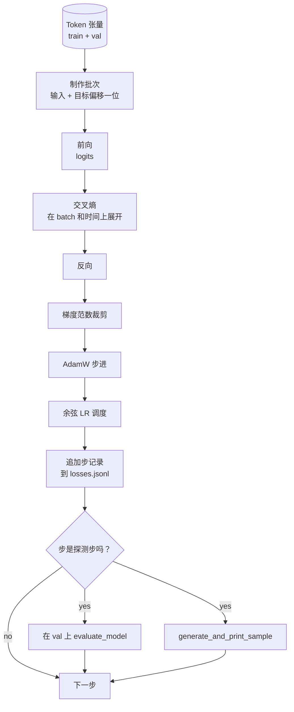

# 训练循环与评估

> 不做测量的循环就是在撒谎。本课构建的是驱动 GPT 模型的训练循环：带权重衰减分组的 AdamW、预热加余弦学习率调度、`calc_loss_batch` 辅助函数、在留出数据上的 `evaluate_model` 评估、每 K 步定性地生成并打印一个样本、以及记录损失到 JSONL 以便后续绘图。这个框架可以训练你今后构建的每一个解码器 LLM。

**类型：** 构建
**语言：** Python
**前置条件：** 阶段 19 第 30 至 35 课
**时间：** 约 90 分钟

## 学习目标

- 构建一个训练循环，用正确的输入目标对齐方式计算下一个 token 预测的交叉熵损失。
- 配置 AdamW，将权重衰减应用于权重张量，而不应用于 LayerNorm 或偏置张量。
- 实现带线性预热和余弦衰减的学习率调度，并读取各步的 LR。
- 在留出划分上用 `evaluate_model` 评估，使评估损失在不同运行间可比较。
- 每 K 步用 `generate_and_print_sample` 定性地生成一个样本，在损失曲线之前捕获发散。
- 将每步损失持久化到 JSONL，以便重载、绘图，并将训练日志作为交付物。

## 问题

一个只打印损失但不干其他事的训练脚本有三重失败。它无法告诉你损失是否因为正确的原因在下降（模型可能过拟合训练集而根本不学习）。它无法告诉你是否开始发散（损失可能在某一步飙升后恢复，或者某一步直接崩溃）。它无法告诉你模型学到了什么（损失是一个标量；生成的样本是一段文字）。除非循环做测量，否则这三重失败都会隐藏起来。

本课的循环从三个角度做测量。每步在训练 batch 上的损失。每 K 步在留出 batch 上的损失。每 K 步从一个固定提示词开始的生成延续。训练日志以 JSONL 落地，所以产物就是循环的证词。

## 概念



两个不那么显而易见的部分是损失对齐和 AdamW 衰减分组。

### 损失对齐

模型在每个位置预测下一个 token。如果输入 batch 是 token `[t0, t1, t2, t3]`，目标 batch 必须是 `[t1, t2, t3, t4]`。交叉熵在展开后的形状 `(batch * seq, vocab)` 上计算，对应展开后的目标 `(batch * seq,)`。忘掉偏移就会训练模型去预测自己，这会收敛到零损失却学不到任何有用的东西。

### AdamW 衰减分组

权重衰减对权重张量做正则化，但对归一化尺度或偏置不做。在 LayerNorm 尺度上施加衰减会缓慢地将尺度驱动到零，破坏归一化。在偏置上施加衰减在数学上无害但是浪费 cycles。标准的分组是：矩阵形状的张量（线性权重、embedding 表）获得衰减，任何看起来像尺度或偏移的东西则没有。

### 预热加余弦调度

预热将学习率在几百步内从零斜升到目标值，使优化器状态有时间积累。余弦衰减在剩余步数内将学习率降回零，使最后阶段以小的步长微调权重。这个组合是开源权重 LLM 训练中最常见的调度，因为它消除了前一千步和最后一千步中最脆弱的时刻。

### 留出评估

`evaluate_model` 从验证划分中运行固定数量的 batch，累积损失，除以 batch 数量，然后返回。没有梯度。没有 dropout。在相同随机种子和相同划分下，这个数字在不同运行间是可复现的。在训练损失旁边报告留出损失是发现过拟合的方法。

### 定性采样作为早期信号

一个训练损失下降良好但生成的样本全是同一个 token 的模型是坏的。一个损失曲线看起来平坦但生成的样本逐渐变成连贯词汇的模型是在学习。定性探测比阅读完整曲线更快，并且能捕获标量损失遗漏的失败模式。

## 构建它

`code/main.py` 实现了：

- `make_batches(token_ids, batch_size, context_length)` 将长 token 张量切片为输入和目标对。
- `calc_loss_batch(model, inputs, targets)` 前向、展开、返回标量交叉熵。
- `evaluate_model(model, val_loader, max_batches)` 在固定数量的验证 batch 上迭代，不带梯度，返回平均损失。
- `generate_and_print_sample(model, prompt, max_new_tokens)` 在固定提示词上运行第 35 课的生成函数并打印结果。
- `build_param_groups(model, weight_decay)` 生成两组 AdamW 参数列表。
- `cosine_with_warmup(step, warmup_steps, total_steps, max_lr, min_lr)` 返回给定步的 LR。
- `train(...)` 运行循环，将 `outputs/losses.jsonl` 持久化，每 `eval_every` 步打印评估损失和一个样本。
- 一个演示：在合成数据上训练一个小模型若干步，写入 JSONL 日志，在探测点打印评估损失和样本。演示在 CPU 上不到一分钟就能跑完。

运行：

```bash
python3 code/main.py
```

输出：每步损失行、每个探测步的评估损失、每个探测步的生成样本、以及最终的 `outputs/losses.jsonl`，你可以用 `json.loads` 按行读取。

## 技术栈

- `torch` 用于自动求导、优化器和模块。
- `main.py` 在本地重新实现了第 35 课的 `GPTModel` 和支持模块。

## 实战中的生产模式

三个模式将教科书式的循环变成可以通宵运行的东西。

**梯度范数裁剪是必须的。** 一个坏的 batch（异常数据、LR 峰值、数值边缘情况）产生一个巨大的梯度，抹掉数小时的训练。在 `backward` 之后和 `step` 之前执行 `torch.nn.utils.clip_grad_norm_(params, max_norm=1.0)` 将优化器保持在安全范围内。裁剪值是一个自由参数；1 是大多数配置下都能存活的默认值。

**可恢复的 JSONL 日志，而不是 pickle 状态。** 每步损失记录为 `{"step": int, "train_loss": float, "lr": float}` 的 JSONL 行是持久的：任何崩溃都留下一个可读的产物，你可以 grep，可以用三十行 Python 绘图，你可以读取最后一步来恢复训练。Pickle 状态将你绑定到生成该文件的确切模块布局，这在重构中是脆弱的。

**从固定切片中抽取评估 batch。** 验证 token 在脚本启动时切片成 batch，而不是动态切片。可复现性取决于评估 batch 在每次运行中完全相同；否则两次运行间的评估损失比较实际上是在比较 batch 的随机打乱，而不只是模型。

## 使用它

- 本课的循环与训练 124M 模型在真实数据上的框架相同。将合成 token 张量替换为 `datasets` 风格的加载器，循环无需改动。
- JSONL 日志是将训练运行转化为证据的交付物。下一课用它来比较新训练的检查点与预训练的检查点。
- 定性样本探测是标量损失无法替代的全能捕获器。

## 练习

1. 添加 `weight_decay_groups()` 单元测试，确认尺度和偏置参数落在无衰减组，线性和 embedding 权重落在衰减组。
2. 用小文本文件的字节替换合成随机 token，使演示在可读的内容上训练。验证生成的样本使用了文件中存在的字符。
3. 在余弦调度中添加 `min_lr` 下限，为 `max_lr` 的 10%，重新绘图。
4. 每 `eval_every` 步保存一个检查点，以及 JSONL 日志。添加一个 `resume_from` 标志来重载模型状态和优化器状态。
5. 在损失旁边记录每步吞吐量（token/秒），确认它保持在稳定区间。

## 关键术语

| 术语 | 大家怎么说 | 实际含义 |
|------|-----------------|------------------------|
| 损失对齐 | "偏移一位" | 输入 token 在位置 0..T-1，目标 token 在位置 1..T；交叉熵在展开的形状上计算 |
| 衰减分组 | "两组" | AdamW 接收带权重衰减的矩阵形状张量和不带权重衰减的尺度或偏置张量 |
| 预热 | "斜升" | 学习率在固定步数内从零爬升到目标值，使优化器状态得以积累 |
| 评估 batch | "留出 batch" | 验证 token 张量的一个固定切片，在脚本开始时切片一次，每次探测时使用相同切片 |
| 定性探测 | "样本打印" | 每 K 步从固定提示词打印一次短生成，捕获损失单独遗漏的失败模式 |

## 延伸阅读

- 第 35 课了解循环驱动的模型。
- 第 37 课了解将预训练权重加载到同一模型。
- 第 10 课第 4 节（预训练 mini GPT）了解真实数据上的流程。
- 第 10 课第 10 节（评估）了解交叉熵损失之外的更广泛评估面。