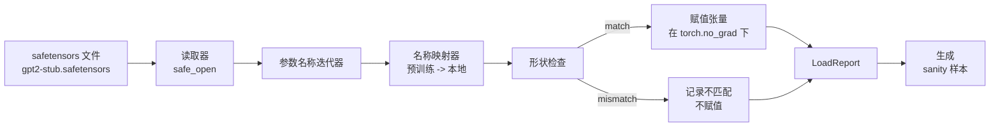

# 加载预训练权重

> 从头训练一个 1.24 亿参数的模型是一个预算决策；加载一个发布的检查点是常态。本课将预训练的 GPT-2 风格权重从 safetensors 文件加载到第 35 课完全相同的架构中，逐步讲解参数名称映射，并进行 sanity 生成以证明加载成功。不需要网络、不需要第三方加载器、不需要神秘魔法。

**类型：** 构建
**语言：** Python
**前置条件：** 阶段 19 第 30 至 36 课
**时间：** 约 90 分钟

## 学习目标

- 用 `safetensors` Python 库读取 safetensors 文件，检查张量名称和形状。
- 将每个预训练参数名称映射到第 35 课 GPT 模型内部的参数。
- 处理发布的 GPT-2 权重与本课程模型之间两种不同的命名约定：`wte/wpe/h.N.attn.c_attn/c_proj` 和 `mlp.c_fc/c_proj` 对比本地的 `tok_embed/pos_embed/blocks.N.attn.qkv/out_proj` 和 `mlp.fc1/fc2`。
- 在任何权重赋值之前检测并拒绝形状不匹配，给出清晰的错误。
- 用加载的权重生成一个短延续，确认 token 来自加载的分布，而不是随机初始化的分布。

## 问题

发布的权重不是为你的架构打包的。它们携带着原始实现使用的名称。预训练文件有 `transformer.h.0.attn.c_attn.weight`，形状为 `(2304, 768)`；你的模型期望 `blocks.0.attn.qkv.weight`，形状也是 `(2304, 768)`（同一矩阵只是布局约定不同），或者你的模型使用 `nn.Linear`，它以转置方式存储矩阵。同一参数以三种微妙不同的身份出现（名称、形状、字节布局），加载器必须调和这三者。

盲目复制的加载器会把正确的张量放到错误的位置，你得到的是一个生成胡说八道的模型。形状不同时拒绝复制但不记录任何东西的加载器让你猜测哪个张量没能落地。本课的加载器是明确的：每次赋值都记录，每次形状都检查，`LoadReport` 总结命中、缺失和形状不匹配，这样你可以读懂发生了什么。

## 概念



名称映射器只是一个从字符串到字符串的函数。形状检查是一个 if。赋值发生在 `torch.no_grad()` 内部，所以自动求导不跟踪加载。报告持有每个名称的结果。

### GPT-2 命名约定

发布的 GPT-2 权重位于类似这样的名称下：

| 预训练名称 | 形状 | 含义 |
|-----------------|-------|---------|
| `wte.weight` | (50257, 768) | Token embedding |
| `wpe.weight` | (1024, 768) | 位置 embedding |
| `h.N.ln_1.weight` | (768,) | 第 N 块的 LayerNorm 1 尺度 |
| `h.N.ln_1.bias` | (768,) | 第 N 块的 LayerNorm 1 偏移 |
| `h.N.attn.c_attn.weight` | (768, 2304) | 融合 QKV 线性权重 |
| `h.N.attn.c_attn.bias` | (2304,) | 融合 QKV 线性偏置 |
| `h.N.attn.c_proj.weight` | (768, 768) | 注意力输出投影 |
| `h.N.attn.c_proj.bias` | (768,) | 注意力输出投影偏置 |
| `h.N.ln_2.weight` | (768,) | LayerNorm 2 尺度 |
| `h.N.ln_2.bias` | (768,) | LayerNorm 2 偏移 |
| `h.N.mlp.c_fc.weight` | (768, 3072) | MLP fc1 权重 |
| `h.N.mlp.c_fc.bias` | (3072,) | MLP fc1 偏置 |
| `h.N.mlp.c_proj.weight` | (3072, 768) | MLP fc2 权重 |
| `h.N.mlp.c_proj.bias` | (768,) | MLP fc2 偏置 |
| `ln_f.weight` | (768,) | 最终 LayerNorm 尺度 |
| `ln_f.bias` | (768,) | 最终 LayerNorm 偏移 |

需要计划两个意外。`c_attn`、`c_proj`、`c_fc` 线性层相对于 `nn.Linear.weight` 期望的方式以转置方式存储。加载器在赋值时做转置。LM head 不在文件中；模型依赖与 `wte` 的权重绑定，所以在 `wte` 落地后通过别名设置 head。

### 本地命名约定

本课程中的模型使用描述性名称：

| 本地名称 | 含义 |
|------------|---------|
| `tok_embed.weight` | Token embedding |
| `pos_embed.weight` | 位置 embedding |
| `blocks.N.ln1.scale` | 第 N 块的 LayerNorm 1 尺度 |
| `blocks.N.ln1.shift` | LayerNorm 1 偏移 |
| `blocks.N.attn.qkv.weight` | 融合 QKV |
| `blocks.N.attn.qkv.bias` | 融合 QKV 偏置 |
| `blocks.N.attn.out_proj.weight` | 注意力输出投影 |
| `blocks.N.attn.out_proj.bias` | 输出投影偏置 |
| `blocks.N.ln2.scale` | LayerNorm 2 尺度 |
| `blocks.N.ln2.shift` | LayerNorm 2 偏移 |
| `blocks.N.mlp.fc1.weight` | MLP fc1 |
| `blocks.N.mlp.fc1.bias` | MLP fc1 偏置 |
| `blocks.N.mlp.fc2.weight` | MLP fc2 |
| `blocks.N.mlp.fc2.bias` | MLP fc2 偏置 |
| `final_ln.scale` | 最终 LayerNorm 尺度 |
| `final_ln.shift` | 最终 LayerNorm 偏移 |

映射是一个固定函数。本课将其作为加载器迭代的字典来提供。

### stub  fixture

真实的 GPT-2 权重有 0.5 GB。演示不下载它们；在首次运行时生成一个小的 safetensors fixture，使用精确的 GPT-2 命名约定和适合 12 层模型在 d_model 192（而非 768）下的形状。Fixture 具有正确的结构来练习加载器中的每个代码路径。将 fixture 替换为真实文件，加载器无需修改即可工作。

## 构建它

`code/main.py` 实现了：

- 第 35 课 `GPTModel` 的一个小副本，使本课自包含。
- `make_pretrained_to_local(num_layers)` 展开每层条目。
- `load_safetensors(model, path)` 迭代名称、映射、检查形状、转置 conv1d 风格的权重、在 `torch.no_grad()` 下赋值。返回 `LoadReport`。
- `make_stub_safetensors(path, cfg)` 用精确的预训练命名约定生成一个 fixture 文件。
- 一个演示：在首次运行时创建 `outputs/gpt2-stub.safetensors`，构建全新模型，从随机初始化捕获一个生成延续，加载 stub，再捕获另一个延续，打印两者，并验证两者不同（加载实际上改变了模型）。

运行：

```bash
python3 code/main.py
```

输出：fixture 路径、每名称的加载日志、`LoadReport` 汇总、加载前的延续、加载后的延续，以及在一个故意注入到 fixture 的坏张量上的形状不匹配，因此失败路径被演练到。

## 技术栈

- `safetensors` 用于磁盘格式和流式读取器。
- `torch` 用于模型和赋值数学。
- 不使用 `transformers`、`huggingface_hub`，无网络调用。

## 实战中的生产模式

三个模式使加载器在与你创建的不同权重接触时存活下来。

**在任何赋值之前始终验证文件。** 打开文件，列出每个张量名称及其 dtype 和形状，运行完整映射并进行形状检查，仅在成功后开始赋值。半加载的模型是静默失败机器。

**记录每次赋值，标明源名称和目标名称。** 当看起来有问题时，日志告诉你哪个张量落到了哪里；替代方案是阅读 hexdump。本课的 `LoadReport` 数据类跟踪 `loaded`、`missing`、`unexpected` 和 `shape_mismatch` 列表，并在最后打印汇总。

**LM head 是权重绑定别名，而不是单独副本。** 在加载 `tok_embed` 后设置 `model.lm_head.weight = model.tok_embed.weight` 是标准模式。将 embedding 矩阵复制到新的 `lm_head.weight` 参数会破坏绑定，静默地使参数数量翻倍。

## 使用它

- 加载器适用于任何使用预训练命名约定的 safetensors 文件。真实的 GPT-2 文件（small / medium / large / xl）无需代码更改即可工作；只有模型配置不同。
- 相同的模式可以扩展到 LLaMA、Mistral、Qwen 权重，只要你更新名称映射。形状检查和报告保持不变。
- 加载后的 sanity 生成是一个快速关卡：如果加载后的样本看起来像加载前的样本，说明加载没有改变模型，这意味着映射静默地遗漏了每个张量。

## 练习

1. 给加载器添加一个 `dtype` 参数，在赋值时将每个张量转换到目标 dtype（`bfloat16`、`float16`、`float32`）。确认 `float32` 模型可以降转到 `bfloat16` 仍然能生成。
2. 添加一个 `expected_layers` 参数，拒绝加载 `h.N` 索引与模型的 `num_layers` 不匹配的检查点。
3. 将加载器插入第 35 课的生成函数，产生两个并排样本：一个来自随机初始化，一个来自加载的 fixture。
4. 添加一个导出路径：将当前模型状态写入使用预训练命名约定的新 safetensors 文件。往返加载器并确认报告的形状不匹配为零。
5. 扩展 `NAME_MAP` 以处理 LLaMA 命名约定（无偏置、RMSNorm、融合 qkv 布局），并在你自己生成的 stub LLaMA fixture 上重新运行加载器。

## 关键术语

| 术语 | 大家怎么说 | 实际含义 |
|------|-----------------|------------------------|
| 名称映射 | "键重映射" | 从预训练张量名称到本地参数名称的函数；通常是一个字面字典，每层索引在一个循环中展开 |
| 形状不匹配 | "坏形状" | 预训练张量存在于映射名称下，但其维度与本地参数不一致；加载器拒绝赋值并记录该对 |
| 加载时转置 | "Conv1d 布局" | 发布的 GPT-2 以 nn.Linear 期望的转置存储注意力和 MLP 投影；加载器在赋值时转置 |
| 权重绑定别名 | "共享 LM head" | 设置 model.lm_head.weight = model.tok_embed.weight 以便 head 和 embedding 共享存储；head 不在文件中因为这个原因 |
| 加载报告 | "覆盖汇总" | 一个跟踪 loaded、missing、unexpected 和 shape_mismatch 列表的小数据类；打印它是告诉你加载是否成功的方式 |

## 延伸阅读

- 第 35 课了解接收权重的架构。
- 第 36 课了解产生相同形状检查点的训练循环。
- 第 10 课第 11 节（量化）了解在内存紧张时如何处理加载的权重。
- 第 10 课第 13 节（构建完整 LLM 流水线）了解加载和推理的完整生命周期。