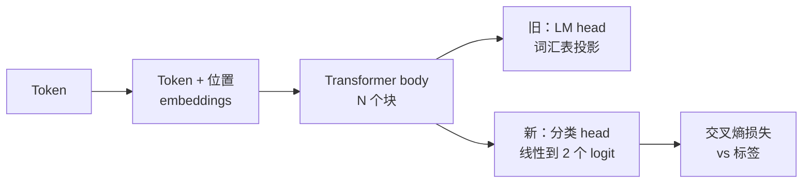
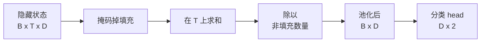
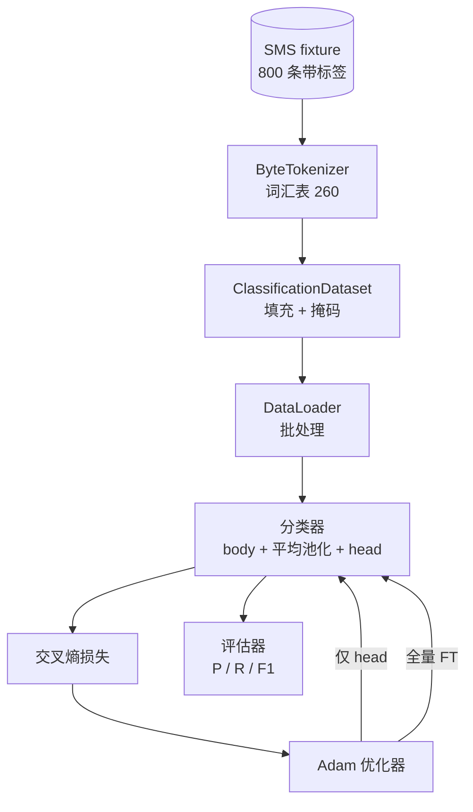

# 顶点课 38：通过 Head 替换进行分类器微调

> B 轨道的第一个顶点课。预训练语言模型是一堆自注意力块，最后接一个 token 预测 head。当你想要垃圾短信 vs 正常短信分类时，head 是错的但 body 大部分是对的。本课去掉 head，在池化表示上粘一个两类线性层，用两种不同方式训练分类器：仅最后一层，和全量微调。评估指标是留出划分上的 precision、recall 和 F1。你学会每种策略给你带来了什么，付出了什么代价。

**类型：** 构建
**语言：** Python (torch, numpy)
**前置条件：** 阶段 19 第 30-37 课（N LP LLM 轨道：分词器、embedding 表、注意力块、transformer body、预训练循环、检查点、生成、困惑度）
**时间：** 约 90 分钟

## 学习目标

- 在不重新初始化 body 的情况下，将语言模型 head 替换为分类 head。
- 实现两种训练模式：冻结 body（仅 head）和全量微调，共用同一个训练循环。
- 构建一个感知分词器的数据管道，进行填充、掩码填充、池化注意力输出。
- 从原始 logits 计算 precision、recall、F1 和混淆矩阵。
- 推理参数数量、训练时间和 head-room 之间的权衡。

## 问题

你在一个通用语料库上预训练了一个小 transformer。输出 head 将最后一个隐藏状态投射到 1000 个 token 的词汇表。你现在有 800 条标有垃圾短信或正常短信的 SMS 消息，想要一个二分类器。存在三个选项。

错误的选项是从头在一个 800 条例子的数据集上训练一个全新的分类器。预训练模型的 body 已经编码了有用的结构：词身份、位置、简单的共现。抛弃它是浪费构建它的算力。

两个正确的选项是 head 替换带冻结 body，和 head 替换带可训练 body。仅 head 训练速度快，内存几乎零消耗，在这么少的数据上很少过拟合。全量微调较慢，在小数据上可能过拟合，但当下游领域与预训练语料库差异较大时能达到更高精度。

本课构建两种，这样你可以在同一个 fixture 上比较它们。

## 概念

模型是一个函数 `f_theta(tokens) -> hidden_states`。Head 是一个函数 `g_phi(hidden) -> logits`。替换 head 意味着保持 `theta` 并替换 `g_phi`。Body 的参数是昂贵部分。Head 是一个单独的线性层。

两个可训练参数集很重要：

- `theta`（body）：每个注意力块数万权重。
- `phi`（head）：`hidden_dim * num_classes` 权重加一个偏置。

在仅 head 训练中，你计算关于 `phi` 的梯度，并将关于 `theta` 的梯度置零。PyTorch 通过设置 body 参数的 `requires_grad=False` 来实现这一点。优化器然后只看到 head，body 保持冻结。

在全量微调中，你让梯度流经整个栈。Body 的权重向分类目标漂移。风险是小数据上的灾难性遗忘：body 的预训练被过拟合噪声冲刷掉。

## 池化问题

分类器需要每个序列一个向量，而不是每个 token 一个向量。三种常见选择：

- **平均池化**：按注意力掩码加权平均隐藏状态。
- **CLS 池化**：添加一个特殊 token 并只使用它的输出。这就是 BERT 的做法。
- **最后一个 token 池化**：使用最后一个非填充 token。这就是 GPT 类分类器的做法。

本课使用带显式注意力掩码加权的平均池化。这是最简单的，在不同序列长度上给出稳定信号，不需要预训练一个 CLS token。

## 数据

800 条 SMS 消息，平衡 400 垃圾和 400 正常，在 `code/main.py` 中确定性生成。生成器使用固定种子，选择模板并替换槽位填充物，发出 5 到 25 个 token 长的消息。真实数据集有这个 fixture 没有的噪声。Fixture 的意义在于可复现性。

数据划分 80/20：640 训练，160 测试。划分是分层的，所以测试集保持 50/50 的平衡。已知平衡的留出集使 precision 和 recall 可以作为诚实数字来解读。

## 指标

二分类，以类别 1 为正类（垃圾短信）。计数为：

- `TP`：预测是垃圾短信，实际是垃圾短信。
- `FP`：预测是垃圾短信，实际是正常短信。
- `FN`：预测是正常短信，实际是垃圾短信。
- `TN`：预测是正常短信，实际是正常短信。

三个 headline 指标：

- `precision = TP / (TP + FP)`。标记为垃圾短信的消息中，实际是垃圾短信的比例是多少？
- `recall = TP / (TP + FN)`。实际垃圾短信中，模型标记的比例是多少？
- `F1 = 2 * P * R / (P + R)`。两者的调和平均。

混淆矩阵将四个计数打印为 2x2 网格。演示将这个写入 stdout，用于两种训练模式。

## 架构

Body 是一个故意很小的 transformer：词汇表 260，隐藏 64，4 个头，2 个块，最大序列 32。它小到可以在 CPU 上在九十秒内将两种模式都训练到收敛。它在本课中没有预训练；相反，`pretrain_quick` 辅助函数在同一 fixture 文本上做五个 epoch 的 LM 训练，给 body 一个非平凡的起点。这使本课自包含。

## 你将构建什么

实现是一个 `main.py` 加一个测试模块（`code/tests/test_main.py`）。

1. `ByteTokenizer`：字节到 ID 的映射，保留一个填充 ID。
2. `Block`：带多头注意力和前馈层的 transformer 块。预归一化。
3. `LMBody`：token + 位置 embeddings 加一堆块。返回隐藏状态。
4. `MeanPool`：在序列轴上的掩码加权平均。
5. `Classifier`：body、pool、线性 head。Body 在不同模式间是同一实例。
6. `freeze_body` 和 `unfreeze_body`：切换 body 参数的 `requires_grad`。
7. `train_classifier`：一个共享循环。接受配置了任一可训练参数组的模型和优化器。
8. `evaluate`：在测试集上运行，返回 `Metrics(precision, recall, f1, confusion)`。
9. `run_demo`：简要预训练 body，然后仅 head 训练和评估，然后全量，打印两份报告，退出零。

## 为什么比较很重要

仅 head 模式通常训练更快，过拟合更优雅。在这个 fixture 上，你通常看到仅 head 训练二十个 epoch 后 precision 接近 0.9，recall 接近 0.85。全量微调大约需要三倍时间，并在几个百分点内落地，取决于随机种子。

本课不选赢家。它教你读懂数字和代价。在 800 条例子和一个很小的 body 上，仅 head 是正确的选择。在 80,000 条例子和一个更大的 body 上，全量微调开始值得付出。你从本课得到的契约是 API：相同的 `train_classifier` 函数处理两种模式，切换只是一次调用。

## 延伸目标

- 添加第三种模式，只解冻最后一个块。这有时被称为部分微调。它比全量 FT 成本低，学得比仅 head 多。
- 添加学习率调度器。Head 上的余弦调度加上 body 上较小的常数率是常见的生产设置。
- 用学习到的注意力池化替换平均池化：一个带一个学习查询的小注意力层。这通常在较长序列上击败平均池化。

实现给了你钩子。测试固定了契约。数字由你来推进。