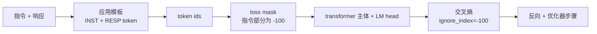
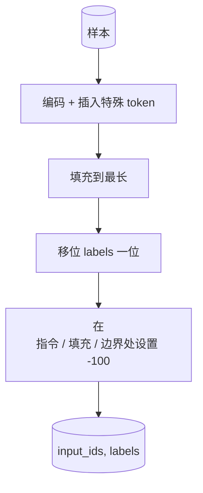

# Capstone 第39课: 指令微调之监督微调

> 预训练基座模型能续写序列，但无法遵循指令。监督微调是解决这一问题最小的改动：向模型输入指令与期望回复的配对示例，训练模型主体预测回复 token。诀窍在于你只希望损失计算回复部分的 loss，而不是指令部分。本课构建一个 Alpaca 风格的 SFT 循环，使用自定义 collate 函数将指令 token 屏蔽为 `ignore_index=-100`，在 200 个指令-响应对上训练，并用法精确匹配（exact-match）在留出集上评估。

**类型：** 构建
**语言：** Python（torch、numpy）
**前置条件：** 第 19 阶段课程 30-37（NLP LLM 路线：分词器、embedding 表、注意力块、Transformer 主体、预训练循环、checkpointing、生成、困惑度）
**时间：** 约 90 分钟

## 学习目标

- 将配对的指令-响应数据格式化为带有明确边界 token 的单一因果序列。
- 构建一个 collate 函数，屏蔽指令 token，使交叉熵仅计算响应 token 的 loss。
- 在 SFT 目标下训练一个微型 Transformer 主体，观察评估指标的移动。
- 实现尊重响应起始边界的贪婪解码和温度采样生成。
- 在生成的补全结果上计算留出集的精确匹配。

## 问题

一个通过下一 token 预测训练的基座模型不知道什么是指令。给它字符串 `"What is the capital of France?"`，它会继续写这个问题或编造一个新句子。模型有语言能力，但没有格式契约。

SFT 契约是一个字符串模板。每个训练样本变成一个带有三个区域的单一序列：

```text
<INST> What is the capital of France? <RESP> The capital of France is Paris.
```

边界 token 是在训练时预留的特殊 token。模型学习到 `<RESP>` 之后的都是响应，响应才是被评分的对象。基座模型的下一 token 目标仍然适用；只是在一个每个样本都有这种形状的语料上训练。

但有一个陷阱。如果你把整个序列喂给普通的交叉熵损失，你就是在训练模型也预测指令 token。指令是给定的。你希望这些位置的梯度为零。解决方法就是掩码。

## 概念



`ignore_index` 是 `torch.nn.functional.cross_entropy` 的一个特性。任何等于 `ignore_index` 的目标位置贡献零 loss 和零梯度。PyTorch 的惯例是 `-100`。collate 函数为每个样本构建两个张量：`input_ids`（完整序列）和 `labels`（`input_ids` 的副本，但指令位置被覆盖为 `-100`）。

模型在前向传播时看到整个序列；注意力可以关注指令。损失只计算响应 token。这正是你想要的：以指令为条件，预测响应。

## 数据

在 `main.py` 中确定性生成 200 个指令-响应对。它们覆盖六种任务类型：

- 事实性单样本（X 的首都）
- 算术
- 列表提取
- 一句话摘要
- 代码（print、sort）
- 定义

每种任务有一个模板化指令和一个确定性响应。这是刻意简化的。精确匹配是脆弱的，本课使用一个fixture，其中正确答案是一个特定的字符串。真实的 SFT 数据集需要模糊指标；原理是相同的。

划分：160 训练，40 测试。测试集覆盖所有六种任务类型，因此可以报告每个类别的精确匹配。

## 分词与填充

分词器是字节级的，有三个预留的特殊 token：

- `INST_ID = 256`：标记指令区域的开始。
- `RESP_ID = 257`：标记指令和响应之间的边界。
- `PAD_ID = 258`：用于可变长度批次的填充。

序列是 `[INST] inst_bytes [RESP] resp_bytes [PAD]*`。collate 函数：

1. 对每个样本进行分词。
2. 将批次中每个样本填充到批次中最长的序列。
3. 构建 `labels` = `input_ids` 移位一位（因果 LM 目标），其中：
   - 指令区域替换为 `-100`。
   - 填充区域替换为 `-100`。
   - `RESP_ID` 边界位置本身替换为 `-100`（你不训练模型预测边界 token；它预测的是接下来的内容）。



移位是标准的因果技巧：位置 `i` 的 `input_ids` 预测位置 `i+1`，所以 `labels[i] = input_ids[i+1]`（最后位置从输入中丢弃，第一个位置从目标中丢弃）。掩码在移位之后应用，以落在正确的位置。

## 训练


这个循环是标准的 PyTorch SFT 循环。Adam，学习率约 3e-4 到 1e-3，在这个 fixture 上训练十到二十个 epoch，无需调度器。模型足够小（hidden 96，2 个 block，max length 64），在 CPU 上可以在两分钟内训练到收敛。

每五个 epoch，循环在留出集上运行一次小评估并打印精确匹配。观察精确匹配从第一个 epoch 的 0.0 到第 15 个 epoch 的约 0.85 是本课的收获：你可以看到模型同时学习格式和答案。

## 生成

在评估时，模型获得指令前缀 `[INST] inst_bytes [RESP]`，并生成 token，直到：

- 序列达到 `max_len`，或
- 模型发出一个特殊的停止启发式：两个连续句子结束字节（`.`、`!`、`?`）。

本课附带贪婪解码加上可选的温度采样器。精确匹配使用贪婪，因为温度会使指标变得随机。真实系统通常采样，然后模糊判断；该流程在第 41 课。

## 精确匹配评估

精确匹配是最严格的文本指标。预测的响应字符串被标准化（lowercase、去除空格、折叠双空格）后与参考响应（同样标准化）进行比较。每个样本的指标为 0 或 1。汇总指标是均值。

真实的 SFT 流水线用 token 级 F1（第 41 课）和评判模型补充精确匹配。精确匹配仍然有用，因为它是无歧义的；如果它说是 0.7，则恰好 70% 的测试指令逐字产生了 gold 响应。

## 你将构建的内容

实现是一个 `main.py` 加测试。

1. `InstructionTokenizer`：字节级编码器，带有预留的特殊 token。既能编码指令前缀，也能编码完整配对。
2. `make_dataset`：用固定种子生成跨六种任务类型的 200 对。
3. `SFTDataset`：返回每个样本的 `(input_ids, labels)`，已做好掩码准备。
4. `sft_collate`：动态填充，构建批次张量，在指令和填充位置设置 `-100`。
5. `TinyGPT`：Transformer 主体加上绑定或非绑定的 LM head。
6. `train_sft`：SFT 循环，带有每个 epoch 的评估钩子。
7. `generate`：从前缀进行因果解码，贪婪或采样，带有停止启发式。
8. `exact_match`：标准化字符串比较，返回 `[0, 1]` 中的浮点数。
9. `run_demo`：构建数据，训练 20 个 epoch，评估，打印每个类别的细分，成功后以零退出。

## 为什么掩码很重要

没有掩码，损失将指令 token 视为目标。模型学习预测指令。这是一个不同的目标，并且在两个方面产生更差的模型。首先，模型容量被浪费在重建用户总是提供的输入上。其次，响应 loss 在梯度总和中更小，因为大多数批次中指令 token 多于响应 token；优化器在你关心的部分上的有效学习率低于你设定的。掩码不是锦上添花；它是目标本身。

## 拓展目标

- 添加学习率预热后接余弦衰减。SFT 对 LR 的敏感性比预训练更高。
- 添加每个 token 的 loss 日志并绘制训练过程中的 loss 曲线。注意早期 epoch 被模板 token（`<RESP>`、常见前缀）主导，后期 epoch 被实际答案 token 主导。
- 将评估扩展到 BLEU-1 或 chrF。精确匹配低估了产生相同答案的释义模型。
- 添加聊天模板，带有多轮格式，并训练一个包含后续的 fixture。

这个实现给了你格式契约、掩码和循环。从基座模型到指令追随者的目标变化就是一个 collate 函数。