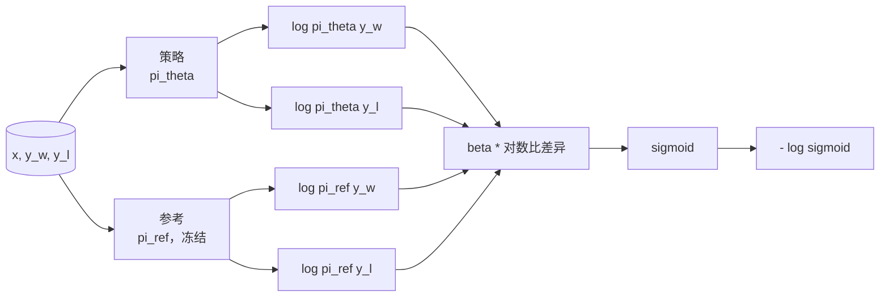
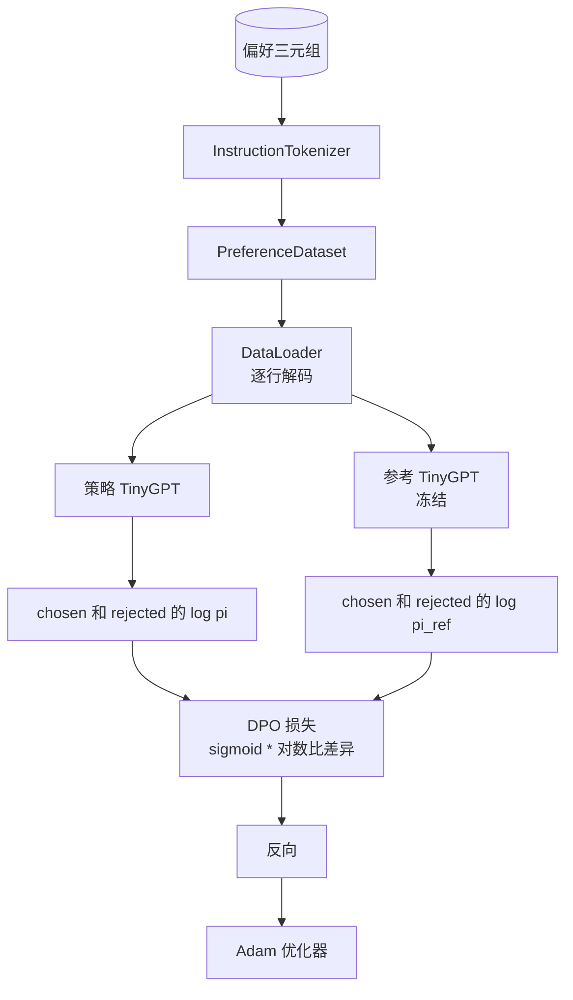

# Capstone 第40课: 从零实现直接偏好优化

> 奖励模型和 PPO 是经典的 RLHF 技术栈。DPO 将该技术栈压缩为一个单一的监督损失，直接拟合策略到偏好对上。本课从奖励差异恒等式推导 DPO 损失，发货一个可工作的参考模型加策略模型，计算每个 token 的对数概率，并在偏好 fixture 上训练一个微型 Transformer（chosen 和 rejected 的补全）。测试锁定损失数学和梯度方向，使你确信实现与论文一致。

**类型：** 构建
**语言：** Python（torch、numpy）
**前置条件：** 第 19 阶段课程 30-37（NLP LLM 路线：分词器、embedding 表、注意力块、Transformer 主体、预训练循环、checkpointing、生成、困惑度）
**时间：** 约 90 分钟

## 学习目标

- 将 DPO 损失推导为缩放对数比差异上的 sigmoid，并连接到隐式奖励。
- 构建一个参考模型 + 策略模型对，其中参考是冻结的，策略是可训练的。
- 计算两个模型下的序列级对数概率，屏蔽提示 token。
- 在 `(prompt, chosen, rejected)` 三元组上训练策略，观察 chosen 的对数概率相对于 rejected 上升。
- 用测试锁定行为：损失数学、梯度符号和参考不变性。

## 问题

你有一个 SFT 模型。它能遵循指令，但输出参差不齐；一些补全清晰，一些冗长或错误。你还有一个小数据集的偏好对：对于相同的 prompt，一个人标记一个补全为 chosen，另一个为 rejected。

经典的 RLHF 答案是两阶段流水线。先从偏好训练奖励模型。用 PPO 针对奖励优化策略。这有效但代价高昂：PPO 期间两个模型在内存中，KL 控制以保持策略接近参考，当奖励模型脆弱时会出现奖励黑客。

DPO 用单一监督损失替换两个阶段。奖励模型从不显式存在。策略直接在偏好对上训练，带有指向 SFT 参考的显式 KL 惩罚。在 Bradley-Terry 偏好模型下具有相同的最优解，代码却少得多。

## 概念

从 Bradley-Terry 模型开始。给定 prompt `x` 和两个补全 `y_w`（chosen）和 `y_l`（rejected），人类偏好 `y_w` 的概率是

```text
P(y_w > y_l | x) = sigmoid( r(x, y_w) - r(x, y_l) )
```

其中 `r` 是某个潜在奖励函数。RLHF 首先从偏好拟合 `r`，然后训练策略 `pi` 最大化 `r`，并带有 KL 锚点：

```text
max_pi   E_{x, y~pi} [ r(x, y) ] - beta * KL(pi || pi_ref)
```

DPO 推导观察到该目标下的最优策略 `pi*` 关于 `r` 有闭合形式：

```text
pi*(y | x) = (1/Z(x)) * pi_ref(y | x) * exp( r(x, y) / beta )
```

重新排列求 `r`：

```text
r(x, y) = beta * ( log pi*(y | x) - log pi_ref(y | x) ) + beta * log Z(x)
```

`log Z(x)` 项对于 `y_w` 和 `y_l` 是相同的（它取决于 `x`，而不是 `y`），所以当你计算偏好差异时它会抵消：

```text
r(x, y_w) - r(x, y_l) = beta * ( log pi_theta(y_w|x) - log pi_ref(y_w|x)
                                - log pi_theta(y_l|x) + log pi_ref(y_l|x) )
```

代入 Bradley-Terry sigmoid，并对偏好对取负对数似然：

```text
L_DPO(theta) = - E_{(x, y_w, y_l)} [
  log sigmoid( beta * ( log pi_theta(y_w|x) - log pi_ref(y_w|x)
                       - log pi_theta(y_l|x) + log pi_ref(y_l|x) ) )
]
```

这就是损失。它是对每个样本的一个标量取 sigmoid，由四个对数概率计算。没有单独的奖励模型。没有 PPO。损失中没有 KL 项；KL 约束被烘焙到闭合形式推导中。



## 梯度的符号

在任何训练运行之前的一个有用的合理性检查。取关于 `log pi_theta(y_w | x)` 的梯度：

```text
d L_DPO / d log pi_theta(y_w | x) = - beta * (1 - sigmoid(z))
```

其中 `z` 是 sigmoid 的参数。这对于所有 `z` 都是负的，这意味着：增加策略对 chosen 补全的对数概率会降低损失。对称地，关于 `log pi_theta(y_l | x)` 的梯度是正的：增加 rejected 的对数概率会增加损失。训练推动 chosen 向上、rejected 向下。参考是冻结的；它不会移动。

## 数据

12 个偏好三元组随本课附带。每个是 `(prompt, chosen, rejected)`。chosen 补全简短而精确。rejected 冗长、跑题或错误。这些对覆盖与第 39 课相同的任务家族（首都、算术、列表），因此从 SFT 基座开始的策略有一个合理的起点。

这个 fixture 刻意做得很小。DPO 在生产中在数万对上工作；这里，关键是损失数学和循环在一个小数据集上端到端运行，chosen-versus-rejected 对数概率差距明显增长。

## 参考不变性

DPO 实现必须仔细处理参考模型。参考是 SFT 模型，冻结不动。三个属性必须成立：

- 参考参数从不接收梯度。
- 参考对数概率在 epoch 之间从不改变。
- 策略从与参考相同的权重开始。（最优 `theta` 是参考加上学习到的更新；将策略初始化为参考的副本是一个有定义的起点。）

实现通过以下方式强制执行这些：

- 在前向传播期间用 `torch.no_grad()` 包装参考。
- 在每个参考参数上设置 `requires_grad=False`。
- 在构建参考后通过 `policy.load_state_dict(reference.state_dict())` 构造策略。

## 架构



模型是第 39 课中使用的相同 TinyGPT（仅解码器、因果、字节分词器）。参考和策略共享架构；策略的权重在训练时偏离参考，而参考保持固定。

## 你将构建的内容

实现是一个 `main.py` 加测试。

1. `InstructionTokenizer`：字节分词器，带有 `INST` 和 `RESP` 特殊 token。与第 39 课形状相同。
2. `TinyGPT`：仅解码器 Transformer。与第 39 课形状相同，因此即使你跳过了 39，本课也能独立存在。
3. `make_preferences`：返回 12 个 `(prompt, chosen, rejected)` 三元组。
4. `sequence_log_prob`：给定模型、prompt 前缀和补全，返回补全上下一 token 对数概率的总和（不包括 prompt 位置的贡献）。
5. `dpo_loss`：接受四个对数概率和 `beta`，返回每个样本的损失张量和用于日志记录的隐式奖励 delta。
6. `train_dpo`：每个 epoch 的循环，计算策略和参考下的 chosen 和 rejected 对数概率，应用损失，并步进 Adam。
7. `evaluate_margins`：返回策略在任何时刻的 mean chosen-rejected 对数概率差。
8. `run_demo`：从小型预热预训练构建参考和策略，复制权重，训练 30 步，打印每步损失和差值，成功后以零退出。

## 为什么 DPO 有效

在 Bradley-Terry 偏好模型下，DPO 在奖励的参数化方面与 RLHF 数学等价。隐式奖励 `r(x, y) = beta * (log pi(y|x) - log pi_ref(y|x))` 从偏好中是可识别的 up to `x` 的函数，这在差异中抵消了。闭合形式策略让你跳过显式奖励模型。KL 约束被结构性强制执行：`pi` 偏离 `pi_ref` 的任何偏差都会使对数比更大，而 sigmoid 饱和，这会在策略移动太远时抑制梯度。参考是你的安全网。

## 拓展目标

- 在对数概率总和中添加长度归一化：除以补全长度。长度偏差是一个已知的 DPO 失败模式，模型优先选择较短的补全，因为它们的绝对对数概率更大。
- 添加 IPO 变体的损失：替换 sigmoid + log 为 `(z - 1)^2`。在 fixture 上比较收敛性。
- 添加标签平滑参数，在硬 chosen-rejected 标签和均匀 0.5 之间进行插值。
- 用更小更便宜的模型替换参考（知识蒸馏风格）。

这个实现给了你损失、参考不变性和训练循环。数学就是本课。代码让数学变得具体。