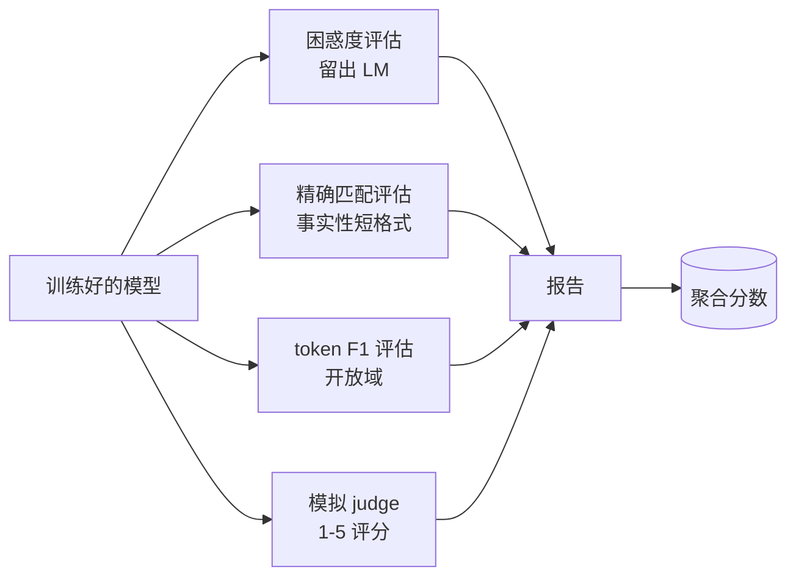
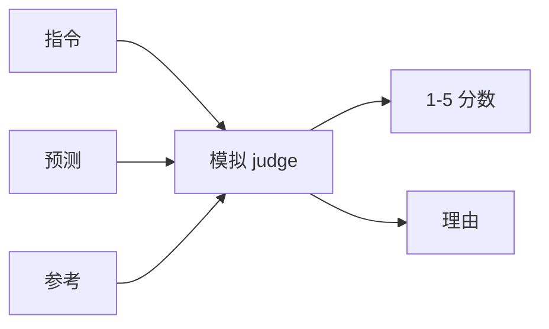
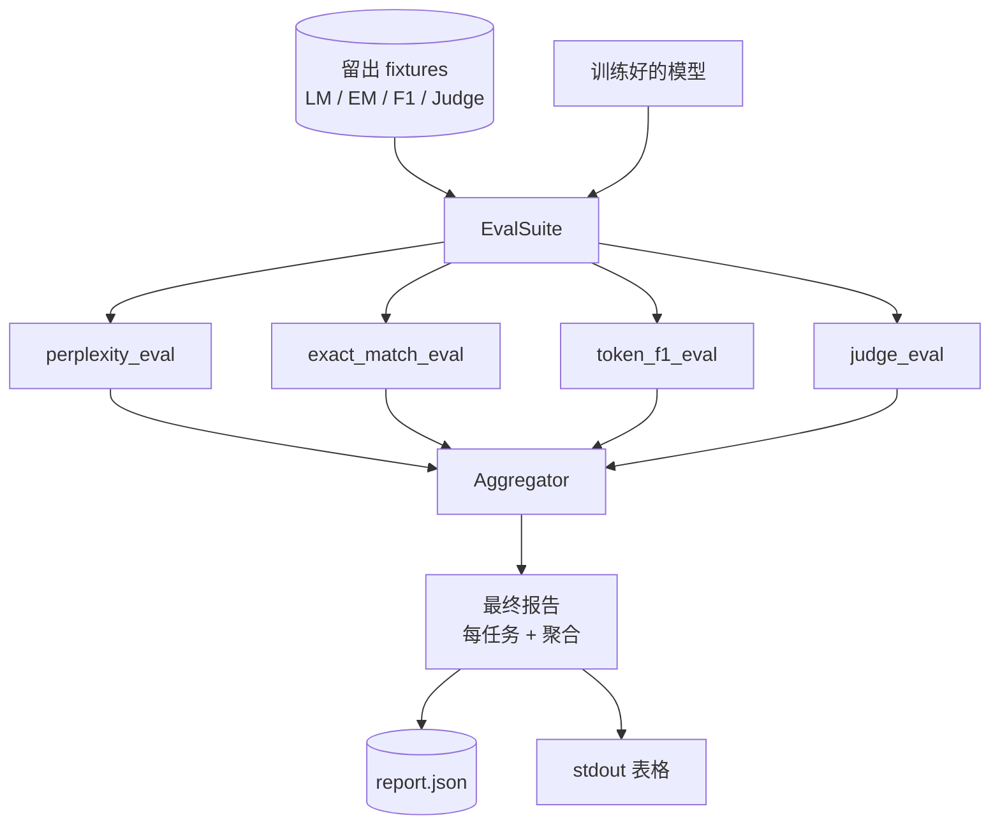

# Capstone 第41课: 完整评估流水线

> 训练是你可以用损失曲线监控的部分。评估是你必须设计的部分。本课构建一个统一的评估流水线，接收任何训练好的语言模型，对其运行四个异构评估，将结果聚合成每个任务的报告，并发货一个本地模拟 LLM-as-judge，使循环无需网络即可运行。四个评估覆盖了每个发布模型都需要维度：语言建模（困惑度）、短格式正确性（精确匹配）、开放格式相似性（token F1）和定性评分（judge）。

**类型：** 构建
**语言：** Python（torch、numpy）
**前置条件：** 第 19 阶段课程 30-37（NLP LLM 路线：分词器、embedding 表、注意力块、Transformer 主体、预训练循环、checkpointing、生成、困惑度）
**时间：** 约 90 分钟

## 学习目标

- 在微型 Transformer 上计算留出集的困惑度，带有屏蔽 token  accounting。
- 在短格式事实性 prompt 上运行精确匹配评估。
- 在预测字符串和参考字符串之间计算带标准化的 token 级 F1。
- 构建一个本地模拟 LLM-as-judge，以 1-5 规模对模型输出进行评分。
- 将四个评估聚合成一个带有每个任务细分的单一加权报告。

## 问题

单个指标永远无法描述语言模型。困惑度说明模型拟合语言分布的好坏，但不说它是否回答问题。精确匹配说明模型是否产生 gold 字符串，但惩罚正确的释义。Token F1 原谅释义，但被与错误内容的词汇重叠所迷惑。LLM-as-judge 捕捉定性维度，但代价高昂且具有随机性。

你真正需要的流水线有以上所有四个。每个评估覆盖其他评估遗漏的维度。每个在为该指标设计的数据留出子集上运行。最终报告并排显示每个任务的数字和聚合值，这样审查者可以一目了然地看到模型正在进行的权衡。

本课端到端构建该流水线，在一个文件中。

## 概念

每个评估是一个函数从 `(model, dataset) -> EvalResult`。结果携带指标值、每个样本的详细信息供检查，以及用于聚合的名称。流水线用配置组合它们，配置说明运行哪些评估以及如何加权。

## 困惑度，正确计算

困惑度是 `exp(每个 token 负对数似然的均值)`。实现有两个陷阱：

- 均值必须在实际 token 位置上计算，而不是在 batch * sequence 上。填充 token 必须从分母中排除，否则困惑度会看起来比实际更好。
- 模型预测下一个 token，所以位置 `i` 的 logits 预测位置 `i+1` 的 token。这里的 off-by-one 错误是静默的：损失仍然训练，但指标变得毫无意义。

评估计算每个 batch 的非填充位置上的 `-log p(token)` 总和以及每个 batch 的 token 计数，然后在最后除。这在数值上比平均每个 batch 的困惑度（这会低估短序列）更安全，与教科书定义一致。

## 精确匹配，带标准化

harness 在比较之前标准化预测和参考：

- 小写。
- 去除周围空格。
- 将内部空格序列折叠为单个空格。
- 如果两者仅因标点符号不同而不同，则丢弃尾部终止标点（`.`、`!`、`?`）。

标准化使精确匹配在实践中可用。说 `"Paris"` 的模型是正确的；说 `"Paris."` 的也是正确的；说 `"  paris  "` 的也是正确的。指标仍然要求标准化后答案是相同的字符串。

## Token F1，正确的方式

Token F1 是在 token 袋上计算的精确率和召回率的调和均值。步骤：

1. 标准化预测和参考（与精确匹配相同的规则）。
2. 分割成 token 列表（空白分词）。
3. 计算多重集交集。
4. 精确率 = `intersection_count / len(pred_tokens)`。召回率 = `intersection_count / len(ref_tokens)`。F1 = 调和均值。

如果预测和参考都为空，F1 为 1（空真匹配）。如果只有一个为空，F1 为 0。此模式匹配 SQuAD 评估参考，并在释义上产生稳定的数字。

## 本地模拟 LLM-as-Judge

真正的 judge 是一个在 API 背后的前沿模型。对于本课，judge 必须离线运行。模拟 judge 是一个确定性评分器，接受指令、模型的预测和参考，并返回 `{1, 2, 3, 4, 5}` 中的分数加上一行理由。评分规则是明确的：

- 5 如果标准化预测等于标准化参考。
- 4 如果预测和参考之间的 token F1 至少为 0.8。
- 3 如果 token F1 在 `[0.5, 0.8)`。
- 2 如果 token F1 在 `[0.2, 0.5)`。
- 1 否则。

这不是一个真正的 judge，但它有正确的接口。以后通过更改一个函数可以换入真正的模型。流水线不关心。

## 聚合

聚合是标准化评估分数的加权均值。每个评估在 `[0, 1]` 中报告自己的数字：

- 困惑度：标准化为 `1 / (1 + log(perplexity))`。困惑度 1 映射到 1，无穷大映射到 0。
- 精确匹配：已在 `[0, 1]` 中。
- Token F1：已在 `[0, 1]` 中。
- Judge：除以 5。

权重是可配置的。默认混合是 0.2 困惑度、0.3 精确匹配、0.3 token F1、0.2 judge。权重的选择是一个产品决策；本课暴露了这个旋钮，这样你就可以进行实验。

## 架构

`EvalSuite` 是一个轻量级编排器。每个单独评估是一个接受 `(model, tokenizer, dataset, config)` 并返回 `EvalResult` 的自由函数。`Aggregator` 收集结果并生成最终报告。演示打印表格并写入 JSON 副本，供下游 CI 接收。

## 你将构建的内容

实现是一个 `main.py` 加测试。

1. `TinyGPT`：与第 38-40 课使用的相同仅解码器架构，包含在内以使本课独立存在。
2. `InstructionTokenizer`：带 INST / RESP / PAD 特殊的字节分词器。
3. 四个 fixtures：LM 语料库、EM 集合、F1 集合和 judge 集合。每个 20 个示例，确定性生成。
4. `perplexity_eval`：返回带有困惑度值和每个 token 损失直方图的 `EvalResult`。
5. `exact_match_eval`：返回平均 EM 和每个样本的记录。
6. `token_f1_eval`：返回平均 token F1 和每个样本的记录。
7. `mock_judge` 和 `judge_eval`：每个样本的分数和理由，跨集合的平均分数。
8. `Aggregator.normalise`：每个评估的标准化规则。
9. `Aggregator.aggregate`：加权均值和组装报告。
10. `run_demo`：简要训练一个微型模型，运行所有四个评估，打印报告表格并写入 JSON，成功后以零退出。

## 阅读报告

报告有三个层次。顶层是聚合分数。下面是四个每个评估的数字。再下面是每个示例的细分用于诊断。失败的 CI 运行通常需要聚合分数，但追逐回归的审查者需要每个示例的细分，以查看模型在哪些输入上出错。

JSON 转储使用稳定的键，因此 CI 仪表板可以绘制跨版本的趋势线。格式化的表格供人们在训练运行后盯着终端查看。

## 拓展目标

- 添加校准评估：模型的 softmax 概率是否与其准确率匹配？按置信度将预测分桶，报告每个桶的经验准确率。
- 添加鲁棒性评估：用扰动（拼写错误、释义、干扰项）标记每个示例，报告每个扰动的指标下降。
- 用 HTTP 调用背后的真实模型替换模拟 judge。函数签名不变。
- 添加每任务权重学习：不是固定权重，而是将权重拟合到模型的目標偏好顺序。

这个实现给了你四个评估、聚合器和报告。真实的评估流水线在上面叠加更多维度；模式保持不变：每个评估一个函数，一个聚合器，一个报告。