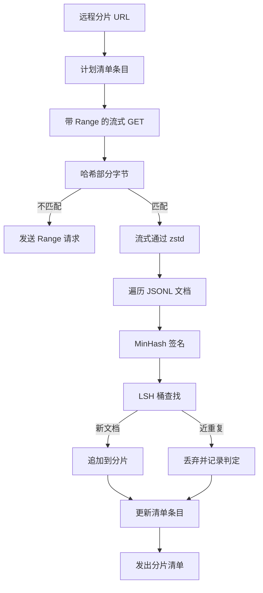

# 大规模语料库下载器

> 训练语言模型的工作，在第一次前向传播之前很久就已经开始了。语料库必须先落到磁盘上、解压、去重、可寻址，而且要在网络掉线率达到 4% 之前就把断点续传的故事讲清楚。本节课构建一个流式下载器：拉取压缩分片、用 Zstandard 流式解压、通过 MinHash + 局部敏感哈希（LSH）指纹近重复文档、输出一个下游流水线可以信任的分片清单。

**类型：** 构建型
**语言：** Python
**前置条件：** 阶段 19 第 30-37 课
**时间：** 约 90 分钟

## 学习目标

- 用 `urllib` 流式下载远程分片，用 `zstandard` 流式解压，全程不把整个文件缓冲到内存。
- 通过向已验证字节偏移量发送 HTTP `Range` 请求，实现部分下载的断点续传。
- 为每个文档构建 MinHash 签名，并用 LSH 将近重复文档打入同一桶中发生碰撞。
- 输出分片清单，包含内容哈希、字节大小、文档数量和去重判定。

## 问题

第一次用 200 GB 语料库训练时，网络在 41% 时掉线，脚本抛出 `urllib` 异常退出。第二次在 78%。到 99% 时你已经把循环重写了三遍。从第一天起就必须解决的两个失败场景是：部分下载的断点续传，以及重复文档的去除。两者都有成熟方案；两者都因为"管道最初只是一行 `requests.get` 调用，后来长出了獠牙"而被常规跳过。

断点续传本质上是 HTTP 问题。服务器必须支持 `Range`，客户端必须相对于磁盘上的记录追踪已验证偏移量，且这个已验证偏移量必须能在进程崩溃后存活。只要偏移量和文件相差哪怕一个字节，恢复后的下载就会写入垃圾数据，语料库会在分词时才发现损坏。

去重本质上是签名问题。精确哈希去重会漏掉近重复：同一篇 Wikipedia 文章带着三个不同的页脚 boilerplate，同一个代码文件换了许可证头，同一篇博客文章每个链接都有追踪参数。MinHash + LSH 以亚线性成本捕获这些。代价是每个文档一个签名，每签名一次桶查找。

## 概念



### 用 `urllib` 流式下载

标准库的 `urllib.request.urlopen` 返回一个类文件对象。将其包装在 `zstandard.ZstdDecompressor().stream_reader` 中，字节从网络流经解压器进入文档迭代器，全程不在内存中 materialize 压缩分片或解压分片。唯一的内存开销是行缓冲、当前文档的 MinHash 签名和 LSH 索引。

### 用 `Range` 断点续传

下载器为每个分片写入两个文件：分片本身和 `.partial.json` 检查点。检查点记录 `verified_bytes`、`expected_size`、`sha256_prefix`（对前 `verified_bytes` 字节计算）和源 URL。启动时下载器读取检查点，重新计算磁盘上字节的 `sha256_prefix`，仅在重新计算的哈希匹配时才续传。如果哈希错误则丢弃 partial 并从字节零重新开始下载。已验证字节是检查而非假设的，所以静默损坏不可能发生。

### MinHash + LSH

MinHash 用固定空间估计两个集合的 Jaccard 相似度。对文档而言，集合是其文本的 shingles（重叠的 n-gram）。签名是 `k` 个最小哈希值，每个对应一个独立哈希函数。两个 Jaccard 相似度为 `s` 的文档，在签名的任一分量上达成一致的恰率为 `s`。

LSH 然后将 `k` 个分量分成 `b` 个 band，每个 band `r` 行，`k = b * r`。两个文档在至少一个 band 中碰撞的恰率为 `1 - (1 - s^r)^b`，这是一个围绕你调参 `(b, r)` 所针对的 `s` 值的尖锐阈值。典型语料库去重的阈值是 `s = 0.8`，LSH 研究文献达到该值用 `k = 128`、`b = 32`、`r = 4`。

### 分片清单作为契约

下载器唯一的持久输出是清单。清单对每个分片记录：URL、解压后字节数、文档数、去重后唯一文档数，以及最终分片文件的 sha256。下游分词器读取清单，而不是目录列表。如果分片缺失或其 sha256 错误，清单告诉下一阶段拒绝启动。清单是"数据已下载"与"数据已下载且可验证"之间的决定性边界。

## 构建

`code/main.py` 实现了：

- `ShardPlanner` - 读取分片 URL 列表，生成计划清单条目。
- `StreamingDownloader` - 用可选的 `Range` 打开 `urllib` 流，写入临时文件，每块更新 `.partial.json` 检查点，恢复时验证 sha256 前缀。
- `ZstdDocIterator` - 将类文件流包装在 `zstandard.ZstdDecompressor` 中，每行吐出一个文档。
- `MinHasher` - 使用固定哈希种子家族为字符串生成 `k` 维签名。
- `LSHIndex` - 按 band 对签名分桶并报告碰撞。
- `Dedup` - 组合 hasher 和 index，为每个文档打上 `keep` 或 `near_duplicate` 标签及其匹配的分片 ID。
- `ManifestWriter` - 收集每分片统计信息并写入 `manifest.json`。

文件底部的演示在磁盘上构建小型合成语料库，用 `zstandard` 压缩，通过 `file://` URL 下载，去重后打印清单摘要。

运行它：

```bash
python3 code/main.py
```

脚本以零退出并打印清单摘要。

## 生产模式

四种模式将本课扩展到真实语料库规模。

**写入前先检查点。** `.partial.json` 必须在字节追加到分片之前 `fsync`。否则断电会使顺序颠倒：分片字节在磁盘上，检查点没有记录它们，下次续传认为自己拥有的已验证字节比实际少，重复的后缀字节破坏文件。先检查点，后写入。这与预写日志是同一套纪律。

**分片式 LSH 索引。** 200 GB 规模下，整个语料库的单一 LSH 索引无法放入 RAM。按第一个 band 哈希对 LSH 索引分区，将分区存储在磁盘上，只查询新签名落入的分区。代价是每文档多一次磁盘读取；收益是 LSH 索引不再是硬性内存天花板。

**墓碑，不删除。** 丢弃的重复文档在清单中记录为 `near_duplicate` 及其碰撞的文档的分片 ID。删除它们会丢失重复文档与其保留文档之间的链接。墓碑化保留审计跟踪，并让下游处理可以改变对阈值的决定。

**清单中的每分片 sha256，加上清单 sha256。** 清单本身也有内容哈希。下游阶段在信任分片条目之前先验证清单哈希。没有这一点，清单就是静默的攻击面：能编辑一个文件的攻击者就能破坏整个管道。

## 使用

生产模式：

- **每次 CI 运行都续传。** CI 运行器是短暂的。下载器必须假设每次运行磁盘都是新的，从缓存或远程恢复。`--cache-dir` 是一等公民标志。
- **分词前先去重。** 分词成本高昂。在同一文档上跑两遍，成本翻倍，损失曲线不变。去重在分词上游，不在下游。
- **清单作为合并关卡。** 训练运行从固定提交中读取清单 sha256。新数据集版本需要新的清单提交。代码和数据之间的链接是 git，不是口头传说。

## 交付

`outputs/skill-corpus-downloader.md` 在真实项目中会描述：哪些 URL 喂给下载器、检查点目录如何布局、分词用的 shingle 宽度和 `(k, b, r)` 三元组、清单在版本控制中的位置。本课交付的是引擎。

## 练习

1. 添加 `--shingle-width` 标志，测量在宽度 3、5、9 时去重判定的变化。为选择的默认值辩护。
2. 在 zstd 旁边添加 gzip 支持，通过 sniffing 魔术字节识别。下载器不应要求调用方指定编解码器。
3. 添加 `--resume-only` 模式，找不到检查点时拒绝启动新下载。在 CI 中有用，防止一次运行意外重新拉取 200 GB。
4. 将 LSH 索引移到 shelf 或 sqlite 文件，测量吞吐量与内存版本的对比。
5. 启动时添加清单 sha256 检查。如果磁盘上的清单与 `manifest.lock` 中的清单哈希不一致，下载器应 fail closed。

## 关键术语

| 术语 | 大家怎么说的 | 实际含义 |
|------|-----------------|------------------------|
| 分片 (Shard) | "一个文件" | 语料库的自包含切片，有自己的 sha256，用作续传和去重的单位 |
| MinHash 签名 | "指纹" | 集合的 `k` 维草图，每个分量是该集合上独立哈希的最小值 |
| LSH band | "桶" | `r` 个签名分量的组合，用作碰撞检测的单一桶键 |
| 已验证字节 (Verified bytes) | "续传偏移量" | 磁盘上 sha256 前缀与检查点匹配的字节；唯一安全的续传偏移量 |
| 清单 (Manifest) | "索引" | 下载器产生的唯一持久记录，包括内容哈希 |

## 进一步阅读

- [RFC 7233](https://datatracker.ietf.org/doc/html/rfc7233) - HTTP Range 请求，续传协议
- [Zstandard 格式规范](https://datatracker.ietf.org/doc/html/rfc8478) - 使流式解压安全的帧格式
- [MinHash](https://en.wikipedia.org/wiki/MinHash) - 本课使用的签名族
- [局部敏感哈希](https://en.wikipedia.org/wiki/Locality-sensitive_hashing) - 去重阈值的分带方案
- 阶段 19 · 43 - 下载器输出的 HDF5 分词语料库
- 阶段 19 · 44 - 在该语料库上训练的余弦调度器
- 阶段 19 · 45 - 消费该调度器的 AMP 循环