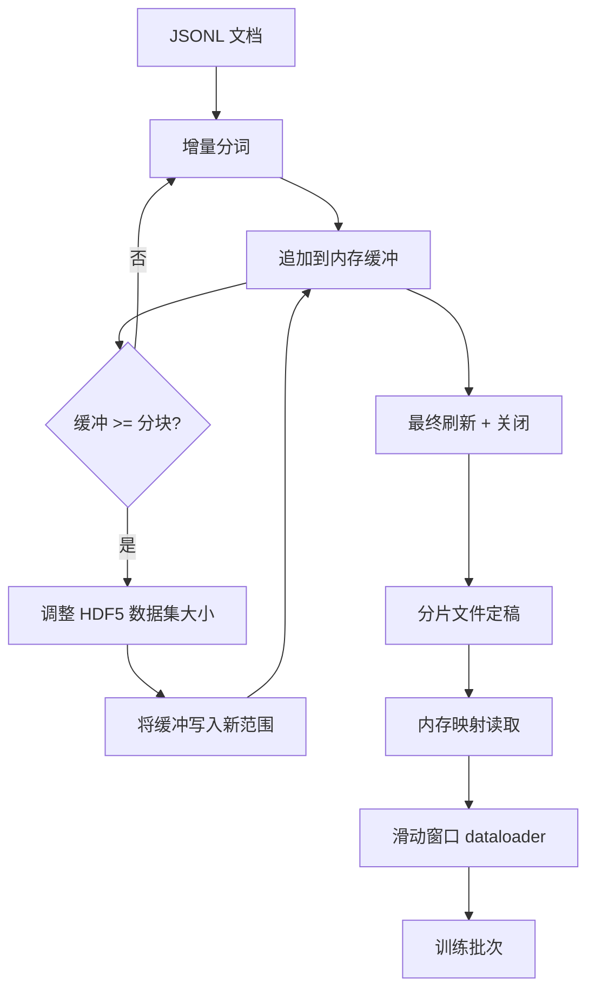

# HDF5 分词语料库

> 下载后的语料库必须以一种布局落地，让训练器能以行速流式读取。JSONL 在磁盘上撑不过 16 个 dataloader worker。HDF5 加可调整大小的分块整数数据集可以。本课将流式分词构建到可调整大小的 HDF5 数据集、分片写入多个文件、训练时内存映射读取，以及滑动窗口 dataloader——它产生固定长度的训练序列并带有正确的打包规则。

**类型：** 构建型
**语言：** Python
**前置条件：** 阶段 19 第 30-37 课
**时间：** 约 90 分钟

## 学习目标

- 将文档流式写入可调整大小的 HDF5 整数数据集，分块大小确定。
- 将写入分片到多个 HDF5 文件，使失败有界且并行可行。
- 通过 HDF5 页缓存支撑的分块布局回读令牌，使 dataloader 仅在批处理时拷贝到批缓冲区。
- 实现滑动窗口 dataloader，发送固定长度的训练序列并带有明确的打包规则。

## 问题

现代语言模型训练运行跨数十个 worker 以每秒数十万样本的速度读取令牌。JSONL 在第一次冷缓存页故障时就死了：JSON 解析器慢，文档边界不可寻址，seek 到"第 4,217,884 个样本"需要扫描文件。即使是压缩效果好的 Parquet 也不合适，因为训练器不要列；要的是平面令牌流和 O(1) 随机访问。

HDF5 之所以合适，是因为它提供了一个分块的、可调整大小的、仅整数的 dataset，其分块在读取时对页缓存友好。训练器请求 `tokens[3,200,000 : 3,200,8192]` 切片，HDF5 将请求的超平板从页缓存拷贝到新分配的 NumPy 数组。代价是每个 worker 一个打开的文件句柄和分块大小的页缓存占用，相比解码 JSONL 的成本可以忽略不计。

构建的难点是让写入侧守规矩。可调整大小的数据集容易被滥用：每写一个文档，HDF5 文件就碎片化到不可用的地步；一个 resize 写入所有文档，进程崩溃就丢失整个分片。正确的纪律是缓冲后扩展，缓冲区大小与分块大小匹配，加上分片写入将工作负载分散到多个文件，这样崩溃最多只丢失一个分片。

## 概念



### 正确地做可调整大小的 HDF5

令牌数据集用 `maxshape=(None,)` 和固定 `chunks=(chunk_size,)` 创建。写入时先将令牌缓冲到长度为 `chunk_size` 的 NumPy 数组。缓冲满了之后，数据集恰好按 `chunk_size` 调整大小，缓冲写入新范围。分片结束时，残差缓冲写入最后一个不完整范围。每次写入都是连续的、对齐的，最后一次写入除外——读取端在分片的 HDF5 属性中记录 `token_count`，读取端在该值处截断。

### 分片写入

单个 HDF5 文件是单点故障。管道并行写入分片：第 42 课的每个输入分片产生一个 HDF5 输出分片。`shards.json` 索引记录每个分片的文件路径、令牌计数、文档计数和令牌的 sha256。训练器读取 `shards.json` 来计算全局偏移量并验证语料库。

### 内存映射读取

训练时每个 worker 以 `swmr=True` 模式打开其份额的 HDF5 文件，请求 `tokens[start:stop]`。HDF5 的分块布局使这成为页缓存支撑的读取，一旦分块变热就只读 RAM。Worker 从不 materialize 整个文件：切片被拷贝到 dataloader 的批缓冲区，然后 dataloader 再将其拷贝到固定内存训练张量中。热路径上每个分块转换只有一次系统调用；其余都是 RAM 访问。

### 滑动窗口 dataloader

dataloader 是唯一知道训练序列长度的阶段。它在全局令牌流中随机选取起始索引，读取 `window_size + 1` 个令牌，返回 `(input, target) = (tokens[:-1], tokens[1:])`。文档边界不强制执行：窗口可能跨越两个文档，中间用显式的 `boundary_token_id` 分隔，让模型学会使用该分隔符。这是标准的打包规则；也是初学者忘记的规则——结果语料库中 8% 是训练边界令牌，92% 是自然文本。

## 构建

`code/main.py` 实现了：

- `Tokenizer` - 一个字节级确定性分词器，用于演示。接口是 `encode(text) -> list[int]` 和 `vocab_size`。
- `HDF5ShardWriter` - 打开可调整大小的整数数据集，将令牌缓冲到分块大小，以固定大小步长 resize 和写入，关闭时将 `token_count` 和 `sha256` 记录为 HDF5 属性。
- `ShardedTokenizationPipeline` - 遍历输入文档，将它们路由到 writer，发出 `shards.json` 索引。
- `MmapTokenStore` - 打开分片文件进行内存映射读取，计算全局偏移量，暴露单一 `get_slice(start, stop)` API。
- `SlidingWindowDataloader` - 从全局流中随机选取窗口，生成 `(input_ids, target_ids)` NumPy 数组。

文件底部的演示构建一个微型内存语料库，分词成两个分片，通过内存映射打开，运行 dataloader 10 个批次，打印每批次形状和校验和。

运行它：

```bash
python3 code/main.py
```

脚本以零退出并打印批次校验和。

## 生产模式

四种模式将本课提升到真实训练运行：

**分块大小等于典型读取大小。** 训练器每个样本读取 `window_size + 1` 个令牌。将 HDF5 分块设置为 `window_size` 的倍数，读取与页缓存对齐。分块不匹配会使吞吐量减半，因为每个样本要触碰两个分块。

**令牌计数在属性中，不在数据集中。** 数据集末尾片可能只是部分满的，因为分块大小不能整除文档边界。将真正的 `token_count` 存储为 HDF5 属性，让读取端在该值处截断。没有这一点，读取端会走到末尾进入零填充令牌，模型学会预测零。

**带并行验证的分片 sha256。** 每个分片对自己的令牌字节有独立的 sha256。训练器可以在训练开始前并行验证所有分片。错误的 sha256 在第一个 epoch 就失败，不是在运行十六小时后的 epoch 3 才失败。

**两端都用 `swmr=True`，写入端加 `libver="latest"`。** 单写入器多读取器模式要求写入端用 `libver="latest"` 打开，提前创建所有数据集，然后设置 `file.swmr_mode = True`。之后写入端必须在每次 resize 后调用 `dataset.flush()`，这样用 `swmr=True` 打开的读取端 worker 才能看到一致数据。忘记 `libver="latest"` 或在结构变更后启用 SWMR 是"文件被锁定"失败的常见原因。

## 使用

生产模式：

- **一个源分片对应一个 HDF5。** 下载器（第 42 课）每个 URL 发出一个分片；分词（本课）每个源分片发出一个 HDF5。1:1 映射使断点续传和部分失败恢复变得 trivial。
- **边界令牌 ID。** 边界令牌是分词器词汇表的一部分，是 dataloader 注入的唯一令牌。如果模型应该忽略它，训练损失掩盖边界令牌；否则模型学会用它作序列分隔符。
- **`shards.json` 作为真相源。** 添加新分片意味着写入 HDF5、计算其 sha256、附加条目。训练器在启动时读取文件一次，不再触碰目录列表。

## 交付

`outputs/skill-hdf5-tokenized-corpus.md` 在真实项目中会描述：哪个分词器喂给管道、哪个分块大小匹配训练器的窗口、`shards.json` 在版本控制中的位置，以及 dataloader worker 如何跨文件分片。本课交付的是引擎。

## 练习

1. 给 HDF5 writer 添加 `--compression gzip` 标志，测量在演示语料库上的吞吐量成本。为选择的默认值辩护。
2. 给滑动窗口 dataloader 添加确定性种子，验证两次相同种子的运行产生相同的批次。
3. 添加 `--validate` 模式，读取每个分片，重新计算其令牌的 sha256，与 `shards.json` 比较。CI 应在训练开始前运行此检查。
4. 比较 dataloader 在分块大小等于、半倍和两倍窗口大小时的吞吐量。报告页缓存效应。
5. 添加 `--max-document-tokens` 标志，在写入时截断超长文档。为在写入时决定而非读取时决定的权衡辩护。

## 关键术语

| 术语 | 大家怎么说的 | 实际含义 |
|------|-----------------|------------------------|
| 可调整大小的数据集 | "仅可追加" | 用 `maxshape=(None,)` 创建的 HDF5 数据集，通过分块大小的 `resize` 调用增长 |
| 分块布局 | "HDF5 如何存储" | 固定大小的磁盘页，内核可以内存映射，dataloader 可以连续读取 |
| `swmr` 模式 | "写时读" | 单写入器多读取器模式，让 dataloader worker 安全共享文件 |
| 分片索引 | "shards.json" | 所有令牌分片的持久索引，含偏移量和内容哈希 |
| 滑动窗口 | "训练样本" | 全局令牌流的固定长度切片，训练器将其与移位一位的目标配对 |

## 进一步阅读

- [HDF5 分块文档](https://docs.hdfgroup.org/hdf5/v1_14/) - 本课使用的分块可调整大小数据集布局
- [h5py 用户指南](https://docs.h5py.org/en/stable/) - HDF5 的 Python 绑定
- [NumPy 内存映射](https://numpy.org/doc/stable/reference/generated/numpy.memmap.html) - HDF5 通过 h5py 暴露的读取原语
- 阶段 19 · 42 - 输出本课分词的下载器
- 阶段 19 · 44 - 消费本 dataloader 的余弦调度器
- 阶段 19 · 45 - 包装训练步骤的 AMP 循环