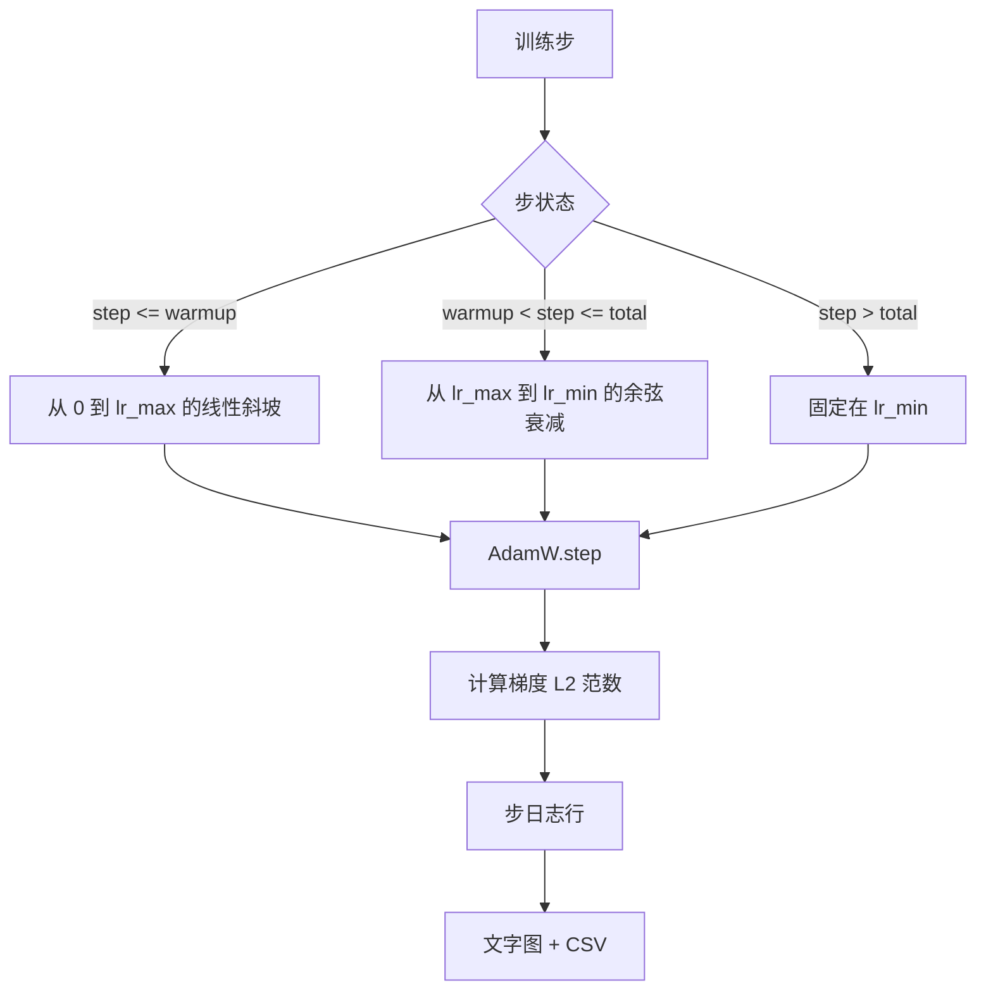

# 带线性 Warmup 的余弦学习率调度器

> 学习率调度器是损失函数之后第二重要的决策。AdamW 配合余弦衰减和线性 warmup 是语言模型训练的现代默认配置，因为它让模型在前一千个脆弱的更新中看到较小的有效步长，攀升到配置的峰值，再平稳衰减回零。本课构建该调度器，在训练步上绘制曲线，将梯度范数与调度器并列记录，并证明调度器遵守 warmup、峰值和衰减边界。

**类型：** 构建型
**语言：** Python
**前置条件：** 阶段 19 第 30-37 课
**时间：** 约 90 分钟

## 学习目标

- 实现连接到带线性 warmup 的余弦学习率调度器的 AdamW 优化器。
- 在任何步数上精确计算调度器的值，跨运行无浮点漂移。
- 将梯度 L2 范数与学习率并列记录，使训练健康状态可观测。
- 将调度器渲染为眼睛可读的文字图和任何工具可消费的 CSV。

## 问题

前一千个训练更新是最不稳定的。模型权重仍接近初始化。优化器的运行二阶矩估计尚未稳定。梯度范数大且嘈杂。如果学习率在这些更新期间处于峰值，模型要么直接发散，要么陷入损失平台再也出不来。两个众所周知的修复是梯度裁剪（这是第 45 课的主题）和从小到大攀升的学习率调度器。

带 warmup 的余弦调度器有三个区域。从步零到步 `warmup_steps`，学习率从零线性缩放到配置的峰值 `lr_max`。从步 `warmup_steps` 到步 `total_steps`，学习率遵循余弦曲线的上半部分，从 `lr_max` 衰减到 `lr_min`。超过 `total_steps` 后，学习率固定在 `lr_min`，这样配置错误的训练器不会静默退出调度器。

构建的难点是调度器很容易 off-by-one。这个 off-by-one 在训练运行六小时后显现：学习率在模型开始过拟合的时刻高了或低了 1%，除非对边界进行穷尽测试，否则这不可见。

## 概念



### Warmup 公式

对于 `step` 在 `[0, warmup_steps]` 且 `warmup_steps > 0`，学习率是 `lr_max * step / warmup_steps`。退化的 `warmup_steps = 0` 情形视为"无 warmup"：调度器在步零直接从 `lr_max` 开始，立即进入余弦衰减。一些测试工具传 `warmup_steps = 0` 来检查调度器仍产生可用曲线。

### Cosine 公式

对于 `step` 在 `(warmup_steps, total_steps]`，学习率是 `lr_min + 0.5 * (lr_max - lr_min) * (1 + cos(pi * progress))`，其中 `progress = (step - warmup_steps) / max(1, total_steps - warmup_steps)`。在 `step = warmup_steps` 时，余弦计算为 `cos(0) = 1`，得到 `lr_max`，精确匹配 warmup 终点。在 `step = total_steps` 时，余弦计算为 `cos(pi) = -1`，得到 `lr_min`，精确匹配衰减终点。

两端的连续性不是巧合。这就是为什么调度器实现为关于 `step` 的单一函数，而不是粘在一起的三个不同函数。粘在一起的调度器在第一次更改 `lr_max` 时会丢失一个边界。

### 超过总步数后的 Floor

对于 `step > total_steps`，学习率保持在 `lr_min`。契约是明确的：调度器不报错也不外推；它固定在 floor，让训练器记录警告。需要延长训练的训练器更改调度器的 `total_steps`，而不是循环。

### 梯度范数与学习率并列记录

调度器是训练健康的一半。梯度范数是另一半。训练循环每步记录两者。发散的训练运行在损失之前就显示梯度范数尖峰；调得好的 warmup 使范数随学习率线性上升；过于激进的峰值表现为 warmup 后范数居高不下。磁盘上的数据集是 `step, lr, grad_l2_norm, loss`。CSV 是唯一的持久记录。

## 构建

`code/main.py` 实现了：

- `CosineWithWarmup` - 关于配置调度器的无状态函数 `lr(step) -> float`。
- `TrainState` - 将模型、`AdamW` 优化器和调度器包装成单一 step 函数。
- `TrainState.step` - 运行一次前向、一次反向，记录梯度 L2 范数，并将 `lr(step)` 应用于优化器。
- `plot_schedule_ascii` - 将调度器渲染为眼睛可读的文字图。
- `write_schedule_csv` - 每步发出一行含学习率。

文件底部的演示构建一个微型 `nn.Linear` 模型，在固定输入批次上训练 20 步，打印每步学习率、梯度范数和损失。调度器也渲染为文字图供视觉检查。

运行它：

```bash
python3 code/main.py
```

脚本以零退出并打印每步训练日志和调度器图。

## 生产模式

四种模式将调度器提升为生产级工件。

**调度器在配置中，不在代码中。** 训练器从提交到 git 的 YAML 或 JSON 配置中读取 `warmup_steps`、`total_steps`、`lr_max`、`lr_min`。调度器可复现是因为配置内容寻址的；调度器可审计是因为配置是 PR diff 的一部分。

**步计数器是单调的，与 epoch 解耦。** 有些框架在数据集分片或 dataloader 重启时混淆步和 epoch。调度器从训练器的检查点读取 `global_step`，不从本地计数器读取。恢复的运行在正确的调度器位置继续，因为步计数器是持久轴。

**调度器图在运行目录中。** 每次训练运行将其运行目录中的 `outputs/lr_schedule.png`（或本课的文字图）写入。浏览目录的审查者无需重跑任何东西就能对调度器进行合理性检查。这能在 PR 时捕获配置错误调度器这一类 bug。

**日志行模式是固定的。** `step, lr, grad_l2_norm, loss` 按此顺序。下游笔记本或仪表板读取该模式；重命名列而不 bump 版本会使每个现有仪表板失效。

## 使用

生产模式：

- **在扫任何东西之前先扫峰值。** `lr_max` 是最敏感的旋钮。先在小模型上扫它；最优 `lr_max` 随模型大小弱缩放，所以小模型扫是强先验。
- **Warmup 是总步数的分数，不是绝对计数。** 2 亿步运行配 2000 warmup 步几乎立即从峰值开始；2 万步运行配相同数量则要预热 10%。将 warmup 配置为分数（典型：1-3%），这样调度器随训练时长缩放。
- **`lr_min` 非零是有原因的。** 峰值的 10% 的 floor 使优化器在长尾阶段继续学习。`lr_min = 0` 的调度器产生的训练曲线在图上很好看，但模型实际上没有训练完。

## 交付

`outputs/skill-cosine-warmup.md` 在真实项目中会描述：哪个配置携带调度器、从哪个训练器步读取全局计数器、哪个 `lr_max` 扫产生了部署值。本课交付的是引擎。

## 练习

1. 添加调度器的逆平方根变体，在 200 步玩具训练运行上比较。哪个曲线产生更低的最终损失？
2. 添加 `--restart` 标志，在 `total_steps / 2` 处添加第二个 warmup。为 warm restarts 在玩具运行上是改善还是伤害辩护。
3. 添加单元测试，测试调度器连续：对于 `[0, total_steps]` 中的每一步，差值 `|lr(step+1) - lr(step)|` 以 `lr_max / warmup_steps` 为界。
4. 将调度器接入 `torch.optim.lr_scheduler.LambdaLR`，这样它可与框架代码组合。本课用普通 step 函数；包装器改变了什么？
5. 添加 `--plot-png` 标志，通过 `matplotlib` 写入真实图。为本课的文字图和 PNG 哪个是 CI 运行的更好默认辩护。

## 关键术语

| 术语 | 大家怎么说的 | 实际含义 |
|------|-----------------|------------------------|
| Warmup | "慢启动" | 在前 `warmup_steps` 次更新中从零到 `lr_max` 的线性斜坡 |
| 余弦衰减 | "平滑下降" | 在剩余步上从 `lr_max` 到 `lr_min` 的上半部余弦曲线 |
| Floor | "训练之后" | 调度器在超过 `total_steps` 后固定的 `lr_min` 值 |
| 梯度范数 | "梯度的 L2" | 连接梯度向量的欧几里得范数，每步记录 |
| 全局步数 | "调度器轴" | 单调步计数器，跨重启存活，驱动调度器 |

## 进一步阅读

- [Loshchilov and Hutter, SGDR: Warm Restarts 随机梯度下降 (arXiv 1608.03983)](https://arxiv.org/abs/1608.03983) - 余弦调度器的参考论文
- [Loshchilov and Hutter, 解耦权重衰减正则化 (arXiv 1711.05101)](https://arxiv.org/abs/1711.05101) - AdamW 的参考论文
- [PyTorch torch.optim.lr_scheduler](https://docs.pytorch.org/docs/stable/optim.html#how-to-adjust-learning-rate) - step 函数如何与框架调度器组合
- 阶段 19 · 42 - 下载该调度器所消费语料库的下载器
- 阶段 19 · 43 - 该调度器共同演进的 dataloader
- 阶段 19 · 45 - 梯度裁剪和 AMP，循环中的下一层