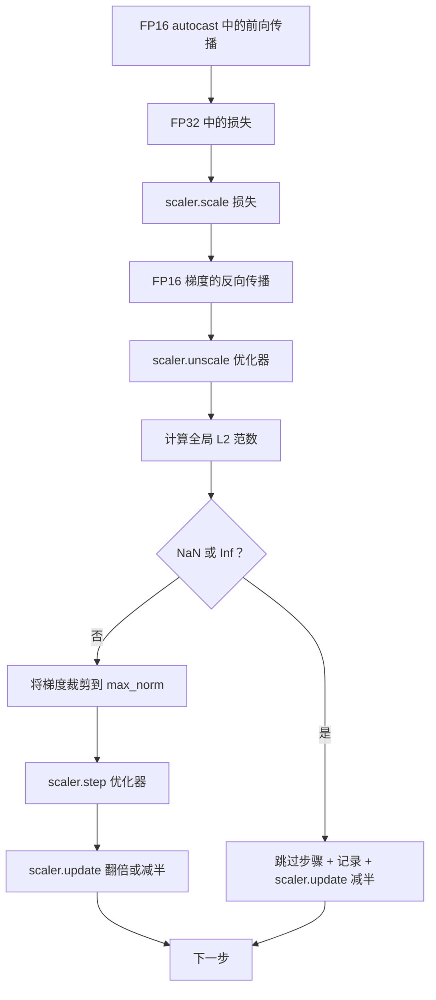

# 梯度裁剪与混合精度

> 上一课的优化器和调度器假设梯度是正常的。但它们通常不是。单批次梯度范数可能飙升至原来的三千倍。混合精度训练通过引入 FP16 溢出进一步放大这个问题。本课构建生产训练不可或缺的两种安全带：按配置的全局 L2 范数裁剪梯度，以及带有 autocast 和 GradScaler 的混合精度循环，用于检测 NaN 和 Inf、干净地跳过步骤并记录缩放因子供事后分析。

**类型：** 构建
**语言：** Python
**前置条件：** 阶段 19 第 30-37 课
**时间：** 约 90 分钟

## 学习目标

- 计算所有参数梯度的全局 L2 范数，在其超过配置阈值时原地裁剪。
- 用 autocast 加 GradScaler 包装训练步骤，使 FP16 前向和反向传播在溢出时存活。
- 检测损失或梯度中的 NaN 和 Inf，跳过优化器步骤并记录跳过。
- 每步报告 GradScaler 的缩放因子，使长时间的连续跳过立即可见。

## 问题

昨天运行正常的训练，在第 8,217 步时损失曲线突然垂直上升。罪魁祸首是一个梯度范数为 4,200 的单批次，是前一个峰值的二十倍。不裁剪的话，优化器会应用一个将前一小时所有学习重置的步骤。若全局 L2 裁剪到范数 1.0，同样的批次贡献一个单位范数更新；损失保持在趋势线上；训练得以存活。

混合精度训练通过在 FP16 中计算前向传播和大部分反向传播，将吞吐量提升 2-3 倍。代价是 FP16 的指数范围很窄。一个在 FP16 中溢出的典型梯度计算结果为 Inf，Inf 会通过后续层传播为 NaN，在下一次优化器步骤时将所有权重设为 NaN。PyTorch 的 GradScaler 通过在反向传播前将损失乘以一个大缩放因子，并在优化器步骤前将梯度除以相同的因子来解决这个问题。如果任何梯度在 unscale 时为 Inf 或 NaN，缩放器跳过该步骤并将缩放因子减半；如果前 N 步都是干净的，缩放器将因子翻倍。在训练过程中，因子会找到 FP16 范围允许的最高值。

构建问题是正确连接这两者。unscale 前裁剪，阈值作用于缩放后的梯度；unscale 后裁剪，GradScaler 的操作顺序会出问题。正确的顺序是：`scaler.scale(loss).backward()`，然后 `scaler.unscale_(optimizer)`，然后 `clip_grad_norm_`，然后 `scaler.step(optimizer)`，然后 `scaler.update()`。任何其他顺序都会产生一个静默失效的循环。

## 概念



### 全局 L2 范数

全局 L2 范数是拼接梯度向量的欧几里得范数，而非逐参数范数。PyTorch 通过 `torch.nn.utils.clip_grad_norm_(parameters, max_norm)` 实现。该函数返回裁剪前的范数，以便记录自然值和裁剪后的值，这对"每步都在裁剪"的诊断是必要的。

### autocast 与 GradScaler

`torch.amp.autocast(device_type)` 是选择性以 FP16 运行合格操作（大多数 matmul 类操作）的上下文管理器。`torch.amp.GradScaler(device_type)` 是在反向传播前缩放损失并在优化器步骤前反向缩放梯度的辅助类。两者设计在一起使用；单独使用其中一个是测试应捕获的配置错误。

本课使用 CPU autocast，因为那是 CI 中运行的；相同的模式原封不动地转移到 CUDA，只需将 `device_type="cpu"` 改为 `device_type="cuda"`。CPU 上的 GradScaler 是一个占位实现（CPU autocast 默认已在 BF16 上运行，不需要损失缩放），但本课包含调用点，使接线方式与 GPU 循环完全一致。

### NaN 和 Inf 检测

检测发生在两个地方。首先，用 `torch.isfinite` 在反向传播前检查损失本身；Inf 或 NaN 损失不会产生有用的梯度，会在不进入优化器的情况下被跳过。其次，在 `scaler.unscale_(optimizer)` 之后，本课使用 `has_non_finite_grad(...)` 扫描未缩放的梯度，并将任何 Inf 或 NaN 视为跳过。这两项检查共同覆盖了前向传播和反向传播两种失败模式。

### 缩放因子诊断

缩放因子是 GradScaler 的内部状态。每步读取 `scaler.get_scale()` 并与学习率和梯度范数一起记录。健康的运行显示缩放因子以 2 的幂次攀升，直到在 `2^17` 或 `2^18` 附近饱和。行为异常的运行显示因子在高值和低值之间振荡，这表明模型的梯度有时在范围内，有时不在。没有记录，此诊断不可见。

## 构建

`code/main.py` 实现：

- `clip_global_l2_norm` —— `torch.nn.utils.clip_grad_norm_` 的包装器，返回裁剪前和裁剪后的范数。
- `has_non_finite_grad` —— 扫描梯度中的 NaN 和 Inf 的辅助函数。
- `AmpTrainState` —— 包装模型、AdamW 优化器、GradScaler 和 autocast 设备。暴露 `step(inputs, targets)` 方法，运行完整的裁剪、缩放和 NaN 时跳过流程。
- `StepLog` 和 `SkipLog` —— 结构化的每步记录。
- 一个演示：对一个小 `nn.Linear` 模型训练 20 步，在第 5 步注入一个 Inf 到梯度中以锻炼跳过路径，并打印结果日志。

运行：

```bash
python3 code/main.py
```

脚本以零退出，打印每步日志，每行标记为 `STEP` 或 `SKIP`；至少有一行是 `SKIP`。

## 生产模式

四个模式将循环提升到生产训练步骤。

**跳过计数器作为告警，而非日志行。** 每个训练运行中有少量跳过的步骤是健康的。每 epoch 数百次跳过是硬告警：模型处于 FP16 无法容纳的状态，循环正在静默失败。本课追踪 1,000 步滚动跳过率，在生产中会在比率超过 5% 时分页告警。

**裁剪阈值放在配置中。** `max_norm = 1.0` 是语言模型训练的现代默认值。先在小模型上调整；更大的阈值让模型从真正困难的批次中恢复；更小的阈值以更嘈杂的损失曲线为代价限制最坏情况。阈值与第 44 课的调度器放在同一个 YAML 或 JSON 配置中。

**范数日志写入与调度器相同的 CSV。** CSV 列是 `step, lr, grad_l2_pre_clip, grad_l2_post_clip, loss, skipped, skip_reason, scaler_scale`。打开文件的审查者在一行中看到调度器、梯度故事、缩放因子和跳过结果（及其原因）。将列拆分到不同文件是错位分析的秘诀。

**`scaler.update()` 每步都运行，即使在跳过时。** 在干净步骤上，缩放器读取其无 inf 计数器，递增，可能将因子翻倍。在跳过的步骤上，缩放器将因子减半并重置计数器。在跳过路径上忘记 `update()` 是产生"缩放因子从未改变"的 bug。

## 使用

生产模式：

- **Autocast 设备与优化器设备匹配。** GPU 训练用 `torch.amp.autocast(device_type="cuda")`；CPU 训练用 `torch.amp.autocast(device_type="cpu")`。混合设备会产生静默的类型错误，表现为损失曲线看起来正常但模型没有在学习。
- **反向传播前检查损失。** `torch.isfinite(loss).all()` 是一次张量归约；代价可以忽略不计，而 NaN 损失的节省是一个完整的训练步骤。始终运行它。
- **`zero_grad` 中的 `set_to_none=True`。** 将梯度设置为 `None` 而非零，使优化器能够跳过不受影响参数组的计算。此设置是免费的吞吐量改进和轻微的 bug 表面减少。

## 交付

`outputs/skill-clip-amp.md` 在实际项目中描述训练步骤使用的裁剪阈值和 autocast 设备、每步 CSV 在版本控制中的位置，以及生产跳过率告警阈值。本课交付引擎。

## 练习

1. 将合成 Inf 注入替换为真实损失峰值（将一个批次的目标乘以 1e8），验证跳过路径触发。
2. 添加 `--bf16` 模式，将 autocast 切换为 BF16 而非 FP16。BF16 的指数范围比 FP16 更宽，很少需要损失缩放；验证在同一演示上跳过率降至零。
3. 添加一个单元测试，验证梯度裁剪包装器在未发生裁剪时正确返回裁剪前和裁剪后的范数。
4. 添加滚动窗口跳过率计算和一个 CLI 标志，在连续 100 步超过配置阈值时使运行失败。
5. 将循环连接到写入规范 CSV（`step, lr, grad_l2_pre_clip, grad_l2_post_clip, loss, skipped, skip_reason, scaler_scale`），并确认文件在 Ctrl-C 时通过每行后刷新存活。

## 关键术语

| 术语 | 大家怎么说的 | 实际含义 |
|------|-----------------|------------------------|
| 全局 L2 范数 | "裁剪目标" | 所有可训练参数拼接梯度向量的欧几里得范数 |
| autocast | "混合精度" | 在 `with` 块内有选择地执行 FP16（或 BF16）合格操作 |
| GradScaler | "损失缩放器" | 在反向传播前乘以损失并在优化器步骤前反向缩放梯度的辅助类 |
| 跳过 | "坏步骤" | 因梯度或损失非有限而被拒绝的优化器步骤；缩放器将因子减半 |
| 缩放因子 | "缩放器状态" | GradScaler 当前乘数；在干净连续段后翻倍，每次跳过时减半 |

## 进一步阅读

- [Micikevicius 等，混合精度训练（arXiv 1710.03740）](https://arxiv.org/abs/1710.03740) —— 原始损失缩放提案
- [Pascanu, Mikolov, Bengio，训练循环神经网络的难度（arXiv 1211.5063）](https://arxiv.org/abs/1211.5063) —— 梯度裁剪参考论文
- [PyTorch torch.amp.GradScaler](https://docs.pytorch.org/docs/stable/amp.html) —— 本课包装的缩放器 API
- [PyTorch torch.nn.utils.clip_grad_norm_](https://docs.pytorch.org/docs/stable/generated/torch.nn.utils.clip_grad_norm_.html) —— 本课使用的裁剪原语
- 阶段 19 · 42 —— 下载器，其语料供给本循环
- 阶段 19 · 43 —— 本循环消费的数据加载器
- 阶段 19 · 44 —— 本循环组合的调度器