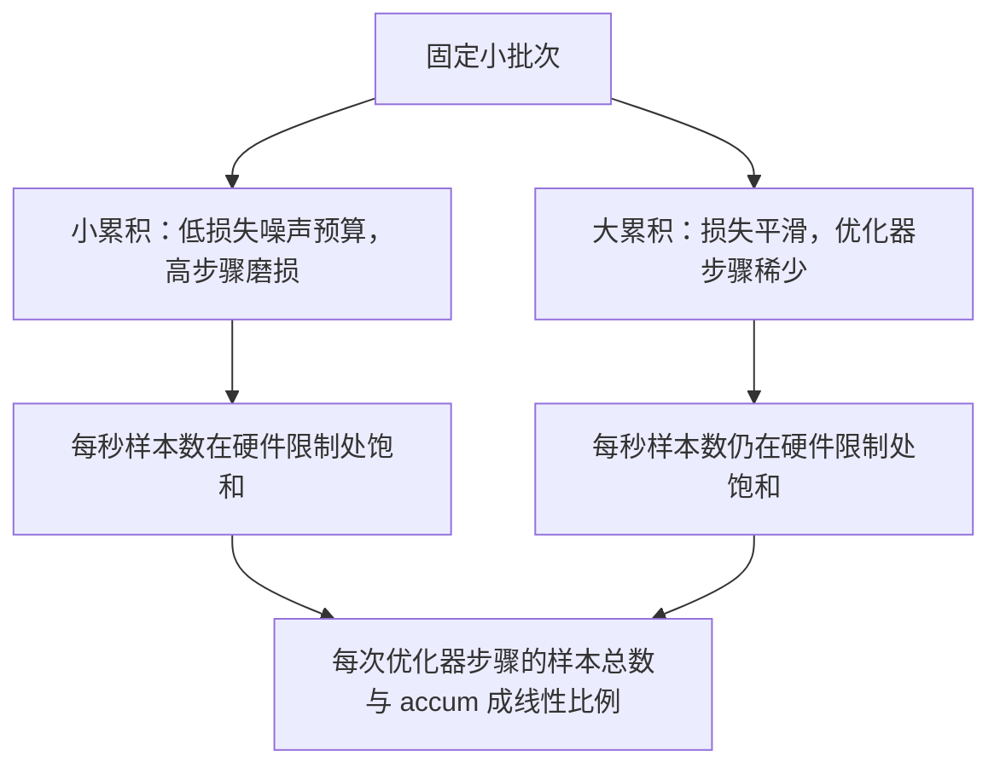

# 梯度累积

> 用你负担不起的有效批次训练，一次一个小批次。缩放损失，保持优化器步骤，让梯度堆积。

**类型：** 构建
**语言：** Python
**前置条件：** 阶段 19 第 42-45 课
**时间：** 约 90 分钟

## 学习目标

- 推导出有效批次恒等式：`effective_batch = micro_batch * accum_steps`。
- 实现每小批次损失缩放，使累积梯度与单次完整批次反向传播匹配。
- 在最后一个小批次之前跳过优化器同步（sync-on-last-step）。
- 阅读吞吐量对有效批次曲线并解释边际效益递减。

## 问题

你想在有效批次 512 上训练，因为损失曲线更平滑，优化器步骤在该规模下更有意义。桌上的加速器在耗尽内存前能容纳 32 个样本。翻倍批次不行。减半模型不行。该领域在 2017 年想出的技巧是一直使用至今：运行 16 次反向传播，让梯度在参数缓冲区中累积，只在计数达到目标时才执行优化器步骤。

风险在于损失不再是更大批次时的同一个数字。16 个小批次的交叉熵简单求和是一个完整批次损失的 16 倍。不缩放的话，梯度方向正确但幅度错误，优化器步骤大了 16 倍。修复是一道除法。修复也很容易忘记。

## 概念


合约很简短：

- 每个小批次的损失在 `backward()` 前除以 `accum_steps`。PyTorch 默认将梯度求和到 `param.grad`；除法将运行中的和推回到正确的规模。
- 优化器步骤在最后一个小批次反向传播后每有效批次触发一次。中途累积时执行步骤会扭曲运行其余部分所依赖的每个参数。
- 优化器状态（动量缓冲区、Adam 矩）在每个有效步骤推进一次，而非每小批次一次。否则指数移动平均会看到错误的频率并耗尽调度器。
- 在单设备上这只是记账。在多 rank 集群上，相同的模式将非最后小批次包装在 `no_sync` 上下文中以跳过梯度 all-reduce；最后小批次一次完成完整累积梯度的归约，而非 N 次支付网络成本。

### 代码中的等价证明

```python
loss = criterion(model(x_full), y_full)
loss.backward()
opt.step()
```

等价于

```python
for x, y in chunks(x_full, y_full, n):
    scaled = criterion(model(x), y) / n
    scaled.backward()
opt.step()
```

至浮点求和顺序。循环结束时累积的梯度缓冲区与单次完整批次反向传播产生的梯度缓冲区相同。课程代码在 `equivalence_check` 中以最大绝对差异小于 1e-4 来断言这一点。

### 成本去向

每个小批次花费一次前向和一次反向。累积以时间换内存。`outputs/accum-curve.json` 中的吞吐量曲线显示在固定小批次时有效批次增长时发生什么：



没有免费午餐。`accum_steps` 翻倍使每次优化器步骤的墙上时间翻倍。改变的是梯度估计的方差：在相同的预算下，你做了更少的优化器步骤，但每一步都在更多样本上做了平均。文献将大批次和小批次视为不同的优化问题；这里的教训是机械的，而非统计的。

## 构建

`code/main.py` 是可运行的产物。它做三件事。

### 第 1 步：等价检查

`equivalence_check()` 用相同种子构建同一网络的两个副本。一个在一次前向传播中看到 16 样本批次。另一个看到四个 4 样本块，损失除以四。函数在优化器步骤前比较梯度缓冲区，在步骤后比较参数。断言是 `max_abs_diff < 1e-4`。

### 第 2 步：sync-on-last-step 模式

`train_one_optimizer_step` 遍历小批次。对于除最后一个外的每个小批次，它进入 `no_sync_context(model)`。在单进程上，上下文是一个空操作；在 DDP 上，这是跳过梯度 all-reduce 的地方。记账无论在哪种情况都是一样的。`sync_counter` 记录我们离开 no_sync 作用域的次数；对于 N 个小批次，计数是每个有效步骤一次，而非 N 次。

### 第 3 步：吞吐量曲线

`sweep_effective_batches` 用固定小批次和累积步骤列表运行相同模型。对于每个设置，它记录：

- `samples_per_sec`：看到的总样本数除以墙上时间
- `median_step_ms`：第 50 百分位每次有效步骤
- `sync_calls`：被调用的集体点
- `avg_loss`：跨扫瞄优化器步骤的平均值

输出落在 `outputs/accum-curve.json`，可从笔记本重用。

运行：

```bash
python3 code/main.py
```

脚本打印等价差值，然后扫瞄表，然后 JSON 路径。退出码为零。

## 使用

在生产训练中，梯度累积隐藏在一个旋钮后面。PyTorch 的模式是 `accumulation_steps = effective_batch // (micro_batch * world_size)`。不允许在这里使用的框架包装了相同的循环，但步骤相同：缩放损失，在非最后小批次上跳过同步，累积，每有效批次步骤一次。

三个野外模式：

- 小批次大小选择为使设备内存饱和。更小浪费加速器周期。更大则崩溃。
- 有效批次从学习率调度器选择。大有效批次需要缩放学习率和预热；这是自 2017 年以来谈论的线性缩放规则。
- 累积计数是两者之间的桥梁，也是运行时唯一可以在不重写数据加载器的情况下自由调整的旋钮。

## 交付

`outputs/skill-gradient-accumulation.md` 获取配方，以便同行可以将其放入新仓库：用 `accum_steps` 缩放损失，在非最后小批次上跳过优化器同步，每有效批次步骤一次优化器，记录吞吐量对有效批次为 JSON，以便权衡可见。

## 练习

1. 用 `--num-steps 100` 重新运行扫瞄，并绘制每秒样本数对有效批次的关系图。曲线在哪里变平？
2. 添加一个错误缩放变体（不除以 N），并显示第 1 步相对于参考的参数差异。
3. 将 SGD 换成 AdamW，并确认优化器状态每有效步骤推进一次，而非每小批次一次。
4. 引入真实的 `DistributedDataParallel` 包装器，并将 `no_sync_context` 路由到其方法。确认每个有效批次的 sync_calls 减少 N-1。
5. 修改等价检查以比较两个不同的小批次分割（2×8 vs 4×4），并解释你需要放宽的任何容差。

## 关键术语

| 术语 | 大家怎么说的 | 实际含义 |
|------|-----------------|------------------------|
| 小批次 | 你前向的批次 | 在单次前向传播中装入内存的切片 |
| 累积步数 | 每次步骤的反向传播次数 | 在一次优化器步骤前求和的反向传播次数 |
| 有效批次 | 那个批次 | 小批次乘以累积步数乘以数据并行 world size |
| 损失缩放 | 除以 N | 每小批次除法，使求和梯度与完整批次匹配 |
| 在最后同步 | 跳过其余 | 仅在窗口中最后一次反向传播上运行梯度集体 |

## 进一步阅读

- PyTorch docs on `DistributedDataParallel.no_sync` 用于 sync-on-last-step 技巧的生产版本。
- Goyal et al., 2017, on large batch training 的线性缩放，这是关注有效批次的典型原因。
- PyTorch issue tracker on gradient accumulation 与混合精度 unscale 的交互。
- 阶段 19 第 42-45 课涵盖本课假设的模型、数据加载器、优化器和训练器脚手架。
- 阶段 19 第 47 课涵盖检查点和恢复，以便长累积运行在墙上时间限制下存活。