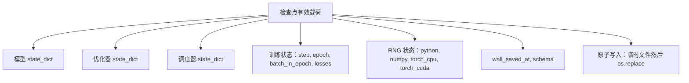
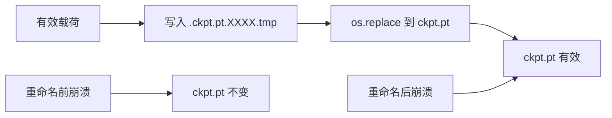
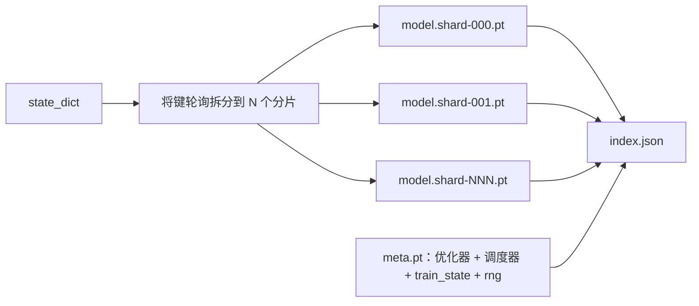

# 检查点保存与恢复

> 训练中断会杀死运行；检查点让它们继续。原子地保存模型、优化器、调度器、损失历史、步骤计数器和 RNG 状态，这样在任何时刻的杀死都在磁盘上留下一个有效文件。

**类型：** 构建
**语言：** Python
**前置条件：** 阶段 19 第 42-45 课
**时间：** 约 90 分钟

## 学习目标

- 将完整训练状态捕获到单个有效载荷中，可以重新加载到新进程中。
- 实现原子保存：先写临时文件再重命名，这样崩溃永远不会留下半写文件。
- 恢复 Python、NumPy 和 PyTorch 的 RNG 状态，使恢复后的损失与未中断基准线匹配。
- 为不再适合单个文件的模型构建分片检查点布局，带有哈希验证的分片和 JSON 索引。

## 问题

你将训练作业设置为 18 小时。墙上时间限制是 4 小时。集群在第 11 小时重启，因为你的上级批准了内核升级。没有检查点，你从头开始。没有恢复，你还损失了前 11 小时学到的优化器状态，所以即使模型权重幸存，AdamW 矩也消失了，下一步会朝着训练轨迹已经走过的方向 lurching。

正确的产物是一个持有继续所需一切的单一文件：模型参数、优化器状态、调度器状态、用于绘图的损失历史、当前步骤和 epoch 以及 epoch 中的批次计数器，以及每个随机性来源的 RNG 状态。没有 RNG 状态，恢复的损失曲线是一条不同的曲线。相同的模型，相同的数据，不同的 shuffle，不同的 dropout mask，仪表板上的不同数字。

原子保存是合约的另一半。写入最终文件名意味着中途崩溃留下损坏文件；恢复读取垃圾。写入同一目录中的临时文件然后重命名意味着中途崩溃留下之前的好文件完好无损。POSIX 文件系统上重命名是原子的。

## 概念



### 五个状态桶

| 桶 | 为什么重要 |
|--------|----------------|
| 模型 | 权重和缓冲区；模型是什么。 |
| 优化器 | 动量和自适应矩；没有这些，下一步是一个不同的优化问题。 |
| 调度器 | 学习率在曲线上的位置；余弦调度器尤其关心。 |
| 训练计数器 | Step、epoch、epoch 中的 batch，加上绘制仪表板的损失历史。 |
| RNG 状态 | dropout、数据 shuffling 和模型内任何采样的确定性。 |

### 原子保存



两条规则。首先，临时文件与目标文件在同一目录，这样重命名保持在同一文件系统内；跨设备重命名不是原子的。其次，临时名称每次尝试都是唯一的，这样两个写入器不会互相踩踏。

### 分片检查点

当模型变大时，单文件有效载荷变得太大而无法快速加载、太无法检查，而且当网络共享中途读写出问题时太痛苦。修复是将参数状态拆分成分片并编写一个将它们绑在一起的小索引。



索引记录分片数量、每个分片的 sha256 和元文件的 sha256。加载器在任何哈希不匹配时大声失败。分片可以落在不同的物理磁盘上；元文件很小，先读取。

### 恢复继续在 epoch 中途

快照到下一个 epoch 开头的恢复会浪费从几分钟到一天的时间。修复是 `(epoch, batch_in_epoch)` 加上 RNG 状态。加载后，训练循环将随机数生成器快进到当前 epoch 中已消费的批次之后，并从 `batch_in_epoch` 继续。课程代码正是这样做的；断言是恢复后的损失轨迹在 1e-4 内与未中断基准线匹配。

## 构建

`code/main.py` 提供四个原语和一个演示驱动程序。

### 第 1 步：捕获和恢复 RNG 状态

`capture_rng_state` 返回一个字典，包含 Python 的 `random.getstate`、NumPy 的 `np.random.get_state` 和 PyTorch CPU 和 CUDA RNG 字节。`restore_rng_state` 反向操作。CPU 张量是一个 PyTorch RNG 知道如何消费的 uint8 字节缓冲区。

### 第 2 步：原子保存

`atomic_save` 将有效载荷写入目标目录中的临时文件，然后 `os.replace` 交换到最终名称。`atomic_write_json` 对分片索引做同样的事情。

### 第 3 步：完整检查点往返

`save_checkpoint` 将模型、优化器、调度器、训练状态和 RNG 打包到一个字典中。`load_checkpoint` 反向操作并返回 `TrainState`。schema 字段是升级钩子：未来格式变化会 bump 版本字符串，加载器会分派。

### 第 4 步：分片变体

`save_sharded_checkpoint` 将参数键轮询分配到 N 个分片，用自己的原子保存写入每个分片，写入带有优化器和调度器及训练状态及 RNG 的元文件，并写入带有分片 sha256 的 JSON 索引。`load_sharded_checkpoint` 在合并前验证每个分片。

### 第 5 步：恢复演示

`run_resume_demo` 训练一个小模型 `total_steps` 步，在 `interrupt_at` 保存检查点，然后继续。第二个进程恢复检查点并运行剩余步骤。函数返回中断点后两条损失轨迹之间的最大绝对差异。恢复 RNG 后，差异为零或浮点噪声。

运行：

```bash
python3 code/main.py
```

单文件和分片演示都断言最大差异低于 1e-4。摘要落在 `outputs/resume-demo.json`。

## 使用

生产训练栈将检查点作为训练器的一部分发货。形状相同：模型 + 优化器 + 调度器 + 计数器 + RNG，原子写入，按步骤命名以便轻松找到最新的。分片布局为大型模型加载提供并行读取支持；index.json 是使该工作成为可能的关键。

三个要强制执行的模式：

- **Schema 是有效载荷中的一个字符串。** 迁移以此为分支。没有它，你无法在不破坏旧运行的情况下演进格式。
- **每个分片都有 Sha256。** 静默截断的下载是最糟糕的 bug；加载器快速失败或晚失败。
- **保持检查点节奏诚实。** 每 N 步和每个墙上分钟保存，以较短者为准。否则，崩溃的长步骤会浪费整整一个窗口的工作。

## 交付

`outputs/skill-checkpoint-save-resume.md` 是任何新训练脚本的配方：有效载荷形状、原子写入、RNG 捕获、分片索引。将技能放入仓库，在周期性保存站点连接 `save_checkpoint`，在启动时连接 `load_checkpoint`，运行就能存活。

## 练习

1. 将轮询分片替换为按参数组（以 `.weight` 结尾 vs `.bias` 结尾的层）分片。每个布局何时更可取？
2. 扩展保存循环以保留最后 K 个检查点并修剪旧的。当磁盘很小时，正确的 K 是多少？
3. 添加一个 `--ckpt-every-seconds` 标志，在墙上时间间隔而非步骤计数上触发保存。
4. 在启动时添加校验和验证路径，扫描目录中的每个检查点，并报告哪些已损坏。
5. 实现一个 `migrate_v1_to_v2` 函数，向有效载荷添加新字段并 bump schema 字符串。使加载容忍两个版本。

## 关键术语

| 术语 | 大家怎么说的 | 实际含义 |
|------|-----------------|------------------------|
| 原子保存 | "写入并祈祷" | 写入同一目录中的临时文件，然后 os.replace 到目标名称 |
| State dict | "权重" | 按参数名称键控的模型参数和缓冲区 |
| 分片检查点 | "大模型文件" | 多个文件，每个分片一个，加一个元文件和一个带 sha256 的 JSON 索引 |
| RNG 状态 | "随机种子" | 为 python random、numpy、torch CPU、torch CUDA 捕获的状态；不仅仅是种子 |
| Epoch 中途恢复 | "重新开始" | 快进 RNG 并从同一 epoch 中的下一批次继续 |

## 进一步阅读

- POSIX `rename` 语义，用于 `os.replace` 所依赖的原子性声明。
- PyTorch 文档关于 `torch.save` 和 `torch.load`，包括用于跨设备恢复的 `map_location`。
- 阶段 19 第 46 课涵盖本课检查点有效载荷在其间存活的梯度累积。
- 阶段 19 第 48 课涵盖本方案容纳的分布式包装器的 state dict 格式。
- Linux 内核 `fsync` 文档，用于原子重命名背后的持久性保证。