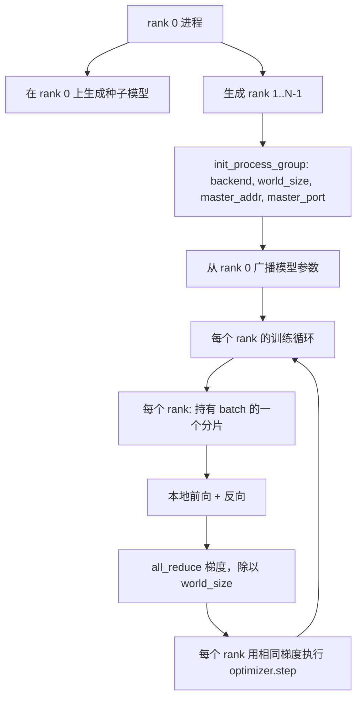
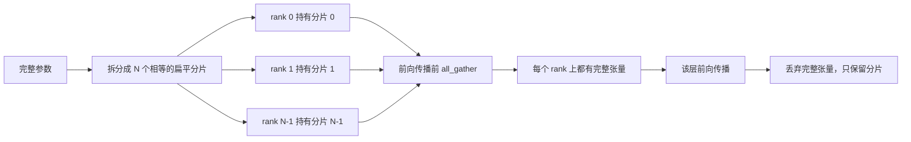

# 从零实现分布式数据并行与 FSDP

> 多 rank 训练只需要两个集合操作和一条规则：启动时广播参数，反向后平均梯度，永远不让各个 rank 在处于哪一步上产生分歧。

**类型：** 建造
**语言：** Python
**前置条件：** 阶段 19 第 42 至 45 课
**时间：** 约 90 分钟

## 学习目标

- 在 N 个 rank 上用 `gloo` 后端启动进程组，无需特殊硬件。
- 实现一个最小的 DDP 封装器，在构造时广播参数，在反向传播后对梯度做 all-reduce。
- 证明每个 rank 梯度的 all-reduce 与拼接输入上单进程的梯度一致。
- 勾勒 FSDP 参数分片：每个 rank 持有一片，前向传播时汇聚成完整张量，之后丢弃。

## 问题

模型能装进一个设备。数据集装不进。优化预算要求每秒墙上时间看到 N 倍的样本。第一层杠杆是数据并行：每个 rank 用不同的 batch 分片跑同一个模型，然后在优化器步骤前对梯度做平均。第二层杠杆是 FSDP：模型在一个设备里也装不下，所以每个 rank 持有每个参数的一部分，在前向传播过程中逐层重建完整张量。

真正的痛苦在于记账。如果参数在各个 rank 之间漂移，运行结果就会悄悄损坏。如果对梯度做了平均但没有对损失做平均，仪表盘就在说谎。如果集合通信后端不能在拓扑上达成一致，运行就会永远挂起。解决办法是手动写一次集合通信，永远不要信任一个你无法复现的封装器。

本课在 CPU 上运行。不需要 CUDA。`gloo` 后端随每个 PyTorch 构建附带，支持 `torch.multiprocessing` 工作进程；同一份代码在多 GPU 节点上切到 `nccl` 无需改变结构。

## 概念



### 两个关键的集合操作

| 集合操作 | 功能 | 时机 |
|------------|--------------|------|
| `broadcast` | 把一个张量从某个 rank 复制到所有其他 rank | 参数初始化、调度器状态、任何一对多同步 |
| `all_reduce` | 在所有 rank 上对张量求和（或求平均，或求最大），每个 rank 获得相同结果 | 反向传播后对梯度做平均 |
| `all_gather` | 每个 rank 提供一个张量，每个 rank 获得所有张量的拼接 | Logits 收集、FSDP 参数去分片 |

DDP 契约是：构造时 `broadcast`，反向传播后 `all_reduce`。FSDP 草稿在此基础上增加了：每个层的前向传播前做 `all_gather`。

### 梯度平均与单进程梯度等价

一个模型在 N 个 rank 上用 B 个样本训练的批次，必须产生与单进程在 N*B 个样本批次上训练相同的梯度。技巧在于：把每个 rank 的梯度求和再除以 N，得到的是平均损失梯度——这正是交叉熵使用均值归约时在完整批次上产生的结果。课程代码用 `max-abs-diff < 1e-3` 来断言手动 all-reduce 的梯度与参考单进程梯度一致。

### FSDP 草稿



内存节省是精确的：每个 rank 的参数量内存降到 1/N。代价是汇聚操作，每个前向传播都要支付一次。生产级 FSDP 将下一个层的去分片与当前层的计算重叠，所以墙上时间代价比简单计算要小得多。本课在每个参数上做完整往返，并断言重建结果与原始参数位相等。

### CPU 和 gloo 后端

CUDA 是生产目标，但同样的代码路径在 CPU 上也存在。`gloo` 是 CPU 的集合通信后端。它比 GPU 上的 `nccl` 慢几个数量级，但 API 表面完全相同。本课用 `backend="gloo"` 初始化进程组，用 `torch.multiprocessing` 生成 rank，而不是用 `torchrun`；两者最终都调用相同的 `torch.distributed` 接口。在多 GPU 节点上，唯一的变化是 `backend="nccl"`、设备张量，以及用 `torchrun` 启动。

## 动手实现

`code/main.py` 是可运行的产物。

### 第 1 步：启动进程组

```python
os.environ["MASTER_ADDR"] = "127.0.0.1"
os.environ["MASTER_PORT"] = str(port)
dist.init_process_group(backend="gloo", rank=rank, world_size=world_size)
```

`MASTER_ADDR` 和 `MASTER_PORT` 是会合点：每个 rank 都在同一台主机的同一端口上拨号连接。本课通过一个绑定后关闭的技巧来选取空闲端口，以避免多轮运行共享一台机器时发生冲突。

### 第 2 步：构造时广播

`MinimalDDP.__init__` 遍历每个参数和缓冲区，调用 `dist.broadcast(tensor, src=0)`。Rank 0 的值成为规范初始化。没有这一步，每个 rank 用自己的种子初始化，从第一步开始各个 rank 就会分叉。

### 第 3 步：反向传播后 all-reduce 梯度

```python
def all_reduce_grads_(module, world_size):
    for p in module.parameters():
        if p.grad is None:
            p.grad = torch.zeros_like(p.data)
        dist.all_reduce(p.grad.data, op=dist.ReduceOp.SUM)
        p.grad.data.div_(world_size)
```

每个 rank 最终持有相同的平均梯度。优化器步骤现在在每个 rank 上都是相同输入的函数，这就是参数在整个运行过程中保持同步的原因。

### 第 4 步：证明等价性

`manual_all_reduce_matches_single_process` 在 rank 0 上构建相同模型，并将 all-reduce 后的梯度与单进程在拼接输入上计算的梯度进行比较。最大绝对差约为 1e-8。

### 第 5 步：FSDP 往返

`fsdp_round_trip_sketch` 将每个参数展平，补齐到 `world_size` 的倍数，切片，all-gather，然后去除填充。每个 rank 的重建结果与原始值相等。这是去分片步骤；逆过程（反向传播后重新分片）是从汇聚张量中取一个切片。

运行：

```bash
python3 code/main.py
```

默认 world size 为 2。两个 CPU 进程生成，通过 `gloo` 互相通信，然后以退出码 0 退出。输出 `outputs/ddp-demo.json` 捕获每个 rank 的参数和、all-reduce 后的梯度范数、FSDP 往返结果，以及手动与参考梯度之间的差异。

## 实际使用

生产训练堆栈调用相同的原语。PyTorch 的 `DistributedDataParallel` 额外提供：与反向传播重叠的 post-backward 梯度钩子、将多个小梯度合并为一个集合操作的 bucketed all-reduce，以及第 46 课使用的 `no_sync` 上下文。

PyTorch 的 FSDP 额外提供：每个层一个扁平参数视图，使每个 rank 持有一段连续缓冲区，下一层的去分片与当前层的计算重叠，以及可选的 CPU 卸载分片。

形状保持不变：启动时广播，反向传播后归约，参数装不下时分片。

## 交付物

`outputs/skill-distributed-fsdp-ddp.md` 携带新训练脚本的配方：用 `gloo` 启动 CPU 进程组、用 `nccl` 启动 GPU 进程组，用 DDP 外壳封装模型（在构造时广播，在反向传播后归约），可选地使用 FSDP 草稿中的 all_gather 模式对参数进行分片。

## 练习

1. 用 `--world-size 4` 运行，确认参数分散在整个运行过程中保持在 1e-3 以下。
2. 将手动平均替换为 `dist.all_reduce(op=dist.ReduceOp.AVG)` 并计时比较差异。
3. 给 DDP 封装器添加 post-backward 钩子，使 all-reduce 与反向传播的其余部分重叠；测量墙上时间的改进。
4. 实现 FSDP 重新分片步骤：在前向传播后，用本地分片替换完整张量。确认每个 rank 的内存下降。
5. 在 CUDA 机器上把后端切换到 `nccl`。注意哪些环境变量会改变，哪些保持不变。

## 关键术语

| 术语 | 大家怎么说的 | 实际含义 |
|------|-----------------|------------------------|
| 后端 | "gloo 或 nccl" | 实现集合操作的库；gloo 用于 CPU，nccl 用于 GPU |
| World size | "总 rank 数" | 组中的进程数；组是集合操作的作用单元 |
| Rank | "工作进程 ID" | 组内的进程标识符，从零开始索引 |
| All-reduce | "对梯度求和" | 在所有 rank 上对张量求和，每个 rank 最终持有相同结果 |
| Unshard | "汇聚参数" | 通过 all_gather 从每个 rank 的分片重建完整张量 |

## 延伸阅读

- PyTorch `torch.distributed` 文档，介绍本课所依赖的集合操作语义。
- `gloo` 库的集合操作列表，与 CUDA 支持的 `nccl` 原语形状相同。
- 阶段 19 第 46 课，介绍梯度累积模式，该模式将 DDP all-reduce 包装在 `no_sync` 中。
- 阶段 19 第 47 课，介绍能在 DDP 和 FSDP 运行中存活的检查点布局。
- PyTorch FSDP 文档，介绍本课所勾勒的参数分片的生产级实现。