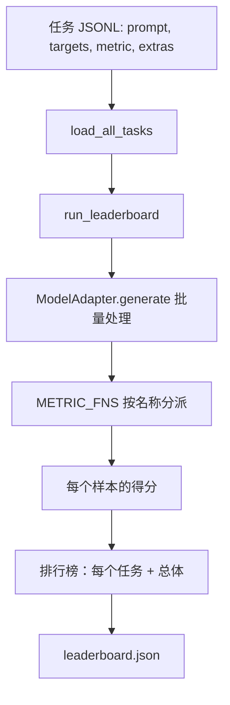
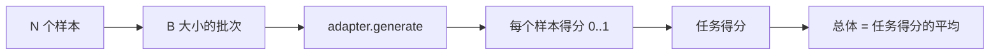

# 语言模型评估框架

> 一个在你无法定义的任务上表现良好的模型，纯粹是偶然表现良好。harness 就是任务定义、指标、运行器和排行榜，凝聚成一种简短可替换的形态。

**类型：** 建造
**语言：** Python
**前置条件：** 阶段 19 第 42 至 45 课
**时间：** 约 90 分钟

## 学习目标

- 将任务定义为 JSONL 文件，每个样本包含 `prompt`、`targets`、`metric` 和可选的 `extras`。
- 实现五种指标：精确匹配、rouge-l F1、可执行检查、多选和子串包含。
- 构建一个运行器，按任务批量处理样本，并分派到可替换的模型适配器。
- 发出一个排行榜 JSON，包含每个任务的得分、延迟和一个可复现的总体平均分。

## 问题

每周都有一个新的语言模型问世。营销宣传说它表现很好。诚实的问题是：好在哪儿？诚实的答案是：你亲手写的排行榜才是答案，因为供应商的排行榜是他们调优过的那一个。

如果在仓库里没有 harness，你靠直觉比较两个模型。有了 harness，你在一个固定任务集上用固定指标比较分数，输出是一个可以 diff 的 JSON。harness 是昨天运行和今天运行之间的契约。没有它，回归就发货了。

陷阱是把 harness 过拟合到单一模型上。解决办法是反用同一个陷阱：harness 小到可以在十五分钟内读完，任务小到可以随仓库一起发货，指标是从零写的所以同事可以审计，适配器是唯一包含模型特定代码的地方。换掉适配器，排行榜移动；换掉任务，排行榜移动。其他东西都不应该动。

## 概念



### 任务规范

每个样本是一行 JSONL：

```json
{"id": "arith-00", "prompt": "compute: 2 + 2", "targets": ["4"], "metric": "exact_match"}
```

对于需要评分辅助的指标，`extras` 携带附加数据：

```json
{
  "id": "code-00",
  "prompt": "python: write a function f that doubles its input",
  "targets": ["ok"],
  "metric": "code_exec",
  "extras": {"io_pairs": [[1, 2], [3, 6]]}
}
```

任务是一个 `outputs/tasks/` 下的 `.jsonl` 文件。文件名就是任务名。一个文件中的所有样本共享同一个指标。

### 五个 fixture 任务

| 任务 | 指标 | 测试内容 |
|------|--------|---------------|
| arithmetic | exact_match | 确定性问题上的 token 级正确性 |
| summary | rouge_l | 与单行参考摘要的最长公共子序列 F1 |
| code-exec | code_exec | 可执行测试：预测的函数必须满足一组输入输出对 |
| multiple-choice | multiple_choice | 预测结果的第一个字母必须匹配一个允许的字母 |
| generation | substring_contains | 自由形式文本必须包含至少一个目标子串 |

### 指标契约

每个指标是一个函数：`(prediction, targets, extras) -> [0.0, 1.0] 范围内的浮点数`。harness 对每个样本得分求平均得到任务得分，再对任务得分求平均得到总体分。指标函数都很小：

- `exact_match`：小写化，合并空白，比对相等。
- `substring_contains`：相同归一化，子串测试。
- `multiple_choice`：首字母大写化。
- `rouge_l`：LCS 长度除以预测和参考的长度，精确率和召回率的 F1。
- `code_exec`：在受限命名空间中执行预测，对每个输入输出对调用 `f(x)`，计数匹配数。

code_exec 指标在剥离的 builtins 命名空间中运行预测。本课的测试断言 `import os` 会炸掉，因为 `os` 不在命名空间中；你无法从一个代码预测中访问文件系统。

### 模型适配器

```python
class ModelAdapter(Protocol):
    def generate(self, prompts: Sequence[str]) -> List[str]: ...
    @property
    def name(self) -> str: ...
```

适配器是接缝。本课交付 `ToyAdapter`，一个确定性模式匹配器，对五个 fixture 任务中的每个 prompt 都返回正确答案。真正的适配器调用模型并返回其输出。harness 不关心是哪个。

### 运行器

`run_task` 按 `batch_size` 批量处理 prompt 并分派给指标函数。`run_leaderboard` 遍历每个任务并求平均。`write_leaderboard` 发出带模式字符串的 JSON，这样未来的格式变化不会悄悄破坏仪表盘。



## 动手实现

`code/main.py` 是可运行的产物。

### 第 1 步：生成 fixture 任务

`seed_fixture_tasks(target_dir)` 写入五个 `.jsonl` 文件。`main.py` 首次运行时会在目录为空时生成它们。

### 第 2 步：加载任务

`load_all_tasks(task_dir)` 读取每个 `.jsonl` 并返回从任务名到 `Example` 记录列表的字典。以 `#` 开头的注释行和空行会被跳过，这样贡献者可以给文件加注解。

### 第 3 步：实现指标

每个指标是一个附带单元测试的小函数。本课的测试套件包含 13 个用例，覆盖归一化、部分重叠、代码执行和不安全代码拒绝。

### 第 4 步：写运行器

`run_task` 迭代批次并产生一个带有得分、正确数、总数和延迟的 `TaskResult`。`run_leaderboard` 遍历所有任务并产生带有总体平均分的 `Leaderboard`。

### 第 5 步：发出 JSON

`write_leaderboard` 序列化排行榜。`--include-per-example` 标志会转储每个样本的记录，这样当分数移动时你可以 diff 预测结果与上一轮运行。

运行：

```bash
python3 code/main.py
```

脚本在首次运行时生成 fixtures，用 toy 适配器评分（toy 适配器答对每个 fixture），并写入 `outputs/leaderboard.json`。使用 toy 适配器总体得分为 1.0；`test_main.py` 中的 stub 适配器测试表明，当适配器无法回答时，同样的 harness 产生 0.0。

## 实际使用

要插入真正的模型，写一个适配器。形状如下：

```python
class HttpAdapter:
    name = "vendor.v1"

    def __init__(self, endpoint, api_key):
        self.endpoint = endpoint
        self.api_key = api_key

    def generate(self, prompts):
        out = []
        for prompt in prompts:
            response = http_post(self.endpoint, prompt, self.api_key)
            out.append(response["text"])
        return out
```

在 `main()` 顶部将 `ToyAdapter` 换成 `HttpAdapter`。harness、任务、指标和排行榜保持不变。

在项目中交付 harness 时需要强制执行的三个模式：

- **固定任务文件。** leaderboard.json 要么携带哈希固定的任务内容，要么把 JSONL 一起带上；否则当任务文件移动时分数也会移动，而你无法判断是哪个。
- **Diff 预测，而不只是分数。** `--include-per-example` 标志让你可以看到分数下降那天模型说了什么。
- **限制批次大小。** 真正的适配器有速率限制。小批次大小使 harness 在不同供应商之间保持兼容。

## 交付物

`outputs/skill-lm-eval-harness.md` 携带配方：JSONL 任务规范、五个指标、可替换适配器、批量运行器、带模式字符串的排行榜 JSON。`outputs/tasks/` 中的任务文件是 fixtures；把它们复制到真实项目中作为起点。

## 练习

1. 添加第六个任务，使用你自己从零写的自定义指标（类似 BLEU 的重叠、类似 BLEURT 的参考评分，或任何有清晰契约的东西）。
2. 扩展 `code_exec` 以捕获 stdout，并接受一列期望的 stdout 作为 targets。
3. 添加排行榜 diff 命令：给定两个 `leaderboard.json` 文件，打印哪些任务有变动以及变动幅度。
4. 限制每个样本的延迟。将适配器调用包装在超时中；在排行榜中公开一个单独的 `timeouts` 列。
5. 在排行榜中用 sha256 固定任务内容，这样未来的读者可以验证他们评分的是相同的任务。

## 关键术语

| 术语 | 大家怎么说的 | 实际含义 |
|------|-----------------|------------------------|
| 任务规范 | "评估格式" | 每个样本包含 prompt、targets、metric 和可选 extras 的 JSONL 文件 |
| 指标 | "如何评分" | 从 (prediction, targets, extras) 到 [0, 1] 浮点数的函数 |
| 适配器 | "模型客户端" | 具有 generate(prompts) -> list[str] 方法的对象；唯一包含模型特定代码的地方 |
| 排行榜 | "记分牌" | 包含每个任务得分、总计数、延迟和总体平均分的 JSON |
| 代码执行指标 | "运行并检查" | 在受限命名空间中执行预测，与输入输出对进行比较 |

## 延伸阅读

- 原始 lm-evaluation-harness 作为生产参考，更大但形状相同。
- HuggingFace 的 lighteval 是同一契约的另一种实现。
- 阶段 19 第 46 课涵盖训练堆栈中使用的梯度累积模式，harness 对其进行评分。
- 阶段 19 第 47 课涵盖你评分所依据的检查点格式；在排行榜中固定检查点哈希。
- 阶段 19 第 48 课涵盖产生被测模型的分发训练堆栈。