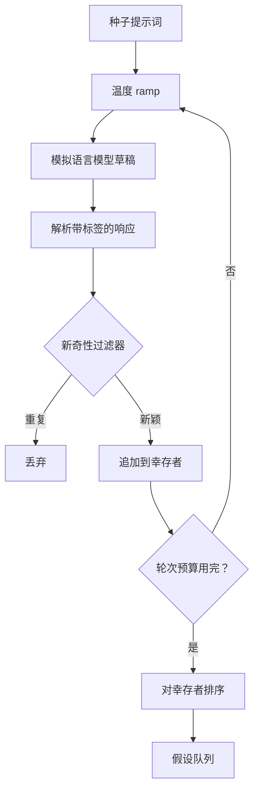

# 假设生成器

> 一个问同样问题两次的研究智能体就是在浪费 token。诀窍是迫使每份草稿落在某个新地方。

**类型：** 建造
**语言：** Python
**前置条件：** 阶段 19 A 轨道第 20-29 课
**时间：** 约 90 分钟

## 学习目标

- 从种子提示词驱动采样器，并将其输出转换为类型化的假设记录。
- 在每轮 pass 中提升采样器温度，使下一份草稿与上一份偏离得更远。
- 用小型 embedding 模型和余弦距离阈值过滤近似重复。
- 用融合新颖性、特异性和可测试性的评分函数对幸存者排序。
- 保持每一步确定性，使相同的种子总是产生相同的队列。

## 为什么要先生成再过滤

一个规划器问一次模型一个问题得到一个假设。这对一个工的例子来说是够的。对于一个研究循环来说形状就错了。循环想要一个有深度的排序队列，这样当第一个假设失败时，运行器已经有下一个准备好了，而不必为另一轮完整采样付费。

两个想法结合产生这个队列。第一个是温度 ramping：每次通过采样器都提升一档温度，这样后面的草稿被鼓励去漫游。第二个是新奇性过滤：每份草稿之后，生成器测量与每个先前幸存者的 embedding 距离，拒绝簇内的任何内容。

本课交付一个模拟语言模型，对固定 prompt 返回脚本化的 token 序列。这足以走通完整路径：种子 prompt 输入，应用温度 ramp，解析候选者，运行新奇性过滤，排序队列输出。

## 假设的形状

```text
Hypothesis
  id             : int           (运行内单调递增)
  text           : str           (主张内容)
  variables      : list[str]     (条件间变化的内容)
  metric         : str           (运行器将要测量的内容)
  baseline_ref   : str | None    (比较所引用的论文或运行)
  draft_pass     : int           (哪一轮采样产生了这个)
  temperature    : float         (草稿时的采样器设置)
  novelty_score  : float         (与先前幸存者的距离，0..1)
  rank_score     : float         (用于排序的加权总和)
```

`variables` 和 `metric` 不是自由文本。解析器从带标签的响应中提取它们。第 52 课的运行器在构建实验配置时直接读取这些字段。

`baseline_ref` 是可选的但建议填写。第 53 课的评估器需要一个基线来比较。如果假设省略了，评估器会回退到同一指标上的上一次运行。

## 架构



循环是直来直去的。有趣的是每个框都有一个硬契约。

## 温度 ramp

从 `t_min` 开始，到 `t_max` 结束，步长为 `(t_max - t_min) / (n_passes - 1)`。每轮 pass 以当前温度调用采样器，产生从 `GeneratorConfig.schedule()` 中均匀分布的 `n_passes` 个值。模拟模型通过在 `(prompt, temp_bucket)` 上切换一组小的脚本化响应来遵守温度。桶是开放区间，所以温度的小变化会选择不同的桶并产生不同的草稿。在生产中，采样器将是一个真正的模型，`temperature=t` 通过传入。

默认 schedule 是六轮从 `0.2` 到 `1.2`。六轮足够填满队列，而不必为那些新奇性过滤器本来就会拒绝的样本付费。低于 `0.2` 模型会鹦鹉学舌般地重复种子。高于 `1.2` 响应往往会跑题并通过了解析器。

## 新奇性过滤器

每份草稿被解析后，生成器 embedding 文本并与每个已接受的假设进行比较。embedding 是一个小型词汇袋哈希，归一化到单位长度。两个单位向量之间的余弦距离是 `1 - dot(a, b)`。如果一份草稿与任何先前幸存者的最小距离高于 `novelty_threshold`，它就通过。默认是 `0.25`。

哈希 embedding 不花哨。它是确定性的，零依赖，足以捕捉明显的情况：两份共享大部分名词的草稿。生产部署会换成小型句子模型。接口保持不变。

## 排序分数

```text
rank_score = w_novelty * novelty_score
           + w_specificity * specificity_score
           + w_testability * testability_score
```

三个子分数。`novelty_score` 是与先前幸存者的最小 embedding 距离。`specificity_score` 是假设中具体变量的数量除以目标数量。`testability_score` 是：如果假设同时指定了指标和基线则为 1，只指定了指标则为 0.5，否则为 0。

默认权重是 `0.4`、`0.3`、`0.3`。权重存在于生成器配置中，这样下游课程可以移动它们而无需 fork 代码。

## 模拟语言模型

```python
class MockLLM:
    def sample(self, prompt: str, temperature: float, seed: int) -> str:
        ...
```

给定 `(prompt, temperature, seed)` 三元组，采样器是确定性的。模拟模型维护一个脚本化响应表，以 `(prompt_signature, temperature_bucket)` 为键。如果表中没有条目的键，采样器返回一个解析器会拒绝的回退。回退路径由其中一个测试覆盖。

种子被混入响应中，所以相同的 `(prompt, temperature)` 对配合不同的种子会产生不同的草稿。在测试中我们固定种子以保持结果可复现。在真实部署中，种子将来自系统时钟或计数器。

## 输出队列

输出是一个按 `rank_score` 降序排列的 `Hypothesis` 记录列表。第 52 课的运行器弹出队头，运行实验，第 53 课的评估器写回一个裁决。如果裁决说假设是错的，运行器弹出下一个。

队列是有限的。当它为空时，编排器可以扩大种子提示词再次运行生成器，或者停止并报告预算耗尽。

## 如何阅读代码

`code/main.py` 定义了 `Hypothesis`、`MockLLM`、`HypothesisGenerator` 和一个确定性演示。生成器暴露一个返回排序队列的单一 `run(seed_prompt)` 方法；pass 数从 `GeneratorConfig.n_passes` 读取而不是作为参数传入。embedding 是词汇袋哈希。新奇性过滤器是一个单一函数。排序分数是一个单一函数。没有依赖 `numpy`；embedding 数学是纯标准库，所以本课保持可移植。

`code/tests/test_generator.py` 覆盖线性路径、重复拒绝路径、解析器失败路径、温度 ramp 边界和排序顺序。

## 这在哪儿接入

第 50 课产生队列。第 51 课取队头运行文献搜索以确认或反驳。第 52 课取同一个队头运行一个真实的实验。第 53 课读取两个输出并写下裁决。四课组合成一个没有人类参与的研究循环；人类可以在任何边界介入。

## 关键术语

| 术语 | 大家怎么说的 | 实际含义 |
|------|-----------------|------------------------|
| 温度 ramp | "让采样更狂野" | 每轮 pass 提升温度，使后面的草稿与前面的偏离更远 |
| 新奇性过滤 | "去掉相似的" | 用 embedding 距离过滤掉与已有假设太接近的草稿 |
| 排序分数 | "最好假设排前面" | 新颖性、特异性和可测试性的加权总和，用于排序 |
| 模拟 LLM | "假的但可测试" | 对固定 prompt 返回脚本化响应的采样器，用于测试全路径 |
| 假设队列 | "待验证的列表" | 按排序分数降序排列的 Hypothesis 列表，等待运行器消费 |