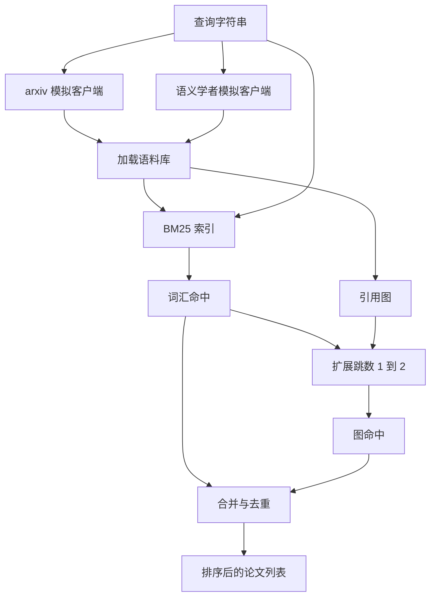

# 文献检索

> 假设很廉价。知道是否已经有人证明了它，才是昂贵的地方。在运行器启动沙箱之前，先构建能回答这个问题的检索层。

**类型：** 构建
**语言：** Python
**前置条件：** 阶段 19 Track A 课程 20-29
**时间：** 约 90 分钟

## 学习目标

- 用循环下游会读取的字段建模一个小论文记录。
- 仅用 stdlib 数据结构在摘要上构建 BM25 索引。
- 遍历引用图，找出词汇搜索漏掉的论文。
- 通过稳定的论文 id 对词汇和图遍历命中的结果去重。
- 把两个模拟外部 API 封装在单个客户端后面，这样当真实端点上线路时，上游调用点保持不变。

## 为什么要两次检索

对摘要的关键字搜索返回与查询共享词汇的论文。这覆盖了大部分表面情况。它会漏掉两种情况。第一种是奠基性论文使用了不同词汇；例如查询"稀疏注意力"会漏掉一篇名为"变换器路由中的块选择"的论文。第二种是相关论文是一篇引用已知锚点的后续论文；找到锚点然后向前查找比暴力扫描摘要库更高效。

本课程构建两次检索。摘要上的 BM25 捕获词汇命中。引用图遍历将种子集合向前和向后扩展一到两跳。通过论文 id 对结果进行并集去重，再按小组合分数排序。

## Paper 的形状

```text
Paper
  id          : str           (稳定标识符，"p001" 用于模拟语料库)
  title       : str
  abstract    : str
  year        : int
  authors     : list[str]
  references  : list[str]     (本论文引用的论文 id)
  citations   : list[str]     (引用本论文的论文 id)
  source      : str           (哪个模拟 API 提供的，"arxiv" 或 "s2")
```

references 和 citations 字段形成有向引用图。两个模拟 API 返回有重叠但不相同的字段，因此语料库加载器按 `id` 进行合并。

## 架构



检索客户端拥有两次检索和合并逻辑。调用方传入查询，返回排序后的列表，每个条目都带有每篇论文的分数字段（`bm25_score`、`graph_distance`、`recency_score`、`final_score`）来解释排序。

## 从零实现 BM25

实现是标准 Okapi BM25，默认参数 `k1=1.5`、`b=0.75`。索引是两个字典：`term -> doc_frequency` 和 `term -> list of (doc_id, term_count)`。文档长度是摘要的 token 计数。平均文档长度在索引构建时计算一次。查询评分是 `idf * tf_norm` 对查询词的求和，其中 `tf_norm` 是标准 BM25 长度归一化的词频。

分词器是先 `lower` 然后按非字母数字分割。不进行词干提取。生产系统会换用小型词干提取器。接口保持不变。

```text
idf(t)      = log((N - df + 0.5) / (df + 0.5) + 1.0)
tf_norm(t)  = (f * (k1 + 1)) / (f + k1 * (1 - b + b * dl / avgdl))
score(d, q) = sum over t in q of idf(t) * tf_norm(t)
```

## 引用图遍历

图从语料库构建一次。前向边从论文指向它的引用。后向边从论文指向它的被引用。遍历是从顶部 BM25 命中开始的广度优先搜索，限制在两跳以内。

两跳是刻意设定的上限。一跳太浅；智能体通常想要最近的祖先或后代。三跳在连通图上会爆炸式增长结果大小，而且容易偏离主题。本课程将跳数限制暴露为一个配置旋钮，这样下游循环可以收紧它。

## 去重与排序

两次检索返回有重叠的集合。合并按论文 id 作为键。对每篇论文，最终分数是加权混合。

```text
final_score = w_bm25 * bm25_score_norm
            + w_graph * graph_score
            + w_recency * recency_score
```

`bm25_score_norm` 是 BM25 分数除以合并集合中的最大 BM25 分数（这样字段在零到一之间）。`graph_score` 直接词汇命中为一，然后一跳 `0.6`，两跳 `0.3`，否则为零。`recency_score` 是从语料库最小年份的零到最大年份的一的线性递增。

默认权重是 `0.5`、`0.3`、`0.2`。权重可配置；过时主题可能调低新鲜度，而快速变化的主题会调高它。

## 模拟语料库

语料库是一百篇论文，由 `build_corpus()` 生成。每篇论文在一组五个主题上有一段手写的标题和摘要：注意力稀疏性、检索增强、低秩适配器、数据集蒸馏和评估工具。引用和被引用是连接好的，这样每个主题形成一个连通的子图，只有少量跨主题边。

两个模拟 API 客户端（`ArxivMockClient`、`SemanticScholarMockClient`）从同一个语料库读取，但暴露不同的字段。Arxiv 返回标题、摘要、年份、作者。语义学者额外提供引用和被引用。检索客户端按 id 合并；跨客户端字段分歧处理留到后续课程。

## 课程 52 和 53 读取什么

第五十二课的运行器读取 `paper.id`、`paper.title` 和摘要的前三句作为实验上下文。第五十三课的评估器读取 `paper.year` 和 `paper.references` 来将基线归因于特定论文。

检索客户端返回 `RetrievalResult`，包含排序列表和按查询的指标：命中数、平均分数、最高分数、总耗时。运行器记录这些，这样下游可观测性可以通过时间绘制质量图。

## 如何阅读代码

`code/main.py` 定义了 `Paper`、`ArxivMockClient`、`SemanticScholarMockClient`、`BM25Index`、`CitationGraph`、`RetrievalClient` 和一个确定性演示。模拟客户端和语料库在同一个文件中，这样课程保持可移植。BM25 实现是一个类，六十行代码。图遍历是一个方法。

`code/tests/test_retrieval.py` 覆盖了词汇路径、图路径、合并、去重和空查询。

## 这放在哪里

第五十课产生假设。第五十一课搜索文献，看假设是否已经解决。第五十二课如果没有解决就运行实验。第五十三课读取检索结果和实验指标来写出裁决。检索客户端是四个阶段中最便宜的，而且首先在编排器中运行。
