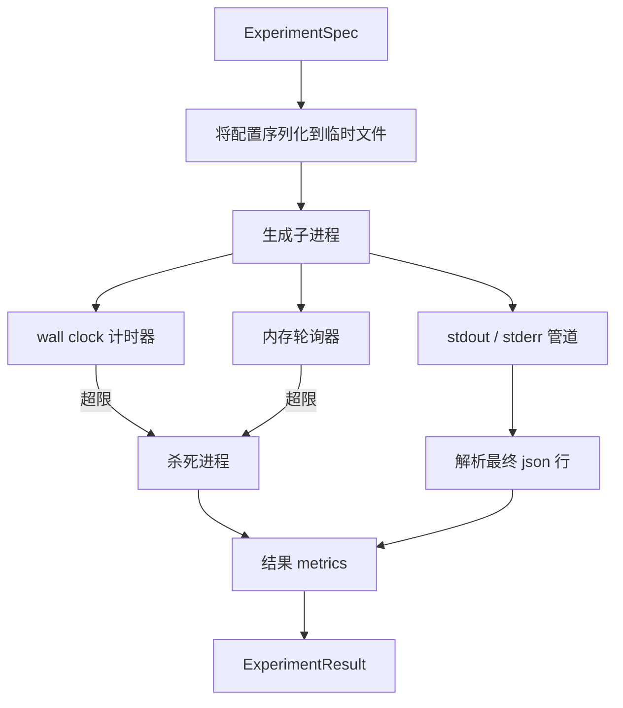

# 实验运行器

> 循环的诚实程度取决于它的测量。把运行器构建成：接收一个 spec，在沙箱子进程中执行，吐出一个评估器可以信任的 json 指标 blob。

**类型：** 构建
**语言：** Python
**前置条件：** 阶段 19 Track A 课程 20-29
**时间：** 约 90 分钟

## 学习目标

- 将实验编码为运行器可以序列化到子进程的类型化 spec。
- 用硬性 wall clock 超时和软性内存上限启动子进程，并将两者作为终止条件暴露出来。
- 将 stdout、stderr 和结构化指标 blob 捕获到单个结果记录中。
- 构建一个消融表，在固定基础 spec 上逐个配置旋钮进行扫描。
- 保持每个结果在给定种子下是确定性的，这样评估器在多次运行中看到相同的数字。

## 为什么要用子进程

研究循环运行不受信任的代码。假设来自采样器，实验脚本来自同一路径；将任何一个视为进程内安全都是自找崩溃，而且会把编排器一起拖下水。子进程是语言提供的最简单隔离：独立进程、独立地址空间、父端信号处理。

这里的运行器没有实现完整沙箱。没有 cgroup、没有 seccomp 过滤器、没有命名空间重映射。它有的是 wall clock 超时、内存增长轮询循环和终止路径——在任一限制超出时终止进程。这是每个更复杂沙箱扩展的运行时契约。本课程保持契约小到可以一口气读完。

## ExperimentSpec 的形状

```text
ExperimentSpec
  spec_id        : str            (稳定 id，"exp_001")
  hypothesis_id  : int            (链接回课程 50 的队列)
  script_path    : str            (要运行的 python 脚本路径)
  config         : dict           (作为 json 参数传给脚本)
  seed           : int            (实验的确定性种子)
  wall_timeout_s : float          (硬超时，超出时杀死)
  memory_cap_mb  : int            (软上限，轮询；超出时杀死)
  metric_keys    : list[str]      (评估器将读取哪些字段)
```

脚本存在于磁盘上；运行器将配置写入脚本读取的临时文件路径。脚本被期望在 stdout 上打印一行 json，其键是 `metric_keys` 的超集。stdout 上的其他任何内容都被捕获但被指标解析器忽略。

## 架构



运行器是一个类一个主方法。轮询器是一个小线程，每隔轮询间隔唤醒一次，在可用时从 proc 文件系统读取子进程 `psutil` 等价物，在平台不暴露时回退到空操作。

## 为什么要软性内存上限

硬性内存上限需要 `resource.setrlimit` 且仅在 POSIX 上工作。课程提供了一个可移植方法：从平台轮询常驻集大小，并在超出上限时杀死子进程。上限是软性的，因为轮询器有非零间隔；进程可能在两次轮询之间飙升超过上限然后降回来。运行器记录观察到的最大 RSS，这样评估器可以看到运行离限制有多近。

在没有进程检查支持的系统上，轮询器记录一次警告并禁用自己。Wall clock 超时仍然适用。课程测试覆盖两条路径。

## 捕获 stdout 和 stderr

运行器在完成时读取两个耗尽的管道。Stdout 逐行扫描；解析为带有所有必需 `metric_keys` 的 json 的最后一行被视为指标 blob。早期的 json 行作为 `intermediate_metrics` 保存在结果中；评估器可以用这些来绘制学习曲线。

Stderr 原样捕获到结果中。运行器永远不会因非零退出码而抛出异常；而是将其记录在结果中。任何非零退出都标记为 `"crash"`，即使脚本打印了指标，这样评估器默认将部分运行视为失败。

## 消融表

```python
def ablate(base: ExperimentSpec, knob: str, values: list[Any]) -> list[ExperimentSpec]:
    ...
```

给定基础 spec 和旋钮名称，辅助函数返回每个值的一个 spec，其中 `config[knob]` 被覆盖。每个 spec 获得一个派生的 `spec_id`（`f"{base.spec_id}_{knob}_{value}"`）。运行器附带一个 `AblationRunner`，按顺序运行它们并返回按旋钮值索引的 `AblationTable`。

为什么要一次一个旋钮。全因子扫描会指数级爆炸，产生评估器无法解释的结果。一次一个旋钮产生一条评估器可以绘制的清晰轴。课程仅将多次旋钮扫描作为重复的单旋钮消融支持，由调用方组合。

## 确定性

每个 spec 都带有种子。运行器通过 config 字典将种子转发给脚本（`config["__seed"] = spec.seed`）。`code/experiments/` 中的模拟实验脚本遵循种子并在运行中产生相同的指标。第五十三课的评估器依赖于此；没有确定性，"回归"可能是不同的随机初始化。

## 模拟实验脚本

课程附带一个实验脚本：`code/experiments/sparsity_experiment.py`。它是一个真实脚本，读取其配置文件，模拟一个带有 numpy 随机过程的小训练运行，并打印一个 json 指标 blob。脚本遵循一个 `sleep_s` 旋钮来测试超时，一个 `allocate_mb` 旋钮来测试内存轮询器。

模拟不是训练任何真实的东西。它是一个数值计算，模拟训练循环的形状：损失曲线、最終困惑度、wall time。课程的要点是运行器，不是模拟。真实实验脚本会导入一个模型。

## 结果形状

```text
ExperimentResult
  spec_id              : str
  hypothesis_id        : int
  exit_code            : int
  terminal             : "ok" | "timeout" | "oom" | "crash"
  wall_time_s          : float
  peak_rss_mb          : float | None
  metrics              : dict
  intermediate_metrics : list[dict]
  stdout_tail          : str
  stderr_tail          : str
```

评估器首先读取 `metrics` 和 `terminal`。如果 terminal 不是 `"ok"`，实验计为失败运行，评估器的裁决是自动的。否则，指标通过显著性检验。

## 如何阅读代码

`code/main.py` 定义了 `ExperimentSpec`、`ExperimentResult`、`ExperimentRunner`、`AblationRunner` 和一个确定性演示。子进程管理是一个类。内存轮询器是一个小线程。消融辅助函数是一个函数。

`code/experiments/sparsity_experiment.py` 是测试中使用的模拟实验。它从 argv 读取配置文件路径，并在完成时在 stdout 上写一行 json 指标。

`code/tests/test_runner.py` 覆盖了成功路径、超时路径、崩溃路径、消融表和跨两次运行的确定性检查。

## 这放在哪里

第五十课生成假设。第五十一课过滤掉文献中已解决的任何内容。第五十二课为剩下的运行实验。第五十三课读取结果，运行显著性检验，并写出编排器存储在假设 id 上的裁决。
