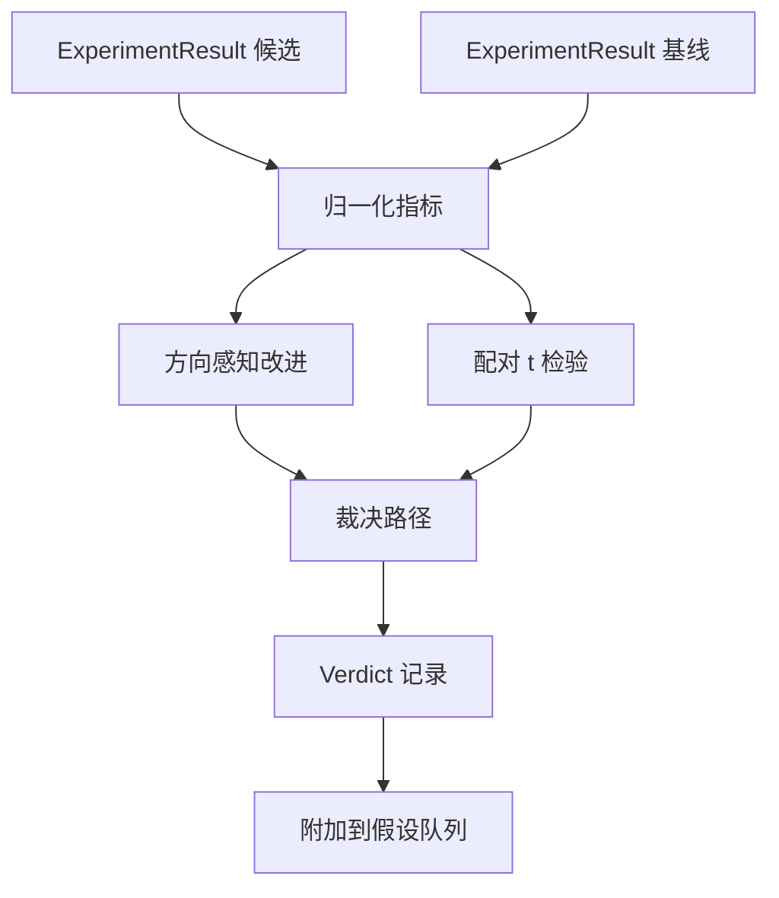

# 结果评估器

> 运行器产生了数字。评估器判断这些数字是改进、回归还是噪声。构建裁决路径，将指标转化为一行的结论。

**类型：** 构建
**语言：** Python
**前置条件：** 阶段 19 Track A 课程 20-29
**时间：** 约 90 分钟

## 学习目标

- 使用方向感知的改进和固定阈值将候选运行与基线进行比较。
- 从零对每个种子的指标运行配对 t 检验并读取结果 p 值。
- 归一化对数缩放指标，这样下游报告可以将其与线性指标混合。
- 发出每个假设的裁决，编排器可以将其附加到第五十课的队列上。
- 保持每一步是纯函数，这样相同输入总是产生相同裁决。

## 为什么要配对检验

运行器的单个数字不能说明变化是否真实。相同配置不同种子给出不同的困惑度。变化可能是噪声。正确的比较是配对的：相同种子相同数据，一次用候选运行一次用基线运行。每个种子贡献一个差值。这些差值的均值是效应。这些差值的标准误是噪声底。

本课程从零实现检验。没有 `scipy.stats`。数学小到可以在一屏内读完。

```text
diffs    = [a_i - b_i for i in seeds]
mean     = sum(diffs) / n
variance = sum((d - mean) ** 2 for d in diffs) / (n - 1)
t_stat   = mean / sqrt(variance / n)
df       = n - 1
p_value  = two_sided_p(t_stat, df)
```

双侧 p 值使用正则化不完全 beta 函数。课程附带一个使用 Lentz 连分数的小实现。整个东西是六十行 stdlib 数学。

## 方向感知的改进

有些指标上升时改进（准确率、吞吐量）。有些下降时改进（损失、困惑度、wall time）。评估器在每个指标上携带一个 `direction` 字段。

```text
if direction == "higher_is_better":
    improvement = (candidate - baseline) / abs(baseline)
elif direction == "lower_is_better":
    improvement = (baseline - candidate) / abs(baseline)
```

改进是有符号的。在 higher is better 指标上负改进意味着候选更差。裁决路径同时读取符号和幅度。

平坦阈值（`improvement_threshold=0.02`，百分之二）决定变化是否大到可以称为。在那之下裁决是"噪声"，无论 p 值是多少；循环不关心用户无法测量的变化。

## 架构



评估器运行三个独立计算并在裁决路径中合并它们。每个计算是一个没有共享状态的纯函数。

## 对数归一化

困惑度是指数依赖于损失。损失下降 0.1 在困惑度上是一个更大的下降。在两个配置间直接比较困惑度没问题，但将其与线性指标混合在单个报告中需要归一化。

课程通过在对数取自然对数后来计算改进，从而归一化任何 `scale` 字段为 `"log"` 的指标。然后在对数空间中应用阈值。困惑度从 32 降到 28 在 lower is better 指标上是 `log(28) - log(32) = -0.133`，远高于百分之二的阈值。

```text
if scale == "log":
    a = log(candidate)
    b = log(baseline)
else:
    a = candidate
    b = baseline
```

`scale="linear"`（默认）的指标跳过变换。相同代码路径处理两者。

## 按种子配对检验

第五十二课的运行器每次运行发出一个最终指标 blob。对于配对检验，评估器需要对候选每种子一个 blob，对基线每种子一个 blob。编排器在种子列表上用候选和基线两种配置运行相同实验，并将两个 `ExperimentResult` 记录列表交给评估器。

评估器按种子配对（种子存在于 `result.metrics["seed"]`）并遍历请求的指标。如果两个列表中的种子不匹配，评估器抛出 `PairingError`。编排器应重新运行。

## Verdict 的形状

```text
Verdict
  hypothesis_id          : int
  metric                 : str
  direction              : "higher_is_better" | "lower_is_better"
  scale                  : "linear" | "log"
  candidate_mean         : float
  baseline_mean          : float
  improvement            : float       (有符号，分数；见方向规则)
  p_value                : float | None  (如果 n < 2 则为 None)
  significance_threshold : float
  improvement_threshold  : float
  verdict                : "improved" | "regressed" | "noise" | "failed"
  rationale              : str
```

裁决路径是一个小决策表：

```text
1. 如果任何候选结果的 terminal != "ok": verdict = "failed"
2. 否则如果 |improvement| < improvement_threshold:  verdict = "noise"
3. 否则如果 p_value 为 None 或 p_value > significance: verdict = "noise"
4. 否则如果 improvement > 0:                          verdict = "improved"
5. 否则:                                             verdict = "regressed"
```

Rationale 是一行人类可读的句子，编排器可以将其记录在假设 id 上。

## 如何阅读代码

`code/main.py` 定义了 `MetricSpec`、`Verdict`、`Evaluator`、t 统计量和不完全 beta 辅助函数，以及一个确定性演示。t 检验在纯 stdlib 数学中实现；numpy 仅用于读取指标列表和计算均值和方差。

`code/tests/test_evaluator.py` 覆盖了改进路径、回归路径、噪声路径（小改进）、噪声路径（低 n）、失败终止路径、对数归一化路径、t 检验针对已知参考值以及配对错误。

## 这放在哪里

第五十课产生了假设队列。第五十一课过滤掉文献中已解决的任何内容。第五十二课在候选和基线配置上跨种子运行实验。第五十三课读取这些运行并写出裁决。编排器将四者缝合在一起：

```text
for hypothesis in queue:
    literature = retrieval.search(hypothesis.text)
    if literature_settles(hypothesis, literature):
        attach(hypothesis, verdict="settled")
        continue
    candidates = runner.run_all(specs_for(hypothesis))
    baselines  = runner.run_all(baseline_specs_for(hypothesis))
    metric_spec = MetricSpec("perplexity", direction=LOWER, scale=LOG)
    verdict = evaluator.evaluate(hypothesis.id, metric_spec, candidates, baselines)
    attach(hypothesis, verdict)
```

该编排器不在本课程中；四课无需除每个定义的数据类之外的粘合剂即可组合成它。
