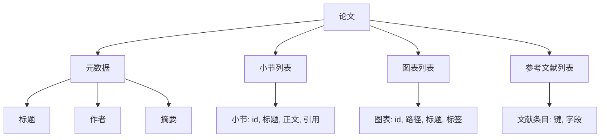
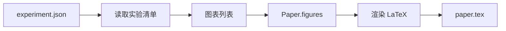
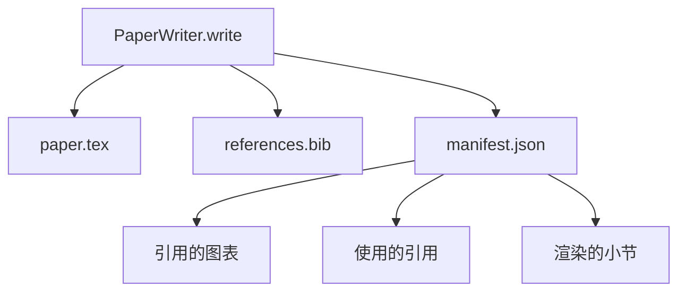

# 论文写作器

> LaTeX 骨架是研究者和排版系统之间的一份契约。一旦契约被打破，文档无法编译，失败会大声响起。先搭骨架，再填内容。

**类型：** 构建型
**语言：** Python
**前置条件：** 阶段 19 第 50-53 节
**时间：** 约 90 分钟

## 学习目标

- 将研究论文视为一种结构化制品，具有已知的小节图，而非自由格式文档。
- 生成一个 LaTeX 骨架，在任何正文之前声明其摘要、各小节、图表槽位和参考文献键。
- 通过确定性槽位机制，将实验输出（路径和标题）注入到骨架中。
- 连接一个模拟正文生成器，从结构化大纲填充每个小节，使测试框架可以在不调用模型的情况下进行测试。
- 输出一个 `paper.tex` 加上 `references.bib` 加上一个清单，列出每个引用的图表和每条引用的参考文献。

## 为什么先搭骨架

从正文开始的草稿会积累结构性债务。引言部分写了三段应该放在相关工作里的内容。一个图表在定义之前就被引用了。参考文献里出现了三个指向同一篇论文的键。当作者注意到这些问题时，重写成本已经高于写作成本了。

骨架将这个顺序反转。结构作为数据预先声明。各小节是带有名称和顺序的槽位。图表是带有 id 和标题的槽位。参考文献键在顶部声明，指向对应的条目。正文逐个槽位地生成到其中。测试框架可以在任何正文被写入之前就验证：每个图表都有槽位、每条引用都有条目、每个小节都出现在目录中。

这与前面课程应用到计划、工具调用和追踪的纪律相同。结构就是契约。

## 论文的形状

每个字段都是纯 Python 数据。渲染器是将 `Paper` 转换为 LaTeX 字符串的纯函数。测试框架可以在渲染之前检查论文：计数小节、列出缺失的图表文件、检查每个 `\cite{key}` 是否有对应的 `BibEntry`。

## 渲染契约

渲染器保证三个属性。第一，骨架中的每个图表槽位都输出一个带有稳定标签的 `\begin{figure}` 块，标签形式为 `fig:<id>`。第二，每个小节都输出一个带有稳定标签的 `\section{}`，标签形式为 `sec:<id>`，使交叉引用正常工作。第三，参考文献输出一个 `\bibliography` 块，其 `references.bib` 恰好包含论文上声明的条目，不多不少。

违反其中任何一条都是渲染错误，不是警告。骨架就是契约；一个静默丢弃图表的渲染是契约破坏。

## 从实验注入图表

本轨迹的前面课程将实验输出生成为 JSON 清单。每个清单携带一个工件列表，带有路径和简短标题。论文写作器读取该清单并生成 `Figure` 记录。

注入是确定性的。图表 id 从实验名称加上单调计数器派生。标题来自清单。路径相对于论文输出目录进行规范化，这样即使实验输出位于磁盘上的其他位置，LaTeX 也能编译。

## 模拟正文生成器

本课程不调用模型。`MockProseGenerator` 读取大纲形状并确定性地产出正文。大纲形状是每个小节一个短字符串。生成器将该字符串展开为两段短文，并将小节标题编织其中。生成的正文恰好在大纲声明它们时才会提及图表和引用。

这足以测试写作器的所有行为。真实实现会将生成器替换为模型调用。它周围的测试框架不会改变。将正文生成器声明为可调用对象就是这个价值：测试替换为一个确定性的，生产替换为一个模型的，其余管道完全相同。

## 清单输出

写作器向输出目录发出三个文件。

清单是下游评估器或批评循环读取的内容。它不解析 LaTeX；它读取清单。下一课，批评循环，将这个清单作为输入并产生反馈列表。这就是为什么清单是契约的一部分，而 LaTeX 不是。

## 验证门

写作器在写入任何文件之前运行四个门。

1. 每个图表 id 在论文内是唯一的。
2. 每个小节的 `cites` 字段引用了论文上声明的参考文献键。
3. 摘要非空。
4. 标题非空。

失败的门抛出 `PaperValidationError` 并带有精确原因。测试框架将原因作为失败模式显示。没有部分写入：要么三个文件都发出，要么都不发出。

## 如何阅读代码

`code/main.py` 定义了 `Paper`、`Section`、`Figure`、`BibEntry`、`PaperValidationError`、`MockProseGenerator`、`PaperWriter` 和 `render_latex` 函数。`write` 方法接受一个输出目录并发出 `paper.tex`、`references.bib` 和 `manifest.json`。`read_experiment_manifest` 辅助函数将实验清单列表转换为 `Figure` 记录。

`code/tests/test_paper_writer.py` 覆盖了：无小节的骨架渲染、两个小节和两个图表的完整渲染、缺失引用门、重复图表 id 门、清单内容，以及 LaTeX 字符串契约（每个小节发出一个 `\section{}`，每个图表发出一个 `\begin{figure}`）。

## 进一步探索

真实实现会想要的两个扩展。第一，多格式渲染：相同的 `Paper` 形状可以编译为博客帖子的 Markdown 和预览的 HTML。渲染器成为 `Paper` 上的策略。第二，引用富化：给定 DOI 的本地缓存，写作器根据引用键获取 BibTeX 条目。两者都增加价值，两者都可以在不触及骨架契约的情况下添加。

骨架就是赌注。小节、图表和引用声明为数据，正文生成到槽位中，清单与 LaTeX 一起发出。每另一个改进都构建在上面。