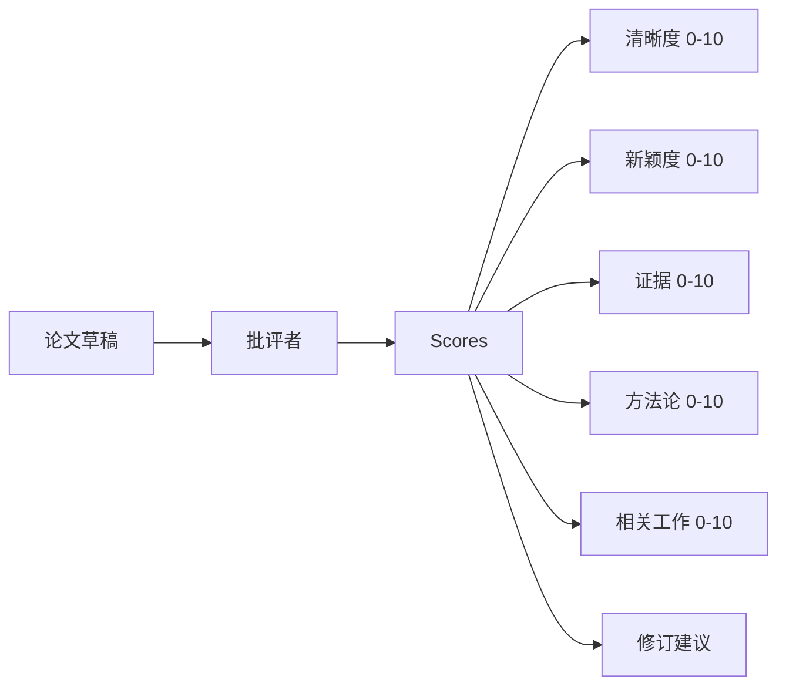
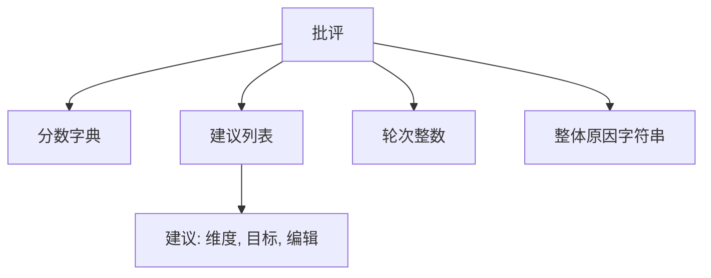
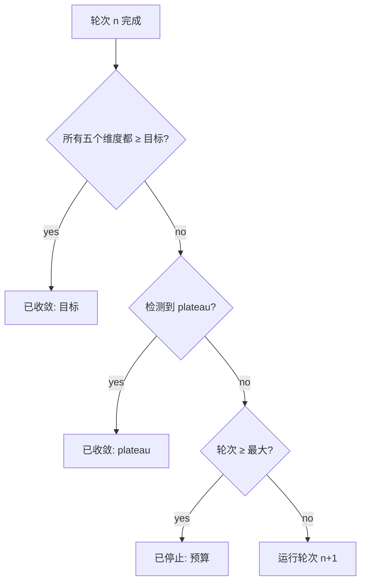
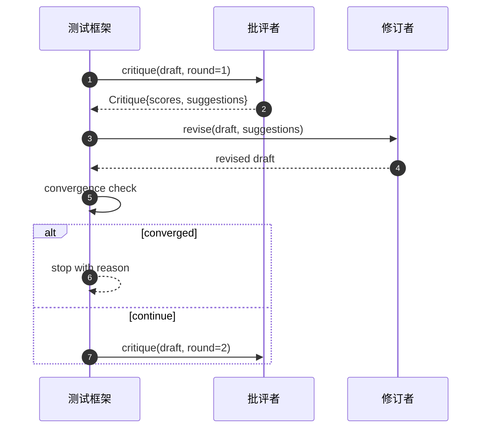

# 批评循环

> 第一次就返回"看起来不错"的批评者是坏的。总是返回"需要修改"的批评者也是坏的。有趣的批评者是能够收敛的那个，而你必须工程化收敛。

**类型：** 构建型
**语言：** Python
**前置条件：** 阶段 19 第 50-53 节
**时间：** 约 90 分钟

## 学习目标

- 从五个固定维度对论文草稿进行评分：清晰度、新颖度、证据、方法论、相关工作。
- 将每轮批评应用为结构化的修订 diff，而非自由格式的重写。
- 通过比较跨轮次的分数来检测收敛；在 plateau、目标达成或预算耗尽时停止。
- 用最大迭代预算限制轮次，这样非收敛的批评者不会永远运行。
- 发出每轮追踪，使仪表板或下一阶段可以渲染分数轨迹。

## 为什么是五个固定维度

自由格式的批评者是一个返回一段建议的模型。下一轮的重写将这段话作为环境上下文。重写是否解决了批评是无法验证的，因为批评从未有过结构。

五个维度给了测试框架一个契约。



分数是一个向量。测试框架在跨轮次中观察每个维度。提高清晰度但破坏证据的修订是证据上的回归，收敛检查会发现这一点。纯模型批评者无法提供这种保证。

## 批评的形状



每个建议都带有它改进的维度、它指向的小节，以及修订者可以应用的 `edit` 指令。修订者也是一个可调用对象。课程附带了一个确定性修订者，将编辑指令解释为追加到小节的操作。模型驱动的修订者会将同一字段解释为提示。契约不变。

## 收敛规则，按顺序执行

当三个条件中的任何一个触发时，批评循环终止。



目标是严格要求：五个维度（清晰度、新颖度、证据、方法论、相关工作）都必须达到 `>= target_score`（默认 `8.0`）循环才会返回成功。高的平均值但有一个弱维度是不够的。Plateau 检测将当前轮次的平均值与上一轮次的平均值进行比较。如果改进连续两轮低于 `plateau_epsilon`（默认 `0.1`），循环以 `plateau` 退出。预算是轮次的硬性上限（默认 `5`）并以 `budget` 退出。

顺序很重要。目标优先于 plateau 优先于预算。如果第三轮在同一迭代中也触发了 plateau，目标胜出，结果是 `target`，而不是 `plateau`。

## 为什么 plateau 检测运行两轮

一轮 plateau 是噪声。真正的批评者在固定草稿的每次迭代中都会返回略微不同的分数，因为确定性评分仍然取决于哪些建议被应用以及以什么顺序应用。要求两轮连续的 plateau 轮次过滤掉噪声。如果测试框架报告了 plateau，草稿确实已经停止改进。

## 本课程中的确定性批评者

本课程不调用模型。附带的批评者是一个可调用对象，基于三个信号对草稿进行评分：平均小节正文长度（清晰度）、图表数量和引用数量（证据），以及论文元数据上的 `originality_tag` 字段（新颖度）。修订者知道如何推动每个分数上升。

```text
清晰度      当平均小节正文长度增加时增长
新颖度      当 originality_tag 设置为 "high" 时增长
证据       当小节的 figure_refs 非空时增长
方法论     当存在标题为 "Method" 且有正文的小节时增长
相关工作   当存在标题为 "Related Work" 且有正文的小节时增长
```

修订者将每个建议解释为有针对性的追加。在第一轮之后，测试框架可以观察分数上升。测试利用这个属性来断言循环减少了差距。

## 完整循环契约



测试框架拥有轮次计数器、追踪和收敛检查。批评者拥有分数。修订者拥有 diff。三个都不触碰其他人的状态。

## 追踪输出

每轮发出一追踪事件，包含轮次编号、分数向量、建议数量和收敛判定。完整追踪与最终草稿一起返回。下游仪表板可以渲染每轮分数图表。下一课，迭代调度器，读取追踪来决定分支是否值得保留。

## 防止糟糕批评者的预算

产生永远不提高分数的建议的批评者会将循环锁定在最大迭代上限。追踪使这可见：五轮，分数持平，判定 `budget`。用户将其读作批评者 bug，而非草稿 bug。另一种选择，仅显示最终草稿，会隐藏诊断。追踪优先的设计使其可见。

## 如何阅读代码

`code/main.py` 定义了 `Critique`、`Suggestion`、`Critic` 协议、`Reviser` 协议、`CriticLoop`，以及一个 `make_deterministic_critic_pair` 工厂，返回确定性批评者和匹配的修订者。包含一个最小的 `Paper` 形状，使课程独立存在。

`code/tests/test_critic_loop.py` 覆盖了：第一轮后单调改进、调优草稿上的目标收敛、两轮持平后的 plateau 检测、没有建议改进时的预算耗尽、修订者应用建议，以及追踪形状。

## 进一步探索

真实实现会想要的两个扩展。第一，维度权重：研讨会论文比方法论更重视新颖度；期刊权重相反。收敛检查变为加权平均值。第二，成对批评者：一个批评者评分，第二个批评者在修订者看到建议之前裁决建议。两者都增加价值，两者都在相同的 `Critique` 形状上组合。

赌注是分数向量。一旦批评被结构化，每一个其他改进、收敛规则、仪表板、成对批评者，都可以嵌入而不改变循环。