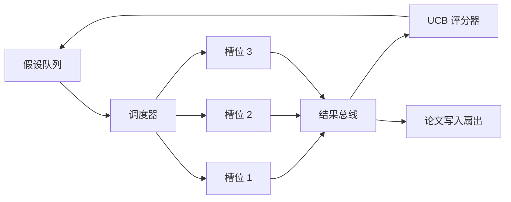
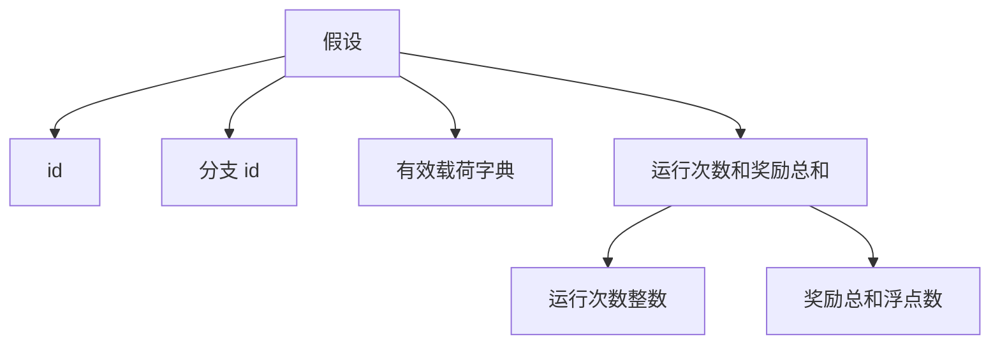
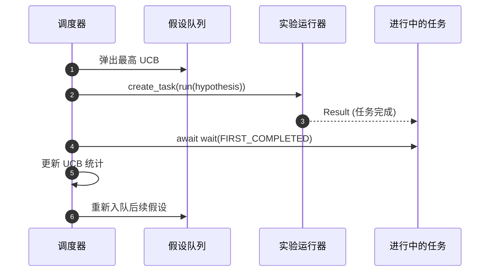

# 迭代调度器

> 没有调度器的研究循环是一个有着妄想的工作队列。调度器是循环决定停止探索什么的地方，而这个决定就是整场游戏。

**类型：** 构建型
**语言：** Python
**前置条件：** 阶段 19 第 50-53 节
**时间：** 约 90 分钟

## 学习目标

- 将研究工作流建模为一个假设队列，喂养并行实验槽位，其结果反馈回来。
- 使用 asyncio 并发运行多个实验，使调度器能够保持所有槽位忙碌。
- 使用 UCB 对每个假设分支进行评分，使调度器能够在不放弃探索的情况下剪除低收益分支。
- 将完成的结果扇出到论文写作阶段和重新入队阶段，使高收益分支产生后续假设。
- 展示每轮迭代的追踪，包含分支分数、槽位占用率和剪枝决策。

## 为什么是调度器，而不是工作列表

扁平的工作列表按提交顺序运行作业。当每个作业独立时，这样很好。研究不是独立的：实验三的发现改变了实验四和实验五的优先级。读取结果反馈并重新排序队列的调度器每单位计算能完成更多有用的工作。

有趣的设计选择是评分规则。贪婪评分者总是选择当前的领先者，从不探索。均匀评分者从不利用。UCB（上置信界）是中间路径：利用领先者，同时为尝试较少的分支保留容量。

## 系统形状



队列持有假设。当槽位空闲时，调度器选择 UCB 最高的假设。每个槽位异步运行实验。完成的实验将其结果扇出到总线。总线更新原始分支的 UCB 统计，并在分支收益越过阈值时扇出到论文写作阶段。

## 假设的形状



`branch` 是 UCB 统计的关键。多个假设可能共享一个分支（分支是研究方向；假设是其中的一个试验）。`runs` 是该分支完成的实验计数，`reward_sum` 是累积奖励。UCB 读取两者。

## UCB 评分

本课程使用的 UCB 公式是经典的 UCB1。

```text
ucb(branch) = mean_reward(branch) + c * sqrt( ln(total_runs) / runs(branch) )
```

`total_runs` 是所有分支完成实验的总数。`c` 是探索权重；课程默认为 `sqrt(2)`。运行次数为零的分支得到 `+inf`，因此未尝试的分支总是被优先调度。 mean reward 高的分支保持高分数，直到其他分支赶上；运行多次而奖励不多的分支会被运行较少的替代选项超越。

剪枝门与选择器分开。剪枝在分支的平均奖励低于绝对下限（默认 `0.2`）且至少运行了 `prune_after_runs` 次试验（默认 `3`）后，将其从未来调度中移除。这保持队列有界。

## 使用 asyncio 的并行槽位

调度器使用 `asyncio.create_task` 驱动实验。每个任务运行实验运行器（一个 `async def` 可调用对象），返回 `Result`。主循环使用 `asyncio.wait(..., return_when=asyncio.FIRST_COMPLETED)` 等待一组进行中的任务，并在每次完成时触发评分更新。



三个槽位并发运行。主循环永远不会阻塞在单个实验上。调度器在槽位空闲时立即开始新任务，直到队列为空且没有任务在进行中。

## 扇出：论文触发

当分支的平均奖励越过 `paper_threshold`（默认 `0.7`）且该分支尚未产生论文时，调度器将 `paper.trigger` 事件扇出到输出列表。在下游，第五十四课的论文写作器会获取它。在本课程中，触发器被捕获为一个列表，以便测试可以断言它。

## 扇出：后续假设

当高收益结果落地时，调度器可以调用用户提供的 `expander` 来产生同一分支上的一个或多个后续假设。expander 是一个从 `Result` 到 `list[Hypothesis]` 的纯函数。课程附带了一个确定性 expander，为任何奖励超过论文阈值的 result 产生两个后续假设。

## 预算

两个预算保护调度器免受失控循环的影响。

```text
max_experiments    : 所有分支运行实验的总数
max_seconds        : 挂钟时间上限 (asyncio 时间)
```

当两者中任何一个触发时，调度器停止调度新任务，等待进行中的任务，并返回最终追踪。追踪包含 `stop_reason`。

## 追踪和最终报告

每个调度决策（选择、调度、结果、剪枝、扇出）发出一事件。最终报告总结每个分支的统计、总运行次数、总挂钟时间和发出的论文触发。下一课，端到端演示，读取此报告来驱动论文写作器。

## 如何阅读代码

`code/main.py` 定义了 `Hypothesis`、`Result`、`BranchStats`、`IterationScheduler`，以及一个 `make_deterministic_runner` 工厂，返回具有可预测奖励的 asyncio 实验运行器。运行器睡眠固定的 `delay_ms`（默认 `5ms`），以便并发是可观察的。

`code/tests/test_scheduler.py` 覆盖了：UCB 首先选择未尝试的分支、并行槽位占用率、阈值跨过时的论文触发、低收益试验后的分支剪枝、扇出后续假设，以及预算退出（实验计数和挂钟时间）。

## 进一步探索

真实实现会想要的三个扩展。第一，跨会话持久化 UCB 统计：当前统计存在于内存中；真正的调度器会对其进行检查点，以便重启保留已花费的探索预算。第二，多目标评分：不是标量奖励，而是每个结果发出一个向量，UCB 成为 Pareto 风格的选择器。第三，上下文赌博机：选择器以假设特征（长度、复杂度）为条件，因此相似的假设共享探索。

调度器是研究变成不仅仅是工作队列的地方。一旦 UCB 连接好且槽位并行运行，每一个其他改进都构建在上面。