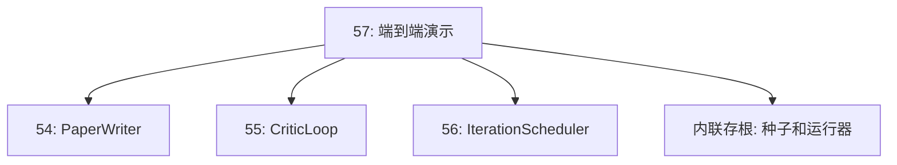
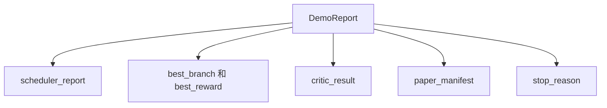

# 端到端研究演示

> 演示厅是每一份早期合同最终都必须组合在一起的地方。只要其中任何一个泄漏，演示就是捕捉它的教训。

**类型：** 构建
**语言：** Python
**前置条件：** 阶段 19 第 50-53 课
**时间：** 约 90 分钟

## 学习目标

- 将自动研究循环从头到尾串联起来：假设种子、实验运行器、调度器、批评循环、论文写作器。
- 通过纯 Python 导入（而非框架）组合前四节 D 追踪课程中的原语。
- 运行循环直到自终止，并发出一份演示报告，列出每个阶段的输出。
- 保持演示的确定性，以便测试套件可以断言最终形状。
- 当任何阶段的合同破裂时显露清晰的失败模式，以便下一阶段不会以损坏的输入运行。

## 这里组合了什么


五个阶段。种子是三个假设的列表。调度器用三个并行槽运行六个实验。总线报告一个或多个论文触发器。选择器选择单一最佳结果。批评循环在基于该结果构建的草稿上进行迭代。论文写作器发出最终的 LaTeX、BibTeX 和清单。

## 为什么是导入而非复制

每节早期课程都提供了一个 `main.py`，其中包含公共数据类和函数。演示通过调整 `sys.path` 到每节课程的父目录来导入它们。这不是框架接线；它与早期课程中的测试文件已经使用的导入方式相同。



内联存根代替了第 50-53 课：一个小型假设种子生成器和一个同步奖励函数。用户可以通过调整两个导入，将内联存根替换为那些课程中的真实原语。

## 确定性保证

演示在结构上是确定性的。实验运行器使用带种子的 numpy。批评循环的修订器以固定顺序遍历固定维度。论文写作器的散文生成器是第 54 课中的模拟版本。调度器的 UCB 选择器按迭代顺序打破平局，而非随机选择。

给定相同的种子，演示发出相同的报告。测试通过运行演示两次并比较清单来断言此属性。

## 演示报告形状



每个字段都逐字来自上游阶段。演示不转换任何输出；它只是组合它们。这就是演示要做的测试。

## 失败模式处理

每个阶段要么成功，要么引发类型化错误。

```text
调度器 ........ 返回 SchedulerReport，其 stop_reason
                   属于 {queue_empty, max_experiments, deadline}
最佳结果选择器 .. 当没有论文触发器触发时引发 NoTriggerError
批评循环 ...... 返回状态为 converged 或 stopped 的 LoopResult
论文写作器 ..... 当合同破裂时引发 PaperValidationError
```

任何阶段的失败都会通过类型化异常使演示短路。测试固定此契约：`test_no_triggers_raises_typed_error` 和 `test_best_picker_raises_when_no_triggers` 断言当没有分支触发触发器时选择器引发 `NoTriggerError` / `BestResultError`，并且论文写作器永远不会被调用。

## 最佳结果选择器

调度器按分支发出论文触发器。选择器选择所有触发器中平均奖励最高的分支。按分支 ID 字母顺序打破平局，以确保演示具有确定性。选择器是一个小型纯函数；测试基于固定的调度器报告对其进行固定。

## 批评循环的接线

第 55 课中的批评循环对 `MiniPaper` 进行操作。演示通过以下方式从选定的分支构建 `MiniPaper`：用分支 ID 填充摘要，为两个部分（引言和结果）播种种子，并根据分支的平均奖励设置 `originality_tag`（如果 >= 0.8 则为高，如果 >= 0.6 则为中等，否则为低）。

然后修订器迭代草稿至收敛。输出进入论文写作器。

## 论文写作器的接线

第 54 课中的论文写作器对具有图表和参考书目的完整 `Paper` 形状进行操作。演示通过 `mini_to_full_paper` 将收敛的 `MiniPaper` 升级，该函数为选定的分支附加一个图表，并从批评建议的引用键的并集中构建一个小型的综合参考书目。演示添加的每个引用也被添加到参考书目列表中，因此验证通过。

## 如何阅读代码

`code/main.py` 定义了 `BestResultError`、`NoTriggerError`、`DemoReport`、`pick_best_branch`、`build_mini_paper`、`mini_to_full_paper` 和 `run_demo`。顶部的导入调整一次 `sys.path`，并从各自的课程中拉取 `PaperWriter`、`CriticLoop` 和 `IterationScheduler`。

`code/tests/test_e2e.py` 覆盖：演示从头到尾运行并发出包含所有五个字段的报告，两次运行之间的确定性，当没有分支越过阈值时的 NoTriggerError，当写作器的合同破裂时的 PaperValidationError，论文清单包含选定分支的图表，以及调度器停止原因是预期值之一。

## 进一步探索

三个扩展值得在演示变绿后进行接线。第一，持久化状态：每个阶段的结果写入小型 JSON 存储，以便重启可以恢复而无需重新运行廉价阶段。第二，仪表板：来自调度器和批评循环的跟踪事件呈现为单个时间线。第三，真实模型调用：将模拟的散文生成器和确定性批评者交换为模型驱动的；接线方式不变。

演示的工作是证明组合就是架构。五节课，四个导入，一份报告。下次你添加一个阶段时，接线正好增加一行。