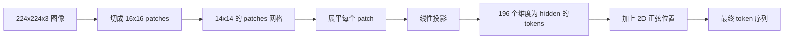

# 视觉编码器 patches

> 一个读取像素的视觉模型需要一个像素的分词器。Patch embedding 就是那个分词器。把图像切成一个方形网格，将每个方块展平，通过一个线性层投影它，然后添加一个 2D 位置信号，以便 transformer 知道每个方块在原始图像中的位置。

**类型：** 构建
**语言：** Python
**前置条件：** 阶段 19 第 30-37 课（B 追踪基础）
**时间：** 约 90 分钟

## 学习目标

- 将图像分词为固定长度的 patch embedding 序列。
- 实现一个基于 `Conv2d` 的 patch 投影，其数学等价于 unfold-then-linear。
- 构建一个确定的 2D 正弦位置 embedding，使 token 顺序编码空间位置。
- 在合成 fixture 上验证 patch 数量、embedding 形状和 `Conv2d`/unfold 等价性。

## 问题

Transformer 消耗一个向量序列。图像是一个 3 通道网格。将每个像素作为一个 token 会导致序列长度爆炸：一个 224x224 的 RGB 图像是 150,528 个 token，一个 12 层 transformer 无法承受如此规模的注意力计算。将图像作为一个巨大的展平向量读取会丢失局部性，而注意力层无法从中恢复。编码器前端的工作是将像素网格压缩成数百个 token，每个 token 汇总一个方形区域。

Patch embedding 用一个线性投影解决这一问题。一个 224x224 的图像被切成 16x16 的 patches，产生一个 14x14 的 196 个 patches 网格。每个 patch 从 `(3, 16, 16) = 768` 个像素值展平为一个向量，然后一个线性层将其映射到模型的隐藏维度。Transformer 看到 196 个维度为 `hidden`（通常为 768）的 token 外加一个 CLS token。这是一个序列，其余网络可以咀嚼。

## 概念



### 为什么用 patches 而非像素

注意力在序列长度上是二次方的。196 个 token 的序列每个头每层花费 `196 * 196 = 38,416` 个注意力分数；150,528 个 token 的序列花费 `150,528 * 150,528 = 226 亿`。Patches 购买了 590,000 倍的注意力计算减少，而且一个单一的 16x16 区域为高级视觉任务承载了足够的信号。代价是在一个 patch 内丢失了细粒度的空间细节，这就是为什么下游多模态堆栈通常在需要精确定位时运行第二个高分辨率分支。

### 为什么线性投影就足够了

每个 patch 被当作一个独立的向量处理。投影学习一个基：边缘检测器、颜色过滤器、简单纹理。单个线性层很小（ViT-Base 为 `768 * 768 = 589,824` 个参数），训练速度快。存在更深的卷积干（"混合" ViT），但展平的线性投影是标准配置，大多数现代开源权重编码器都采用这种确切的形状。

### `Conv2d` 技巧

一个 `Conv2d(in_channels=3, out_channels=hidden, kernel_size=patch_size, stride=patch_size)`（无填充）给出与 unfold-then-linear 相同的数值结果，因为每个输出位置将 patch 像素与一个滤波器进行点积。卷积就是 patch 投影，大多数生产代码库都这样实现，因为它在 GPU 上更快，并且少用一个 reshape。

### 位置 embeddings

Tokens 在投影后不带顺序。2D 正弦 embedding 给每个 token 一个固定的信号，编码其 `(row, col)` 位置。embedding 维度的一半用多个频率的 sin/cos 编码行位置；另一半编码列位置。编码是确定的，因此你可以交换分辨率而无需重新训练，并且它能很好地插值到模型在训练时从未见过的网格。

| 组件 | 形状 | 参数 |
|-----------|-------|------------|
| Patch 投影 (`Conv2d`) | `(hidden, 3, patch, patch)` | `3 * P * P * hidden + hidden` |
| 位置 embedding（固定） | `(num_patches, hidden)` | 0（计算所得，非学习） |
| CLS token（学习） | `(1, hidden)` | `hidden` |

对于 224 分辨率下的 ViT-Base/16：投影中有 590,592 个参数，CLS token 中有 768 个，正弦位置为零。下一课（59）在此前端之上堆叠一个 12 层 transformer。

### 作为健全性检查的等价性

Patch 步骤有两种写法：`Conv2d` 投影和显式的 unfold-then-linear。它们必须为相同的权重产生相同的输出。如果不相同，unfold 数学就是错误的，而编码器的其余部分就是在沙滩上建造的。本课中的测试练习这种等价性。

## 构建

`code/main.py` 实现：

- `PatchEmbed`，一个包装 `Conv2d` 进行 patch 投影的 `nn.Module`。
- `sinusoidal_2d(grid_h, grid_w, dim)`，一个无状态的函数，构建 2D 位置表。
- `VisionFrontEnd`，将 patch embedding、CLS  prepend 和位置相加组合成一个前向传播。
- 一个 `synthesize_image(seed)` 辅助函数，从 `numpy.random` 构建一个确定的 224x224x3 fixture。
- 一个演示，将一个 fixture 图像通过前端运行，并打印输出形状、CLS token 范数以及位置 embedding 的一行。

运行它：

```bash
python3 code/main.py
```

输出：224x224 fixture 被分词为形状 `(1, 197, 768)` 的序列。第一个 token 是 CLS；接下来的 196 个是 patch tokens。位置 embedding 范数在同一行内是均匀的，这是正弦信号的签名。

## 使用

相同的 patch 前端出现在每个现代视觉-语言模型中：CLIP ViT-L/14、SigLIP、DINOv2、Qwen-VL 系列和 InternVL 堆栈都从 `Conv2d` patch 投影加位置信号开始。家族之间的差异位于下游（CLS vs 无 CLS 池化、register tokens、变化的 patch 大小 14 vs 16、通过插值位置的动态分辨率）。本课中的前端是每个这些模型站立其上的基质。

## 测试

`code/test_main.py` 覆盖：

- patch 数量匹配 `(image_size / patch_size) ** 2`
- 输出形状匹配 `(batch, num_patches + 1, hidden)`
- `Conv2d` 投影在小型 fixture 上等于手动 unfold-then-linear
- 正弦位置表在多次调用中是确定的
- CLS token 在 batch 维度上广播而不会泄漏

运行它们：

```bash
python3 -m unittest code/test_main.py
```

## 练习

1. 将正弦位置替换为学习的 `nn.Parameter`，并在小型合成分类任务上比较第一个 epoch 的损失。学习位置在固定分辨率下获胜；在训练后更改分辨率时正弦位置获胜。

2. 将 `Conv2d` 交换为显式的 `nn.Unfold` 加 `nn.Linear`，并断言输出在浮点容差内匹配。同样的数学，两种写法。

3. 添加对非方形 patch 大小的支持（例如，用于宽幅输入的 32x16），并验证位置表处理非方形网格。

4. 在批量大小 1、8、64 下分析 patch 步骤。Patch 投影很少是瓶颈；下游的注意力层占主导。

5. 将前端训练为冻结的特征提取器，在 4 类合成形状数据集上（圆、正方形、三角形、星形）。CLS token 输出应该线性可分。

## 关键术语

| 术语 | 含义 |
|------|---------------|
| Patch | 图像的一个方形子区域，通常为 14x14 或 16x16 |
| Patch embedding | 一个展平的 patch 到隐藏维度的线性投影 |
| 序列长度 | Patch 分词后的 token 数量，通常加 CLS |
| 正弦位置 | 编码 2D 网格坐标的固定 sin/cos 信号 |
| CLS token | 作为池化头预先添加到序列中的学习向量 |

## 进一步阅读

- An Image is Worth 16x16 Words（ViT，2021）用于原始的 patch-embed 框架。
- Attention Is All You Need（2017）用于这里适应到 2D 的正弦位置公式。
- DINOv2 论文用于 register tokens，一个你可以作为练习 6 添加的扩展。