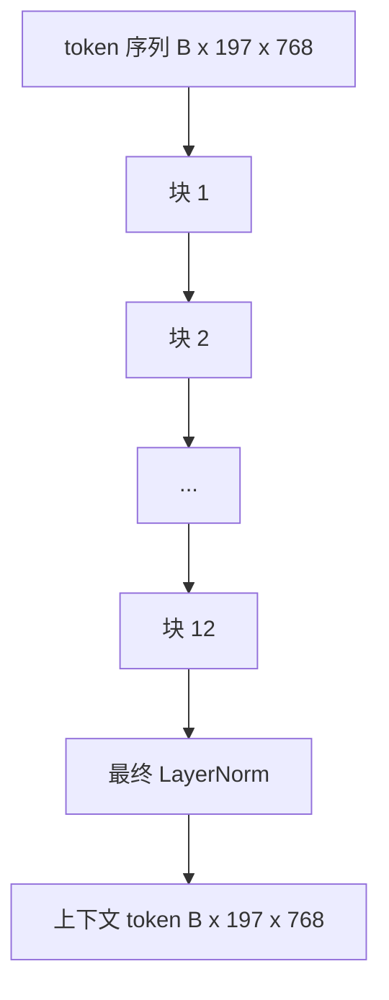
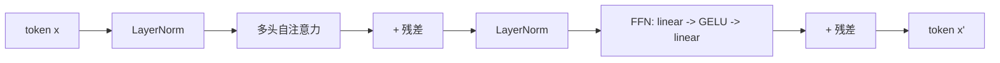

# Vision Transformer 编码器

> Patches 本身看不见东西。具有 12 个注意力头、12 层 pre-LN transformer 将 patch token 序列转换为上下文 token 序列，其中 CLS token 在其最终隐藏状态中池化整个图像的特征。本课是每个现代视觉-语言模型的引擎室。

**类型：** 构建
**语言：** Python
**前置条件：** 阶段 19 第 30-37 课（B 追踪基础）
**时间：** 约 90 分钟

## 学习目标

- 实现一个带有多头自注意力和前馈子层的 pre-LN transformer 块。
- 堆叠 12 个块和 12 个头形成 ViT-Base 编码器。
- 将第 58 课的 patch 前端接入编码器并运行一次前向传播。
- 验证 CLS token 从每个 patch 聚合信息。

## 问题

Patch embedding 产生一个 197 个 token 的序列，每个 token 是一个向量，彼此之间没有任何感知。一张猫的图像需要每个 patch 知道哪些 patch 包含胡须、哪些包含背景、哪些包含眼睛。Transformer 就是建立这种感知的机制，逐层进行注意力计算。没有它，patch 前端只是一个聪明的分词器，没有任何理解。

标准配方是 12 层深、12 头宽，带有 pre-LayerNorm 放置、GELU 激活和 4 倍的前馈扩展。该配方是 CLIP ViT-L、SigLIP、DINOv2、Qwen-VL 系列、InternVL 以及 2025-2026 年每个其他开源权重视觉编码器的脊梁。该配方足够稳定，你可以阅读任何这些论文并假设这种块形状，除非它们明确说明其他情况。

## 概念





### Pre-LN vs post-LN

原始 Transformer 将 LayerNorm 放在残差之后。Pre-LN（每个子层之前的 LayerNorm）是每个现代视觉-语言模型使用的版本，因为它训练稳定，无需学习率预热技巧。区别在前向传播中只是一行代码，但在 12+ 深度时梯度流是昼夜分明的。

### 多头自注意力

每个头将 token 向量投影到自己的 `(query, key, value)` 三元组，维度为 `head_dim = hidden / num_heads`。当 `hidden = 768`、`heads = 12` 时，每个头的维度为 `64`。12 个头并行参与，然后它们的输出 concat 回维度 768 并通过输出投影。多人头的意义在于，一个头可以学习"关注猫眼"，而另一个学习"关注背景梯度"，互不干扰。

### 为什么是 4 倍前馈扩展

FFN 为 `hidden -> 4 * hidden -> hidden`，中间带 GELU。因子 4 是经验性的，自 2017 年以来在语言和视觉 transformer 中保持不变。较小（2 倍）欠拟合；较大（8 倍）在固定数据预算下过拟合。MLP 是模型存储大多数学习事实的地方，而更宽的中间层是它们所在的位置。

| 组件 | ViT-Base 规模下的参数 |
|-----------|------------------------------|
| 每个块的 qkv 投影 | `3 * 768 * 768 = 1.77M` |
| 每个块的输出投影 | `768 * 768 = 590K` |
| 每个块的 FFN（4 倍扩展） | `2 * 768 * 4 * 768 = 4.72M` |
| 每个块的 LayerNorm | `4 * 768 = 3K` |
| 每个块合计 | 约 7.1M |
| 12 个块 | 约 85M |
| 加上前端 | 约 86M 总计 |

ViT-Base 是一个 86M 参数的编码器。按 2026 年的标准来说很小（SigLIP-So400M 为 400M，Qwen-VL ViT 为 675M），但架构在宽度和深度上是相同的。

### 因果 mask 还是不是？

视觉 Transformer 是纯编码器且双向的：token `i` 可以关注任何对的 token `j`。无需 mask。第 61 课中的解码器侧交叉注意力将使用因果 mask，但在视觉编码器内部，注意力是完全连接的。

### CLS token 学到了什么

CLS token 作为一个学习参数开始，本身没有 patch 内容，并通过每个块的注意力积累信息。到最后一层，CLS 行是整个图像的向量摘要；下游头将这个单一向量投影到类别 logits、对比 embeddings 或文本解码器的交叉注意力 key。

## 构建

`code/main.py` 实现：

- `MultiHeadSelfAttention`，带有 qkv 和输出投影、缩放点积注意力数学和形状断言。
- `FeedForward`，4 倍扩展 GELU MLP。
- `Block`，一个 pre-LN 块，用残差组合注意力和前馈子层。
- `ViT`，12 个块的堆叠，带有最终 LayerNorm。
- `VisionEncoder`，将第 58 课的 `VisionFrontEnd` 连接到 `ViT` 堆叠上，并暴露一个 `forward()`，返回上下文序列和池化 CLS 向量。
- 一个演示，将合成的 224x224 fixture 图像通过完整编码器运行，并打印输入形状、输出形状、参数数量以及每隔一层的 CLS 范数。

运行它：

```bash
python3 code/main.py
```

输出：fixture 被编码为一个 `(1, 197, 768)` 张量。CLS 范数随着层组合向上漂移，然后在最终 LayerNorm 处稳定。报告的总参数约 86M。

## 使用

这里定义的编码器，在宽度和深度上，与 2025-2026 年每个开源 VLM 中提供的块堆叠相同。差异位于：

- **宽度和深度。** ViT-Large 为 `hidden=1024, depth=24, heads=16`；SigLIP So400M 为 `hidden=1152, depth=27, heads=16`。相同的块。
- **池化头。** CLS 池化（本课）vs 平均池化（SigLIP）vs 注意力池化（后来的 VLM）。
- **位置处理。** 固定正弦（第 58 课）vs 学习 1D vs ALiBi vs 2D RoPE。块数学不变。
- **Register tokens。** DINOv2 在 CLS 之后 prepend 4 个额外的学习 token。一行代码。

这个块堆叠是基质。接下来的课程（60-63）建立在它之上。

## 测试

`code/test_main.py` 覆盖：

- 单个块保持形状且对输入批量大小不变
- 注意力分数沿 key 轴求和为 1（softmax 健全性）
- 残差路径已连接（零输入仍通过 CLS token 产生非零输出）
- 4 层堆叠前向传播产生正确形状
- 梯度从 CLS 输出流向 patch 投影

运行它们：

```bash
python3 -m unittest code/test_main.py
```

## 练习

1. 添加 register tokens（4 个在 CLS 之后 prepended 的学习向量）并重新运行。通过最后一层 softmax 分布的熵比较注意力图平滑度。

2. 将 pre-LN 交换为 post-LN，并在合成形状分类器上训练一个 epoch。观察哪一个可以在没有 LR 预热的情况下稳定训练。

3. 实现因果 mask 作为 `attn_mask` 参数，以便同一块可以重用作解码器块。Mask 形状为 `(seq, seq)`，下三角。

4. 用 `torch.profiler` 在批量大小 1、8、64 下分析前向传播。MLP 层主导墙钟时间，而非注意力。

5. 将一个注意力头的 q-k-v 投影替换为低秩 LoRA 适配器，冻结其余部分，并验证梯度只流向你期望的地方。

## 关键术语

| 术语 | 含义 |
|------|---------------|
| Pre-LN | LayerNorm 在每个子层之前应用，而非之后 |
| 自注意力 | 每个 token 关注同一序列中所有其他 token |
| 多头 | 隐藏维度被分割到 `H` 个独立的注意力头上 |
| FFN 扩展 | 前馈层扩展到 `4 * hidden`，然后收缩 |
| CLS 池化 | 使用第一个 token 的最终隐藏状态作为图像摘要 |

## 进一步阅读

- An Image is Worth 16x16 Words（ViT，2021）用于编码器配方。
- DINOv2（2023）用于 register tokens 和自监督预训练目标。
- SigLIP（2023）用于平均池化变体和第 62 课中使用的 sigmoid 对比损失。