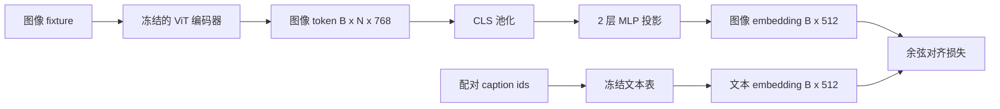

# 投影层与模态对齐

> 视觉编码器生成图像 token，文本解码器消费文本 token。两者生活在不同的向量空间中。一个小型两层 MLP 将图像 token 投影到文本 embedding 空间，配对caption的余弦对齐损失将两个空间拉齐。这个投影是视觉-语言模型中最小的部件，却是对迁移最关键的部件。

**类型：** 构建
**语言：** Python
**前置条件：** 阶段 19 第 30-37 课（Track B 基础）
**时间：** 约 90 分钟

## 学习目标

- 构建一个两层 MLP 投影层，将图像特征映射到文本 embedding 空间。
- 构建一个模拟文本 embedding 表（无预训练 tokenizer，无真实语料）。
- 计算投影图像 token 与配对 caption embedding 之间的余弦对齐损失。
- 在冻结视觉编码器和冻结文本表的情况下，单独训练投影层。

## 问题

你有一个视觉编码器（第 58-59 课）产生维度为 `vision_hidden = 768` 的 token。你有一个文本解码器想接在上面，embedding 维度为 `text_hidden = 512`（换成别的数字也一样合理）。解码器期望的是文本形状的 token。图像 token 不是文本形状的：它们活在编码器在纯视觉预训练中学到的基空间中，与解码器的词向量没有任何关系。

两层 MLP 投影层（linear、GELU、linear）弥合了这个鸿沟。它足够小（约 `768 * 1024 + 1024 * 512 = 1.3M` 参数），可以在单块 GPU 上几分钟内完成训练，而且是对齐阶段唯一需要学习的部件。视觉编码器保持冻结。文本 embedding 表保持冻结。只有投影层在变化。这就是 LLaVA 2023 年发表的配方，BLIP-2 将其重新表述为 Q-Former，此后每个开源 VLM 都以某种形式采用了它。

## 概念



### 投影前的池化

视觉编码器发出 197 个 token。文本侧有一个 caption 级 embedding。要对齐它们，每个样本需要一个图像级向量。CLS 池化是最简单的：取编码器的第一个 token 并投影。对所有 197 个 token 做平均池化是另一个选项，SigLIP 用的是这个。两者都是将 197 个向量池化到 1 个。

### 为什么要两层而不是一层

单层线性投影可以旋转和缩放，但如果两个空间有曲率不匹配就无法修复基问题。两层线性层之间的 GELU 给投影一次非线性弯曲，这在经验上足以将 CLIP 风格的特征对齐到语言模型 embedding。更深的投影（LLaVA-NeXT 用 GLU；Qwen-VL 用一堆注意力层）是扩展；两层 MLP 是标准的基线，也是 BLIP-2 的 Q-Former 投影头在内部所采用的。

| 层 | 形状 | 参数量 |
|-------|-------|------------|
| fc1 | `(vision_hidden, projection_hidden)` | `768 * 1024 + 1024` |
| activation | GELU | 0 |
| fc2 | `(projection_hidden, text_hidden)` | `1024 * 512 + 512` |

对于 `768 -> 1024 -> 512` 的头来说约 1.3M 参数。

### 余弦对齐损失

对齐不等于 `image_emb == text_emb`。对齐意味着在联合空间中 `image_emb` 与 `text_emb` 指向同一方向。余弦损失是 `1 - cos_sim(image, text)`，范围从 0（完美对齐）到 2（相反）。训练驱动每对 pair 的损失趋近于零。第 62 课将其推广到对比 batch（InfoNCE），其中每张图像必须比任何其他 caption 更接近自己的 caption；本课使用每对版本以使动态变化可见。

### 冻结编码器是诀窍

视觉编码器有 86M 参数。文本表又有几百万。从模拟语料从头训练所有这些不现实。两个都冻结意味着投影层的 1.3M 参数是唯一变化的东西，在合成对上跑几百步就足以驱动损失下降。这正是每个基于 adapter 的 VLM 的运作形态：重的部分保持冻结，轻的桥接层训练。

## 构建

`code/main.py` 实现了：

- `MLPProjector(in_dim, hidden_dim, out_dim)`，带 GELU 激活的两层线性 MLP。
- `MockTextEmbedding(vocab_size, dim)`，带确定性初始化的冻结 embedding 表（来自种子）。
- `make_pair(seed, vocab_size)`，合成一个配对的（图像，caption）样本。Caption 是短 id 序列；caption embedding 对 token embedding 做平均池化。
- `cosine_alignment_loss(image_emb, text_emb)`，每对的 `1 - cos_sim` 目标函数。
- 一个训练循环，在 32 个合成对（循环使用）上运行投影 200 步，视觉编码器和文本表冻结，每 25 步打印损失。

运行：

```bash
python3 code/main.py
```

输出：训练报告从初始损失约 1.07 在 200 步内降到约 0.80，说明仅凭投影层就能把图像 token 拉向文本空间。每对的最终余弦相似度也会打印出来。

## 使用

同样的模式出现在每个开源 VLM 中：

- **LLaVA 1.5。** 两层 GELU MLP 投影，从 CLIP-ViT-L hidden 到 LLaMA embedding 维。冻结视觉编码器，冻结 LLM，只训练投影层（然后在第二阶段解冻 LLM）。
- **BLIP-2。** Q-Former 让 32 个学习到的 query token 通过交叉注意力处理图像 token，然后投影到 LLM embedding 维。Q-Former 最末的投影头正是本课 MLP 的对等物。
- **MiniGPT-4。** 从 BLIP-2 Q-Former 输出到 Vicuna embedding 维的单层线性投影。
- **Qwen-VL。** 带好几层交叉注意力 adapter，但最后一块仍是投影到 LM embedding 维。

形状各异但角色相同：池化图像 token，投影到文本 embedding 维，单独训练。

## 测试

`code/test_main.py` 覆盖：

- 投影头输出形状与配置的 `out_dim` 匹配
- 冻结文本 embedding 表的 `requires_grad` 参数为零
- 相同向量的余弦损失为 0，反平行向量的损失为 2
- 一次反向传播后投影头梯度正常流动
- 训练循环在第 0 步和第 200 步之间损失降低

运行：

```bash
python3 -m unittest code/test_main.py
```

## 练习

1. 将 CLS 池化替换为对 196 个 patch token 的平均池化，比较 200 步后的最终损失。平均池化在合成数据上通常训练更快；CLS 在自然图像上样本效率更高。

2. 在余弦损失中添加一个学习到的标量温度参数 (`cos / tau`)，观察当 `tau` 过小（梯度噪声）或过大（损失高位停滞）时会发生什么。

3. 将两层 MLP 换成单层线性层并量化损失差距。非线性在自然图像特征上更重要，在合成特征上次要。

4. 在投影器权重上添加一个小 L2 惩罚项，观察它与余弦对齐的交互（余弦是尺度不变的，所以惩罚主要收缩未使用的方向）。

5. 持久化投影器权重，然后重新加载并在没有视觉编码器反向传播的情况下运行推理，验证部署时只需要投影器。

## 关键术语

| 术语 | 含义 |
|------|---------------|
| 模态对齐 | 使图像和文本 embedding 在一个共享空间中可比的过程 |
| 投影头 | 将一个空间映射到另一个空间的小模块，通常是 2 层 MLP |
| 余弦相似度 | 点积除以 L2 范数的乘积 |
| 冻结编码器 | 视觉（或文本）模型所有参数的 `requires_grad=False` |
| 模拟语料 | 用于使训练不依赖数据集下载的合成对 |

## 延伸阅读

- LLaVA 论文关于两阶段训练（先投影，再解冻 LM）。
- BLIP-2 论文关于 Q-Former 作为可学习投影的替代方案。
- Qwen-VL 技术报告关于更深投影头的交叉注意力 adapter。