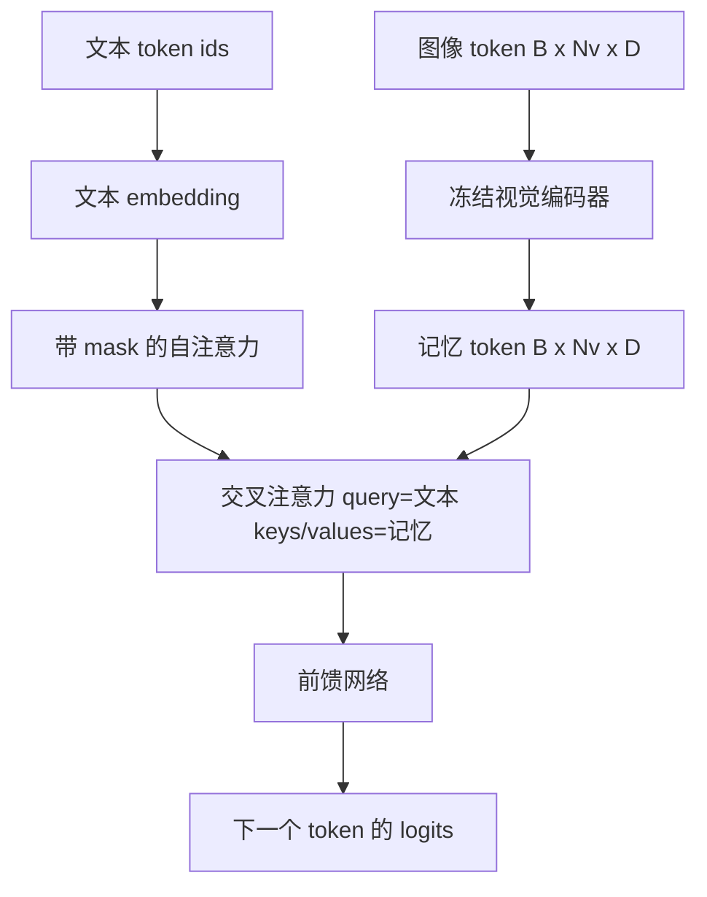
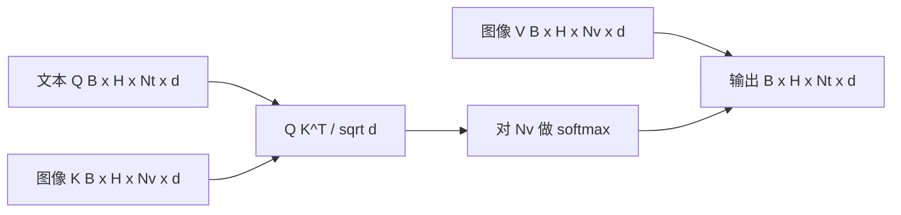

# 交叉注意力融合

> 投影层将一个图像向量与一个 caption 向量对齐。真正的视觉-语言解码器需要每个文本 token 都能 attend 到每个 patch token，这样模型才能将每个词锚定在某个区域上。交叉注意力就是实现这种锚定的方式。文本发出 query，视觉提供 keys 和 values。本课构建交叉注意力块、因果文本自注意力，以及保持两者合法的 mask 形状。

**类型：** 构建
**语言：** Python
**前置条件：** 阶段 19 第 30-37 课（Track B 基础）
**时间：** 约 90 分钟

## 学习目标

- 实现多头交叉注意力，其中 query 流是文本，key/value 流是视觉。
- 组合一个解码器块：因果自注意力 + 交叉注意力 + 前馈网络。
- 正确处理 mask 形状：自注意力用因果 mask，交叉注意力不用 mask。
- 用批量的文本 token 和固定的图像 token 池运行一次前向传播。

## 问题

将图像 token 和文本 token 拼接成一个序列是一种融合方案（早期融合，Chameleon 和 Emu3 的路径）。交叉注意力是另一种（晚期融合，Flamingo 引入的路径，此后每个 Flamingo 形状的解码器都沿用了它）。在晚期融合中，文本解码器只运行在纯文本 token 上，在每一层通过交叉注意力伸手进图像流。

晚期融合有两个优势。第一，文本流保持干净，模型保留纯文本能力。第二，图像流每个图像只计算一次，每个解码步骤复用，所以生成长 caption 也很廉价。代价是每块一个额外的注意力子层。

## 概念





### Mask 形状

解码器块内的两种注意力需要不同的 mask：

| 注意力 | Query 长度 | Key 长度 | Mask | 原因 |
|-----------|--------------|------------|------|-----|
| 自注意力 | `Nt`（文本） | `Nt`（文本） | 因果：下三角 `(Nt, Nt)` | 文本 token 在自回归时不能向前看 |
| 交叉注意力 | `Nt`（文本） | `Nv`（视觉） | 无 mask | 每个文本位置都能看到整张图像 |

本课包含一个形状验证函数，把混用两者的错误作为 `ValueError` 暴露出来，而不是静默地让损失曲线出问题。

### 交叉注意力为什么不用 mask

图像在任何文本生成之前已完全被观察。Caption 的第 `t` 个 token 可以 attend 到图像的任意 patch；图像 patch 之间没有时间顺序。一些 Flamingo 变体在混合多张图像和文本段落时会添加每样本 mask 模式，但对于单张图像加一个 caption，交叉注意力能看到一切。

### Key/value 缓存

图像 keys 和 values 在解码开始时计算一次，存入缓存。每个新的文本 token 使用缓存而无需重计算。这使得 captioning 在推理时很快：重的 ViT 只运行一次；交叉注意力为每一步复用它的 keys 和 values。本课暴露缓存并测试缓存命中路径。

### 块组合

一个解码器块执行：pre-LN -> 自注意力 -> 残差 -> pre-LN -> 交叉注意力 -> 残差 -> pre-LN -> 前馈 -> 残差。三个子层，每个都有自己的 LayerNorm。Flamingo 论文在交叉注意力上添加了一个学习到的 gate，使模型能够在训练时选择退出图像路径（以稳定性为代价）；本课采用的标准基线没有 gate。

```python
class DecoderBlock:
  def forward(self, text_tokens, image_tokens, text_mask, cross_mask):
      text_tokens = text_tokens + self.self_attn(self.ln1(text_tokens),
                                                 mask=text_mask)
      text_tokens = text_tokens + self.cross_attn(self.ln2(text_tokens),
                                                  image_tokens,
                                                  mask=cross_mask)
      text_tokens = text_tokens + self.ffn(self.ln3(text_tokens))
      return text_tokens
```

## 构建

`code/main.py` 实现了：

- `CrossAttention(hidden, heads)`，带独立 `q` 和 `kv` 投影的多头交叉注意力。
- `CausalSelfAttention(hidden, heads)`，标准解码器中的带 mask 自注意力。
- `DecoderBlock`，用 pre-LN 残差组合三个子层。
- `VisionLanguageDecoder`，四层解码器，接收模拟视觉编码器输出和小型文本 embedding 表。
- `causal_mask(length)`，返回一个 `(length, length)` 下三角布尔张量。
- 一个演示：输入批量 2 个长度为 10 的文本序列和长度为 197 的图像记忆，打印输出形状、自注意力 mask 形状和每位置交叉注意力输出范数。

运行：

```bash
python3 code/main.py
```

输出：解码器产生一个 `(2, 10, text_vocab)` 的 logits 张量。Mask 形状是 `(10, 10)`。KV 缓存复用检查确认缓存路径和无缓存路径的 logits 相同。

## 使用

交叉注意力出现在两个生产系列中：

- **Flamingo 和 IDEFICS。** 每 K 个语言模型块插入一个交叉注意力子层，LM 冻结。视觉-语言 adapter 就是交叉注意力块及其 gate。
- **BLIP-2。** Q-Former 用固定 32 个 query token 对图像特征做交叉注意力，然后将 queries 投影到 LM embedding 空间。

本课的块形状直接映射到两者。Mask 规则（自注意力用因果，交叉注意力不用）是相同的。

## 测试

`code/test_main.py` 覆盖：

- 因果 mask 是下三角的且形状匹配预期布尔值
- 交叉注意力输出形状为 `(B, Nt, hidden)`，与 key 长度无关
- KV 缓存路径在浮点容差内匹配无缓存路径
- 文本流和图像流之间的形状不匹配抛出清晰的 `ValueError`
- 完整解码器前向传播产生正确的 batch 和序列形状

运行：

```bash
python3 -m unittest code/test_main.py
```

## 练习

1. 在交叉注意力残差上添加一个学习到的 tanh gate（Flamingo 技巧），验证训练从近零初始 gate 收敛。Gate 从 0 开始；模型先恢复纯文本行为，再混入图像流。

2. 实现交错注意力，同一个解码器消费多张图像加多个文本段落。构建每样本交叉注意力 mask，防止文本段落 2 attend 到图像 1。

3. 在 `Nt=64, Nv=576`（高分辨率下 24x24 网格）对交叉注意力和自注意力层做性能分析。交叉注意力开销是 `Nt * Nv`，在高图像分辨率下占主导。

4. 在交叉注意力图上添加 query 侧 dropout，测量演示中的 caption 多样性（caption 采样方差随交叉 map 中的 dropout 增加）。

5. 将交叉注意力层换成 Q-Former 风格的注意力块，固定 32 个 token 的 query 池每层 attend 一次图像特征。

## 关键术语

| 术语 | 含义 |
|------|---------------|
| 晚期融合 | 文本和视觉保持在独立流中；交叉注意力在每块桥接两者 |
| 交叉注意力 | Q 来自一个流，K 和 V 来自另一个流 |
| 因果 mask | 下三角布尔 mask，防止在自回归时向前看 |
| KV 缓存 | 图像 keys 和 values 存储一次，每步解码复用 |
| 记忆 token | 解码器伸手进去的冻结图像 token |

## 延伸阅读

- Flamingo（2022）关于带门控交叉注意力的标准晚期融合设计。
- BLIP-2（2023）关于 Q-Former，这是一种伪装成学习 query 池的交叉注意力块。
- IDEFICS（2023）关于 Flamingo 配方的一个开源复现。