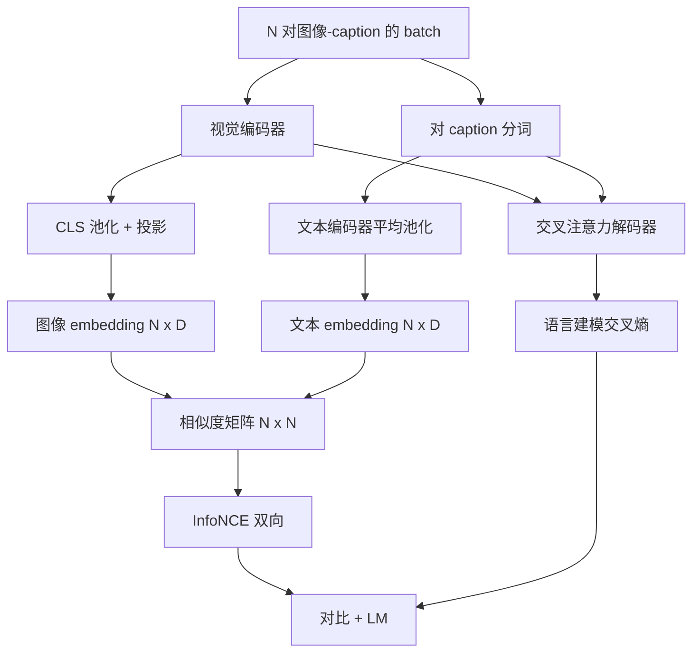

# 视觉-语言预训练

> 编码器、投影层和解码器已经接好了。现在一起训练。两个目标驱动学习：对比图像-文本损失（InfoNCE）将配对在联合 embedding 空间中拉近，语言建模损失让解码器为每张图像写 caption。两者结合，教会网络既能找到 caption 对应的图像，也能为图像写出 caption。

**类型：** 构建
**语言：** Python
**前置条件：** 阶段 19 第 30-37 课（Track B 基础）
**时间：** 约 90 分钟

## 学习目标

- 在一批图像-caption 对上实现 InfoNCE 对比损失。
- 将对比损失与自回归语言建模损失组合。
- 合成一个 200 对的模拟图像-caption 语料，无需下载真实数据集。
- 运行 50 步演示训练循环，观察两个损失都在下降。

## 问题

一个视觉-语言模型需要两种能力。它必须做排序：给定一个 caption，在多张图像中找到正确的那张。它还必须做生成：给定一张图像，写出一个 caption。只用一个技能预训练模型得到的是半个系统。CLIP 擅长排序但不能 caption。GPT-4V 能 caption 但排序用单独一个检索头。多目标预训练一次得到两种能力。

InfoNCE 处理排序部分。对于一批 N 对，模型将 N 个配对视为正样本，将 `N^2 - N` 个不匹配对视为负样本，然后在得到的 `(N, N)` 相似度矩阵上运行交叉熵损失。LM 损失处理生成部分：标准的下一个 token 预测，以图像为条件。两个损失都可微分，可以共享编码器、投影器和解码器的权重。

## 概念



### InfoNCE 一段话解释

将 N 个图像 embedding 作为行堆叠，N 个文本 embedding 也作为行堆叠。L2 归一化两者。计算矩阵 `S = I T^T / tau`，其中 `tau` 是学习到的温度。对角线元素是配对；非对角线元素是负样本。以对角线为 target argmax 沿行应用交叉熵：行 `i` 应该在列 `i` 处有最高条目。沿列做同样的对称操作。总损失是两者的平均。这就是 CLIP 损失的八行实现。

### 温度很重要

温度 `tau` 控制 softmax 的峰值程度。太小（例如 `tau = 0.01`），梯度只来自最难的负样本，训练噪声大。太大，softmax 变平，梯度消失。CLIP 将 `tau` 作为参数学习；这里的演示也一样。

### 语言建模损失

解码器通过交叉注意力消费图像记忆 token，在每个位置预测下一个文本 token。损失是标准交叉熵，下一个位置 target。填充位置在损失中被 mask 掉。

### 组合损失

`total = contrastive + lm_weight * lm`，其中 `lm_weight` 是一个标量（常为 1.0）。两个损失共享编码器和投影器的梯度；只有解码器接收 LM 损失的梯度。这是 CoCa、BLIP 和 SigLIP 风格模型都使用的多任务配方，只是权重配比不同。

| 组件 | 损失曲面 | 影响 |
|-----------|--------------|---------|
| InfoNCE | 联合空间中的配对排序 | 编码器 + 投影器 + 文本头 |
| LM | 以图像为条件的 token 预测 | 编码器 + 投影器 + 解码器 |
| 组合 | 多任务 | 整个堆栈 |

### 为什么 50 步对演示就足够了

模拟语料是随机图像和随机 caption ids 的 200 对合成集。用 batch size 16 做 50 步 SGD 后，两个损失即使绝对值仍高于真实数据模型能达到的水平，下降也是可见的。演示的目的是确认梯度管道从头到尾是接通的，以及加入 LM 损失不会破坏对比目标。

## 构建

`code/main.py` 实现了：

- `MultimodalModel`，组合小型 ViT 编码器、MLP 投影器、微型文本侧编码器（对 embedded ids 做平均池化）和第 61 课的交叉注意力解码器。
- `info_nce_loss(image_emb, text_emb, temperature)`，双向 CLIP 风格对比损失。
- `lm_loss(logits, target_ids, padding_id)`，带 mask 的下一个 token 交叉熵。
- `make_mock_corpus(seed, n_pairs)`，返回 200 个确定的（图像，caption_ids）对。
- 一个训练循环，用 batch size 16、Adam 优化器和学习到的对数温度参数跑 50 步。每 5 步打印两个损失。

运行：

```bash
python3 code/main.py
```

输出：对比损失从约 `ln(16) = 2.77` 降到 2.4 左右；LM 损失从随机均匀基线的 `ln(512) ≈ 6.24` 降到约 4.7。两个下降都证明梯度是正确接通的。真实模型训练数百万步；动态是一样的。

## 使用

这就是以下模型使用的相同损失配方：

- **CLIP（2021）。** 只做图像-文本对比，带一个单独冻结编码器的 caption 探测头。
- **CoCa（2022）。** 图像-文本对比加图像 captioning LM 损失，在一个模型里。本课构建的正是这个模式。
- **BLIP（2022）和 BLIP-2。** 对比 + LM + 图像-文本匹配头。三个损失组合。
- **SigLIP（2023）。** 将 InfoNCE 换成 sigmoid 对损失；相同对比角色，不同函数形式。
- **LLaVA 系列。** 两阶段训练，第一阶段是对齐（在冻结 LM 上做余弦），第二阶段加入 LM 损失同时解冻 LM。第 60 课对应第一阶段；本课对应第二阶段。

## 测试

`code/test_main.py` 覆盖：

- InfoNCE 损失在图像/文本行上对称
- 当相似度矩阵是一个大正数完美对角线时 InfoNCE 损失返回 0
- LM 损失正确 mask 填充位置
- 模型前向传播无错误地产生两个损失
- 5 步训练循环降低组合损失

运行：

```bash
python3 -m unittest code/test_main.py
```

## 练习

1. 将 InfoNCE 换成 SigLIP 风格的 sigmoid 对损失，在模拟语料上比较收敛性。

2. 添加硬负样本挖掘步：每隔一个 batch，从上一个 batch 中选择最难的对角线外配对并追加。训练并检查对比损失是否下降更快。

3. 在联合 embedding 上添加图像-文本匹配二分类头（真假：这些匹配吗？），引入第三个损失，复现 BLIP 的三头设置。

4. 将模拟语料换成由马尔可夫链生成的 caption id 序列，过渡矩阵以图像 hash 为条件。Captioning 损失应该下降更多，因为有实际可学习的信号。

5. 用 `lm_weight = 0` 训练同一模型一次，再用 `lm_weight = 1` 训练一次。比较对比损失；LM 损失不应退化排序目标。

## 关键术语

| 术语 | 含义 |
|------|---------------|
| InfoNCE | 噪声对比估计：相似度矩阵上的交叉熵 |
| 温度 | 控制对比 softmax 峰值程度的标量 |
| 硬负样本 | 模型觉得困惑的非对角线配对，对采样有用 |
| LM 损失 | Captioning 侧标准的下一个 token 交叉熵 |
| 联合 embedding 空间 | 图像和文本向量在投影后在共享空间中生活的空间 |

## 延伸阅读

- CLIP 论文关于原始对比配方。
- CoCa 论文关于对比和 captioning 在一个模型中。
- SigLIP 论文关于 sigmoid 对损失变体及其为何更好扩展。