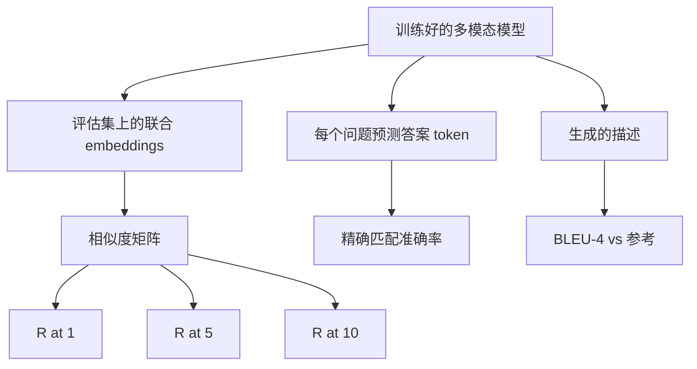

# 多模态评估

> 训练只是闭环的一半，另一半是测量。本课从底层原语构建三种评估面：图像-描述检索（R@1、R@5、R@10）、视觉问答（精确匹配准确率）、图像描述生成（BLEU-4）。每个指标都是模型输出与合成评估套件的函数，几秒内即可运行。

**类型：** 构建
**语言：** Python
**前置条件：** 阶段 19 第 58-62 课（Track E 基础：编码器、Transformer、投影、跨注意力融合、预训练）
**时间：** 约 90 分钟

## 学习目标

- 根据图像和描述 embeddings 之间的相似度矩阵计算 Recall@K。
- 从将（图像，问题）对映射到固定答案词表的模型计算精确匹配 VQA 准确率。
- 从生成序列和参考 token 序列计算 BLEU-4，不依赖任何外部库。
- 在基于第 62 课训练模型的合成评估套件上运行全部三种评估。

## 问题

一种常见诱惑是当训练损失趋于平稳时就宣告多模态模型完成。训练损失衡量的是对训练分布的拟合程度，它无法衡量模型是否能在保留批次中对配对进行排序、回答问题、或写出人类可以接受的描述。三种标准评估面：

- **检索（R@1、R@5、R@10）。** 为查询描述构建联合 embedding；用余弦相似度对评估池中的每张图像排序；报告匹配图像是否落在第 1、第 5、第 10 名。对称形式（图像到文本）用同样的方式运行。
- **视觉问答（精确匹配）。** 给定（图像，问题），模型输出一个答案 token。精确匹配是每样本一位：预测答案是否等于参考答案？取评估集的平均。
- **描述生成（BLEU-4）。** 生成一段描述。计算 1-gram 到 4-gram 精确度的几何均值，并附简短惩罚。多参考是标准形式（一张图像，多条参考描述）。

每个指标都是一个简单的函数。本课全部用代码实现，这样数学是具体的，评估面也在你的掌控之下。真实基准套件（MS-COCO、VQA v2、GQA、OK-VQA）插入相同的函数形式。

## 概念



### 从相似度矩阵计算 Recall@K

在图像和描述 embeddings 之间构建 `(N, N)` 余弦相似度矩阵。对每一行，按相似度降序排列各列。Recall@K 是对角线列索引位于前 K 位以内的行所占的比例。对称 Recall@K（描述到图像）在转置矩阵上计算。两个数字都报告。对于 N=100 的评估，R@1 = 0.6 意味着 100 条描述中有 60 条将其正确图像检为第一名。

### VQA 精确匹配

对于每个（图像，问题，答案），编码图像，嵌入问题，通过解码器融合，并读出下一个 token。预测的 token id 与参考 id 比较；相等则正确。取评估集的平均。真实的 VQA 数据集为每个问题提供多个人类标注答案，并使用软准确率公式（如果有至少 3/10 的标注者同意则为 1.0，否则按比例缩放）；本课为清晰起见使用单答案精确匹配。

### BLEU-4

```text
BLEU-4 = BP * exp(mean(log p1, log p2, log p3, log p4))
```

其中 `p_n` 是改良 n-gram 精确度（生成的 n-gram 中出现在任意参考中的裁剪计数，除以生成的 n-gram 总数），`BP` 是简短惩罚：

```text
BP = 1                如果生成长度 > 参考长度
   = exp(1 - r/g)     否则，其中 r 是参考长度，g 是生成长度
```

对于小样本需要平滑处理，某些 `p_n` 为零时使用。本实现使用 Chen 和 Cherry 的"方法 1"（对任何零计数在分子和分母上加 1），这是低计数区间最安全的默认方法。

### 合成评估套件

一个 50 样本的评估套件从第 62 课使用的相同模拟语料模式在内存中构建，使用一个留出种子。三个列表组成套件：

- `pairs`：50 个用于检索的（图像，描述_ids）对。
- `vqa`：50 个（图像，question_ids，answer_id）三元组。
- `caps`：50 个（图像，[参考描述_ids, ...]）条目，每张图像最多 3 条参考。

套件由种子决定性生成，并与训练语料分离，因此指标在模型从未见过的数据上计算。将套件持久化到 JSON 留作练习（见下文）。

| 指标 | 范围 | 随机基线（N=50） |
|--------|-------|------------------------|
| R@1 | 0 到 1 | 0.02（1 / N） |
| R@5 | 0 到 1 | 0.10 |
| R@10 | 0 到 1 | 0.20 |
| VQA EM | 0 到 1 | 1 / 词表大小 |
| BLEU-4 | 0 到 1 | 很小但非零 |

对于在合成数据上的 50 步训练运行，指标预期不会很高；预期会高于随机基线，这是演示检查的内容。

## 构建

`code/main.py` 实现：

- `recall_at_k(sim_matrix, k)`，返回两个方向的 `[0, 1]` 浮点数。
- `vqa_exact_match(predictions, references)`，返回 `int` 相等的平均。
- `bleu4(generated, references, smoothing=True)`，支持多参考。
- `build_eval_suite(seed, n_samples, vocab_size, max_len)`，返回三个确定性评估列表。
- `evaluate(model, suite)`，运行全部三个指标并返回数字的 `dict`。
- 一个演示，加载第 62 课新初始化的多模态模型，评估它，然后训练 50 步再评估，打印前后指标。

运行：

```bash
python3 code/main.py
```

输出：前后指标表显示检索从接近随机逐步改善到模型的学得信号，VQA 高于随机改善，BLEU-4 改善（合成结构足以提升 4-gram 精确度）。

## 使用

每个指标直接映射到生产基准：

- **检索。** MS-COCO 5K val、Flickr30K、ImageNet 零样本都是相同相似度矩阵上的 R@K 问题。用真实文件替换合成评估，函数签名不变。
- **VQA。** VQA v2、GQA、OK-VQA 使用相同的精确匹配形式（VQA v2 使用软准确率而非单答案 EM）。
- **BLEU-4。** MS-COCO 描述生成、NoCaps、Flickr30K 描述生成都使用 BLEU-4 加上 CIDEr 和 METEOR。加一个 CIDEr 就是再多一个函数。

对于真实基准，将 `build_eval_suite` 替换为真实加载器，函数体保持不变。数学与基准无关。

## 测试

`code/test_main.py` 覆盖：

- recall@k 在完美恒等相似度矩阵上返回 1.0，在翻转矩阵上对 k < N 返回 0.0
- recall@k 遵守 `k <= N` 上界
- bleu4 在生成与某参考完全相等时返回 1.0
- bleu4 在不相交词表上返回 0.0
- vqa 精确匹配等于相等对的比例
- build_eval_suite 返回预期数量的配对、VQA 条目和描述条目

运行：

```bash
python3 -m unittest code/test_main.py
```

## 练习

1. 将 CIDEr 加入描述生成指标。CIDEr 在 n-gram 上使用 TF-IDF 加权，奖励信息丰富的 token。

2. 实现软准确率 VQA：每个问题多个人类答案，如果任何匹配则准确率为 `min(human_count / 3, 1)`。复现 VQA v2。

3. 添加 `bleu4` 的 NaN 安全变体，处理空生成序列而不崩溃。

4. 在 R@K 之外计算平均倒数排名（MRR）。MRR 对正确项落在前 K 位之后的位置敏感；R@K 对它是否落进前 K 位敏感。

5. 在训练过程中五个检查点（第 0、10、20、30、40、50 步）对模型运行评估并绘制学习曲线。确认指标轨迹跟踪损失轨迹。

## 关键术语

| 术语 | 含义 |
|------|---------------|
| R@K | 正确匹配落在前 K 位结果的查询比例 |
| 精确匹配 | 最简单的 VQA 评分：预测答案等于参考 |
| BLEU-4 | 1- 到 4-gram 精确度的几何均值，带简短惩罚 |
| 多参考 | 描述生成指标接受每张图像的多条参考描述 |
| 留出 | 评估集从与训练语料分离的种子采样 |

## 延伸阅读

- VQA v2 论文的软准确率公式和数据集统计。
- CIDEr 论文的 TF-IDF 加权 n-gram 描述生成。
- BLEU 原始论文（Papineni et al., 2002）的平滑变体。
- MS-COCO 描述生成评估脚本的规范参考实现。