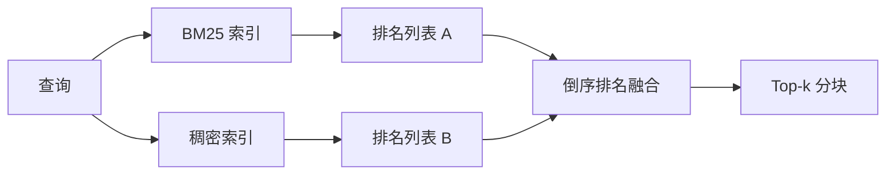

# BM25 与稠密 Embedding 的混合检索

> 词法检索和语义检索在相反的查询分布上失败。带有倒序排名融合的混合检索不进行插值，而是投票——而且投票在每个查询类别上都获胜。

**类型：** 构建型
**语言：** Python
**前置条件：** 阶段 11 第 04 课（embedding）、第 06 课（RAG）；阶段 19 Track B 基础（第 20-29 课）；阶段 19 第 64 课（分块策略）
**时间：** 约 90 分钟

## 学习目标

- 根据 Robertson 和 Sparck Jones 的公式从零实现 BM25，支持字段加权、文档长度归一化以及可调的 k1 和 b。
- 在确定性 mock embedding 之上构建稠密检索器，使循环可以离线运行。
- 按照 Cormack、Clarke 和 Buettcher 2009 年发表的原始公式精确实现倒序排名融合，并解释为什么它优于分数加权插值。
- 调优 RRF k 常量和每种模态的权重，在小型 fixture 语料上阅读权衡。

## 问题

当查询携带语料中逐字存在的字面标识符时，词法搜索获胜。查询 `AbortMultipartOnFail` 通过 BM25 在微秒内返回正确的 Go 函数。同样的查询经过 embedding 后，落在三个相似性聚类的边界上，稠密检索器把错误的文件排在了第一位。

当查询经过改述远离语料的字面词汇时，稠密搜索获胜。用户问"我们如何处理取消的上传"时，从未输入过 abort 或 multipart。BM25 返回"上传大文件"的文档，因为该页面包含单词 uploads。稠密检索找到摘要中提到取消的 abort 函数。

两者之间的选择不是静态的。查询分布才是变量。生产 RAG 系统从同一端点处理两类查询，所以检索必须同时处理两者。这就是混合检索。融合步骤才是必须做对的部分。

## 概念



### BM25 一段话说明

BM25 通过对每个查询项求和来评分：一个逆文档频率因子乘以一个包含长度归一化校正的饱和词频因子。有两个旋钮。`k1` 控制词频饱和；默认值 1.5 是发表的推荐值，没有基准测试不应该调整它。`b` 控制文档长度的重要程度；默认值 0.75 表示长文档会被惩罚，但不是线性惩罚。

IDF 公式使用平滑后的 Robertson 和 Sparck Jones 定义，即 `log((N - df + 0.5) / (df + 0.5) + 1)`。对数内部的加一使 IDF 在词出现在超过一半语料时保持为正。这在停用词技术上是稀有词的小语料中很重要。

字段加权让你告诉 BM25：符号名匹配比正文匹配更重要。实现是在索引时对词计数应用乘数，而不是在评分时。这样数学形式保持不变，避免了每个字段一个独立分数。

### 稠密检索一段话说明

用 embedding 模型将每个块嵌入为固定维向量。查询时，对查询做 embedding，用余弦相似度对每个块排序，返回 top-k。模型是决定质量的变量。检索算法本身只有两行：点积和排序。

本课使用确定性基于哈希的 embedding，使你可以阅读融合数学而无需网络调用。哈希将 token 键控的偏移量求和到一个 96 维向量中并归一化。余弦排序在运行之间是确定性的，这是测试套件所要求的。

### 倒序排名融合，发表的公式

两条排名列表。对于出现在任一列表中的每个候选，求其倒序排名的贡献之和。2009 年的论文使用 `1 / (k + rank)`，k 默认等于 60。按总分排序。这就是整个算法。

发表的常数 k = 60 不是任意的。k = 60 时，第一名贡献 1/61，第十名贡献 1/70。贡献衰减缓慢，所以深排名候选仍然参与投票。较小的 k 使顶级结果占主导地位。较大的 k 会拉平贡献曲线。

我们实现中有两个可调旋钮。`k` 常量。一对每模态权重，使你可以当有先验证据表明某种模态在你的语料上更好时提升 BM25 或稠密。将 rank 贡献乘以权重是最简单的有原则实现；它保留了 rank 衰减形状且与尺度无关。

### 为什么融合优于分数加权插值

BM25 分数是无界且取决于语料的。余弦相似度被限制在 -1 到 1 之间。线性组合 `alpha * bm25 + (1 - alpha) * cosine` 需要每语料调优 alpha，每次重新索引都会失效。基于 rank 的融合不会这样。两种 rank 在模态之间是可比较的。自 2010 年以来，发表的 RRF 基线在每个 TREC 公开评测中都击败了分数插值。

这与你在 Vespa 和 Weaviate 文档中听到的关于 RankFusion 与 RRF 的论点相同。他们得出了相同的结论：除非你有非常强的证据进行分数插值，否则坚持使用基于 rank 的方法。

## 构建

`code/main.py` 实现了：

- `tokenize(text)` - 快速正则分词器。
- `BM25Index` - 字段加权，有 `add` 和 `search`，k1、b 可调。
- `mock_embed`, `DenseIndex` - 与第 64 课相同的确定性 embedding，使分块具有可比性。
- `rrf(rankings, k, weights)` - 带多模态权重的发表融合。
- `HybridRetriever` - 组合 BM25 和稠密。
- 演示用 `main()` 加载小型 fixture 语料，运行三个查询分别针对每种检索器的优势和劣势，打印每种模态产生的排名以及融合后的列表。

运行：

```bash
python3 code/main.py
```

并排阅读演示输出。字面标识符查询 BM25 排第 1，稠密排第 4，RRF 排第 1。改述查询 BM25 排第 6，稠密排第 1，RRF 排第 1。歧义查询 BM25 排第 3，稠密排第 3，RRF 排第 1。融合不是平局决胜者；它是在每个查询类别上都获胜的系统。

## 调优旋钮

| 旋钮 | 默认 | 调高当 | 调低当 |
|------|---------|----------------|------------------|
| BM25 k1 | 1.5 | 词在文档中重复且你希望频率更重要 | 文档很短且词重复是噪声 |
| BM25 b | 0.75 | 长文档确实每个词信息量较少 | 文档长度与主题不相关 |
| RRF k | 60 | 深排名候选应该继续参与投票 | 排名第一的应该占主导地位 |
| BM25 权重 | 1.0 | 你的语料包含字面标识符且查询匹配它们 | 你的查询是用户改述的 |
| 稠密 权重 | 1.0 | 查询是改述的 | 查询是字面的 |

通过在留出查询集上重新运行第 68 课的评估工具来调优，而不是凭直觉。

## 演示会隐藏的失败模式

**词表外 token。** BM25 的 IDF 是从语料计算的，所以仅在查询中存在的词贡献为零。稠密 embedding 为相同词生成一个似是而非的向量。对于词表外的标识符，稠密模态返回看起来合理但实际错误的近邻。融合会吸收这一点，因为 BM25 返回空且 rank 贡献退出，但这只有在你按文档而不是按块去重时才成立。

**停用词主导。** 针对单词"the"的 BM25 会在整个语料上产生均匀排名。在索引器中过滤停用词，或者接受高 IDF 词自然占主导地位。

**模态间内容相同。** 如果你的语料小到 BM25 的 top-1 也是稠密的 top-1，RRF 给你相同的 top-1 和相同的近邻。这是正确行为，不是失败，但这使得融合看起来不可见。在评估中添加对抗性查询对以验证融合实际在工作。

## 使用

生产模式：

- 在进程内索引 BM25；瓶颈是词频字典，不是向量。
- 在独立存储中索引稠密向量（在本课我们使用扁平列表；在生产中你会使用 HNSW）。
- 并行运行两个查询；融合是对并集的常数时间合并。
- 持久化每个检索命中的模态，使下游重排序器能看到哪个模态投了票。

## 交付

第 66 课取本课的融合 top-k 并用交叉编码器重排序。第 68 课用精确率、召回率、MRR 和 nDCG 评估整个流水线。本课的混合检索器是第 69 课端到端系统的第一阶段。

## 练习

1. 用你 provider 的真实模型替换 `mock_embed`。重新运行演示并报告稠密单独排名在改述查询上的变化。
2. 添加第三种模态：单独索引的分块摘要作为第三条排名列表融合。测量收益。
3. 在 10、30、60、100、200 上扫描 RRF k。从第 68 课绘制 recall@k 曲线。在你的语料上曲线峰值对应的 k 值是多少。
4. 正确实现 BM25F（每字段长度归一化而不是乘数技巧），并在符号匹配最重要的语料上比较。

## 关键术语

| 术语 | 大家怎么说 | 实际含义 |
|------|-----------------|------------------------|
| BM25 | "词法检索" | 概率排序：idf × 饱和 tf × 长度归一化 |
| RRF | "排名融合" | 跨排名列表的 1 / (k + rank) 之和；k 默认 60 |
| k1 | "TF 饱和" | 控制重复词何时停止增加更多分数 |
| b | "长度惩罚" | 0 表示忽略文档长度，1 表示完全归一化 |
| 字段加权 | "符号提升" | 在索引时重复 token 以提升该字段中的匹配 |
| 基于排名 vs 基于分数的融合 | "为什么 RRF 优于线性" | 排名在模态间可比；分数不可比 |

## 延伸阅读

- Cormack, Clarke, Buettcher, "Reciprocal Rank Fusion outperforms Condorcet and individual rank learning methods", SIGIR 2009
- Robertson, Walker, Beaulieu, Gatford, Payne, "Okapi at TREC-3"（原始 BM25 论文）
- [Vespa: Hybrid Retrieval with BM25 and Embeddings](https://docs.vespa.ai/en/tutorials/hybrid-search.html)
- [Weaviate: Hybrid Search](https://weaviate.io/developers/weaviate/search/hybrid)
- 阶段 11 第 06 课 - RAG 基础
- 阶段 19 第 64 课 - 在此索引的分块器
- 阶段 19 第 66 课 - 消费融合 top-k 的交叉编码器重排序器