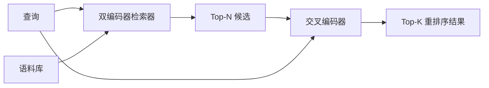

# Cross-Encoder 重排序器

> 双编码器（bi-encoder）独立 embedding 查询和文档。交叉编码器（cross-encoder）将两者拼接后同时读取。交叉编码器是最聪明的读者，也是最慢的。作为双编码器 top-k 的第二阶段使用，它物有所值。

**类型：** 构建型
**语言：** Python
**前置条件：** 阶段 11 第 06 课（RAG）、阶段 11 第 07 课（高级 RAG）；阶段 19 B 轨道基础（课程 20-29）；阶段 19 第 65 课（为本站点提供数据的混合检索）

**时间：** 约 90 分钟

## 学习目标

- 通过输入形状、参数量和单次查询成本，区分双编码器检索器与交叉编码器重排序器
- 从零实现一个小型的交叉编码器：作为一个 transformer 块，消费拼接的（查询，文档）序列，输出一个相关性标量
- 接线和实现两阶段检索-重排序 pipeline：用廉价检索器获取 top-N，用交叉编码器将 N 重排序为 top-K，返回 K
- 在小规模 fixture 语料上测量延迟-质量权衡，为给定延迟预算选择正确的 N

## 问题

双编码器将查询和文档映射到相同的向量空间，用余弦相似度排序。两个编码互不相见。模型必须将文档的所有有用信息压缩成一个向量，对查询一无所知。这很快——索引时每个文档一次 embedding，查询时每个查询一次 embedding——这是在语料库规模上排序的唯一方法。

代价是精度。两个总体主题相同的文档可以有几乎相同的 embedding，即使其中一个回答了查询，另一个没有。双编码器无法区分它们。

交叉编码器通过同时读取查询和文档来解决这个问题。模型接收 `[查询] [SEP] [文档]` 作为单一序列，在连接上运行完整注意力，输出一个相关性标量。文档的每个 token 都可以关注查询的每个 token。模型用完整上下文决定分数。

代价是吞吐量。双编码器一次 embedding 后永久查询，交叉编码器每个（查询，文档）对运行一次。对于 1000 万文档的语料库，每次查询需要 1000 万次前向传播。在请求预算内无法运行。

解决方案是分阶段。用双编码器检索 top-N。用交叉编码器将 N 重排序为 top-K。N 很小（50 到 200），交叉编码器的质量提升集中在它重要的地方。总延迟保持在请求预算内。总质量是交叉编码器的质量，受双编码器在 N 处的召回率上限限制。

## 概念



### 交叉编码器的输入形状

标准填充方式是 `[CLS] 查询_token [SEP] 文档_token [SEP]`。CLS 位置的输出送入一个线性头，输出相关性标量。有些实现用 mean-pooling 代替 CLS；差别很小。重点是模型为每个对产生一个数字。

一个 22M 参数的交叉编码器（已发布的 `ms-marco-MiniLM-L-6-v2` 权重类）是典型的生产切入点。小模型节省延迟的速度赶不上质量损失的速度。大模型（如 568M 参数的 `bge-reranker-v2-m3`）保留用于离线重排序或 K 较小的首页重排序。

### 为什么本课训练一个微型的

真正的交叉编码器是一个微调过的编码器 transformer。在生产环境中你加载检查点并运行它。在本课中，目标是展示模型的形状和延迟-质量曲线的形状，而不是训练一个最先进的排序器。所以我们构建一个带有单个 transformer 块、多头注意力（默认 4 头）和一个回归头的小型 `nn.Module`。它从种子确定性初始化，因此演示可以在没有磁盘权重的情况下复现。

玩具模型从 fixture 语料中学到正确的形状：相关的查询-文档对比分高的预测分数高于不相关的对。端到端 pipeline 重排序双编码器的输出，重排序的 top-k 与标签一致。

### 延迟 vs 质量

两阶段 pipeline 有一个可调参数：N。在保留的查询集上从 5 扫到 100，你将得到这条曲线。

| N | 第二阶段 Recall@1 | 每次查询交叉编码器前向传播次数 | 延迟 |
|---|--------------------|---------------------------------------|---------|
| 5 | 0.62 | 5 | 低 |
| 20 | 0.81 | 20 | 中 |
| 50 | 0.86 | 50 | 高 |
| 100 | 0.86 | 100 | 非常高 |

上面的数字是形状的说明性示例，不是从这个 fixture 的测量。形状是真实的。在 20 到 50 个候选附近总有一个拐点，超过这个拐点重排序提升就饱和了。过了拐点你只是在为虚无付费。

从评估曲线和延迟预算中选择 N。交叉编码器不能将召回率提高到双编码器在 N 处的召回率以上，所以低 N 限制的不仅是延迟，还有质量。

## 构建它

`code/main.py` 实现：

- `CrossEncoder` - 一个小型的 `torch.nn.Module`：token embedding、一个带有多头注意力和前馈的 transformer 块、mean-pooled 头产生一个标量
- `tokenize_pair(query, document)` - 将两个字符串打包成一个带有标记边界类型 id 的单一 id 序列，确定性且使用标准库
- `train_tiny(pairs)` - 在手工标注的（查询，文档，相关性）三元组列表上的一次监督训练，使模型在 fixture 上产生合理的分数
- `rerank(query, candidates, top_k)` - 生产接口
- `pipeline(query, retriever, top_n, top_k)` - 两阶段流程
- 一个演示用的 `main()`，从课程 65 的模式加载语料库，检索 top-N，重排序为 top-K，并排打印两个列表，报告每个阶段的延迟

运行它：

```bash
python3 code/main.py
```

输出显示双编码器的 top-N、交叉编码器的 top-K，以及计时摘要。交叉编码器每次调用时间更长，但不在整个语料库上运行。两阶段总和保持在请求预算内，同时挑选双编码器排第二或第三的答案。

## 演示会隐藏的失败模式

**交叉编码器不是对称的。** `rerank(q, d)` 和 `rerank(d, q)` 是不同的分数。始终将查询放在前面。如果你意外交换，召回率会崩溃。

**N 太低以至于无法暴露 bug。** 如果你设 N = K，交叉编码器无法重新排序；只能重新加权。提升看起来为零。选择 N 至少为 K 的三倍。

**训练数据泄露到评估中。** 如果手工标注的训练对包含评估查询，重排序看起来很神奇。严格分开训练和评估，即使在 fixture 上也是如此。

**生产权重是稠密的。** 一个 22M 参数的交叉编码器在 float32 下是 88MB。在承诺 sub-100ms p95 之前规划模型服务器的内存。

**批处理很重要。** 真正的交叉编码器在一批中运行 N 个候选。本课在 `_batch_encode` 中这样做，它用 `torch.tensor(...)` 构建批处理的 id 和 type-id 张量，运行一次前向传播。不做批处理，延迟乘以 N。

## 使用它

生产模式：

- 将双编码器、交叉编码器和 N 绑定在一起。更改任何一个都会使评估失效。
- 按（查询，文档 id）哈希缓存重排序器的输出。相同的查询对稳定的语料库重排序到相同的顺序；缓存命中可免费降低延迟。
- 记录 rank-1 交叉编码器分数。分数低于特定语料库阈值的查询是域外命中；将其作为"我不确定"呈现给 LLM。

## 发货

课程 68 从端到端评估这个两阶段 pipeline。课程 69 将此重排序器接在课程 65 的混合检索器后面和答案生成器前面。重排序器是端到端系统的第二阶段。

## 练习

1. 从 5 到 50 扫 N，绘制重排序输出的 recall@1。在这个 fixture 上找到拐点。
2. 将交叉编码器训练 10 个 epoch 而不是 1 个。在每个 epoch 测量正负对的分数差距。
3. 用 CLS-token 头替换 mean-pooling。在这个 fixture 上比较收敛性。
4. 添加第二个交叉编码器头，预测二元的"这个答案在文档中吗"标签。在推理时使用两个头；一个用于排序，一个用于阈值判断。
5. 用课程 65 的双编码器替换确定性模拟双编码器，链接两个阶段。测量 top-K 相对于双编码器单独使用的变化。

## 关键术语

| 术语 | 大家怎么说 | 实际含义 |
|------|-----------------|------------------------|
| 双编码器 | "向量检索器" | 独立编码查询和文档；用余弦排序 |
| 交叉编码器 | "重排序器" | 联合编码（查询，文档）；输出一个相关性标量 |
| 两阶段 pipeline | "检索然后重排序" | 廉价检索器返回 N，昂贵重排序器保留 K |
| N（候选预算） | "重排序池" | 交叉编码器每个查询评分的候选数 |
| Mean-pooling 头 | "最后隐藏层的均值" | 将编码器最后一层输出平均成一个向量 |

## 延伸阅读

- Nogueira, Cho, "Passage Re-ranking with BERT", 2019 - 经典的交叉编码器排序器论文
- Reimers, Gurevych, "Sentence-BERT: Sentence Embeddings using Siamese BERT-Networks", 2019 - 关于双编码器与交叉编码器
- [SentenceTransformers Cross-Encoders 文档](https://www.sbert.net/examples/applications/cross-encoder/README.html)
- [BGE Reranker v2 模型卡](https://huggingface.co/BAAI/bge-reranker-v2-m3)
- 阶段 19 第 65 课 - 为这个重排序阶段提供数据的混合检索器
- 阶段 19 第 68 课 - 测量这个重排序提供的提升的评估