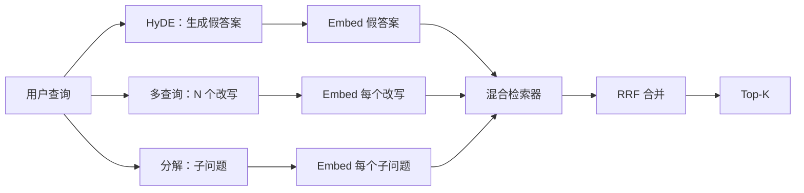

# 查询重写：HyDE、多查询与分解

> 用户输入的查询不是检索器想要的查询。重写在检索之前架起桥梁，让索引看到更接近答案的东西。

**类型：** 构建型
**语言：** Python
**前置条件：** 阶段 11 第 04 课（embedding）、第 06 课（RAG）；阶段 19 B 轨道基础（课程 20-29）；阶段 19 第 64 和 65 课
**时间：** 约 90 分钟

## 学习目标

- 实现假设文档 Embedding（HyDE）：生成一个假答案，embedding 它，用那个向量而不是查询向量进行检索
- 实现多查询扩展：将一个查询重写为 N 个改写，逐一检索，用倒数排名融合合并结果
- 实现查询分解：将复杂问题拆分为子问题，逐一检索子问题，合并
- 在同一 fixture 上比较三种重写器，并解释每种策略何时胜出
- 连接一个模拟 LLM，产生确定性的、基于 fixture 的输出，使重写循环可以离线运行

## 问题

用户输入"当上传失败且预算用完时我们团队做什么？"。语料库中有一篇文档说"AbortMultipartOnFail 在上传失败时中止正在进行的 S3 多部分上传，并减少每个桶的重试预算"。查询和文档没有共享名词短语。BM25 漏检。双编码器将文档排第三或第四，因为查询向量落在 embedding 空间中偏向关于取消任务的文档而非中止上传文档的区域。课程 66 的两阶段重排序可以挽救位于 top-N 中的答案，但如果答案甚至没有进入 top-N，重排序器永远看不到它。

解决方法是让它接触检索器之前重写查询。2023 年的论文"Precise Zero-Shot Dense Retrieval without Relevance Labels"（Gao 等人）引入了 HyDE：让 LLM 写出会回答查询的文档，embedding 那个假设文档，用它的 embedding 作为检索向量。假设文档因为是用语料库的语气写的，所以落在 embedding 空间的正确区域。查询向量没有。

两个表亲技术与 HyDE 配对。多查询扩展（微软 GraphRAG 使用的术语）生成 N 个查询改写，逐一检索，然后合并。分解（在 2024 年 Stanford DSPy 工作中推广为"子查询分解"）将"当上传失败且预算用完时我们团队做什么"拆分为两个问题："上传失败时会发生什么"和"重试预算用完时会发生什么"。两次检索，一次合并结果，两个答案片段都可到达。

本课实现所有三种方法，并在同一 fixture 语料上运行它们。

## 概念



### HyDE 详解

HyDE 用 LLM 写的假设文档向量替换用户的查询向量。提示词很短：

```
You are a domain expert. Write a one-paragraph passage that answers the question
below. Use the same vocabulary and phrasing the documentation in this domain would
use. Do not refuse. Do not say you do not know.

Question: {user_query}

Passage:
```

作为事实答案，LLM 的答案是错误的，因为 LLM 不知道你的语料库。这没关系。检索器不在乎事实正确性，只在乎 token 分布。假设段落包含"abort"、"multipart"、"bucket"、"budget"这些词，因为这是关于这个主题的文档段落会说的。Embedding 那个段落。向量落在真实段落附近。

在生产中，你将假设文档限制在两到三句话。更长的假设文档收集更多噪声。更短的会丢失 HyDE 需要的词汇信号。

### 多查询扩展详解

生成用户查询的 N 个改写。最简单的提示词：

```
Rewrite the following question in {N} different ways. Each rewrite must preserve
the original intent. Number them 1 to {N}. Do not add explanations.
```

为每个改写检索 top-k。用 RRF 合并 N 个排序列表（与课程 65 相同的算法）。廉价、并行、确定性。

当用户的措辞是许多同样有效的提问方式之一时，多查询胜出，任何一个改写都会问得更好。当所有改写都同样糟糕时失败，因为原始查询以同样的方式糟糕。

### 分解详解

单次检索无法满足多面问题。分解让 LLM 将问题拆分为子问题，系统逐一检索子问题。提示词：

```
The following question may require information from multiple distinct topics.
Decompose it into a list of sub-questions. Each sub-question must be answerable
independently. If the question is already atomic, return it unchanged.

Question: {user_query}
```

逐一检索子问题。合并。分解是包含连词、多子句比较或两个不相关主题的问题的正确工具。对于原子问题来说是错误的工具；分解器在那里的工作是返回单一问题，不要编造子问题。

### 为什么三种都存在

三种方法是互补的。HyDE 弥合查询-语料库的 token 差距。多查询覆盖改写差异。分解覆盖多主题查询。生产系统运行所有三种方法，按查询选择策略（课程 69 的端到端系统展示了选择器）。

## 模拟 LLM

课程离线运行。模拟 LLM 是一个小的查找表，以用户查询为键，对未见过的查询有后备。查找表包含：

- 对于每个 fixture 查询：一篇写好的假设段落，三个改写，和一个分解
- 对于未知查询：确定性转换：取查询的内容词，通过同义词映射扩展它们，返回结果

模拟的形状才是重要的，不是数据。在生产中你将模拟换成真实的模型调用。检索器不变。

## 构建它

`code/main.py` 实现：

- `MockLLM` - 上述确定性替代品
- `HyDERewriter` - 调用 LLM 写假设文档，将重写输出作为 `RewriteResult` 返回，包含假设文本和检索器应使用的查询
- `MultiQueryRewriter` - 调用 LLM 生成 N 个改写，返回查询列表
- `DecomposeRewriter` - 调用 LLM 分解，返回子问题
- `retrieve_with_rewriter` - 接收一个重写器和一个检索器，运行重写，融合结果
- 一个演示，对 fixture 运行三种重写器，打印哪种策略首先返回黄金答案文档

检索器形状从课程 65 重用（混合 BM25 + 稠密）。融合是相同的 RRF。唯一的新形状是重写器接口，它很小。

运行它：

```bash
python3 code/main.py
```

输出是每策略排序和最终摘要。HyDE 在措辞不匹配的查询上胜出。多查询在改写差异的查询上胜出。分解在多主题查询上胜出。后备（无重写器）至少在三种之一上失败。

## 演示会隐藏的失败模式

**HyDE 幻觉出错的语料库特定标识符。** 模型编造了一个函数名。假设文档在正确文档上的 BM25 分数崩溃，因为编造的名称现在是一个高权重 token，不出现在索引中。限制假设文档的长度，并在融合中降低 BM25 的权重。

**多查询改写全部收敛。** 弱模型产生三个几乎相同的改写。N 次检索返回相同的 top-k。RRF 合并不比单次检索好。在重写提示词中添加明确的多元化指令，并用 Jaccard 检测重复。

**分解过度拆分。** 分解器将原子问题变成列表。所有检索返回同一文档但排名降低。合并比原始的更差。在扩展之前用"这些子问题是否足够不同"的检查来检测这一点。

**延迟倍增。** HyDE 花费一次 LLM 调用。多查询花费一次 LLM 调用生成 N 个改写，然后 N 次检索。分解花费一次 LLM 调用分解，然后 M 次检索。检索并行运行；LLM 调用是地板。

## 使用它

生产模式：

- 按查询长度进行每查询策略选择：原子短查询用多查询，复杂多子句查询用分解，行话重的查询用 HyDE
- 按查询哈希缓存重写器输出。许多查询会重复
- 将三种全部并行运行，用 RRF 将三个结果集融合成一个。成本是三次 LLM 调用和一次融合；质量是三种策略覆盖的并集

## 发货

课程 69 将此重写器阶段接在课程 65 的检索器和课程 66 的重排序器之前。课程 68 评估重写器为检索召回率带来的提升。

## 练习

1. 实现 RAG-Fusion（2024 年多查询变体），其中重写器的改写故意多元化，然后重排序步骤（课程 66）选择最终列表
2. 添加第四种策略：后退提示（让 LLM 问更一般的问题，在那个上检索，然后缩小）。在 fixture 上比较
3. 训练分解器识别原子查询，添加一个"问题是否是原子的"头。测量前后过度拆分率
4. 将模拟 LLM 替换为真实模型调用。测量每策略延迟
5. 每个重写添加置信度分数。丢弃低于阈值的重写。测量对召回率的影响

## 关键术语

| 术语 | 大家怎么说 | 实际含义 |
|------|-----------------|------------------------|
| HyDE | "假文档检索" | LLM 写出答案；embedding 并检索那个而不是查询 |
| 多查询 | "改写扩展" | 查询的 N 个重写；检索 N 次，用 RRF 合并 |
| 分解 | "子查询拆分" | 多主题查询拆分为子问题，分别检索 |
| 原子查询 | "单主题" | 不能在不编造子问题的情况下分解 |
| 后退 | "抽象查询" | 问更一般的问题，检索，然后缩小 |

## 延伸阅读

- Gao, Ma, Lin, Callan, "Precise Zero-Shot Dense Retrieval without Relevance Labels" (HyDE), 2023
- Microsoft Research, "Multi-Query Expansion for Retrieval"
- Stanford DSPy, "Subquery Decomposition for Multi-Hop QA"
- [LlamaIndex 查询转换文档](https://docs.llamaindex.ai/en/stable/optimizing/advanced_retrieval/query_transformations/)
- 阶段 11 第 07 课 - 高级 RAG 模式
- 阶段 19 第 65 课 - 这个重写器提供的检索器
- 阶段 19 第 68 课 - 测量重写器提升的评估