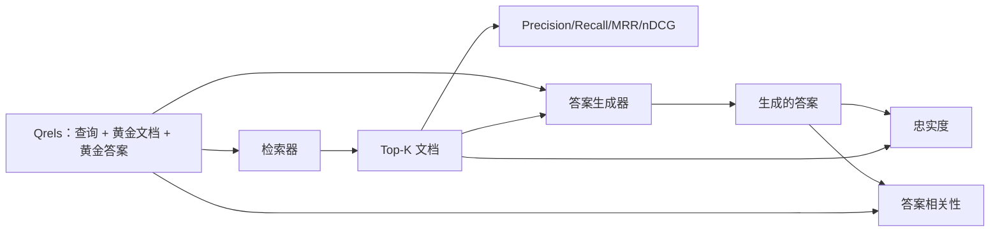

# RAG 评估：Precision、Recall、MRR、nDCG、忠实度、答案相关性

> 如果你不能同时对你的检索和答案打分，你就无法交付系统。两者不是同一个指标，同一个提示词会在不同轴上失败。

**类型：** 构建型
**语言：** Python
**前置条件：** 阶段 11 第 06 课（RAG）、第 10 课（评估）；阶段 19 B 轨道基础（课程 20-29）；阶段 19 第 64、65、66、67 课
**时间：** 约 90 分钟

## 学习目标

- 从黄金 qrels 计算四个检索指标：precision@k、recall@k、MRR（平均倒数排名）和 nDCG@k
- 计算两个答案评分指标：忠实度（每个声明都有检索上下文支持）和答案相关性（答案回答了问题）
- 构建一个 fixture qrels 文件（查询、黄金文档 id、黄金答案文本），评估端到端读取它
- 读取指标值来诊断 pipeline 哪里失败：检索、排序、生成还是 grounding

## 问题

RAG 系统至少有四个移动部件：分块器、检索器、重排序器、生成器。任何一者都可能是错误答案的原因。没有每阶段指标你就是瞎飞。

用户报告错误答案。是因为分块器切断了答案跨度？是因为检索器没有将块包含在 top-k 中？是因为重排序器将正确的块推过位置一？是因为生成器忽略了块并编造了东西？你不能仅从答案中判断。你需要：

- 检索指标来评估检索器输出的内容
- 排序指标来评估正确块在顺序中的位置
- 忠实度来评估生成器是否停留在检索到的上下文内
- 答案相关性来评估答案是否完全回答了问题

本课在 fixture qrels 文件之上构建所有六个指标。评估是离线和确定性的；在生产中你将模拟 LLM-as-judge 替换为真实的。

## 概念



### Precision@k

检索器返回的 top-k 文档中，有多少比例在黄金集中？如果黄金有三个文档，top-3 返回其中两个和一个错误的，precision@3 是 2/3。当检索到不相关块的成本高时使用 precision（生成器在上面浪费 token，或者块毒害答案）。

### Recall@k

黄金文档中，有多少比例在 top-k 中？如果黄金有三个文档，top-5 包含全部三个，recall@5 是 1.0。当错过答案的成本高时使用 recall（你宁愿看到一个额外的错误块也不要错过答案块）。

在生产 RAG 中人们通常引用的指标是 recall@k。生成可以轻易丢弃不相关块；它无法从一个从未见过的块中编造答案。

### MRR（平均倒数排名）

对于每个查询，在排序列表中找到第一个相关文档的位置。倒数排名是 1/位置。在查询集上取平均。MRR 是检索器将最佳答案放在首位的单数字总结。

MRR 严重加权位置-1。黄金文档排第一的查询贡献 1.0。排第二贡献 0.5。排第十贡献 0.1。该指标由列表顶部主导。

### nDCG@k

归一化折扣累积增益。完整公式为每个检索到的文档分配增益（通常相关为 1，不相关为 0），按位置的对数折扣，求和，再除以理想 DCG（如果你完美排序会得到的 DCG）。范围 0 到 1。

nDCG 容纳分级相关性：黄金可以说"文档 A 是 3，文档 B 是 2，文档 C 是 1"。MRR 和 recall@k 将一切扁平化为二元。当语料库中每个查询有多个部分相关的文档时使用 nDCG。

### 忠实度

对于生成的答案中的每个声明，检查该声明是否被检索到的上下文支持。标准实现使用 LLM-as-judge 提示词，接收（声明，上下文）并返回是或否。指标是通过的声明所占比例。

忠实度捕获生成器的失败模式，即模型编造内容。即使检索器返回了正确的块，如果生成器幻觉了，系统也是坏的。忠实度也称为 groundedness、support、attribution。

本课用确定性模拟 judge 实现忠实度，检查每个声明的 token 是否与检索到的上下文重叠超过阈值。在生产中你替换为真实的模型调用。指标的形状是相同的。

### 答案相关性

答案实际上回答了问题吗？忠实度问"答案是否有上下文依据？"。答案相关性问"答案是否有问题依据？"。忠实但离题的答案在忠实度上得分高，在相关性上得分低。忽略上下文的简短、切题的答案在相关性上得分高，在忠实度上得分低。

标准实现也使用 LLM-as-judge：接收（问题，答案）并问答案是否回答了问题。本课实现了一个 token 重叠加 judge 替代品。

## Fixture qrels

```python
{
  "qid": "q1",
  "query": "what is the abort threshold for multipart uploads",
  "gold_doc_ids": ["d1", "d3"],
  "gold_answer_substring": "three failed parts",
  "graded_relevance": {"d1": 3, "d3": 2},
}
```

每个查询携带：
- 查询字符串
- 一组黄金文档 id（用于 precision / recall / MRR）
- 一个分级相关性字典（用于 nDCG）
- 黄金答案子串（作为参考元数据保存在每个 qrel 上；本课中的忠实度是通过将提取的声明与检索到的上下文进行比较来评判的，而不是与此子串比较）

在生产中你标注这些。本课附带一个手工构建的 fixture，所以评估开箱即用。

## 构建它

`code/main.py` 实现：

- `precision_at_k(retrieved, gold, k)` - 字面定义
- `recall_at_k(retrieved, gold, k)` - 字面定义
- `mean_reciprocal_rank(retrieved_list_of_lists, gold_list)` - 在查询上的均值
- `ndcg_at_k(retrieved, graded_relevance, k)` - DCG / IDCG，带二元或分级增益
- `extract_claims(answer)` - 将答案拆分为句子形状的声明
- `faithfulness(claims, context_texts, judge)` - 被评判为支持的声明比例
- `answer_relevance(question, answer, judge)` - 评判答案是否回答了问题
- `MockJudge` - 确定性 token 重叠 judge，所以评估可以离线运行
- `evaluate_pipeline(pipeline_fn, qrels, ks)` - 运行每个指标的编排器
- 一个演示，对三个 pipeline 变体（分块器基线、混合检索、混合 + 重排序）在 qrels 上运行，并打印指标表

运行它：

```bash
python3 code/main.py
```

输出显示每个变体的 precision@k、recall@k、MRR、nDCG@k、忠实度和答案相关性在一个指标表中。混合检索行在召回率上优于分块器基线；重排序行在 MRR 上优于混合。

## 读取指标诊断失败

| 症状 | 可能原因 | 修复什么 |
|---------|-------------|-------------|
| 低 recall@k，低 precision@k | 分块器切断了答案或检索器找不到它 | 分块器边界（课程 64）或检索器模态（课程 65） |
| 可观的 recall@k，低 MRR | 正确块在 top-k 中但不在位置 1 | 重排序器（课程 66） |
| 高 MRR，低忠实度 | 生成器尽管有正确上下文仍编造内容 | 生成提示词；强制引用或拒绝 |
| 高忠实度，低相关性 | 答案有依据但离题 | 查询重写器（课程 67）或生成提示词 |
| 四个指标都高，用户仍抱怨 | 评估集不具代表性 | 用真实用户查询扩展 qrels |

## 演示会隐藏的失败模式

**LLM-as-judge 偏差。** 模型评判自己的输出比实际更忠实。使用与生成器不同的模型家族做 judge，或手工标注一个样本。

**Qrels 腐坏。** 黄金答案随着语料库变化而漂移。2024 年 1 月 q1 的黄金文档在 2024 年 10 月不再是正确答案，因为团队重命名了函数。安排每季度 qrels 审查。

**忠实度微观检查错过宏观声明。** 按句子的忠实度可以通过，而整体答案的结构具有误导性。在自动化指标之上添加样本级定性审查。

**Recall@k 掩盖每查询失败。** 90% 的平均召回率可能隐藏某一类查询总是漏检。按查询类（字面、改写、多主题）切片 qrels 并报告每切片指标。

## 使用它

生产模式：

- 在每次检索器或生成器更改时运行评估。将 recall@k 回归视为测试失败
- 持久化每个查询的指标追踪。当用户抱怨时，查找匹配的 qrel 条目，看它是否会被捕获
- 分层 qrels：20 个查询的冒烟集在 CI 中运行；200 个的回归集每晚运行；2000 个的深度集每周运行

## 发货

课程 69 连接整个 pipeline（分块器、检索器、重排序器、生成器）并在此评估上运行端到端系统。

## 练习

1. 添加第五个检索指标：hit-rate@k。与 recall@k 比较。解释它们何时不同
2. 实现分级忠实度：0（不支持）、1（部分支持）、2（完全支持）。相应更新指标
3. 用真实模型调用替换模拟 judge。测量模拟和真实 judge 在 fixture 上的分歧
4. 添加查询类切片（"字面"、"改写"、"多主题"）。报告每切片指标
5. 添加"答案长度"指标并将其与忠实度相关联。绘制曲线

## 关键术语

| 术语 | 大家怎么说 | 实际含义 |
|------|-----------------|------------------------|
| Precision@k | "检索到的命中率" | top-k 中黄金的比例 |
| Recall@k | "黄金的命中率" | top-k 中黄金的比例 |
| MRR | "首次命中位置" | 第一个相关文档的 1/rank 的均值 |
| nDCG@k | "分级排序质量" | top-k 的 DCG 除以理想 DCG |
| 忠实度 | "Groundedness" | 被检索上下文支持的答案声明比例 |
| 答案相关性 | "它回答了问题吗？" | 答案是否匹配问题的意图 |
| Qrels | "黄金标签" | 查询及其黄金文档和答案的标注集 |

## 延伸阅读

- Buckley, Voorhees, "Evaluating Evaluation Measure Stability", SIGIR 2000 - 排序指标的经典论文
- Jarvelin, Kekalainen, "Cumulated Gain-based Evaluation of IR Techniques" - nDCG 论文
- [Ragas：RAG Pipeline 的自动化评估](https://docs.ragas.io)
- [Anthropic, Evaluating RAG](https://www.anthropic.com/news/evaluating-rag)
- 阶段 11 第 10 课 - 评估框架基础
- 阶段 19 第 64-67 课 - 这里评估的组件
- 阶段 19 第 69 课 - 这个评估评分的端到端 pipeline