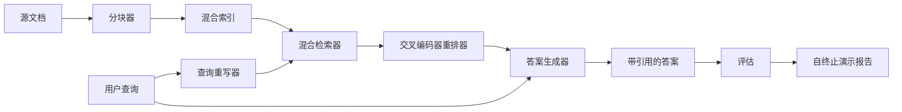

# 端到端 RAG 系统

> 六个组件课程，一条流水线，一个 eval 循环，一个自终止演示。这才是你要交付的系统。

**类型：** 构建型
**语言：** Python
**前置条件：** 阶段 11 第 06 课 (RAG)、第 10 课 (评估)；阶段 19 Track B 基础（课程 20-29）；阶段 19 第 64、65、66、67、68 课
**时间：** 约 90 分钟

## 学习目标

- 将分块器、混合检索器、查询重写器、交叉编码器重排器和答案生成器组合成一条端到端流水线。
- 实现一个能按分块锚点标注引用来源、并在低置信度时拒绝回答的答案生成器。
- 用第 68 课的评估标准对组装后的流水线进行评测，证明分阶段构建在各项指标上都优于各组件的独立运行。
- 构建一个自终止的 CLI 演示程序，摄取 fixture 语料库，运行一组固定查询，并在退出时输出汇总报告。

## 问题

六个组件各自独立运行什么都证明不了。分块器可以在语料库的 recall@5 上胜出，却因为检索器无法对分块器输出的内容正确排序而导致系统的 recall@5 下降。重排器可以在合成候选池上提升 MRR，却在真实的双编码器候选上失效，因为双编码器在重排预算下的召回率太低。查询重写器可以在单个查询上把 gold doc 排到前面，却在下一个查询上崩溃，因为 LLM mock 返回了退化的假设性答案。

集成测试是对整条流水线端到端运行同样的 fixture qrels、使用同样的指标、由一个编排文件把所有东西连接起来。这就是本课要构建的内容。如果集成流水线的指标胜过了每个阶段独立演示的指标，你就证明了整个系统的价值。

## 概念



### 连接选择

流水线是一张小图。每个阶段都是一个签名清晰的函数。

| 阶段 | 输入 | 输出 |
|-------|-------|--------|
| 分块器 | 文档文本 | Chunk 记录列表 |
| 检索器 | 查询字符串 | Top-N Chunk 记录 |
| 重写器（可选） | 查询字符串 | 重写列表 + 假设性答案 |
| 重排器 | 查询、候选 | Top-K Chunk 记录及交叉得分 |
| 生成器 | 查询、Top-K Chunk 记录 | 带引用的答案字符串 |

当每个签名都稳定时，组合是直接的。课程中的 `Pipeline` 类持有五个阶段，以及一个按顺序运行它们的 `query` 方法。每个阶段都是可替换的：传入不同的分块器、检索器、重写器、重排器或生成器，流水线仍然可以运行。

### 带引用的答案生成器

生成器是最后一个阶段，也是最容易出错的地方。课程附带了一个确定性 mock 生成器，它：

1. 接收排名靠前的 K 个重排后分块。
2. 选择最多两个与查询在内容词重叠度最高的分块。
3. 输出由每个选中分块的一句话拼接而成的答案，每句话后面跟一个 `[doc_id:chunk_index]` 锚点。
4. 如果没有分块的重叠度超过拒绝阈值，输出"I do not know"且不附带引用。

在生产环境中，你可以将 mock 替换为真正的 LLM 调用，使用以下提示模板：

```
You are answering a question using only the snippets below.
Cite every claim with the anchor in parentheses.
If the snippets do not answer the question, say "I do not know".

Question: {query}

Snippets:
{enumerated chunks with anchors}

Answer:
```

拒绝低置信度路径是记录交叉编码器 rank-1 分数的整个原因。如果该分数低于语料库阈值，生成器就会拒绝回答。这是防止幻觉答案的安全阀。

### 自终止演示

演示程序端到端运行所有内容。它打印一个查询的各阶段分解，对四个 fixture qrels 运行评估，打印指标表格，并在所有第 68 课指标达到演示中设定的阈值时以状态码零退出。如果任何指标低于阈值，演示以非零状态码退出，并输出失败指标的名称。

这是 CI 冒烟测试的形态。流水线离线运行、快速、确定性。阈值在 fixture 上故意设得很紧，以便六个课程中任何一个的回退都会导致演示失败。

## 构建它

`code/main.py` 实现了：

- `Chunk` - 在所有阶段间传递的记录（在第 64 课的 shape 基础上扩展了 chunk_index 和 source doc_id）。
- `Chunker` - 从第 64 课中选择分块策略（默认递归分割）。
- `HybridIndex` - 捆绑了第 65 课的 BM25 + dense + RRF。
- `Rewriter`（可选）- 根据查询长度和连词存在与否，从第 67 课中选择 HyDE、多查询或分解策略。
- `Reranker` - 第 66 课训练好的交叉编码器，使用更小的 fixture 训练集以便在几秒内收敛。
- `Generator` - 带引用和拒绝低置信度的确定性 mock 生成器。
- `Pipeline` - 用 `query(question)` 方法组合五个阶段，返回 `Result(answer, top_k, latency_ms_per_stage)`。
- `run_demo()` - 摄取语料库，运行三个 fixture 查询，运行评估，打印结果，按阈值设置退出码。

运行：

```bash
python3 code/main.py
```

输出为一个打印的查询追踪、完整评估表格和最终的通过/失败状态。在 fixture 上返回退出码 0。

## 演示会隐藏的失败模式

**分块器边界漂移。** 如果在 eval qrels 标注过程和演示之间切换了分块策略，gold doc id 就无法再对上。在 qrels 文件中锁定分块器策略。演示包含一个命名分块器的头部。

**重排器训练集泄露到评估中。** 第 66 课中的 14 个训练三元组包含与评估查询相似的查询。在生产中，要严格分离评估查询。演示的评估查询与重排训练集故意不重叠。

**Mock 生成器掩盖幻觉风险。** Mock 不会产生幻觉，因为它只输出检索到的分块中的文本。课程指出了这一点，并指明了生产替换路径。

**不支持流式输出。** 流水线在每个阶段结束时返回完整答案。生产系统会流式传输生成器的输出。流式输出不在本课范围内；答案级指标无论是否流式都工作在最终字符串上。

**延迟是离线的。** Mock LLM 调用是固定时间的。真正的 LLM 调用才是大头。在请求范围内规划延迟预算；本课的各阶段计时只测量 CPU 工作。

## 使用它

生产模式：

- 将流水线文件作为一个编排器交付，明确阶段接口。避免在代码库中分散连接逻辑。
- 每次修改阶段的合并前都运行评估。如果评估下降，则不合并。
- 持久化每个 CI 运行的指标追踪，以便将回退归因到阶段切换。
- 添加一个 20 个查询的冒烟集（回归集的子集），在 30 秒内运行；完整回归集每晚运行。

## 交付它

本课的流水线文件是阶段 19 后续 Track F 课程所假设的形态。后续课程将在此基础上添加摄取自动化、增量重索引、遥测和服务层。检索、重排、重写和评估各半部分在这里已经完成。

## 练习

1. 在重写器内部添加按查询的策略选择器：来自第 67 课的启发式规则（长度、连词、行话比率）选择 HyDE、多查询或分解。
2. 在 env 标志后面为生成器添加真正的 LLM 调用。默认为 mock。测量延迟差异。
3. 扩展演示以接受 `--corpus path` 标志来加载真实语料库。重新运行评估和阈值检查。
4. 为分块器添加 `--strategy` 标志。测量每个策略对端到端召回率的贡献。
5. 添加流式生成器接口并将其接入评估。确认忠诚度是在最终字符串上计算，而不是在流式前缀上。

## 关键术语

| 术语 | 大家怎么说 | 实际含义 |
|------|-----------------|------------------------|
| 流水线 (Pipeline) | "RAG 流水线" | 从摄取到带引用答案的组合阶段 |
| 引用锚点 (Citation anchor) | "来源链接" | 附加在每个声明上的 (doc_id, chunk_index) 引用 |
| 拒绝低置信度 (Refuse-on-low-confidence) | "我不知道" | 当重排器 top-1 分数低于阈值时生成器不返回答案 |
| 冒烟集 (Smoke set) | "CI 评估" | 在每个 PR 检查中运行的最小 qrels 子集 |
| 阶段接口 (Stage interface) | "函数签名" | 每个流水线阶段的稳定输入输出类型 |

## 延伸阅读

- [Anthropic, Building search and retrieval](https://www.anthropic.com/news/contextual-retrieval)
- [Pinterest, MCP internal search](https://medium.com/pinterest-engineering) - 参考生产架构
- [Ragas: Automated Evaluation of RAG Pipelines](https://docs.ragas.io)
- 阶段 11 第 06 课 - RAG 基础
- 阶段 19 第 64-68 课 - 这里组合的各个组件