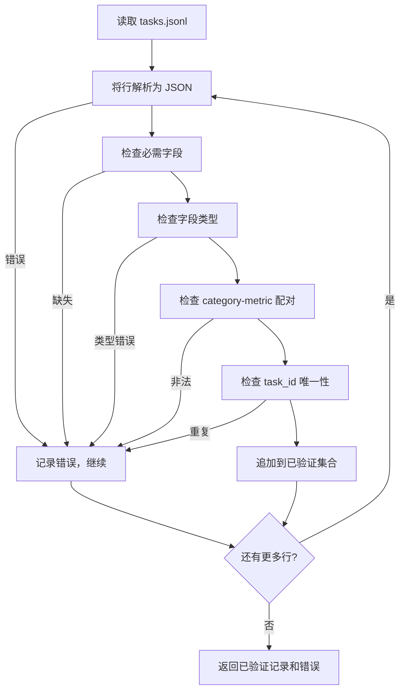

# 任务规范格式

> 评估工具链的价值取决于任务所遵守的契约。在你写任何一个评分函数之前，先冻结 JSONL 的 shape 和指标词汇表。

**类型：** 构建型
**语言：** Python
**前置条件：** 阶段 19 Track B 基础
**时间：** 约 90 分钟

## 学习目标

- 定义一个 JSONL 任务记录 schema，用同一种 shape 覆盖算术、选择题、代码执行、分类和自由文本摘要。
- 锁定一个封闭的指标名称词汇表，以便后续课程（71-73）能基于单一字段进行调度。
- 将少样本示例和后处理规则指定为任务的一部分而非运行器的一部分，使得同一提示在不同模型上产生相同目标。
- 实现一个严格的验证器，在记录到达运行器之前拒绝格式错误的记录。
- 交付一个 10 任务的 fixture 集，覆盖 spec 的每个分支，使验证器有真实的东西来处理。

## 为什么需要冻结规范

研究代码库积累评估脚本的速度会快于积累测试。六个月后，每个笔记本都有自己定义的 JSON shape，每个指标都被重新实现两次，跨运行比较变得不可能。修复方法很无聊。选一个 schema。写一个验证器。拒绝其他一切。这就是本课所做的。

这个 shape 借鉴了 BIG-bench、HELM 和 lm-eval 风格工具链的想法，但字段名是我们自己的。每个字段只有一个所有者。运行器读取任务。指标读取目标。后处理步骤规范化生成结果。管道中没有任何字段是可变的。

## 记录 shape

任务是一个 JSON 对象，位于单行上。工具链读取 `tasks.jsonl` 并独立验证每一行。一条坏记录中止该记录，而不是整个运行。

```json
{
  "task_id": "arith_001",
  "category": "arithmetic",
  "prompt": "Compute the result. Question: 17 + 24\nAnswer:",
  "targets": ["41"],
  "metric_name": "exact_match",
  "few_shot_examples": [
    {"prompt": "Question: 2 + 2\nAnswer:", "completion": "4"}
  ],
  "post_process": "strip_whitespace",
  "metadata": {"difficulty": "easy"}
}
```

必需字段是 `task_id`、`category`、`prompt`、`targets`、`metric_name`、`post_process`。`few_shot_examples` 和 `metadata` 是可选的。未知顶层字段会导致验证失败。

## 字段规则

`task_id` 是一个不含空白的字符串。验证器强制执行文件内的唯一性。

`category` 是以下之一：`arithmetic`、`mcq`、`code_exec`、`classification`、`summary`。category 约束了哪些指标和后处理对是合法的。`code_exec` 任务必须使用 `metric_name = code_exec`，`mcq` 任务必须对单字母目标使用 `metric_name = exact_match`。

`prompt` 是一个非空字符串。验证器禁止尾随空白，并拒绝在 prompt 正文中已包含少样本块的记录。少样本渲染在运行器中进行，而非由作者完成。

`targets` 是一个非空字符串列表。对于 `exact_match`，任意元素匹配即算正确。对于 `f1` 和 `rouge_l`，得分最高的 target 获胜。对于 `mcq`，列表恰好持有一个元素。

`metric_name` 是以下之一：`exact_match`、`f1`、`bleu_4`、`rouge_l`、`accuracy`、`code_exec`。词汇表是封闭的。新指标需要新课程并在此添加新条目。

`few_shot_examples` 是一个 `{prompt, completion}` 对的列表。验证器将列表上限设为 8 个条目，以保持提示长度有限。

`post_process` 是以下之一：`none`、`strip_whitespace`、`lower`、`extract_letter`、`extract_code_block`、`extract_first_line`。每个规则有单一确定性行为。验证器禁止组合规则。

## 验证器行为



验证器返回两个列表：已验证记录和错误记录（包含出错的行、违反的规则和出错的字段）。除非设置了明确的 `--allow-bad-tasks` 标志，否则当错误列表非空时运行器拒绝启动。

## 少样本渲染

运行器在提示前面拼接少样本示例，用空行分隔。同样的代码路径对每个模型都运行，因此方差的唯一来源是模型本身。作者写一次示例，而非每个 provider 写一次。

```python
def render(task):
    parts = []
    for ex in task.get("few_shot_examples", []):
        parts.append(ex["prompt"] + " " + ex["completion"])
    parts.append(task["prompt"])
    return "\n\n".join(parts)
```

## 后处理规则

后处理步骤在生成之后、指标计算之前运行。它是确定性的且无状态的。

- `none` 原样返回字符串。
- `strip_whitespace` 去除首尾空白。
- `lower` 将字符串转为小写。
- `extract_letter` 返回第一个匹配 `[A-E]` 的字符，用于 MCQ。
- `extract_code_block` 返回第一个三反引号围栏代码块的主体，用于代码执行。
- `extract_first_line` 返回第一个非空行，用于摘要分类。

如果一个任务需要的规则超出此列表，应归入新课程。

## 本课不做什么

本课不评分。不调用模型。不运行代码。这些出现在课程 71、72 和 75 中。本课冻结的是所有这些课程都遵守的契约。

这 10 个任务的 fixture 覆盖了两个算术题、两个 MCQ 题、两个代码执行题、两个分类题和两个摘要题。验证器全部通过。另一个 fixture（`tasks_bad.jsonl`）触发每条规则，验证器返回恰好相应数量的错误。

## 如何阅读代码

`main.py` 定义了 `TaskSpec`、`validate_task`、`validate_file` 和 CLI 入口点。Fixture 加载器是 `load_fixtures`。渲染和后处理辅助函数与验证逻辑放在一起，以便第 75 课的运行器只需导入一个模块。

从上到下阅读 `main.py`。然后阅读 `code/tests/test_spec.py`。测试固定了每条验证规则和每种后处理行为。`main.py` 底部的演示验证了捆绑的 fixture 并打印汇总。

## 进一步探索

真正的评估套件以与 schema 增加列相同的方式增加 category。明智的做法是拒绝在不同时添加指标、后处理规则和至少一个 fixture 任务的情况下添加 category。把规范当作数据库迁移来对待。每项更改都要经过审查、版本控制并附带测试。本课的验证器就是这道门。