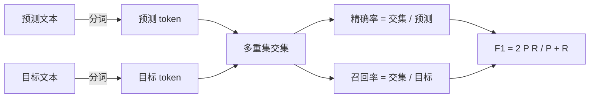
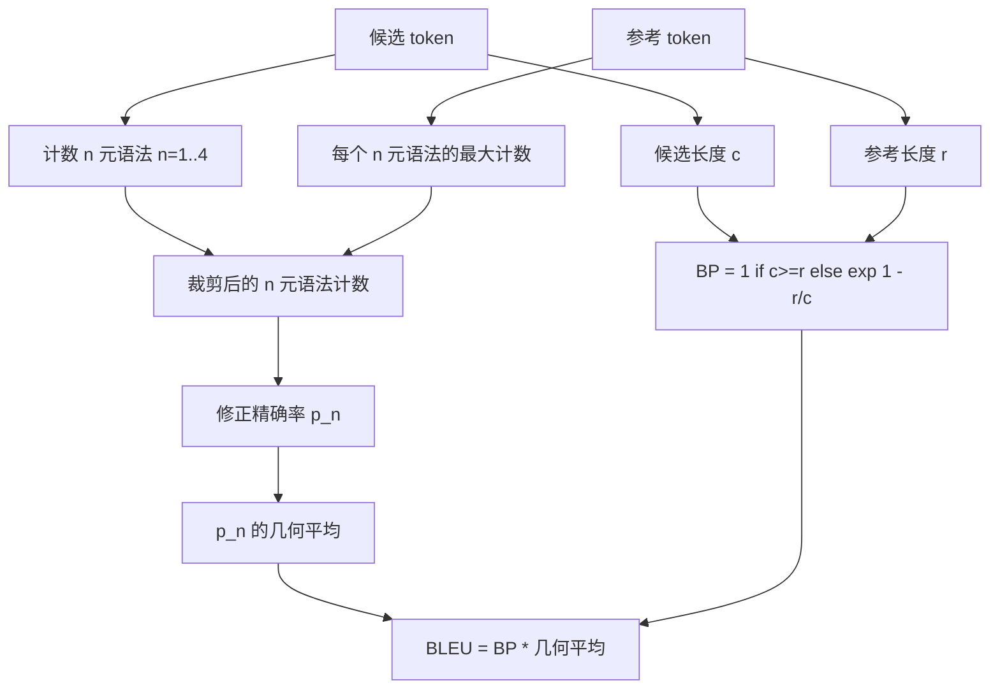

# 经典指标

> BLEU、ROUGE-L、F1、精确匹配、准确率。五个仍然占据了大多数已发布 LLM 评估数字的指标。从第一性原理实现每个指标，这样你才知道那个数字意味着什么。

**类型：** 构建型
**语言：** Python
**前置条件：** 阶段 19 Track B 基础，课程 70
**时间：** 约 90 分钟

## 学习目标

- 实现带显式分词规则的词级精确匹配、F1 和准确率。
- 从零实现 BLEU-4：修正 n 元语法精度、n 从 1 到 4 的几何平均、简短惩罚。
- 使用最长公共子序列实现 ROUGE-L，结合精度的 F-beta 组合与召回率。
- 基于课程 70 中的 metric_name 字段进行调度，使运行器保持指标无关。
- 用来自详尽示例的参考向量来固定行为，而非来自第三方库。

## 为什么要重新实现

你会看到论文报告 BLEU 28.3，也会看到另一篇报告 BLEU 0.283。你会发现两个库之间的 ROUGE-L 分数相差十分，因为一个将结果截断到小写而另一个没有。停止困惑的最快方法是自己写这些指标，然后指向分词器决定的那一行以及平滑应用的那一行。之后，跨论文比较数字就成了阅读指标设置的问题，而非争论库的问题。

标准库加 NumPy 就够了。BLEU 就是计数和一个 clamp。ROUGE-L 就是动态规划。F1 是 token 上的集合交集。最难的部分是选择分词器并坚持使用它。

## 分词

分词器是 `re.findall(r"\w+", text.lower())`。小写、字母数字连续片段、丢弃标点。本课中每个指标都使用这个确切的分词器。运行器没有选择权。如果你换了分词器，你就是在运行一个不同的基准。

```python
TOKEN_RE = re.compile(r"\w+", re.UNICODE)
def tokenize(text):
    return TOKEN_RE.findall(text.lower())
```

这是一个刻意的简化。生产环境会关心 CJK、缩写和代码标识符。本课的重点是分词器是一份契约，而非一个旋钮。

## 精确匹配

```python
def exact_match(pred, targets):
    return float(any(pred.strip() == t.strip() for t in targets))
```

它对每个任务返回 1.0 或 0.0。在数据集上的聚合就是平均值。这是算术、MCQ 和短分类任务的主力指标。

## 词级 F1

为预测和目标设置 token 多重集。精确率是多重集交集除以预测的多重集。召回率是同样的交集除以目标的多重集。F1 是调和平均。实现处理了空预测和空目标的边缘情况。



对于多目标任务，我们取目标列表上的最佳 F1。这匹配了文献中广泛报道的 SQuAD 风格行为。

## BLEU-4

BLEU 是标准的机器翻译指标，仍然出现在摘要工作中。我们使用的公式是语料库级 BLEU-4，附带标准简短惩罚和在修正 n 元语法计数上的加一平滑，这样单个缺失的 4 元语法不会把分数打到零。

对于每个候选-参考对，我们计算 n 等于 1、2、3、4 的修正 n 元语法精确率。修正精确率将候选 n 元语法计数裁剪到任意参考中该 n 元语法的最大计数，这样候选就不能通过重复一个短语来虚高分数。四个精确率的几何平均由简短惩罚包裹。



平滑规则是 Lin 和 Och 所说的方法 1：在取对数之前，给每个 n 元语法精确率的分子和分母都加一。这样当参考没有匹配的 4 元语法时避免了 `log 0`，并且在长候选上保持接近未平滑的值。

## ROUGE-L

ROUGE-L 比较候选和参考 token 序列的最长公共子序列。LCS 捕获词序而不强制连续性，这就是它成为默认摘要指标的原因。我们用标准动态规划表计算 LCS 长度，然后导出召回率 `lcs / 参考长度`、精确率 `lcs / 候选长度`，并用 beta 等于一的对称 F1 形式组合。

```python
def lcs_length(a, b):
    n, m = len(a), len(b)
    dp = numpy.zeros((n + 1, m + 1), dtype=int)
    for i in range(n):
        for j in range(m):
            if a[i] == b[j]:
                dp[i+1, j+1] = dp[i, j] + 1
            else:
                dp[i+1, j+1] = max(dp[i+1, j], dp[i, j+1])
    return int(dp[n, m])
```

NumPy 表使实现清晰可读；纯 Python 列表也可以工作。选择 ROUGE-L 的任务每个任务付出 O(n m) 的代价。对于典型的摘要长度，这保持在毫秒以下。

## 准确率

对于多目标分类任务，准确率归约为对单一规范化目标的精确匹配。我们将其公开为一个独立函数，这样调度器可以基于 `metric_name` 调度，而无需在运行器内部进行字符串比较。

## 调度契约

单一入口点是 `score(metric_name, prediction, targets)`。它返回 `[0, 1]` 范围内的浮点数。运行器不在指标名称上分支。它将调用转交并写入结果。这就是课程 75 将粘合到课程 70 的任务规范的表面。

```python
def score(metric_name, pred, targets):
    if metric_name == "exact_match":
        return exact_match(pred, targets)
    if metric_name == "f1":
        return max(f1_score(pred, t) for t in targets)
    if metric_name == "bleu_4":
        return max(bleu4(pred, t) for t in targets)
    if metric_name == "rouge_l":
        return max(rouge_l(pred, t) for t in targets)
    if metric_name == "accuracy":
        return accuracy(pred, targets)
    raise ValueError(f"unknown metric_name: {metric_name}")
```

`code_exec` 在课程 72 中处理，并在那里插入调度器。

## 本课不做什么

本课不调用模型。除了课程 70 已有的后处理规则外，不对生成结果做进一步规范化。不计算置信区间。不做 BLEURT 或 BERTScore（那些需要模型，归入另一课程）。重点是地板：五个指标、一个分词器、一个调度表。

## 如何阅读代码

`main.py` 将每个指标定义为独立函数加上调度器。参考向量位于文件底部 `_reference_examples` 块中。演示对八个示例运行调度器并打印每个指标的分数。`code/tests/test_metrics.py` 中的测试固定了参考向量并压测每个边缘情况（空预测、空参考、无共享 token、精确匹配、重复短语裁剪）。

从上到下阅读 `main.py`。函数按复杂度排序。exact_match 和 accuracy 各一行。F1 六行。BLEU 和 ROUGE-L 是重头戏，它们包含了关于平滑规则和 LCS 递推的详细注释。

## 进一步探索

经典指标是必要的，但不够充分。它们奖励表面重叠而忽略语义。一旦你信任了经典地板，就在上面叠加基于模型的指标（BLEURT、BERTScore、GEval）。那是后续课程。现在：让这五个工作起来，用测试固定它们，你就拥有了一个可审计、快速且可复现的指标栈。