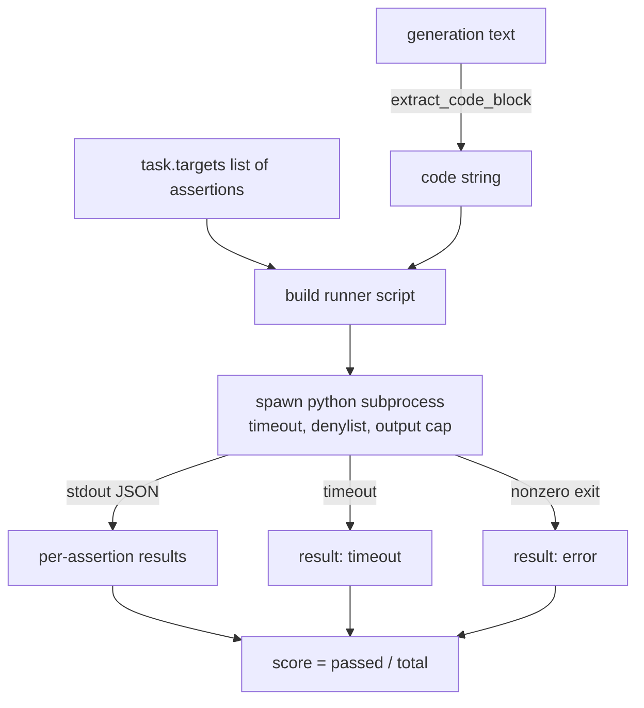
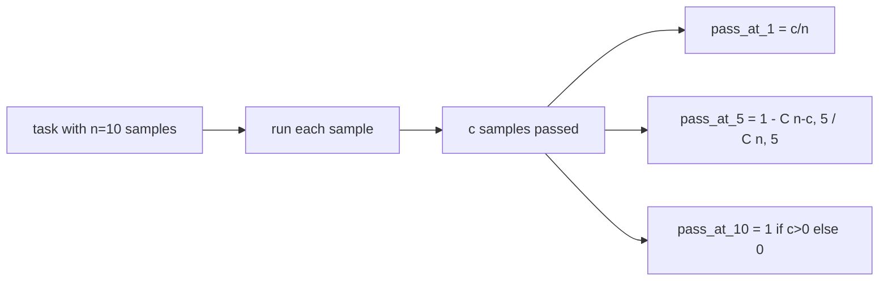

# 代码执行指标

> 生成的代码在通过测试时就是正确的。评估工具必须能够从生成内容中提取代码、在隔离进程中运行它，并诚实地统计通过率。本节课来构建这一层能力。

**类型：** 构建型
**语言：** Python
**前置条件：** 阶段 19 Track B 基础，课程 70 和 71
**时间：** 约 90 分钟

## 学习目标

- 从自由形式的生成内容中提取代码块，方式与课程 70 的后处理规则一致。
- 在隔离子进程中以 wall-clock 超时、输出上限和导入黑名单的方式执行候选项代码。
- 将任务得分计算为通过的对 supplied assertion 字符串的比例。
- 为采样了多个生成的候选项的任务计算 pass-at-k。
- 将沙箱崩溃、语法错误和超时作为一类失败模式，用不同的退出码记录，供运行器使用。

## 为什么要用隔离子进程

内联 `exec` 是安全和稳定性隐患。生成的 `while True: pass` 会永久阻塞评估。生成的 `import shutil; shutil.rmtree('/')` 造成的后果和听起来一样灾难性。解决办法是为每个候选项启动一个全新的 Python 解释器，通过 stdin 传入代码，将断言结果写入 stdout，如果超出时间就 kill 掉进程。主机评估进程继续运行。

HumanEval、MBPP、BigCodeBench 和 LiveCodeBench 等真实评估都使用子进程沙箱。有的在其上再封装一层 Docker。我们只用到子进程这一步是有原因的：它可移植、它是标准库，而且能捕获对教学评估真正重要的失败模式。生产部署会添加 seccomp、网络隔离和只读文件系统。下一课讲加固的内容不在本 track 内。

## 代码执行任务的形态

`code_exec` 任务在 `targets` 中携带 assertion 字符串。运行器从生成内容中提取一个带围栏的代码块，围绕它构建测试工具，然后运行结果。



得分是一个 `[0, 1]` 之间的分数。有三个断言且通过两个的任务得分为 0.667。无论哪种失败，运行器都返回相同的结构：子进程崩溃被映射为标准化的错误码，而不是 Python 追踪信息冒泡到 harness。

## 黑名单

黑名单基于导入。在运行候选项代码之前，运行器脚本将危险模块的导入重写为抛出 `ImportError("denied")` 的桩。该列表是刻意保守的：`os.system`、`subprocess`、`socket`、`requests`、`urllib`、`urllib.request`、`urllib.error`、`urllib.parse`、`ctypes`、`shutil`、`http.client`、`asyncio.subprocess`。

我们不会假装这是坚不可摧的。determined adversarial 代码可以逃逸 Python 中任何进程内沙箱。黑名单是最后防线。wall-clock 超时和输出上限才是承载控制量的部分。

```python
DENIED = {
    "os.system": True,
    "subprocess": True,
    "socket": True,
    "shutil": True,
    "requests": True,
    "urllib": True,
    "ctypes": True,
}
```

我们通过前置 `import sys` 和一个 guard 来包装候选项，该 guard monkey-patches `os.system` 使其抛出异常。完整的模板在 `main.py` 中。

## Wall-clock 超时

每个子进程都有三秒 wall-clock 的默认预算。运行器使用 `subprocess.run(..., timeout=t)`。如果超时触发，运行器捕获 `TimeoutExpired`，kill 掉进程，并为该任务记录 `timeout` 退出原因。该任务的得分为零。运行器继续下一个。

超时可以通过 `task.metadata.timeout_s` 按任务配置。长运行的单元测试可以请求更多时间；课程 70 的验证器将值上限设为三十秒，以保持套件有界。

## 输出上限

子进程可能 flood stdout，耗尽主机内存。运行器将 stdout 流式写入缓冲区，一旦运行总计超过 256 KB 就 kill 子进程。结果记录为 `exit_code = error`，详情字符串为 `"output overflow"`。这在实践中会出现，当生成代码意外写入一个打印内容的无限循环时。

## Pass-at-k

Pass-at-k 是 HumanEval 等使用的无偏估计量。给定每个任务 `n` 个独立样本，其中 `c` 个通过，从 `n` 中采样大小为 `k` 的样本至少包含一个通过方案的概率为：

```
pass_at_k(n, c, k) = 1 - C(n - c, k) / C(n, k)
```

当 `n - c < k` 时分子无定义，值为 `1`。实现直接处理这个边界情况。我们暴露 `pass_at_k(n, c, k)` 以供课程 74 的 leaderboard 层使用。



## 退出码

运行器为每个任务返回以下五种结果之一：

- `pass` 当所有断言都通过时。
- `assertion_fail` 当代码运行了但至少有一个断言失败时。
- `syntax_error` 当代码未能导入或存在 SyntaxError 时。
- `timeout` 当 wall clock 超期时。
- `error` 用于任何其他崩溃，包括黑名单命中和输出溢出（溢出时详情为 `"output overflow"`）。

得分仍然是分数。退出码是元数据。下游课程可以决定是将超时计为零还是计为缺失数据。

## 本节课不做什么

它不给你一个真正的沙箱。它不运行来自开放网络的不受信任的代码。它不处理有状态的任务，如文件 I/O 或网络调用。那些需要容器或 microVM。本节课的重点是契约：隔离子进程、黑名单、超时、输出上限、干净的退出码词汇表，以及 pass-at-k 数学。

## 如何阅读代码

`main.py` 定义了 `extract_code`、`run_candidate`、`score_code_exec` 和 `pass_at_k`。子进程运行器脚本被构建为字符串，并作为 `-c` 传递给全新的 Python 解释器。`code/tests/test_exec.py` 中的测试针对 HumanEval 风格的案例验证了四种退出码加上 pass-at-k。

从上到下阅读 `main.py`。运行器模板是承载的部分。盯着断言循环直到你能预测它写回父进程的 JSON 信封结构。

## 深入学习

一旦子进程形态工作起来，下一个关注点是可移植性。不同 Python 版本在 Windows 上对 SIGKILL 的处理不同。最干净的解决办法是把运行器放进 Docker 镜像。之后的下一步是用真正的单元测试文件替换 assertion 字符串，这样评估与生产 CI 所做的匹配。到那时不要再把 assertion 字符串称为测试；它们是玩具测试，有玩具式的失败模式。