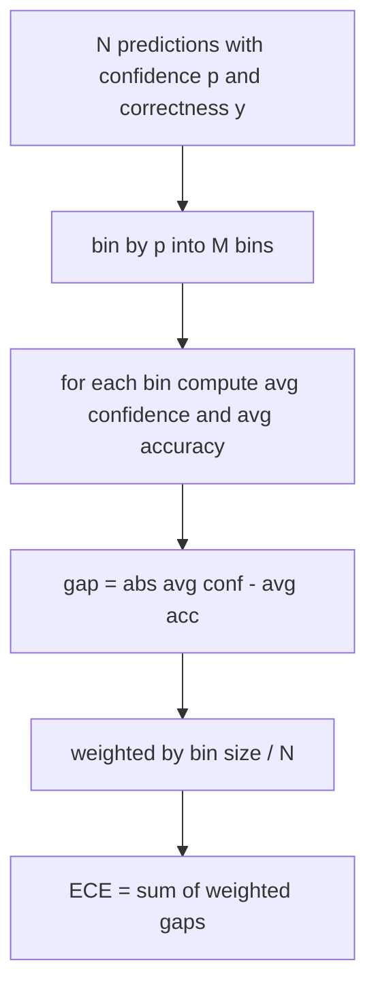
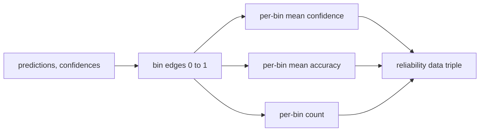

# 困惑度与校准

> 如果你的模型在一千个答案上声称 90% 置信度，却只答对了六百个，那它的校准就不好。校准是可信评估的半壁江山。另一半是困惑度，它告诉你模型是否认为留出的文本是可信的。

**类型：** 构建型
**语言：** Python
**前置条件：** 阶段 19 Track B 基础，课程 70 和 71
**时间：** 约 90 分钟

## 学习目标

- 根据模型适配器提供的 token 负对数概率，计算在留出语料库上的 token 级困惑度。
- 根据分箱预测概率，计算分类器或多选评估的期望校准误差（ECE）。
- 计算 Brier 分数（对正确性指示器的均方误差），并解释它在 ECE 不擅长的地方做什么。
- 构建可靠性图所需的数据，用于绘制置信度对准确率曲线。
- 将三者接入评估工具，使运行器能够将 `perplexity`、`ece` 和 `brier` 数值附加到模型报告上。

## 困惑度告诉你什么

困惑度是每个 token 的指数化平均负对数似然。越低越好。困惑度为 1 意味着模型给每个实际 token 分配的 probability 为 1。困惑度等于词表大小意味着模型是均匀的，什么都没学到。真实数字落在两者之间：2026 年的强基础模型在 WikiText-103 上约为 8 到 12。同上文本上的差模型在 50 以上。

harness 本身不计算对数概率。那些来自模型适配器。harness 做聚合：它接收每 token 对数概率列表、每个序列的 token 计数列表，返回语料库困惑度。

```python
def perplexity(neg_log_probs, token_counts):
    total_nll = sum(neg_log_probs)
    total_tokens = sum(token_counts)
    return math.exp(total_nll / total_tokens)
```

实现处理了零 token 边界情况，并断言负对数概率非负。一个常见错误是忘了取负：返回 `log p` 而不是 `-log p` 的适配器会产生小于 1 的困惑度，这是不可能的。函数将其作为契约违反捕获。

## ECE 衡量什么

期望校准误差将预测按置信度分入固定数量的箱，然后测量跨箱的平均置信度与准确率之间的差距，按箱大小加权。



标准公式在 `[0, 1]` 上使用十个等宽箱。实现支持任意正整数计数。我们暴露一个 `bins` 参数，这样运行器可以在发布惯例（10）和比较惯例（15）之间选择。

ECE 受箱数和样本量偏差。使用十个箱和一百个预测，你无法区分 0.02 的 ECE 和随机噪声。实现返回填充箱的数量以及 ECE，这样运行器可以在样本太少时拒绝报告单一数字。

## Brier 分数在 ECE 不擅长的地方做什么

ECE 只关心平均差距。在一半箱上过度自信而在另一半箱上不够自信的模型可能具有低 ECE，但在局部校准很差。Brier 分数对每个预测的真实结果测量平方误差，因此它直接惩罚分布。

对于二元结果，Brier 为 `mean((p_i - y_i)^2)`。它可分解为可靠性、分辨率和不确定性。我们计算分数和分解。运行器报告标量，但将分解记录到仪表板。

```python
def brier(p, y):
    return float(np.mean((p - y) ** 2))
```

## 可靠性图数据

可靠性图在每个箱中绘制预测置信度对经验准确率。对角线是完美校准。函数返回三个数组：每箱平均置信度、每箱平均准确率和每箱计数。绘图代码在下游；本节课止步于数据形态。



返回的元组是调用层绘制图表或计算自定义 ECE 变体（自适应 ECE、扫描 ECE 等）所需的。我们返回 numpy 数组，这样下游代码不需要转换。

## 置信度来源

harness 不假设置信度来自 softmax。它接受每个预测 `[0, 1]` 中的任意数字。对于多选任务，自然的置信度是 `选项对数似然的 softmax`。对于自由文本，自然的置信度是模型 self-reported 概率或平均对数似然的指数。评估只消费这个数字。它从哪里来是适配器的事。

## 边界情况

- 所有预测都错误：ECE 是平均置信度，Brier 很高，困惑度是模型对该文本的看法。
- 所有预测都正确且置信度高：ECE 接近零，Brier 接近零。
- 完美的不确定预测器在 p=0.5：ECE 是 0.5 减去准确率，Brier 是 0.25 减去一个校正项。
- 空输入：ECE、Brier 和 reliability 返回 `0.0`（或零填充数组）。困惑度对零 token 情况返回 `NaN`。这些路径都不发出警告；运行器检查值并决定是否报告或跳过。

这些情况被烘焙到测试中。真实模型在真实基准上不会遇到它们，但有 bug 的适配器或小样本会，而且运行器不应该崩溃。

## 分派

校准不是像 F1 这样的按任务指标。它是按模型报告。运行器在整个评估过程中累积 `(confidence, correct)` 对，并一次性计算 ECE、Brier 和可靠性数据。困惑度是在留出文本语料库上计算的，与逐任务的评分分开。

接口是：

```python
report = CalibrationReport.from_predictions(confidences, correct)
report.ece          # float
report.brier        # float
report.reliability  # tuple of three numpy arrays
report.populated_bins  # int
```

`PerplexityResult.from_token_nll(neg_log_probs, token_counts)` 返回困惑度和每个 token 的平均负对数似然。

## 本节课不做什么

它不调用模型。它不实现 softmax。它不从输出 token 估计置信度；那是适配器的事。它不做温度缩放或 Platt 缩放；那些是事后再修复的方法，属于另一节课。本节课的重点是让这三个数字（困惑度、ECE、Brier）可信且可复现。

## 如何阅读代码

`main.py` 定义了 `perplexity`、`expected_calibration_error`、`brier_score`、`reliability_diagram` 以及 `CalibrationReport` / `PerplexityResult` 数据类。演示在合成预测上运行，其中 ground truth 是已知的：一个校准良好的模型、一个过度自信的和一个不够自信的。`code/tests/test_calibration.py` 中的测试为每个边界情况以及合成预测器的参考值设置了 pin。

从上到下阅读 `main.py`。函数顺序是从标量到向量到报告。每个函数都有一个简短的 docstring，包含数学和契约。

## 深入学习

校准是发布评估中被忽视最多的轴。大多数 leaderboard 报告一个单一准确率数字就结束了。在准确率上获胜而在 Brier 上输掉的模型比准确率低几分但可靠报告其不确定性的模型是更差的生产部署。一旦你把校准管道搭建好，在留出的验证切片上添加温度缩放，重新计算 ECE，看看差距缩小。这是另一节课，但基础在这里。