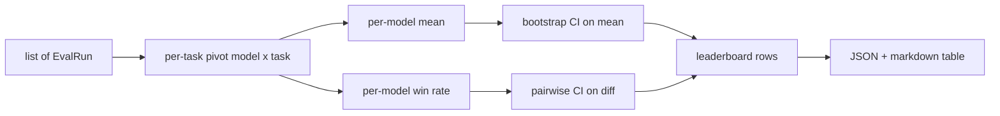
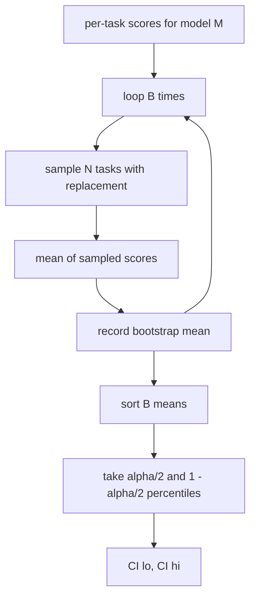

# Leaderboard 聚合

> 按任务得分容易。跨异构任务对模型进行排序难。在包含一千个预测的 leaderboard 上做统计显著性是每个人都跳过的那部分。本节课不跳过。

**类型：** 构建型
**语言：** Python
**前置条件：** 阶段 19 Track B 基础，课程 70、71、73
**时间：** 约 90 分钟

## 学习目标

- 跨多个模型和多个任务聚合按任务得分，整理成整洁的按模型行。
- 归一化异构得分，使通过率和 BLEU 值不会过度影响聚合结果。
- 按均值和按胜率对模型排序，并解释何时哪个是合适的总结。
- 计算每个模型均值和两两差异的 bootstrap 置信区间。
- 将 leaderboard 输出为 JSON 报告和 markdown 表格，供课程 75 的运行器粘贴到 CI 评论中。

## 输入的形态

聚合器消费一个 `EvalRun` 记录列表：

```python
@dataclass
class EvalRun:
    model_id: str
    task_id: str
    metric_name: str
    score: float          # in [0, 1]
    category: str
```

课程 75 的运行器为每个 `(model, task)` 对发出一行记录。聚合器不关心得分是如何产生的。它期望归一化已经发生：每个得分都在 `[0, 1]` 中。

## 输出

输出三张表：



Leaderboard 行包含：`model_id`、`mean_score`、`mean_ci_lo`、`mean_ci_hi`、`win_rate`、`tasks_completed`，以及一个可选的 `categories` 映射用于按类别均值。

## 归一化

如果一个任务得分在 `[0, 1]`，另一个在 `[0, 100]`，第二个会悄然主导均值。聚合器验证每个输入得分都在 `[0, 1]` 中，否则拒绝运行。修复在上游：metric 应该已经返回分数。课程 71 到 73 执行该契约。

## 均值和胜率

两种排序方案服务于不同目标。

均值得分是一个模型的按任务得分平均值。它是 leaderboard 报告的 headline 数字。它对异常值和任务不平衡敏感。

胜率计算一个模型在同一个任务上击败其他所有模型的次数。对于每个任务，得分最高的模型获胜（平局 split）。胜率等于获胜次数除以该模型有得分的任务数。它对异常值和规模差异不那么敏感，但丢失了信息。

```python
def win_rate(model_id, runs_by_task, all_models):
    wins, total = 0, 0
    for task_id, runs in runs_by_task.items():
        scores = {r.model_id: r.score for r in runs if r.model_id in all_models}
        if model_id not in scores:
            continue
        total += 1
        best = max(scores.values())
        if scores[model_id] >= best:
            wins += 1
    return wins / total if total else 0.0
```

harness 报告两者。课程 75 的运行器默认按均值排序；markdown 列中包含胜率，以防用户偏好它。

## Bootstrap 置信区间

每个模型均值带有一个由 bootstrap 重采样（跨任务）估计的置信区间。我们带放回地对任务 ID 重采样，计算重采样集的均值，重复 `B` 次，然后取 level `alpha` 的百分位置信区间。



对于两两比较，我们 bootstrap 按任务差异 `score_A - score_B`，取百分位置信区间，并报告它。用户可以读出区间是否包含零。如果包含，则差异在 alpha 水平上显著。如果不包含，leaderboard 将模型视为平局。

低级 helper（`bootstrap_mean_ci`、`bootstrap_pairwise_diff`）默认为 `B=1000`；公共聚合器（`aggregate`、`pairwise_diffs`）默认为 `b=500`，这样演示和测试保持快速。默认 alpha 是 0.05。本节课保持 bootstrap 为纯 numpy，没有 scipy。

## 类别

如果设置了 `EvalRun.category`，聚合器还报告按类别均值。这是每个 leaderboard 上写着 `math`、`reasoning`、`code`、`safety` 的列。它让运行器发现一个模型总体良好但在 code 上薄弱，这是 headline 均值隐藏的信息。

## Markdown 渲染

Leaderboard 渲染为 markdown 表格：

```text
| Rank | Model | Mean | 95% CI | Win rate | Tasks |
|------|-------|------|--------|----------|-------|
| 1    | gpt   | 0.78 | 0.74-0.82 | 0.62 | 50 |
| 2    | claude| 0.75 | 0.71-0.79 | 0.34 | 50 |
| 3    | random| 0.10 | 0.07-0.13 | 0.04 | 50 |
```

表格按均值得分排序。CI 渲染为两位小数。长 model id 截断为二十个字符。

## 本节课不做什么

它不运行模型。它不调用 metric 层。它不实现自适应 ECE 或其他校准变体；那些是课程 73。它不实现任务加权。每个任务在这里计数相同。生产 leaderboard 对任务加权；我们通过 `weight` 字段保持这个钩子开放但在聚合器中忽略它。如果需要，在后续课程中添加加权。

## 如何阅读代码

`main.py` 定义了 `EvalRun`、`LeaderboardRow`、`aggregate`、`bootstrap_mean_ci`、`bootstrap_pairwise_diff` 和 `render_markdown`。演示构建了三个模型和十二个任务的合成套件，聚合，并打印 leaderboard 以及两两差异表。`code/tests/test_leaderboard.py` 中的测试为 bootstrap、markdown 渲染、胜率边界情况和空输入行为设置了 pin。

从上到下阅读 `main.py`。数据形态（EvalRun、LeaderboardRow）在前，聚合器其次，bootstrap 第三，渲染最后。每个函数都有一个聚焦的契约。

## 深入学习

自然的下一步是配对任务显著性而不是非配对 bootstrap。如果模型 A 和 B 都跑了相同的一百个任务，适当的检验是按任务差异的配对 bootstrap，我们实现了。除此之外，你需要尊重任务族的层次 bootstrap（数学问题之间不独立；一个算术错误模式影响其中十个）。那是后续内容。本节课的重点是把底限做好，这样评估报告的数字是你可以捍卫的。