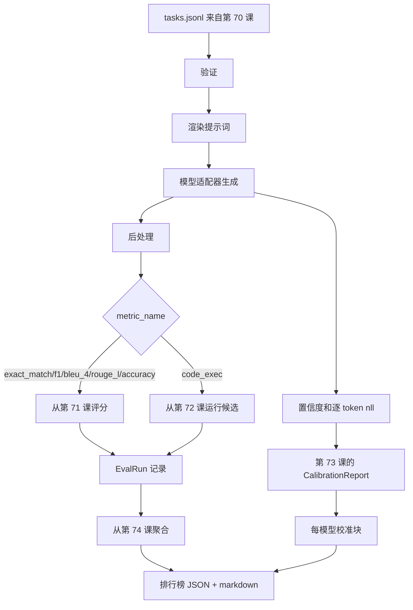

# 端到端评测运行器

> 五节管道路具课，一节胶水课。运行器从第 70 课读取任务规格，通过适配器调用模型，用第 71 和 72 课评分，附上第 73 课的校准报告，并输出第 74 课的排行榜。演示程序自行终止。

**类型：** 构建
**语言：** Python
**前置条件：** 阶段 19 B 轨道基础，第 70 至 74 课
**时间：** 约 90 分钟

## 学习目标

- 定义一个 `ModelAdapter` 接口，任何模型（mock、本地、API）只需极小量的方法就能满足。
- 通过线程池并行执行任务，对 fixture JSONL 文件进行评测。
- 在一次遍历中组合度量层（exact_match、F1、BLEU-4、ROUGE-L、code_exec）与校准层。
- 发出每个模型的 `EvalRun` 记录，并直接送入排行榜聚合器。
- 输出 JSON 报告和 markdown 表格；干净运行时以退出码零自终止，验证或运行时失败时非零退出。

## 管道



运行器是集成点。第 70 至 74 课各自拥有一个模块，运行器组合它们。运行器不复制任何来自这些模块的逻辑：它只是导入它们。

## 适配器接口

适配器是运行器和任意模型之间的接缝。接口设计得很小。

```python
class ModelAdapter:
    model_id: str

    def generate(self, prompt: str, task: TaskSpec) -> Generation: ...
```

`Generation` 是一个数据类，包含：

- `text`：模型的自由形式输出
- `confidence`：`[0, 1]` 范围内的浮点数，表示模型对答案的自我报告概率
- `token_nll`：生成 token 的负对数似然之和（可选）
- `token_count`：生成的 token 数（可选）

运行器中的 mock 适配器提供三种风格：`RuleBasedAdapter`（确定性、近乎完美）、`NoisyAdapter`（过度自信、经常出错）和 `BiasedAdapter`（擅长某一类，极差于另一类）。演示程序对第 70 课的 fixture 运行所有三种。

## 并行执行

运行器使用 `concurrent.futures.ThreadPoolExecutor` 在每个模型上并行运行任务。工作线程数默认为 8 和任务数中的较小值。线程足够用，因为真实模型调用的瓶颈是网络 I/O。代码执行路径在任务内部生成自己的子进程，执行器只负责调度等待。

对于确定性测试，运行器暴露 `run_eval(adapters, tasks, parallel=False)`，以便测试固定执行顺序。

## 一次遍历评分循环

对每个任务：

1. 渲染提示词（少样本前缀加提示词主体）。
2. 调用适配器并计时。
3. 根据任务的规则对生成结果进行后处理。
4. 分发到度量层。
5. 用分数和度量元数据构建 `EvalRun` 记录。
6. 将 `(confidence, correct)` 对追加到校准缓冲区。

`correct` 信号：对于 exact_match 风格的度量（`exact_match`、`accuracy`、`code_exec`），阈值为 `score >= 1.0`；对于分级度量，阈值为 `score >= 0.5`。阈值位于 `_correct_from_score`，运行器不暴露公共覆盖。

## 聚合

每个任务都有结果后，运行器调用第 74 课的 `aggregate` 和 `pairwise_diffs`，以及第 73 课的 `CalibrationReport.from_predictions`。输出是一个 JSON 信封：

```json
{
  "leaderboard": [...],
  "pairwise": [...],
  "calibration": {
    "model_id_a": {"ece": 0.04, "brier": 0.10, "populated_bins": 8, ...},
    ...
  },
  "summary": {
    "tasks": 10,
    "models": 3,
    "wall_seconds": 1.2
  }
}
```

运行器还将 markdown 表格写入 stdout，以便用户粘贴到 PR 审查中。

## 自终止演示

演示程序对第 70 课的十个 fixture 任务运行三个 mock 适配器。墙上时间应低于十秒。干净运行时退出码为零。

干净运行的标准：

- 每个任务通过第 70 课验证。
- 每个任务通过第 71 和 72 课评分。
- 排行榜将基于规则的适配器严格排在随机适配器之上。

其中任何一条破裂，运行器都以非零退出码退出，并在 JSON 信封中写入结构化错误。

## 本课不做什么

它不调用真实模型。它不实现 API 密钥流程或速率限制处理。它不实现流式传输或部分生成；适配器每次调用返回一个生成。它不做重试或缓存。这些关注点存在于适配器层；运行器是度量无关和提供商无关的。

## 如何阅读代码

`main.py` 是集成。它通过一个小的 `_load_sibling` 辅助函数导入其他五个课程模块（按相对路径解析）。数据类 `Generation`、`EvalReport` 和 `ModelAdapter` 在本地定义。mock 适配器在文件底部。

自上而下阅读 `main.py`。浏览导入，然后看 `run_eval`，再看 `_score_one`，最后看适配器。末尾的演示是入口点。

`code/tests/test_runner.py` 中的测试固定了适配器接口、一次遍历循环、并行与顺序执行的等价性、校准缓冲区和 JSON 信封形状。

## 进一步拓展

运行器是地板。一个生产评测系统需要添加：按 `(task_id, model_id, model_version)` 键控的结果缓存、跟踪每次运行美元和 token 数的成本账本、在速率限制时退避的重试层、用于 pass@k 任务的采样策略，以及长测试套件的流式输出格式。每一个都是单一关注点，包装运行器而不改变度量或聚合层。这种分离是合约的意义。

让 mocks 工作后，为真实提供商添加适配器。选一个有免费层的，写三十行胶水代码，看排行榜亮起来。然后加第二个提供商，让工具链干活。