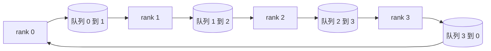

# 从零实现集合通信原语

> 维持分布式训练的四个集合通信原语是 allreduce、broadcast、allgather 和 reduce_scatter。训练框架提供的其他所有原语都是这些的包装。先在 `multiprocessing.Queue` 网格上构建一遍，针对参考实现验证，之后课程中的其余部分就都是管道路具了。

**类型：** 构建
**语言：** Python
**前置条件：** 阶段 19 C 轨道第 42-49 课
**时间：** 约 90 分钟

## 学习目标

- 实现环形 allreduce（两遍：reduce-scatter 然后 allgather），证明每个 rank 的通信量为每元素 2(N-1)/N 字节。
- 在 `multiprocessing.Queue` 上的点到点发送之上构建 broadcast、allgather 和 reduce_scatter。
- 针对同一输入的 `torch.distributed` gloo 参考实现验证每个原语。
- 从集群形状、延迟底噪和带宽上限捍卫环形与树形拓扑的选择。

## 问题

朴素的 N rank allreduce 将 tensor 发送 N 次到根节点，再广播 N 次回来。每个 rank 的带宽为 O(N)，根节点成为瓶颈，墙上时间下限是最慢链接乘以 N。环形 allreduce 将其扁平化为 2(N-1) 个大小为 T/N 的块，因此每个 rank 的字节数降到独立于集群大小的 2T(N-1)/N。树形 allreduce 在小 N 和高延迟链路上获胜，因为深度是 log2(N) 跳而不是 2(N-1)。为集群形状选了错误的拓扑，最慢的 GPU 决定了每步时间。

你在本课程中读到的每个分布式训练框架都依赖这四个原语。PyTorch DDP 通过每个参数桶一次 allreduce 同步梯度。ZeRO 通过 reduce_scatter 分片优化器状态，通过 allgather 广播更新后的参数。FSDP 将完整前向转为 allgather 加 reduce_scatter。流水线并行需要 broadcast 来跨阶段组传递激活。如果你不能实现四个集合通信，你就无法推理训练为何停滞、梯度不匹配为何出现在 rank 3、或者流水线气泡为何在切换拓扑时翻倍。

## 概念



### 环形 allreduce 两遍

将 tensor 分割成 N 个等大小的块，索引 0..N-1。每个 rank 拥有等于其 rank 的块索引。第一遍，reduce-scatter，运行 N-1 步。在第 s 步，rank r 将块 (r - s) mod N 发送到 rank (r + 1) mod N，并从 rank (r - 1) mod N 接收块 (r - s - 1) mod N，将接收到的块累加到本地副本。经过 N-1 步后，rank r 拥有块 r 的完整和。第二遍，allgather，再运行 N-1 步，将完成的块围绕环旋转，直到每个 rank 持有每个块的完整和。

| 原语 | 每 rank 字节数 | 步数 | 使用场景 |
|-----------|---------------|-------|-------------|
| 环形 allreduce | 2T(N-1)/N | 2(N-1) | 大 T，胖管道同构集群 |
| 树形 allreduce | T log2(N) | 2 log2(N) | 小 T 或高延迟链路 |
| Broadcast | T | log2(N) 树 | 参数初始化，标量配置 |
| Allgather | T(N-1)/N | N-1 | 分片前向，ZeRO 未分片 |
| Reduce_scatter | T(N-1)/N | N-1 | ZeRO 梯度分片 |

### 队列网格作为 NCCL 的替代品

NCCL 通过 PCIe 和 NVLink 运行，硬件卸载归约。在 CPU 上你没有那个。每个环边缘一个 `multiprocessing.Queue` 给你有序的点到点传递，单生产者单消费者。归约发生在用户空间，所以你付 Python 开销，但线路模式与 NCCL 环形 allreduce 相同。在队列版本上推理正确性，集群行为随之而来。

### 针对 gloo 验证

每个原语都附带一个单元测试，针对同一 tensor 在同一世界大小上用 gloo 后端初始化的 `torch.distributed` 比较输出。如果你的环形 allreduce 与 gloo 偏差超过 float32 epsilon，测试失败。针对参考实现验证是不可商量的；没有它，原语看起来正确，直到真实训练的第 10000 步。

## 构建

`code/main.py` 实现：

- `Mesh` 类：将 N 个 `multiprocessing.Queue` 实例连成环，并按 rank 暴露 `send(dst, tensor)` 和 `recv(src)`。
- `ring_allreduce(mesh, rank, world_size, tensor)`：运行两遍算法。
- `broadcast(mesh, rank, world_size, tensor, src)`：基于对数树。
- `allgather(mesh, rank, world_size, tensor)`：使用 N-1 次旋转。
- `reduce_scatter(mesh, rank, world_size, tensor)`：作为 allreduce 的前半部分。
- `_gloo_reference(op, world_size, tensor)`：通过 gloo 运行相同输入的 `torch.distributed`，用于字节级相等比较。

运行：

```bash
python3 code/main.py
```

输出：按原语列出的验证表，比较队列网格和 gloo 输出，随后是每个 rank 的字节计数器，证明 2T(N-1)/N 的扩展性。

## 生产中的模式

三个模式足以让原语 hardened 到可以发布。

**allreduce 前先 bucket 梯度。** 1B 参数模型有数万个梯度 tensor。每个 tensor 一次 allreduce 付 N 倍延迟地板。DDP 将梯度 bucket 成约 25 MB 块，每 bucket 一次 allreduce；小 tensor 搭大 tensor 的便车。没有 bucket，延迟开销主导每步。

**计算与通信重叠。** 反向按反向顺序逐层计算梯度。最后一层梯度就绪的时刻，踢出它的 allreduce，同时下一层继续计算。PyTorch DDP 通过 bucket-ready 钩子连线。当网络有空闲时，重叠使可见通信时间减半。

**按消息大小选环形或树形，而非按教条。** NCCL 内置拓扑检测器，对大于约 1 MB 的消息选环形，对小于的选树形。交叉点是带宽对延迟：大于 1 MB，带宽项 2T(N-1)/N 占主导，环形胜；小于 1 MB，log2(N) 跳数胜。硬编码一种拓扑在错误的消息大小上损失吞吐量。

## 使用

生产模式：

- **PyTorch DDP。** 在反向后对 bucket 化梯度调用 `dist.all_reduce`。bucket 大小可调；默认 25 MB 对 100Gbit 以太网合理。
- **DeepSpeed ZeRO。** 发出 reduce_scatter 分片梯度，allgather 在前向之前重建完整参数。本课原语正是 ZeRO 发出的调用。
- **FSDP。** 前向以 allgather 未分片层开始，计算，然后用 reduce_scatter 归约并丢弃未分片。原语相同，调度不同。

## 发布

将队列网格原语用于第 77-81 课。第 77 课将 allreduce 接入 DDP。第 78 课将 reduce_scatter 接入 ZeRO。第 79 课将 broadcast 接入流水线激活。第 81 课将四个原语组合成端到端演示。

## 练习

1. 添加树形 allreduce 变体，按消息大小在环形和树形之间切换。测量交叉点。
2. 添加 `recv_timeout_ms`，以便卡住的 rank 抛出截止时间错误而不是永远挂起。
3. 用 TCP 套接字替换 `multiprocessing.Queue` 实现四个原语。同样的测试，真正的线路。
4. 添加带宽检测钩子，使每个 rank 的字节计数器记录到 JSONL。
5. 在 4 个 rank 上比较环形与树形的墙上时间，tensor 大小分别为 1KB、1MB、16MB。用经验数据捍卫交叉点。

## 关键术语

| 术语 | 大家怎么说的 | 实际含义 |
|------|----------------|------------------------|
| Allreduce | "跨 rank 求和" | 调用后每个 rank 持有相同的归约后的 tensor |
| Ring | "快速拓扑" | N-1 个大小为 T/N 的块围绕环流动两圈 |
| Tree | "对数拓扑" | 归约沿二叉树进行；深度为 log2(N) 跳 |
| Allgather | "拼接分片" | 每个 rank 最终持有每个其他 rank 的分片 |
| Reduce_scatter | "分割求和" | 每个 rank 最终只持有一个块的求和 |
| Bucket | "融合小 tensor" | 将 N 个小 allreduce 合并成一个大 |

## 进一步阅读

- [PyTorch Distributed: NCCL 集合通信](https://pytorch.org/docs/stable/distributed.html#collective-functions)
- [Horovod 环形 allreduce 论文](https://arxiv.org/abs/1802.05799)
- [NCCL 拓扑和算法选择](https://docs.nvidia.com/deeplearning/nccl/user-guide/docs/index.html)
- [Patarasuk and Yuan，带宽最优 allreduce 算法](https://www.cs.fsu.edu/~xyuan/paper/09jpdc.pdf)
- 阶段 10 第 05 课 - 分布式训练概述
- 阶段 19 第 77 课 - 在这些原语之上接入 DDP