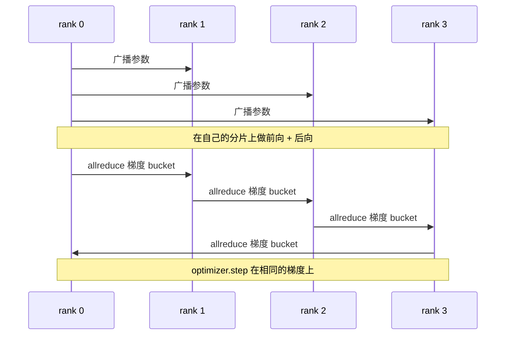

# 从零实现数据并行 DDP

> DistributedDataParallel 是 allreduce 之上的钩子。包装一个模型，从 rank 0 广播初始参数使每个 rank 从相同状态开始，在每个参数上安装一个后向钩子发出梯度 allreduce，其余就是梯度下降。整个模式约 200 行。

**类型：** 构建
**语言：** Python
**前置条件：** 阶段 19 C 轨道第 42-49 课
**时间：** 约 90 分钟

## 学习目标

- 接入一个 `DistributedDataParallel` 形状的包装器，在构造时广播参数，在后向之后 allreduce 梯度。
- 用 `torch.multiprocessing.spawn` 通过 gloo 后端和基于文件的集合 spawn N 个 CPU rank。
- 通过在同一数据上顺序训练相同模型来证明梯度同步正确性，并显示每步参数等价。
- 捍卫 bucket（梯度融合）和 overlap（后向期间通信）作为将可用 DDP 变成生产级 DDP 的两个关键变化。

## 问题

一个带 12 GB 激活的 10 亿参数模型无法塞进一块消费级 GPU。即使塞得下，训练也要几周。数据并行将 batch 分到 N 个 rank，每个 rank 在自己的分片上计算前向和后向，每一步结束时所有 rank 的梯度求和，使 N 个副本保持一致。求和后的梯度才是优化器踩的东西。

没有梯度同步，N 个副本在第 2 步就发散。模型不再是"用更多数据训练的一个模型"，而是 N 个恰好共享初始权重的独立模型。梯度同步做得很烂（每个参数一次 allreduce，无 overlap，无 bucketing），网络成为瓶颈，GPU 在线缆上空转等待。DDP 的手艺是使梯度同步相对于计算几乎免费。经典的 PyTorch DDP 通过梯度 bucket、让 allreduce 与下一层的后向重叠、以及在 NVLink 上使用 NCCL 实现这一点。我们可以在 CPU 上用 gloo 做这三件事，学习同样的教训。

## 概念



### DDP 需要的三个操作

| 阶段 | 集合通信 | 为什么 |
|-------|-----------|-----|
| 初始化 | 从 rank 0 broadcast | 每个 rank 以相同的参数开始 |
| 后向之后 | 每个梯度一次 allreduce | 平均梯度才是优化器踩的 |
| 有时 | buffer 的 broadcast | Batchnorm 运行统计保持同步 |

### 为什么是均值而不是求和

Allreduce-SUM 除以 world_size 得到平均梯度。均值对 world_size 不变：在一个 rank 上调好的学习率在四个 rank 上同样有效，因为每步梯度幅度不变。Allreduce-SUM 不除以 world_size 迫使你每次改变集群大小时重新调学习率。DDP 包装 SUM 并除以；课程里也一样做。

### 为什么 bucket 梯度

一个 transformer 有数万个参数 tensor。每个 tensor 一次 allreduce 付 gloo 延迟地板数千万次。DDP 将梯度分组为约 25 MB bucket，每 bucket 一次 allreduce。总量相同的字节在线上传输，但延迟被 bucket 摊销。对于课程里的小模型，我们将所有东西放入一个 bucket；结构是跨过去的部分。

### 为什么固定随机种子

每个 rank 对 shuffle 调用 `torch.manual_seed(seed + rank)`，对参数 init 调用 `torch.manual_seed(seed)`。单一共享种子意味着每个 rank 看到相同的 batch 顺序（破坏了数据并行）；rank 特定的种子用于参数意味着初始参数按 float epsilon 不一致，梯度同步不再使副本相同。把种子模式做对，否则参数等价的测试在第 1 步就失败。

## 构建

`code/main.py` 实现：

- `MiniMLP`：3 层 MLP，小到能在秒级收敛，大到能暴露接线。
- `DistributedDataParallel(model, world_size)`：在构造时广播参数，返回一个包装器，其 `sync_grads` 将累加的 allreduce 求和梯度除以 world_size。
- `worker(rank, world_size, ...)`：完整训练循环，通过 gloo 初始化 `torch.distributed`，前向、后向、同步、踩步。
- `_reference_single_process_loop(...)`：在单个 rank 上对相同数据顺序训练相同模型，供测试使用，在每步后字节级相等参数等价验证。

运行：

```bash
python3 code/main.py
```

输出：逐步训练表，比较单进程损失和参数校验和与 DDP 在 4 个 rank 上的运行。两条路径产生到 float epsilon 相同的损失曲线，证明梯度同步正确。

## 生产中的模式

三个模式足以让 DDP hardened 到可以发布。

**找到未使用的参数。** 某些前向路径有条件地跳过参数（早退出、MoE 路由器）。跳过的参数没有梯度，但 DDP 的 bucket-ready 钩子仍等待它们，归约时 allreduce 死锁。`find_unused_parameters=True` 告诉 DDP 在归约前检查哪些参数获得了梯度。代价是每步一次图遍历，所以除非你的前向分支，否则关闭它。

**静态图优化。** 当前向在步之间稳定时，`static_graph=True` 让 DDP 预计算 bucket 调度。优化在规模上重要：预计算每步节省几毫秒，在 10000 步上复合。

**梯度累积需要小心。** 在不同步不同步的 K 个微批次上累积梯度是 10 倍吞吐量提升。DDP 暴露 `no_sync()` 作为上下文管理器，暂停后向 allreduce。忘记这个管理器，你就 K 次 allreduce 白做了；吞吐量跌到地板。

## 使用

生产模式：

- **PyTorch DDP。** 经典实现。`torch.nn.parallel.DistributedDataParallel(model)` 接入 bucketing、overlap 和 no_sync 上下文。
- **HuggingFace Accelerate。** 添加处理 `torchrun` 环境变量和模型包装的启动器。底层是同样的 DDP。
- **Megatron-LM 数据并行。** 将 DDP 与张量并行结合用于大模型；数据并行部分是同样的 allreduce-后向模式。

## 发布

第 78 课（ZeRO 分片）用 reduce_scatter 替换 per-parameter allreduce，使每个 rank 只存储自己那份优化器状态。第 81 课将 DDP 与 ZeRO 组合成端到端演示。

## 练习

1. 添加可配置大小的梯度 bucket，测量相对于每参数一次 allreduce 的加速。
2. 实现 `no_sync()` 作为上下文管理器，并验证梯度累积在 K 个微批次上匹配单进程基线。
3. 添加 `find_unused_parameters` 模式，其中前向有时跳过 MLP 层之一；没有该标志运行应死锁。
4. 用 `torch.distributed.barrier()`-only 同步替换 gloo，感受 allreduce-based 和 barrier-based 同步的区别。
5. 测量梯度同步开销占步时间的比例，batch 大小为 1、16、256，并解释扩展。

## 关键术语

| 术语 | 大家怎么说的 | 实际含义 |
|------|----------------|------------------------|
| DDP | "数据并行" | 广播参数并每步 allreduce 梯度的包装器 |
| Bucket | "融合梯度" | 将 N 个小 allreduce 合并成一个大 |
| Overlap | "隐藏通信" | 在后续层仍计算后向时发出 allreduce |
| no_sync | "累积" | 跳过后向 allreduce 用于梯度累积 |
| find_unused | "分支前向" | 归约前检测没有梯度的参数 |

## 进一步阅读

- [PyTorch DistributedDataParallel 文档](https://pytorch.org/docs/stable/generated/torch.nn.parallel.DistributedDataParallel.html)
- [PyTorch DDP 内部教程](https://pytorch.org/tutorials/intermediate/ddp_tutorial.html)
- [Li et al, PyTorch Distributed: Experiences on Accelerating Data Parallel Training](https://arxiv.org/abs/2006.15704)
- 阶段 19 第 76 课 - DDP 所基于的集合通信原语
- 阶段 19 第 78 课 - ZeRO 分片用 reduce_scatter 替换 per-param allreduce