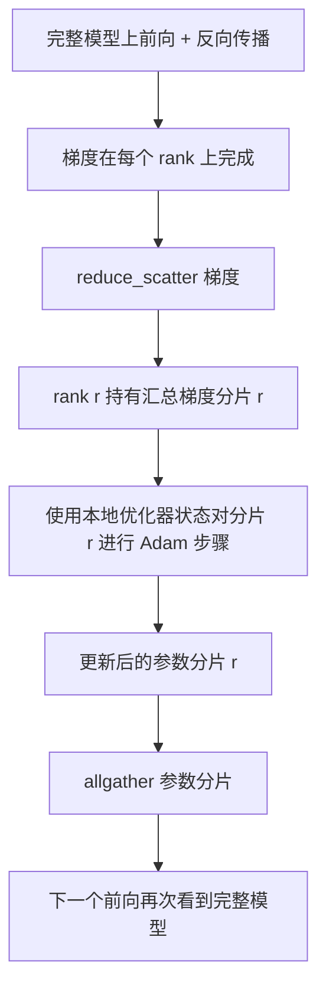

# ZeRO 优化器状态分片

> Adam 为每个参数存储两个矩估计值，均为 float32。一个 7B 参数的模型携带 56 GB 的优化器状态。ZeRO 阶段 1 将其分片到 N 个 rank；每个 rank 拥有 1/N 的优化器。本地步骤完成后更新的参数分片广播回来，每个 rank 重建完整模型，下一步开始。收益是训练栈中最大单次分配的内存线性下降。

**类型：** 构建型
**语言：** Python
**前置条件：** 阶段 19 C 轨道课程 42-49
**时间：** 约 90 分钟

## 学习目标

- 将优化器状态（一阶矩、二阶矩、fp32 主副本）分片到 N 个 rank，使每个 rank 拥有 1/N。
- 使用 reduce_scatter 向每个 rank 仅交付其分片的梯度总和，然后使用 allgather 广播更新后的参数分片。
- 计算阶段 1、阶段 2、阶段 3 相对于 vanilla DDP 的内存节省表。
- 根据模型大小和带宽预算论证阶段 1 vs 阶段 2 vs 阶段 3 的选择。

## 问题

Vanilla DDP 复制一切：参数、梯度和优化器状态在每个 rank 上都是完整存在的。对于一个采用 fp16 的 7B 参数模型，这意味着每个 rank 有 14 GB 参数、14 GB 梯度和 28 GB 优化器状态。优化器状态是最大项，也是最容易分片的，因为它只在 step 阶段被访问，不在前向或反向传播中。

ZeRO 阶段 1 对优化器状态进行分片。每个 rank 持有 1/N 的 Adam 矩。反向传播后，ZeRO 不是全reduce 完整梯度并在本地 step，而是 reduce_scatter 使每个 rank 仅接收其分片的汇总梯度。该 rank 将优化器步骤应用到其主参数分片上。然后更新后的参数分片 allgather 回来，使每个 rank 在下一个前向时拥有完整模型。优化器内存下降 N 倍。每步的通信量与 DDP 相同：一次 reduce_scatter 加一次 allgather 等于一次 allreduce（按带宽计）。内存赢了，吞吐量保持。

## 概念



### ZeRO 的阶段

| 阶段 | 分片内容 | 每 rank 内存 | 每步通信 |
|-------|----------------|------------------|---------------|
| DDP | 无 | params + grads + optim | 1x allreduce |
| ZeRO-1 | 优化器状态 | params + grads + optim/N | 1x reduce_scatter + 1x allgather |
| ZeRO-2 | optim + grads | params + grads/N + optim/N | 1x reduce_scatter + 1x allgather |
| ZeRO-3 | optim + grads + params | params/N + grads/N + optim/N | 每层 1x allgather + 每层 1x reduce_scatter |

阶段 1 是最便宜的收益，因为优化器状态占预算主导地位。阶段 2 需要梯度分片累积逻辑，但带宽相同。阶段 3（FSDP）为每个前向和反向支付每层通信，获得参数分片内存下降。本课程完整实现阶段 1。

### 内存数学，实际数字

对于采用 Adam 混合精度训练的 P 个参数的模型：

| 项 | Vanilla | ZeRO-1 | 原因 |
|------|---------|--------|-----|
| fp16 参数 | 2P 字节 | 2P 字节 | 前向需要 |
| fp16 梯度 | 2P 字节 | 2P 字节 | 反向需要 |
| fp32 主副本 | 4P 字节 | 4P/N 字节 | 只有优化器使用 |
| fp32 一阶矩 | 4P 字节 | 4P/N 字节 | 只有优化器使用 |
| fp32 二阶矩 | 4P 字节 | 4P/N 字节 | 只有优化器使用 |
| 总计 | 16P 字节 | 4P + 12P/N 字节 |   |

在 N=8 时：vanilla 16P，ZeRO-1 5.5P，下降 65%。在 N=64 时：vanilla 16P，ZeRO-1 4.19P，下降 74%。

### 为什么 reduce_scatter 胜过 allreduce-then-shard

Allreduce 给每个 rank 完整的汇总梯度。如果你只需要分片 r，被 reduce 的 (N-1)/N 梯度在 rank r 上被浪费了。Reduce_scatter 仅交付每个 rank 拥有的分片；每 rank 字节数与 allreduce 相同（因为 allreduce 是 reduce_scatter + allgather），但第二半被后续的参数分片 allgather 替换。净通信量与 DDP 相同，内存被分割。

## 构建它

`code/main.py` 实现：

- `flatten_params(module)` 和 `unflatten_into(module, flat)` 将模型的参数打包到一个连续张量中并解包回去。扁平布局使按 rank 分片成为一个简单的切片操作。
- `ZeroOptimizer(model, world_size, rank, lr)` 拥有主副本和 Adam 矩的 rank 分片。
- `step()` 对扁平梯度运行 reduce_scatter，将 Adam 应用于 rank 的分片，并将更新的参数 allgather 回来。
- 一个演示，训练一个 3 层 MLP 进行 20 步，并打印每步内存预算以及 vanilla DDP 基线。

运行它：

```bash
python3 code/main.py
```

输出：每步损失以及内存表，显示 ZeRO-1 在每个 rank 上持有 1/N 的优化器状态，而 DDP 是完整副本。

## 生产环境中的模式

三个模式使 ZeRO 足够坚固可以交付。

**分片检查点很重要。** ZeRO-1 的优化器状态跨 rank 分割；检查点必须记录哪个 rank 拥有什么。第 80 课构建分片检查点清单，用于在相同 world size 上恢复 ZeRO 运行。没有它，保存的状态在重启时无法读取。

**混合精度是关键。** ZeRO 是一种混合精度技术；fp32 主副本是被分片的内容。在没有混合精度的情况下运行 ZeRO 会支付 fp32 主副本的内存税，而没有相应的 fp16 前向收益。生产运行始终将 ZeRO 与 autocast 或 bf16 权重配对。

**阶段 1 是一个近乎免费的收益。** 通信量按带宽计与 DDP 相同。内存节省随 N 线性增长。唯一代价是优化器分片的簿记工作。生产栈默认为阶段 1，除非参数分片内存也是问题；然后阶段 2 或 3 以通信换内存。

## 使用它

生产模式：

- **DeepSpeed ZeRO。** 参考实现。`deepspeed_config.json` 选择阶段 1/2/3 和分区大小。
- **PyTorch FSDP。** PyTorch 原生等价物。`ShardingStrategy.SHARD_GRAD_OP` 是 ZeRO-2；`FULL_SHARD` 是 ZeRO-3。
- **HuggingFace Accelerate。** 在统一配置下包装 DeepSpeed 和 FSDP。

## 交付它

第 79 课（流水线并行）是正交分片轴：不是跨相同模型分片优化器状态，而是将层跨 rank 分片。第 81 课在端到端演示上组合 DDP + ZeRO。

## 练习

1. 通过分片梯度扩展到 ZeRO-2：每个 rank 仅存储其分片的梯度，方法是在反向传播后将非分片部分归零。
2. 添加一个内存分析器，打印 rank 0 上的实际 fp32 字节使用量与公式预测的对比。
3. 测量 vanilla DDP 与 ZeRO-1 的每步墙钟时间，并分解为前向、反向、通信。
4. 在 ZeRO-1 下实现梯度裁剪：L2 范数必须通过对本地范数平方的 allreduce 跨所有分片计算。
5. 实现一个"朴素 ZeRO"，使用 allreduce 而不是 reduce_scatter，测量通信时间差异。用数字论证 reduce_scatter 的选择。

## 关键术语

| 术语 | 大家怎么说的 | 实际含义 |
|------|----------------|------------------------|
| ZeRO-1 | "分片优化器" | 每个 rank 持有 1/N 的 fp32 主副本 + Adam 矩 |
| ZeRO-2 | "也分片梯度" | 每个 rank 在 reduce_scatter 后也丢弃非分片梯度 |
| ZeRO-3 | "分片参数" | 每个 rank 持有 1/N 的 fp16 参数；每层前向时 allgather |
| Master copy | "fp32 权重" | 优化器更新的高精度参数副本 |
| Reduce_scatter | "分割和" | 仅向每个 rank 交付其分片的汇总梯度 |

## 延伸阅读

- [Rajbhandari et al, ZeRO: Memory Optimizations Toward Training Trillion Parameter Models](https://arxiv.org/abs/1910.02054)
- [DeepSpeed ZeRO 文档](https://www.deepspeed.ai/tutorials/zero/)
- [PyTorch FSDP 文档](https://pytorch.org/docs/stable/fsdp.html)
- 第 19 课第 76 节 - 本课所依赖的 reduce_scatter 和 allgather
- 第 19 课第 80 节 - ZeRO 状态必须使用的分片检查点