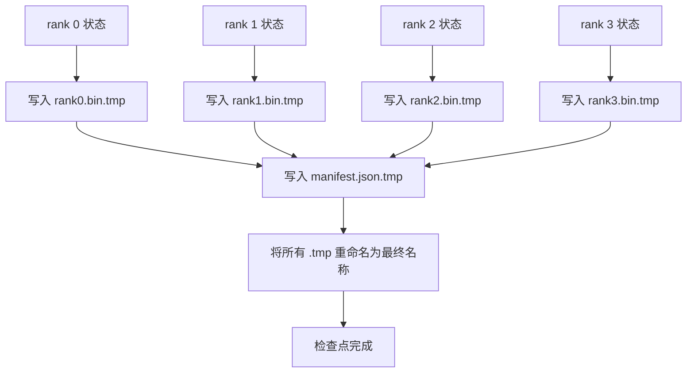

# 分片检查点与原子恢复

> 一个 70B 参数的训练任务每隔几小时就会因节点故障而暂停。检查点格式决定你是损失 30 分钟还是 30 小时。分片检查点并行写入每个 rank 的分片，并在清单中记录所有权。恢复从清单加载每个 rank 的分片，在相同的 world size 上重建状态，优化器步骤就像什么都没发生一样。原子写入防止写入一半的检查点毒害下一次恢复。

**类型：** 构建型
**语言：** Python
**前置条件：** 阶段 19 C 轨道课程 42-49
**时间：** 约 90 分钟

## 学习目标

- 将多 rank 检查点保存为每 rank 分片文件加上一份记录哪个 rank 拥有什么的清单。
- 使用原子写入模式（写入临时路径然后重命名），以便写入中间崩溃永远不会产生半完成的检查点。
- 从清单恢复，验证每个 rank 上 fp16 参数和 ZeRO 优化器状态的字节级相等状态。
- 论证清单模式抵抗三种失败模式：world size 改变、分片数量不匹配和部分写入。

## 问题

Vanilla 检查点将所有参数和优化器状态读入 rank 0，gather，然后写入单个文件。对于一个 70B 模型，那是 1.1 TB 的状态通过一个 rank 的网络端口。写入阻塞所有其他 rank，因为它们在等待 gather 时空闲。IO 带宽是最慢的单 GPU 网络链接，而不是聚合带宽。在真实集群上，gather-then-write 步骤可能比前一个训练小时花费更长时间，这意味着任务每天发送不到一个检查点。

分片检查点翻转模式：每个 rank 并行写入自己的分片到自己的文件。清单记录哪个 rank 拥有哪个分片，以便恢复时可以将每个分片放回原处。聚合写入带宽随集群扩展。一个通过 64 个 rank 从 1 小时通过 1 个 rank 变成 4 分钟的 1 TB 检查点。加上清单为你提供了不兼容恢复的契约：world size 改变可检测，部分写入可检测，负载路径可以大声失败而不是静默使用陈旧数据。

## 概念



### 清单模式

```json
{
  "world_size": 4,
  "step": 1234,
  "wall_clock_seconds": 4521,
  "shards": [
    {"rank": 0, "path": "rank0.bin", "sha256": "...", "param_shard_offset": 0, "param_shard_numel": 65536},
    {"rank": 1, "path": "rank1.bin", "sha256": "...", "param_shard_offset": 65536, "param_shard_numel": 65536}
  ],
  "schema_version": 1
}
```

三个字段是负载承重的。`world_size` 使在不同大小上恢复大声失败而不是静默损坏。每个分片的 `sha256` 捕获部分或损坏的写入。每个分片的 `param_shard_offset` 和 `param_shard_numel` 让加载器在正确位置重建扁平参数张量。

### 原子写入

标准模式：将每个分片写入 `<name>.tmp`，将清单写入 `manifest.json.tmp`，对每个执行 fsync，然后重命名。同一文件系统内的 POSIX rename 是原子的；要么新文件完全存在，要么旧文件存在。崩溃在最终重命名之前会留下先前的检查点作为活动文件。没有原子写入，崩溃可能留下带有存在清单的部分分片，清加载在恢复时损坏优化器状态。

### 模式必须抵抗的三种失败模式

| 失败 | 症状 | 防御 |
|---------|---------|---------|
| World size 改变 | 用 N=4 的清单在 N=8 上恢复 | 清单中 world_size 不匹配，大声失败 |
| 分片数量不匹配 | 恢复时看到的 rank*.bin 文件少于清单中的分片 | 枚举分片，验证每个都存在 |
| 部分写入 | 分片文件在刷新中途被截断 | 加载时 sha256 验证 |

每种防御都在早期拒绝错误的加载；替代方案是静默损坏，在损失变为 NaN 时 100 步后才会出现。

### 为什么是每 rank 文件，而不是一个大文件

通过 `O_APPEND` 并发写入一个文件在 POSIX 上对字节对齐写入有效，但在实践中一个分片内的偏移量跨越 MB 大小的区域，锁定占主导地位。每 rank 文件没有争用，并在底层文件系统并行时受益于条带化（Lustre、GPFS）。生产栈（DeepSpeed、FSDP、NeMo）都因此使用每 rank 文件。

## 构建它

`code/main.py` 实现：

- `ShardManifest` 数据类，包含上面的模式加上 `to_json`/`from_json`。
- `save_sharded(state_dict_per_rank, dir, step)` 使用原子临时然后重命名模式将每个 rank 的二进制状态写入自己的文件，然后写入清单。
- `load_sharded(dir, expected_world_size)` 读取清单，验证每个分片的 sha256，并返回每 rank 状态字典。
- 一个往返测试：构建每 rank 状态，保存，加载，断言字节级相等。

运行它：

```bash
python3 code/main.py
```

输出：写入 4 个分片文件加清单，然后重新加载并进行字节级相等验证。

## 生产环境中的模式

三个模式使检查点足够坚固可以交付。

**异步写入。** 生产栈在线程或进程上发出检查点写入，以便训练继续。栅栏在下一个检查点：不要在上一个完成之前开始下一个保存。DeepSpeed 的 `async_io` 标志正是这样做的。本课保持写入同步，以便步骤可见。

**先本地快速磁盘，然后异步上传。** 写入本地 NVMe（快速）然后异步上传到 S3 或 GCS。两层模式保持集群内检查点恢复快速，同时将持久副本运送到集群外进行存档。清单携带本地路径；上传清单携带远程路径。

**轮换很重要。** 生产运行保留最后 K 个检查点（通常 3-5 个）并轮换最旧的。没有轮换，磁盘会在运行中途填满，下一个检查点失败。有了轮换，下一次保存先删除最旧的，释放预算。

## 使用它

生产模式：

- **DeepSpeed 检查点。** `deepspeed.save_checkpoint(tag=step)` 写入每 rank 文件和一个指向活动标签的 `latest` 文件。
- **PyTorch FSDP 检查点。** `torch.distributed.checkpoint` 使用决定每 rank 布局的 `Planner` 保存分片状态。
- **NeMo。** 用统一的 `save_to_checkpoint` API 包装 DeepSpeed 和 FSDP，添加元数据。

## 交付它

第 81 课保存端到端 DDP+ZeRO 运行的分片检查点，并在相同的 world size 上重新加载，以证明恢复契约成立。

## 练习

1. 添加异步写入：在线程中启动保存并让训练继续。直到上一个完成才阻塞下一个保存。
2. 添加 `last_5_steps` 轮换：保留 5 个最近的检查点，在保存新检查点之前删除最旧的。
3. 为内部循环重新加载添加 CRC-only 快速验证路径（轮换将检查点滚动为新的活动检查点，无需完整 sha256）。
4. 添加跨 world size 加载：通过读取清单、连接和重新分片，从 N=4 分片重新平衡到 N=8。
5. 添加上传到假 S3（第二个目录）并写入上传清单。论证两层存储策略。

## 关键术语

| 术语 | 大家怎么说的 | 实际含义 |
|------|----------------|------------------------|
| 分片检查点 | "每 rank 保存" | 每个 rank 并行写入自己的分片文件 |
| 清单 | "索引" | JSON 文件，记录分片路径、偏移量和 sha256 |
| 原子写入 | "tmp 然后重命名" | 写入 .tmp 然后 POSIX rename，以便崩溃时留下先前文件 |
| 部分写入 | "截断的分片" | 写入期间的崩溃产生损坏的分片；sha256 捕获它 |
| 轮换 | "保留最后 K 个" | 在写入新检查点之前删除最旧的检查点以绑定磁盘使用 |

## 延伸阅读

- [DeepSpeed 检查点](https://www.deepspeed.ai/tutorials/checkpointing/)
- [PyTorch torch.distributed.checkpoint](https://pytorch.org/docs/stable/distributed.checkpoint.html)
- [POSIX rename 原子性](https://pubs.opengroup.org/onlinepubs/9699919799/functions/rename.html)
- 第 19 课第 78 节 - 本检查点被塑形去保存的 ZeRO 状态
- 第 19 课第 81 节 - 端到端演示往返保存的状态