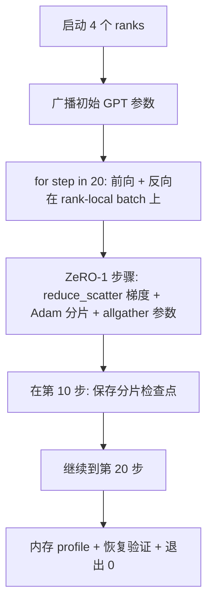

# 端到端分布式训练

> 第 76 至 80 课每课实现了一个组件。这是它们的组装：一个小型 GPT 在 4 个模拟 rank 上进行训练，配合 DDP 梯度同步、ZeRO-1 优化器状态分片，以及在训练中途的检查点分片保存。演示运行 20 步，自动终止，打印损失曲线和内存profile，并写入可恢复的检查点。

**类型：** 构建
**语言：** Python
**前置条件：** 阶段 19 C 轨道第 42-49 课
**时间：** 约 90 分钟

## 学习目标

- 将 DDP（第 77 课）+ ZeRO-1（第 78 课）+ 分片检查点（第 80 课）组装进同一个训练循环。
- 在一个小型合成语料上，用 4 个模拟 rank 训练一个 2 层 Transformer 语言模型 20 步。
- 打印每步损失表、每个 rank 的内存 profile，以及一个检查点清单——在相同 world size 下重启后可逐字节一致恢复。
- 验证组合的正确性：每个组件在前置课程中独立可测，本课证明它们可以组合。

## 问题

顶点课程就是证明各组件能够协同工作。第 76 课实现了集合通信。第 77 课将其包装为 DDP。第 78 课用 reduce_scatter 分片优化器状态。第 79 课分析了流水线。第 80 课保存了分片检查点。每课独立，有各自的测试。真实训练运行需要同时使用每一个原语；如果组合出错，损失会发散、检查点无法恢复，或者每个 rank 的内存本应减少却反而增长了。

本课运行端到端演示并验证四个不变量：(a) 损失在 20 步内随浮点噪声单调下降，(b) 每个 rank 在每一步都持有相同的参数范数，(c) 每个 rank 的优化器内存等于 ZeRO-1 公式 12P/N 字节，(d) 第 10 步的检查点在重启后可逐字节一致恢复。演示自动终止：20 步，单条命令，退出码 0。

## 概念



### 小型 GPT

模型有意做得很小：2 层 Transformer 块，embed dim 32，4 个注意力头，词表 64，序列长度 16，batch 4。几千个参数。足够大以锻炼每一个连接决策（多头注意力走标准 masked 路径；LayerNorm 有权重需要同步；LM head 是一个独立线性投影映射回词表）。足够小以至于在 4 个 CPU rank 上跑 20 步只需几秒钟。

### 组合规则

| 课程组件 | 它负责什么 | 交给循环什么 |
|--------------|--------------|----------------------------|
| DDP 广播 | 初始参数同步 | 构造时调用一次 |
| ZeRO-1 步骤 | 梯度同步、主副本更新、参数广播 | 每步调用一次，替代 optimizer.step |
| 分片检查点 | 持久化每个 rank 的状态，带 sha256 的清单 | 在 rank 0 调用，状态通过 allgather 收集 |
| 训练循环 | 前向、反向、损失日志 | 按顺序调用上述三个 |

循环不知道 reduce_scatter 或 rendezvous 文件。ZeRO 和检查点模块暴露窄接口，循环组合它们。

### 为什么用小型 GPT 而不是 MLP

第 77 课的 MLP 足以验证梯度同步。小型 GPT 增加了三样东西：一个独立的 LM head 映射到词表（本课中为清晰起见不绑定；完整 GPT 通常将 head 绑定到 token embedding）、softmax+交叉熵作为损失（比 MSE 有更多数值边界情况）、以及非对称前向（每层依次为 embeddings、注意力、MLP）。在顶点课程中继续用 MLP 会掩盖组合是否正确处理了 LayerNorm 或 embedding 层的梯度形状。

### 自动终止意味着退出码 0

循环固定运行 20 步然后退出。没有 `while True`，不需要人工干预，不依赖外部状态恢复。一个可以无人值守运行、完成时带着完整日志的顶点课程，才能证明系统连接正确。如果任何一个环节死锁，演示永远不会返回，测试框架会捕获它。

## 构建

`code/main.py` 实现：

- `MiniGPT`：2 层 Transformer，带 masked 自注意力和独立的 LM head。
- `make_corpus(seed, total_tokens)`：确定性下一 token 预测数据。
- `_train_worker`：每个 rank 派生；广播初始参数，运行循环，调用 ZeRO 步骤，在第 10 步写入分片检查点。
- `verify_resume`：主运行后，在进程内重新加载第 10 步的检查点，并断言保存的主分片与内存中快照逐字节一致。
- `main`：编排整个演示，打印损失表、内存 profile 和验证结果。

运行：

```bash
python3 code/main.py
```

输出：一个 20 行的损失表、一个 4 行的每个 rank 内存 profile、一个检查点清单，以及成功后的一条 "RESUME VERIFIED" 行。

## 生产环境中的模式

三个模式将组合完成真实训练运行。

**每 K 分钟检查一次，而不是每 K 步。** 步时间随序列长度和 microbatch 数量变化。每 10 分钟检查一次能捕捉相同的计算量，与模型大小无关。本课为简单起见用步数触发；生产用墙上时钟时间。

**尽早检测发散。** 生产运行在反向传播后加入 NaN 防护和损失尖峰检测器；如果损失在某一步跳升超过 2 倍，就回滚到上一个检查点，而不是让优化器走入退化状态。本课的损失曲线很平滑，所以这个防护用不上，但钩子保留着。

**跨 rank 汇总内存 profile。** 真实运行中每个 rank 的内存因 rank 而异（拥有最大流水线阶段的 rank 持有更多激活）。生产环境记录跨 rank 的最大值和平均值；本课打印每个 rank 以展示公式匹配情况。

## 使用

生产模式：

- **DeepSpeed。** 将 DDP + ZeRO + 流水线 + 激活检查点组合在一个配置下。本课的组合是 DeepSpeed 形态的微型版本。
- **PyTorch FSDP。** 原生等价物。`FullyShardedDataParallel` 配合 `ShardingStrategy.SHARD_GRAD_OP` 等同于 ZeRO-2。
- **NeMo 和 Megatron-LM。** 为超大型模型添加张量并行；否则组合形态相同。

## 交付

完整轨道在此结束。6 课一起构成了真实团队在采用 DeepSpeed 前会构建的分布式训练子系统；抽象已在 gloo 上得到验证，失败模式已被充分练习。第 17 阶段（基础设施和生产）是将其迁移到真实集群的地方。

## 练习

1. 添加注意力头的张量并行分割，验证损失与单 rank 基线一致。两个 rank：每个 rank 一半的头，注意力输出做 allreduce。
2. 添加跨 4 个 microbatch 的梯度累积，证明累积梯度等于一个大 batch 的梯度。
3. 添加从第 10 步恢复的路径，实际继续训练到第 20 步，并产生与原始运行相同的最终损失。
4. 添加指标导出（损失、梯度范数、步时间）到 JSONL，以便事后可视化运行过程。
5. 添加 NaN 防护，在损失尖峰时回滚到上一个检查点，并用一步学习率乘数强制产生尖峰以练习回滚。

## 关键术语

| 术语 | 大家怎么说 | 实际含义 |
|------|----------------|------------------------|
| 端到端 | "把它们全部连接起来" | 一次运行组合每一个组件，而非每个组件一个单元测试 |
| 内存 profile | "每个 rank 的 GB" | 每个 rank 持有的参数、梯度、优化器状态的字节数 |
| 恢复契约 | "保存并加载" | 检查点往返后每个 rank 的状态逐字节一致 |
| 自动终止 | "有界运行" | 固定步数，完成时退出码 0，循环中无人介入 |

## 延伸阅读

- [DeepSpeed 端到端训练教程](https://www.deepspeed.ai/getting-started/)
- [PyTorch FSDP 高级教程](https://pytorch.org/tutorials/intermediate/FSDP_advanced_tutorial.html)
- [Megatron-LM 训练脚本参考](https://github.com/NVIDIA/Megatron-LM)
- 阶段 19 第 76-80 课——本课组合的各个组件
- 阶段 17——将组合迁移到真实集群