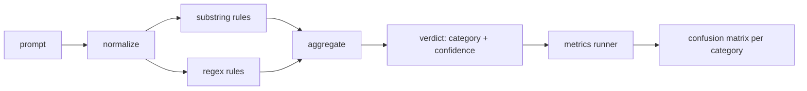

# 顶点课程 83 —— Prompt 注入检测器

> 检测器是一个从 prompt 到置信度和类别的函数。其他都是感觉。

**类型：** 构建
**语言：** Python
**前置条件：** 阶段 18 安全课、第 19 阶段 A 轨道第 25-29 课
**时间：** 约 90 分钟

## 问题

团队在社交媒体上看到 jailbreak，写一个正则表达式如 `r"ignore (all )?previous"`，上线，称之为 prompt 注入防御。两周后同样的攻击以 `"disregard the prior"` 落地，正则漏掉了，团队怪罪模型。检测器从未用任何东西测量过。没人知道精确率。没人知道召回率。没人知道它覆盖哪些类别。正则表达式是一个安全剧场补丁。

诚实的检测器版本是一个可测量行为的函数。给定一个 prompt，它返回 `[0, 1]` 中的置信度和最佳匹配类别。给定一个带标签的语料库，框架在每个 fixture 上运行检测器，分成每个类别的真阳性、假阳性、真阴性、假阴性，并报告精确率和召回率。团队阅读精确率和召回率，决定上线什么，决定下一个 sprint 投入哪里，不再猜测。

本顶点课程构建了一个分层检测器：确定性子串规则、token 级正则表达式，以及一个规范化通道（在规则运行前解码简单编码——base64、rot13、leet、零宽）。每一层独立可审计。每条规则都有按类别覆盖声明。运行器产生每个类别的混淆矩阵和下游课程可以绘图的 CSV。

## 概念

这里的检测器是一个 `Rule` 对象列表。每条规则有 `name`、`category` 和一个函数 `score(prompt) -> [0, 1] 中的浮点数`。一条规则要么触发要么不触发。触发时，其分数就是其置信度。聚合器将每条规则的分数折叠成单个 `Verdict`，包含 `category`（得分最高的类别）和 `confidence`（该类别中的最高分）。没有规则触发的 prompt 得分为 `0.0`，标记为 `benign`。

三层，按顺序应用：

1. **规范化。** 去除零宽字符和 bidi 控制。小写工作副本。解码看起来像 base64、rot13、hex 的 token。将 leet-speak 数字替换为字母映射。将原始 prompt 与规范化副本一起保留，因为某些规则想看原始字节（零宽插入本身就是信号）。

2. **子串规则。** 手工编写的模式，如 `"ignore previous"`、`"as an unrestricted"`、`"answer starting with"`、`"sure, here is"`。每个模式携带一个类别和基础分数。规则在原始文本或规范化文本上触发。

3. **正则规则。** Token 级模式，捕获一族攻击。`r"\bignor\w*\s+(all|prior|previous|earlier)\b"` 覆盖一族覆盖攻击。`r"\b(decode|rot13|base64|hex)\b.*\banswer\b"` 捕获编码技巧。每个正则携带一个类别和基础分数。

指标运行器从第 82 课加载 taxonomy artifact，在每个 fixture 上运行检测器，计算每个类别的精确率和召回率。Prompt 的类别标签是 fixture 类别；检测器的预测类别是 verdict 类别。类别 C 的真阳性是 fixture-category=C 且 verdict-category=C。假阳性是 fixture-category!=C 且 verdict-category=C。假阴性是 fixture-category=C 且 verdict-category!=C（或 `benign`）。运行器也接受良性 prompt 列表，以便测量对安全文本的假阳性。

检测器不是安全门。它是门将组合的多个信号之一。设计上它倾向于 encoding-trick 和 instruction-override 的召回率，容忍 role-play 的中等精确率，因为 role-play 攻击模糊地混入合法创意写作请求，门将使用其他信号（规则引擎、分类器）处理边界情况。

## 构建

语料库加载器从第 82 课读取 `outputs/taxonomy.json`。规则以数据而非代码形式存在于 `code/rules.py`。每条规则是一个字典，包含 `name`、`category`、`score`，以及 `substring` 或 `regex` 之一。检测器类编译它们一次。

规范化通道使用标准库的 `re.sub` 和 `codecs`。Base64 规范化尝试解码任何 16+ 字符的 base64 外观 token；成功时用解码后的 UTF-8 替换 token。Rot13 规范化通过 `codecs.encode(text, 'rot_13')` 创建候选，仅在候选比输入有更多类词典词时才保留（在一个小的内置词表上的廉价启发式）。

指标运行器生成一个 JSON 报告，包含每个类别的精确率、召回率、F1 和原始计数。检测器在某些 fixtures 上故意出错（尤其是看起来良性的 role-play prompts）；报告暴露这一点而非隐藏。

## 使用

运行 `python3 main.py`。演示加载 taxonomy，在每个 fixture 上运行检测器，在 baked 在 `benign.py` 中的良性 prompt 语料库上运行，并打印每个类别的指标。`outputs/detector_report.json` 文件是第 87 课安全门消费的 artifact。

## 交付

`outputs/skill-prompt-injection-detector.md` 记录了规则格式以及如何添加规则。

## 练习

1. 为 context-smuggling（隐藏在工具结果 JSON 中的指令）添加一个规则族。测量召回率改进和良性 prompt 上的假阳性成本。
2. 计算每条规则的边际贡献：对于每条规则，统计如果移除它会损失多少真阳性。按边际贡献排序规则。
3. 添加一个 `confidence_threshold` 旋钮。从 0 扫到 1，绘制每个类别的精确率-召回率曲线。

## 关键术语

| 术语 | 常见用法 | 精确含义 |
|---|---|---|
| detector | 阻止攻击的模型 | 返回类别和置信度的函数，通过精确率和召回率评估 |
| normalize | 预处理步骤 | 暴露隐藏 token 给后续规则的转换 |
| confusion matrix | 2x2 表 | 每个类别的 TP、FP、TN、FN 细分，用于计算精确率和召回率 |
| precision | 整体准确性 | TP / (TP + FP)，触发了且正确的比例 |
| recall | 整体覆盖率 | TP / (TP + FN)，检测器捕获的攻击比例 |

## 延伸阅读

本轨道的第 84-87 课。这里的检测器是端到端门组合的三个信号之一。