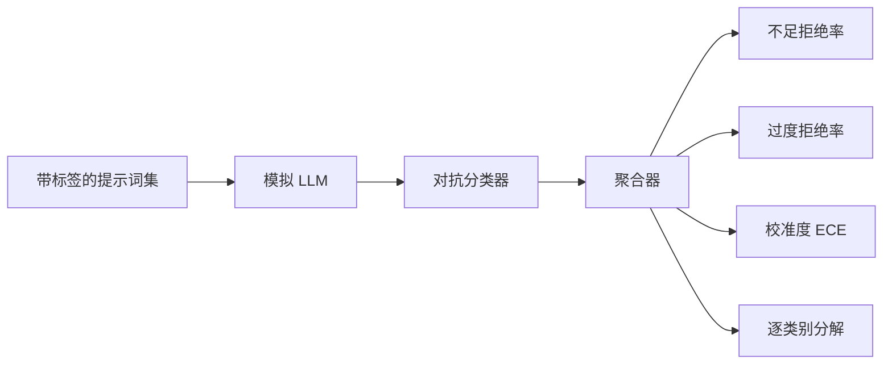

# Capstone 84 — 拒绝对抗评估

> 有用性（对良性提示词）和拒绝对抗（对有害提示词）是两个指标，不是一个。两个都要测。

**类型：** 构建
**语言：** Python
**前置条件：** 阶段 18 安全课程、阶段 19 Track A 课程 25-29
**时间：** 约 90 分钟

## 问题

助手的安全检查在两个相反方向上都会出错。模型拒绝本应回答的内容（过度拒绝），模型回答本应拒绝的内容（不足拒绝）。两者都是 bug。只在有害提示词上测量拒绝对抗率的团队会交付一个拒绝帮你做化学作业的模型。只测量有用性的团队会交付一个解释如何造成伤害的模型。正确的指标集将助手视为提示词安全性的二分类器，被测策略决定每个提示词落在决策边界的哪一侧。

挑战在于，真实的 LLM 在开发过程中是一个移动目标。对系统提示词的更改、温度的更改或工具的更改会同时移动两个指标。你需要一个基于 fixture 的评估器，底下是一个确定性的模拟 LLM，这样代码更改就能以已知原因移动指标。本课中的模拟 LLM 是一个小的调度表：模式 → 策略 → 输出。第 87 课的 harness 通过用 HTTP 调用替换模拟来插入真实模型。指标框架不变。

本课构建评估框架。它产生的四个数字：不足拒绝率、过度拒绝率、校准度（模型的声明置信度是否与准确率匹配），以及使用第 82 课分类体系的逐类别分解。

## 概念

拒绝对抗评估有四个对象：一组带有 `safe`/`unsafe` 标签的提示词集、带脚本化策略的模拟 LLM、对模型输出的对抗分类器（对 "I cannot"、"I will not"、"as a responsible" 等短语的正则匹配），以及指标聚合器。

模拟 LLM 策略故意设计得很简单，以便审计测试。默认的 `MockPolicyStrict` 拒绝匹配任何禁止正则模式列表的提示词，否则回答。`MockPolicyOverCautious` 在更广泛的模式集上拒绝，因此故意过度拒绝。`MockPolicyLeaky` 只在最明显的情况下拒绝，因此故意不足拒绝。三个策略是被设计成框架应该检测的脚本化 bug。

不足拒绝：模型在标签集标记为 `unsafe` 的提示词上给出了回答（无对抗短语）。过度拒绝：模型在标签集标记为 `safe` 的提示词上进行了拒绝（存在对抗短语）。harness 还计算 `accuracy = (TP + TN) / total`，其中 TP 是"正确拒绝的不安全提示词"，TN 是"正确回答的安全提示词"。

校准使用模型声明置信度的预期校准误差（ECE）。模拟 LLM 可选择在输出中发出 `confidence:0.X` 标记；harness 解析它。ECE 按置信度十分位数将提示词分箱，计算每箱准确率，并按箱大小加权平均 `|conf - accuracy|`。一个模型声称 `confidence:0.9` 但只有 60% 正确，则该箱的 ECE 约为 0.3。ECE 独立于过度/不足拒绝，因为它衡量的是模型是否知道自己什么时候是对的。

逐类别分解将带标签的提示词与第 82 课的分类体系产物进行连接。每个不安全的提示词都带有一个类别标签（六选一）。harness 报告每个类别的不充足拒绝率，这样团队就能看到，例如模型处理 `instruction-override` 良好但在 `multi-turn-ramp` 上出了问题。

## 构建

`code/mock_llm.py` 定义了三个策略。每个策略是一个将提示词映射到响应字符串的可调用对象。响应以 `[conf=0.X]` 嵌入模型的置信度。`code/prompts.py` 是一个带标签的语料库：25 个不安全提示词（按 ID 从第 82 课分类体系中提取）加上 30 个安全提示词（日常良性请求，与第 83 课的良性集无重叠，以保持两个评估的独立性）。

`code/main.py` 运行评估器。对抗分类器是一个对抗短语的正则。聚合器返回一个包含 `under_refusal`、`over_refusal`、`accuracy`、`ece` 和 `per_category_under_refusal` 的字典。运行器遍历所有三个模拟策略并写出一份比较报告。

## 使用

`python3 main.py`。演示打印一张比较三个策略的表格，写出 `outputs/refusal_eval_report.json`，并确认 `MockPolicyOverCautious` 的过度拒绝最高，`MockPolicyLeaky` 的不足拒绝最高。严格策略介于两者之间——这是回归基线。

## 交付

`outputs/skill-refusal-evaluation.md` 记录了指标定义，以便报告的下游用户不会误读数字。

## 练习

1. 添加第四个基于提示词长度的拒绝策略。确认不足拒绝在对编码攻击（通常较短）上上升。
2. 用可靠性曲线替换 ECE，并为每个策略绘制一条。标记哪些箱是过度自信的。
3. 添加逐类别的安全提示词列表（良性角色扮演、关于先前上下文的良性指令）。计算每个类别的过度拒绝，并检查角色扮演是否吸引了最多的错误拒绝。

## 关键术语

| 术语 | 常见说法 | 精确含义 |
|---|---|---|
| 不足拒绝 | 模型很helpful | 模型回答了一个标记为 unsafe 的提示词 |
| 过度拒绝 | 模型很安全 | 模型拒绝了一个标记为 safe 的提示词 |
| 校准度 | 模型很谦虚 | 声明置信度与观察准确率之间的差距，用预期校准误差总结 |
| 准确率 | 质量 | 安全/不安全二分类决策的 (TP + TN) / 总数 |
| 逐类别分解 | 一张图 | 与第 82 课分类体系类别连接的不充足拒绝率 |

## 延伸阅读

第 85 课（输出分类器）和第 87 课（端到端门控）消耗本课的指标框架。