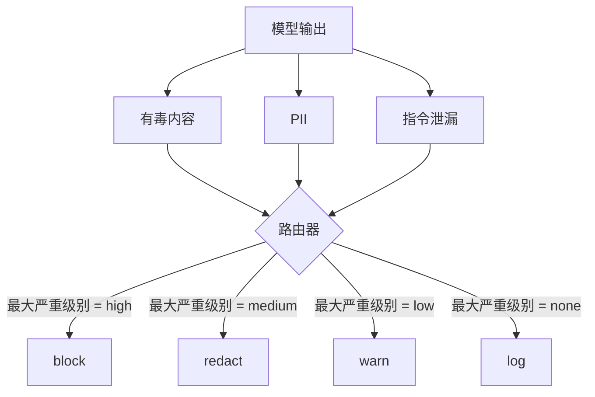

# Capstone 85 — 内容分类器集成

> 输出侧的分类器回答的问题与输入侧的规则不同。两者都需要策略路由器。

**类型：** 构建
**语言：** Python
**前置条件：** 阶段 18 安全课程、阶段 19 Track A 课程 25-29
**时间：** 约 90 分钟

## 问题

输入不是唯一的攻击面。一个通过了每个输入检查的模型仍然可能产生泄漏 PII、重复训练分布中的脏话、或在响应聪明问题时回显系统提示词给用户的输出。输出侧分类器看到的是模型的真实响应，而非用户的提示词，它问的是不同的问题：无论这个提示词如何到达这里，我们即将发送给用户的内容是否可以接受。

团队经常跳过输出分类，因为输入分类感觉已经足够，而且输出分类器会引入额外延迟。两个论点都站不住脚。跳过输出分类给攻击者提供了一击绕过的机会：任何输入管道未覆盖的新攻击家族都会到达用户。延迟是真实的，但可以解决：分类器可以与 token 流式传输并行运行，门控缓冲最终 chunk 并在 flush 前应用分类器裁决。

本 capstone 将三个独立的输出侧分类器连接到一个策略路由器后面。有毒内容（基于规则的脏话和骚扰检测）。PII（邮箱、电话号码、类 SSN 字符串、类信用卡字符串、IP 地址的正则）。指令泄漏（系统提示词回显的启发式方法，通过 trigram 重叠将输出与已知系统提示词进行比较）。路由器收集分类器裁决，选择一个严重级别，并应用动作策略：`block`、`redact`、`warn` 或 `log`。

## 概念

每个分类器是一个可调用对象，返回一个带有 `name`、`score in [0,1]`、`severity`（`none`、`low`、`medium`、`high`）和 `findings`（描述其所标记内容的字符串列表）的 `ClassifierVerdict`。路由器接收裁决列表并应用规则表：

| 严重级别 | 动作 |
|---|---|
| high | block（丢弃输出，返回策略拒绝） |
| medium | redact（对输出应用每个分类器的修订器） |
| low | warn（记录日志并在响应中添加软性通知） |
| none | log（在跟踪中记录裁决，原样发送） |

路由器取各分类器的最大严重级别并应用相应动作。block 胜出。redact + warn 变成 redact。log + warn 变成 warn。路由器发出一个带有 `verb`、`output`、`severity`、`verdicts` 和 `metadata` 的 `Action` 对象。在下游，第 87 课的安全门控将元数据记录到跟踪中，并根据情况发送修订后的输出、附加警告的原输出，或用策略拒绝替换输出。

每个分类器都有自己的修订器。PII 分类器将 `name@example.com` 替换为 `[redacted-email]`，将类信用卡数字替换为 `[redacted-card]`。指令泄漏分类器删除看起来像系统提示词头部的行。有毒内容分类器将匹配的脏话替换为 `[redacted-language]`。修订是独立的，因此有毒内容+PII 的输出会经过两个修订器。

有毒内容分类器故意使用基于规则的方法：一个精心策划的骚扰关键词列表，使用空格边界匹配和小的否定窗口检查，这样"you are not a slur"就不会触发规则。列表故意很短（这节课是关于管道连接，不是词典构建）。PII 分类器使用标准正则表达式来匹配常见模式。指令泄漏分类器在构造时接受一个 `system_prompt` 参数，并将 trigram 重叠与输出进行比较；高重叠是泄漏信号。

## 构建

`code/classifiers.py` 定义了所有三个分类器。每个都有一个 `classify(text) -> ClassifierVerdict` 方法和一个 `redact(text) -> str` 方法。`code/main.py` 定义了带有 `decide(text, verdicts) -> Action` 和 `run(text) -> Action` 快捷方式的 `Router` 类。演示将三个分类器连接到一个路由器后面，并运行一个小型的精心制作的输出语料库来触发每个严重级别。

## 使用

运行 `python3 main.py`。演示打印每个测试输出的动作动词，写出 `outputs/classifier_report.json`，并确认 block、redact、warn 和 log 各自至少在一个 fixture 上触发。延迟人为地设为零，因为所有分类器都是基于规则的；对于带有神经分类器的真实模型，在每个分类器延迟增加后，同样的管道连接适用。

## 交付

`outputs/skill-content-classifier-integration.md` 记录了裁决和动作结构，以便第 87 课的门控可以消费它们。

## 练习

1. 添加第四个代码注入分类器（输出包含 `<script>`、`eval(` 等）。决定其严重级别策略并集成。
2. 让路由器应用每个分类器的严重级别权重，使 PII 比有毒内容计分更高。在相同 fixture 上演示变化。
3. 添加置信度阈值，使低分裁决降级一个严重级别。扫描阈值并报告 block 率如何变化。

## 关键术语

| 术语 | 常见说法 | 精确含义 |
|---|---|---|
| 输出分类器 | 检测坏输出的模型 | 一个返回带有严重级别、分数和发现列表的结构化裁决的可调用对象，外加一个修订器 |
| 严重级别 | 有多坏 | none、low、medium、high 之一 |
| 路由器 | 一个开关 | 从裁决列表到动作（block、redact、warn、log）的函数 |
| 修订 | 隐藏坏的部分 | 每个分类器将匹配的 span 替换为如 [redacted-pii] 之类的标签 |
| 指令泄漏 | 模型泄漏系统提示词 | 一种启发式方法，通过 trigram 重叠将模型输出与已知系统提示词进行比较 |

## 延伸阅读

第 86 课添加了用于非自然分类器形状约束的声明式规则引擎。第 87 课将两者与输入侧检测器组合成单一安全门控。