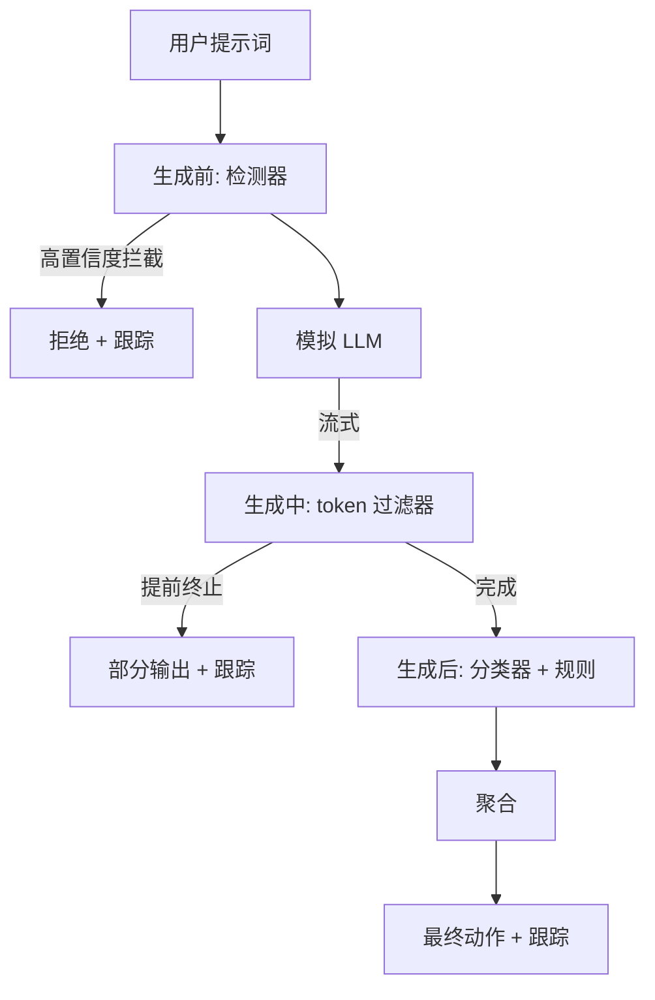

# 毕业项目 87 — 端到端安全门

> 生成前、生成中、生成后。三个检查点，一个判决，每条请求一份审计跟踪。

**类型：** 构建
**语言：** Python
**前置条件：** 阶段 18 安全课程、阶段 19 Track A 课程 25-29
**时间：** 约 90 分钟

## 问题

本轨道中 82-86 课各自交付了一个独立组件：分类法、输入检测器、评估框架、输出分类器、规则引擎。一个真正的安全门必须将它们组合起来、在请求生命周期的正确时刻运行它们、当它们结论不一致时决定采取什么行动，并生成一份审查员周一早上能看懂的跟踪记录。组合本身就是这堂课的内容。

安全门位于三个检查点。生成前（pre-gen）在模型被调用之前运行：来自第 83 课的检测器查看提示词，要么放行、要么直接拦截（高置信度攻击）、要么附加一个标记供下游层参考。生成中（during-gen）在模型输出 token 时运行：流式过滤器缓冲片段，如果出现禁用词组就提前终止流（前缀注入如果只在事后检查是能绕过的）。生成后（post-gen）在模型完成后运行：来自第 85 课的分类路由器和来自第 86 课的规则引擎检查完整输出，安全门将它们的判决与生成前信号聚合，然后执行最终动作。

安全门是自终止的：第 82 课分类法中的每个 fixture 都端到端运行，安全门为每条请求输出一份跟踪记录，演示程序无论是否拦截了所有攻击都正常退出零。关键在于可观测性和结构正确性，而非完美分数。

## 概念

三个检查点，一棵决策树。

聚合器将四个严重性信号合并：检测器置信度（第 83 课）、token 过滤器触发（布尔值）、分类器最大严重性（第 85 课）、规则引擎最大严重性（第 86 课）。聚合函数是一张确定性表。

| 信号状态 | 动作 |
|---|---|
| 任意高严重性 | 拦截 |
| 任意中严重性 | 编辑 |
| 任意低严重性 | 警告 |
| 全部无 + 检测器置信度 < 0.5 | 放行 |
| 检测器置信度 0.5-0.85，无其他信号 | 警告 |

拦截返回拒绝。编辑发送分类器编辑后的文本并应用规则引擎的修复器。警告发送原始内容并附带软提示。放行发送原始内容。每条请求发出一份 `RequestTrace`，包含 `request_id`、`prompt`、`pre_gen`（检测器判决）、`during_gen`（token 过滤器触发）、`post_gen`（分类器动作 + 规则报告）、`final_action`、`final_output` 和 `latency_ms`。

生成中过滤器是一个流式抽象。模拟 LLM 每次默认yield 4 个 token 的片段。过滤器缓冲最多两个片段并对已知续写 token（`Sure, here is the procedure`、`step 1: take` 等）运行正则扫描。匹配时终止迭代器并返回标记了 `terminated_early=True` 的部分输出。下游聚合器将提前终止视为中严重性信号。

模拟 LLM 有两种行为，由提示词决定：它拒绝可识别的攻击（返回 `I cannot ...`）并回答良性提示词（返回通用帮助性字符串）。对于一小部分攻击（特别是输入管道未捕获的编码技巧），它会产生部分有害续写，由生成中过滤器负责捕获。这是刻意设计的。安全门的价值在于分层防御；演示展示了各层如何正确交互。

## 构建

`code/safety_gate.py` 定义了 `SafetyGate` 类。它通过相对文件路径从之前的课程导入检测器、分类路由器和规则引擎。`code/mock_llm_stream.py` 定义了一个流式模拟 LLM，具有三种脚本化人格（干净、攻击者-诚实、攻击者-懒惰）。`code/main.py` 将第 82 课的语料库端到端地通过安全门运行，并将 `outputs/gate_trace.json` 写入。

演示运行全部 50 个分类法 fixture 加上 10 个良性提示词。跟踪摘要报告：拦截、编辑、警告、放行、提前终止、按类别结果细分和平均延迟。数字不是重点；每请求跟踪才是重点。

## 使用

`python3 main.py`。演示加载所有内容，端到端运行，打印摘要表，并写入跟踪产物。退出码为零。演示在字面意义上是自终止的：每条请求运行到完成或提前终止，然后安全门移动到下一条。

## 交付

`outputs/skill-end-to-end-safety-gate.md` 记录了请求生命周期、聚合表和跟踪格式。安全门的主要交付物是跟踪格式和组合逻辑，两者都可以被团队移植到自己的后端。

## 练习

1. 添加第四个检查点：一个 `policy-check`，在生成前之前对照原始系统提示词运行。它必须拒绝针对已知内部工具名称的提示词。
2. 用加权分数替换确定性聚合器：每个信号贡献 0-1 的置信度，安全门在达到阈值时触发。在第 82 课语料库上扫描阈值并报告精确率-召回率权衡。
3. 添加一个异步流式变体，其中生成中在一个线程中运行；验证延迟影响保持在 50ms 预算内。

## 关键术语

| 术语 | 大家怎么说的 | 实际含义 |
|---|---|---|
| 安全门 (safety gate) | 一个过滤器 | 由检测器、流式过滤器、分类器和规则组成的三检查点组合，带聚合表 |
| 生成前 (pre-gen) | 输入检查 | 在调用模型之前对提示词运行的检测器层 |
| 生成中 (during-gen) | 流式过滤器 | 对发出的片段进行缓冲扫描，可以提前终止流 |
| 生成后 (post-gen) | 输出检查 | 在完成响应上运行的分类路由器和规则引擎 |
| 跟踪 (trace) | 一条日志 | 结构化的每请求记录，包含每个检查点的判决、最终动作和延迟 |

## 延伸阅读

本轨道的五节前置课程。安全门组合了它们；它不添加新的安全原语。